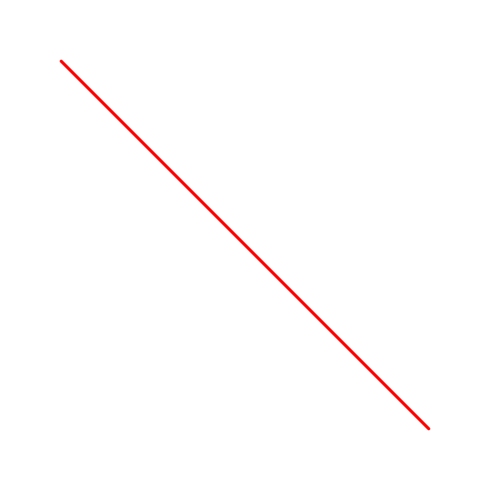
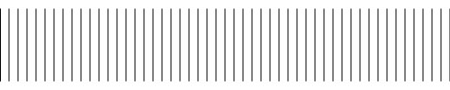

# 第一章 曲线艺术编程 coding curves
> 原作：Keith Peters

> 译者：池中物王二狗(sheldon)

> blog: http://cnblogs.com/willian/

> 源码：github: https://github.com/willian12345/coding-curves

Background
For a number of years, I’ve been wanting to writing a book called “Coding Curves”. There are all kinds of really fascinating curves that are fun to code and understand and create very interesting images. I’ve started this book at least three times. I’m feeling the urge to to it again, but I’m going to be more realistic about it this time. I don’t think I’m going to sit down and write a book cover to cover and get it formatted and edited and self publish it. I’ve accepted that that’s just not going to happen. But I want to write about this stuff.

## 背景
多年来，我一直希望写一本名为“曲线编程”的书。 各种领人着迷的曲线，可以用于趣味编程、更好的理解曲线、生成生动有趣的图形。

我开始写这本书至少三次了，结果冲动又来了，但这回我会现实一点，我不会正襟危坐从头到尾写一本书完整的书并把它编辑成册自己出版（译者注：原作者之前自己出版过《Playing with Chaos 》）。不得不承认这不太可能。我只是想写了。

The Plan
So I’m going to do it as a series of blog posts. I don’t know how often these posts will come out. Maybe once a week if I’m diligent. Maybe more often if I get on a roll. Maybe less if I get bored, distracted, or busy with other things. But even if there’s a gap, I can pick back up where I left off and continue.
Maybe, when it’s all done (will it ever be?) there will be enough there to actually compile into a book. Who knows.

## 计划
所以呢，我打算写成系列博客。我不知道发布频率有多高。勤快的话也许一周一篇。如果运气好一切顺利的话可能更的更快些。但如果我感到无聊、分心或忙于其它事情也可能会更新的很慢。但只要有空，我还是会继续写。

也许，全部完成后真的可以成册。鬼知道呢。。


Table of Contents
This is the plan. It may differ, but we gotta start somewhere. I’ll link the posts as they come out here, so this post can continue to serve as an index.
1. Intro (you’re reading it)
2. Trig Curves
3. Arcs, Circles, Ellipses
4. Lissajous Curves
5. Harmonographs
6. Pintographs
7. Parabolas
8. Bezier curves
9. Roulette curves
10. Spirals
11. Roses
12. Guilloche Patterns
13. Superellipses and Superformulas
14. Miscellaneous Curve

In general we’ll be covering two-dimensional curves. Some of these subjects will take multiple posts to cover. I’ll update the TOC as it evolves. There may be more subjects too, and I’m open to suggestions.


目录

计划是这样的。也许会有一丢丢不同，但会开始的。我会将博文连接放在此处，这里就作为总目录了。
1. 梦开始的地方
2. 三角函数曲线
3. 弧线、圆、椭圆
4. 利萨茹曲线 Lissajous
5. 谐波图 Harmonographs
6. 平托图 Pintographs
7. 抛物线 Parabolas
8. 贝赛尔曲线 Bezier curves
9. 转盘曲线 Roulette curves
10. 螺旋 Spirals
11. 玫瑰 Roses
12. 连接环图案 Guilloche Patterns
13. 超级椭圆和超级方程 Superellipses and Superformulas
14. 其它曲线 Miscellaneous Curve


In general we’ll be covering two-dimensional curves. Some of these subjects will take multiple posts to cover. I’ll update the TOC as it evolves. There may be more subjects too, and I’m open to suggestions.

一般来说我们会限制在讨论二维的曲线。其中一些课题会用多篇博文.隨着内容的更新，目录也会更新。也许有更多的章节，我很 open 的，欢迎提建议。


The Audience and Purpose

The audience for this course is people who are interested in exploring different types of curves and want practical techniques for drawing them. It may be artists, designers, game developers, UI developers, or recreational mathematicians. This is NOT a mathematics course, though there will be plenty of math in it. A lot of the explanations I give will be very incomplete. There will hopefully be enough information in the materials to give you the understanding you need to draw the given curves and expand on them. But at best, each chapter will be a mere introduction to a topic. Hopefully nothing will be straight out incorrect, but I’m happy to hear about it if there is, and will make my best efforts to correct it.

## 受众目标

此课程目标用户是针对那些希望探索不同类型的曲线且想用曲线绘制图形的人。比如：艺术家、设计师、游戏开发人员、UI设计人员、用趣味教学的数学家。这不是一个数学教程，尽管有大量的数学包含在内。我给的大量的讲解也会非常不完整。希望提供的资料信息足以让你理解并且能举一反三。 每个章节仅仅介绍了一下相关的数学主题。希望没有什么直接错误。当然我很乐你们指出我的错误，我会尽最大努力改的。

Personally, I love finding some new mathematical formula that I can apply to create some new, interesting shape, then tweaking the parameters to see how it changes that shape, and eventually animating those parameters. And finally combining the formula for one curve with the formula for another one and possibly making some shape that nobody has every seen before. If any of that rings true for you too, you will probably enjoy reading through this.

个人来讲，我喜欢找一些数学公式用于创建一些有趣的图形，并观察参数对形状的影响，最终对这些参数进行动态改变形成动画，最后通过对曲线应用公式不断叠加创造一些前所未有的形状。如果你也是其中的爱好者，相信你也会喜欢的。

The Format

## 内容约定

Most of what I’ve written before has been tailored to a specific language. For example, I wrote Playing With Chaos using JavaScript and HTML 5 Canvas. The idea was that it should be generic enough to convert to any language or platform, but I felt I needed to base it in some concrete language.

我之前写的大多数文章会使用特定的编程语言，如： Playing With Chaos 内，使用的是 javascript 和 HTML5  Canvas. 主要是希望能它能通用的转换成的任意语言或平台，但又感觉需要使用实际的编程语言来实现它。

After recently reading a couple of really fantastic books on ray tracing (covered here), which were completely language agnostic and only included pseudocode samples, I’ve changed my thinking about this. So all “code samples” in this series will actually be “pseudocode samples”.

但最近在阅读一些优秀的 “射线追踪” 相关的文章时，看到它们没有使用某种真实的编译语言实现，而是通过伪代码的方式展示例子。所以我改主意了，我也将使用伪代码作为代码示例。


So write in whatever language or platform you want. The main requirements will be:
A. The ability to set up and size a canvas or drawing surface of some kind.
B. The ability to draw lines of different colors and widths on said canvas.
C. Typical language features and control structures like functions, variables, for loops, conditionals, etc. We’ll probably need some kind of array or list as well as some structured object type, so we can have a point object that has x and y properties. Most of this is all table stakes for any modern language, though it may look different in each one.

所以，无论你在任何编程语言，任何平台上实现，你需要注意以下几点必要条件：

A. 有能力设置canvas或其它类似可以提供绘制的能力
B. 在此基础上可提供绘制不同颜色、粗细线条的能力
C. 拥有典型的编程语言特征和控制结构，如方法，变量，循环，条件等等 。可能还需要一些数组或列表还有对象结构类型，这样就可以创建一个像 Point 这样拥有 x 和 y 属性的类。 任何现代编程语言都包含以上提到的大多数特性，尽管可能样子看起来不太一样。

Additionally, it will be nice if you can draw circles (or at least arcs, which can become circles) and rectangles, and be able to fill an area with a given color. Extra credit if your drawing api lets you write text to the canvas.
A simple pseudocode example might look like this:

另外，如果能画圆（至少能画圆弧，圆弧能组成圆）和矩形且能为其填充颜色，当然如果能有填充文本的 api 就更好了。

简单的伪代码例子可能看起来像下面这样:

```
canvas(800, 800)
 
setLineWidth(5)
setColor(1, 0, 0) // red
moveTo(100, 100)
lineTo(700, 700)
stroke()
```

This should output an image like this:

应该输出像这样的图



I’ll avoid going as deep as OOP or FP as those can look quite different on different platforms, but we’ll need some functions, so I’ll keep those pretty basic:

我会避免深入面向对象或函数式编程它们在不同平台上看起来太不一样了， 但我们又需要一些方法函数 ，所以我保留了一些最基本的：

```
canvas(500, 100)
foo(100)
 
function foo(count) {
  for (i = 0; i < count; i++) {
    moveTo(i * 10, 10)
    lineTo(i * 10, 90)
  }
  stroke()
}
```
Resulting in:

看起来应该是这样



A few things to note here.
First, I’m calling the function before it’s defined. That might work in your language, or it might not. If not, you’ll have to rearrange things.

Secondly, the drawing api functions are written like global functions. It’s likely that in your drawing api, these will need to be called as methods of some kind of canvas object, which may have to be passed into the function, or might be able to be defined globally. I’m going to ignore that and assume that you can figure stuff like that out. The focus here is on covering concepts, not best coding practices.

Also, I’m not bothering with types for vars, args or returns, unless in some instance it becomes non-obvious and important.
As I get deeper into the series, my pseudocode style might change somewhat. If so, I’ll come back here and update things.

## 另外

还有一些注意事项

首先，在定义 foo 方法前我先调用了 foo ，在某些编程语言中可能会报错。如果报错，请根据你自己使用的语言调整调用顺序。

其次，绘图 api 调用方式写的好像是直接全局调用。在你的编程语言中可能需要在 canvas 对象下调用，定义成全局或将 api 传进来。 我自己能搞定, 我信你。我就不多说了。重点是有这样的概念，但这可不是最佳的编程实践。

当然我也不会在伪代码中强调变量类型，传参类型，结果返回类型，除非某些特例。随着本系列的深入我的伪代码风格可能也会发生变化，如果是的话，我会回来改这里的说明的。安心了…

## Wait for it!

Look for the first installment soon!

## 等风来

期待第一章吧！