# 第二章 三角函数曲线（TRIG CURVES）
> 原作：Keith Peters https://www.bit-101.com/blog/2022/11/coding-curves/
>
> 译者：池中物王二狗(sheldon)
>
> blog: http://cnblogs.com/willian/
>
> 源码：github: https://github.com/willian12345/coding-curves

Chapter 2 in the Coding Curves Series
This is going to be a relatively simple one, but we’ll get into a few different applications. I’m not going to take a deep dive into what trigonometry is, there will be no images of triangles with the little square in the corner telling you which angle is 90°. No definitions of adjacent, opposite, hypotenuse. And NO soh-cah-toa!!!

曲线艺术编程系列第二章

这是与曲线相关最基础简单的一章，但我会用几个不同的示例来演示。我不会深入详细讲解三角学，这里不会演示什么是90度角，邻边，对边，斜边和 soh-cah-toa(老外用来记忆三角函数的口诀)

I’m going to assume you know all that stuff. And if you don’t, a google search for basics of trigonometry will net you about 18,800,000 results in under one second. Proof:

我假定你已经了解了这些基本概念。如果你从未听过，那么你需要 google一下，你会得到 18800000 个结果: 


So if you have no idea what I’m talking about in that first paragraph, stop here and do some learning on that stuff first.

如果你对上面一段我说的东西一无所知，那么先学上面我说的初中三角函数相关的知识。


Wait, what am I doing? Totally ignoring an opportunity for shameless self-promotion on my own blog. OK, here’s a playlist of trigonometry videos by myself. The best material on the subject out of all of those 18 million results, or your money back.
Coding Math – Trigonometry Playlist

等等，我在干什么？我失去了一个不要脸的推荐我自己博客的机会。好吧， 这里是有关我讲解三角学的视频列表（译者注：请自己上外网搜索 coding math ^_^!），这是最佳学习资料，比刚才的 1.8 亿搜索结果要好的多，可能帮你省不少钱。

But we have to start somewhere…

OK, there are a few basic trig functions that your language should have somewhere in it. Maybe they are global, maybe part of a math library. For this post, we’ll be dealing with what you’ll probably find named sin, cos, and tan. These stand for sine, cosine and tangent, which you should know about or have just learned more about above.

好的，你使用的编程语言中应该已经包含了许多三角学相关内置数学函数。也许是全局的，也许在Math 类内，在此篇中，你会和叫 sin、cos、tan的这些东西打交道。这几个函数代表了正弦、余弦、正切，这些你在初中的时候肯定学过了（译者：九年制义务教育的肯定学过，看看谁是漏网之鱼…）

Let’s start with sin. You pass it a number and it gives you a number back. If you give it 0.0, it returns 0.0. As you increase that argument incrementally, the result you get will slowly increase up to 1.0 – or almost 1.0 anyway. Then as you continue to increase it it will go back down to 0.0, then down to -1.0 and back up to 0.0. As you continue to increase the argument, the result will continue to oscillate between -1.0 and 1.0.

我们先从Sin 正弦开始。你传入一个数值，它回给你一个数值。如果传0.0，它返回 0.0。 随着你传入参数值的增长，返回的值也慢慢从0.0到1.0，或接近1.0大概差不离。接着，随着你传入参数的继续增长，返回值会从1.0 慢慢回落到0.0。 随着你传入的参数继续增长，返回值会在 -1.0 至正 1.0 之间振荡。

试试：

```
for (i = 0.0; i < 6.28; i += 0.1) {
  print(sin(i))
}
```

in your language, you might need println or some kind of console or log function to display values. But you should get some output that looks like:

在你使用的编译语言中，你可能需要使用 printIn 或 console 、log 之类的方法打印结果。但你应该可以获取类似以下的打印结果：

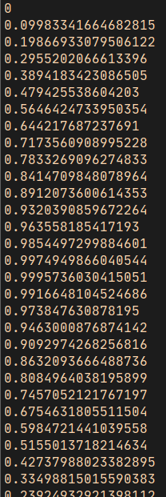

As I predicted, it starts at 0, goes up to 0.99957… and then starts going down again. Your output should continue going down to something like -0.999923… and then back up to almost 0.0.

正如我预测的那样，它从0 长到了 0.99957… 然后开始回落。你的输出结果将继续回落至- 0.9999923… 然后回到接近0.0

Note that it did exactly one cycle of 0 to 1 to -1 to 0. Not a coincidence. It’s because the for loop ends at 6.28, which is approximately 2 * PI. Or 2 * 3.14… In most programming languages, the trig functions work on radians rather than degrees. This is another point I’ll assume you have some understanding of. But a radian is approximately 57 degrees. And 3.14… (PI) radians is 180 degrees. 6.28… (2*PI) radians is 360 degrees.

注意：它完成了一个圆循环，从0-1再从-1到0，这不是巧合。因为for循环的结束点在设置在6.28。 在大多数编程语言中这个值值正大约是 2*PI 或者说2 *3.14156…  三角函数基本使用弧度代替我们常用的角度。这是另一个我假定你已经知道的知识点。 比如一个弧度转换成角度大概是57角度，3.14（PI）弧度是180 角度。6.28… （2 * PI）弧度是360角度。

So the result of sin will go from 0 to 1 to -1 to 0 exactly one time from 0 to 360 degrees, or 0 to 6.28… radians.

所以，sin 结果从 0 到 1  到 -1 到 0，就是 0 - 360 度，或者说是0-6.28弧度

If you change the for loop to end at PI (most languages have that as a constant somewhere) and the numbers should go from 0.0 up to 1.0, back to 0.0 and stop there. That’s half a cycle.

如果你改变了for循环的结束点在 PI （大多数编程语言会有PI这个常量）结果值将会从0.0至1.0再至0.0 ，这就是半个圆周期。

Bring on the Curves!

OK, let’s draw a sine wave. Size your drawing area to 800×500. It’ll also be helpful to set variables (or constants) to the width and height values. Then have a for loop with a variable x going from 0 to 800, using that width variable. Then we’ll take the sine of x and that will be our y value. We’ll add that to half the height so our sine wave will run along the center of the image. Draw a line segment to x, y and we’re all set.
Remember, this is all psuedocode. You’ll have to convert this to the language and drawing api of your choice. More details in the series intro.


把它们应用到曲线上

好的，让我们画个正弦波吧。设置你的绘制区域 800x500。 将这两个值设置成变量（或常量） width 宽度，height 高度。 然后用一个循环将变量x 从0 加到 800。用 width 这个变量。 我们使用x 这个值计算出正弦值用作 y值。 我们再在y值上加上height值的一半，这样正弦波就会显示在图象中央位置了。画一条线段从x至y，搞定。
记住，这全是伪代码，你需要转换成你正真在使用的编程代码。
```
width = 800
height = 500
canvas(width, height)
 
for (x = 0; x < width; x++) {
  y = height / 2 + sin(x)
  lineTo(x, y)
}
stroke()
``` 

Depending on your drawing api, you might have to start with a moveTo(0, height/2) before you do the lineTos. When you’re done, you should have something like this image:

依据你所使用编程语言对应的绘图 api ，在使用 lineTo api 前 你可能先需要使用 moveTo(0, height/2) 。当你搞定后应该会得到如下结果


that’s a sine wave, but maybe not quite what you would expect. There are two problems, which is good, because they both lead into the next two things we need to talk about: wavelength/frequency and amplitude. Here, there are too many waves – the wavelength is too short (or the frequency is too high), and the waves themselves are mere blips – the amplitude is too low.

这就是正弦波了，也许不如你预期的那样。有里有两个问题，但很好这两个问题引出了我们要讨论的两个东西: 波长/频率 和 振幅。上图中太多波了--波长太短（或者说频率太高），波有点像点了- 振幅太低了。

## Amplitude
The amplitude is easy enough to handle. The sin function returns from -1.0 to 1.0, so we just need to multiply that number by an amplitude value and we’ll be good. The height times something like 0.45 will make the wave just smaller than the size of the canvas.

##  振幅

振幅很容易拿捏。正弦值从 -1.0 至 1.0 ，我们仅需要将这些值乘以对应的振幅值就可以了。 canvas 高度乘以类似 0.45 这样的值可以让波形高度小于 canvas 的高度

```
width = 800
height = 500
amplitude = height * 0.45
canvas(width, height)
 
for (x = 0; x < width; x++) {
  y = height / 2 + sin(x) * amplitude
  lineTo(x, y)
}
stroke()
```


That gives us height, but there are still too many waves so it’s hard to even comprehend this as a sine wave. We’ll fix that next.

现在高度我们是有了，但波还是太多了以致于我们不能说这就是正弦波。我们将在下面章节解决这个问题。

Wavelength and Frequency
Wavelength is… wait for it… the length of a wave. Or the length between the same point on two consecutive waves. In the real world, these are actually physical distance measurements, with units anywhere from meters to nanometers, depending on what kind of wave it is you are measuring.

## 波长与频率

波长…. 等等, 波的长度，或者说两个连续周期相同点之间波的长度。在真实世界中，它们是真实测量的物理距离单位从米到纳米，取决于你测量的是何种波

Another way of measuring waves is frequency – how many waves there are in a given interval (of space or time).

另一种横量波形的是频率 ——— 一个时间间隔(或一段距离空间)内波形数量

Wavelength and frequency are inversely related. A low wavelength (small distance between waves) equals a high frequency (many more waves in a given space). A high wavelength equals a low frequency.
You can write code to use either method of measurement. Let’s start with frequency.

波长与频率反向相关(反比)。短波(两个波形很近)等于高频(给定的一段距离内拥有很多波形)。长波等于低频。

你可以用它的两个特性编写代码，让我们从频率开始。

Frequency
This is often specified as “cycles per second” (cps) rather than cycles in a given distance. Radio waves, for example, hit a receiver of some kind and we can just count how many hit it each second. The term “Hertz”, abbreviated “Hz” is the same as cycles per second. 100 Hz is 100 cycles per second. One kilohertz is 1000 cps, one megahertz is a million cps, etc.

## 频率

我们一般用“周期数/每秒”(cps)来代指一段距离内的周期数。以收音机收到音频波举例，我们可以通过每一秒接收到了多少来统计。 专业名词“赫兹”简写为“Hz”代表每秒拥有多少个周期。100Hz 代表每秒100个周期。1千赫兹代表1000 cps, 1兆赫代表100万cps …

Since we’re not dealing with moving waves though, it’ll be easier for us to measure frequency in terms of how many cycles occur in a given space. What you come up with here is up to your given application, but since we’re currently drawing a sine wave across an 800-pixel wide canvas, we can say that a frequency of one means that we should see one cycle occur as the wave goes across that canvas.

There’s a bit of math involved, so I’ll throw the pseudocode out there, then we’ll go through it.

因为我们不是处理动态的波，在给定的空间内测量一个周期内波的频率会更容易。 想要产生什么样的结果取决于你给定的应用程序，既然我们是在 800 像素宽度内绘制正弦波，我们说的频率为 1 ，意为着一个正弦波图形应该穿越整个画布。

There’s a bit of math involved, so I’ll throw the pseudocode out there, then we’ll go through it.

这里用了一点点数学，先上伪代码，然后我们继续分析过一遍

```
width = 800
height = 500
amplitude = height * 0.45
freq = 1.0
canvas(width, height)
 
for (x = 0; x < width; x++) {
  y = height / 2 + sin(x / width * PI * 2 * freq) * amplitude
  lineTo(x, y)
}
stroke()
```

First we create a new variable, freq and set it to 1.0.

Then instead of just taking the sine of x, we divide x by width. This results in values from 0.0 to 1.0 as we move across the canvas.

Then we’ll multiply that by PI * 2. This will give us values from 0.0 to 6.28…, which should be familiar from the very first code example. This alone would make the results go from 0 to 1 to -1 and back to 0 exactly one time, as we saw. One cycle.

Finally, we multiply that by freq. That’s set to 1.0 now, so we’ll still get one cycle. With all this in place, you should be seeing this:

首先我们创建了一个 freq 变量并设值为1.0

我们替换之前给 sin 的 x 值，将 x 乘以 canvas 宽度。 x / width 循环结果过程值会变为从 0.0 到 1.0。

然后我们再乘以 PI * 2 这会让值 0.0 至 6.28… , 这个非常像最初的例子中得到的结果。这个例子会让结果从 0 到 1再到 -1 然后回到 0，刚好就是你看到的一个周期。

最后，我们乘以 freq 频率。 当前设置的是 1.0 ， 我们得到的仍然是一个周期。所有的这些设置你将会看到下图：

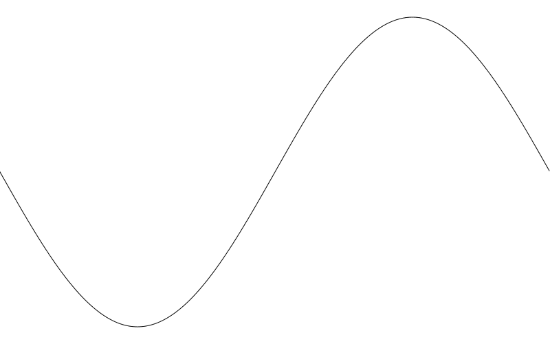

OK, that’s more like it. But you might be more used to the sine wave going up first, then down. If you’re seeing it go down and then up, like in my example, it’s because your drawing surface has the y-axis oriented such that positive values go down, the reverse of Cartesian coordinates. If you know how to use the 2d transform methods of your drawing api, you can fix it that way. I’ll go for a simpler fix of just subtracting y from height in the lineTo call.

好的，像那么回事儿了。但是一般我们常用的正弦图波形是先向上再向下的。如果你看到的是先向下再向上，就如我们这里的例子中展示的那样，那是因为我们使用的 y 轴是向下的与迪卡尔坐标系的 y 轴相反。 如果你了解如何使用绘图 api 2d transform 方法, 你自己就能搞定。我将用简单方式修复它，在调用 lineTo 时将 y 变成 height - y 就妥了。

```
width = 800
height = 500
amplitude = height * 0.45
freq = 1.0
canvas(width, height)
 
for (x = 0; x < width; x++) {
  y = height / 2 + sin(x / width * PI * 2 * freq) * amplitude
  lineTo(x, height - y)
}
stroke()
```
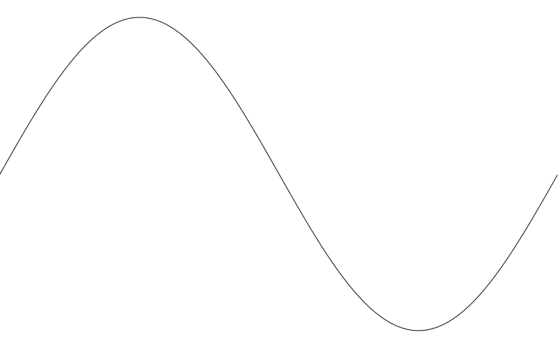


Now you can mess with those two variables, amplitude and freq to create different waves. Here I set amplitude to 50 and freq to 5:

现在，你可以尝试改变 amplitude 和 freq 这两个变量创建不同的波形图。下面是我将 amplitude 设为 50 freq 设为 5 的结果

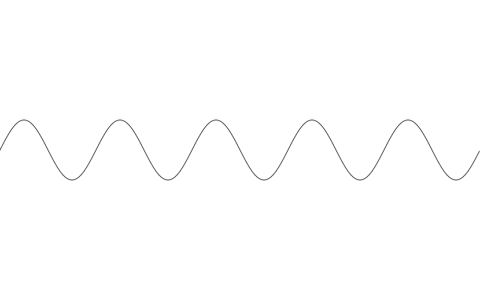

## Wavelength

Now let’s encode this to use wavelength instead of frequency. In this case we’ll be defining wavelength in terms of how many pixels it will take the wave to complete a full cycle. Let’s say we want one cycle to be 100 pixels long. Again, here’s the code, explanation to follow:

## 波长

现在，让我们用波长代替频率来重新实现一下。在这例子中，我们将用波长表示一个完整波形周期内占用的像素。 我们可以这样说：我想要一个 100 像素长的周期波形。

先上代码再解释：

```
width = 800
height = 500
amplitude = height * 0.45
wavelength = 100
canvas(width, height)
 
for (x = 0; x < width; x++) {
  y = height / 2 + sin(x / wavelength * PI * 2) * amplitude
  lineTo(x, height - y)
}
stroke()
```

This time, inside the sin function call we divide x by wavelength. So for the first 100 pixels, we’ll get 0.0 to 1.0, then for the next 100 pixels 1.0 to 2.0, etc.
This gets multiplied by PI * 2, so for every 100 pixels we’ll get some multiple of 6.28… and will execute a complete wave cycle.
The result:

此番在 sin 函数调用时，我们将 x 除以 wavelength。这样前 100 像素内，我们将得到值 0.0 至 1.0，接着下一个 100 像素是 1.0 至 2.0，继续下去。

然后值再乘以 2 PI，所以 100 像素内每一个像素都会乘以 6.28 中的某一个值…并执行一个完整的波形周期

结果如下图

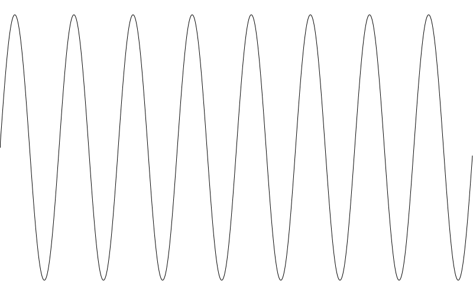

Since our canvas is 800px and the wavelength is 100px, we get eight full cycles, as expected.

由于我们的 canvas 画布宽 800像素 波长设置为 100 像素，我们如期得到了 8 个完整周期波型。

Resolution
A quick word about resolution. Here, we are moving through the canvas in intervals of a single pixel per iteration, so our sine waves look pretty smooth. But it might be too much. If you are doing a lot of this and you want to limit the lines drawn, you can do so, with the possible loss of some resolution. We’ll just create a res variable and add that to x in the for loop and see what that does. We’ll start with a resolution of 10.

## 分辨率

简单解释一下分辨率（译者注：不是物理上的分辨率，只是绘制过程中循环内的步幅）。这里，for循环每一次迭代在canvas画布中走过1像素距离， 这样让我们的正弦波看起来挺润的。但绘制次数也太多了。如果在你的绘制中想减少一些线条绘制，你可以通过缩小减少分辨率来实现。我们创建一个叫 res 的变量 并将它添加进 x 在 for 循环内看看会发生什么 。 我们先从 10 开始

```
width = 800
height = 500
amplitude = height * 0.45
freq = 3
res = 10
canvas(width, height)
 
for (x = 0; x < width; x += res) {
  y = height / 2 + sin(x / width * PI * 2 * freq) * amplitude
  lineTo(x, height - y)
}
stroke()
```

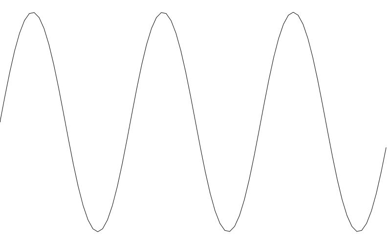

On the plus side, we are drawing only 10% of the lines we were drawing before. But you can already see that things have gotten a bit chunky. Going up to 20 for res reduces the lines drawn by half again. But now things are looking rough.

从好的的一方面来说，我们只绘制了之前绘制线条的 10%。但你已经可以看到了线条有一点点块状化了。如果将 res 加到 20 继续减少线条绘制，这回线条看起来就很粗糙了

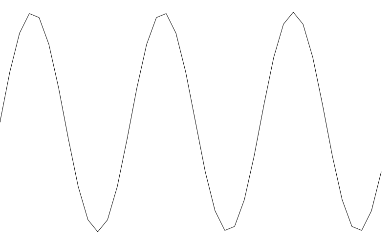

But the important thing is knowing the options, their benefits and tradeoffs.

重点是你知道这个有这个选项的，在使用过程中在性能与效果上权衡利弊


## Cosine
I’m going to keep this one really quick. Because everything I’ve said about sine holds true for cosine, except that the whole cycle is shifted over a bit. Going back to a single cycle and simply swapping out cos for sin …

## 余弦

在余弦上面我会讲快一占，因为基本知识已经在上面正弦中普及过了同样适用于余弦， 除了余弦图像相对正弦是翻转过来的。回到单循环波形简单的将 sin 替换成 cos 就行。

```
width = 800
height = 500
amplitude = height * 0.45
freq = 1.0
canvas(width, height)
 
for (x = 0; x < width; x++) {
  y = height / 2 + cos(x / width * PI * 2 * freq) * amplitude
  lineTo(x, height - y)
}
stroke()
```

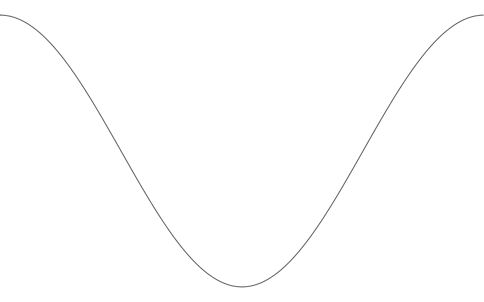

Here, an input of 0.0 gives us 1.0. And then we drop to 0.0, -1.0, back through 0.0 and end on 1.0 as we move from inputs of 0.0 to 2 * PI. It’s the same wave shifted over 90 degrees (or PI / 2 radians). It’s easier to see if we move the frequency up a bit.

这里，我们输入 0.0 得到的是 1.0 然后往下掉到 0.0， -1.0 再回到 0.0 最后再回 1.0 结束。 就像是我们将0.0 慢慢变到 2 * PI .  就像是同样的波形转了 90 度（或都说 PI / 2 弧度）。如果我们将频率调高一点，更容易看清

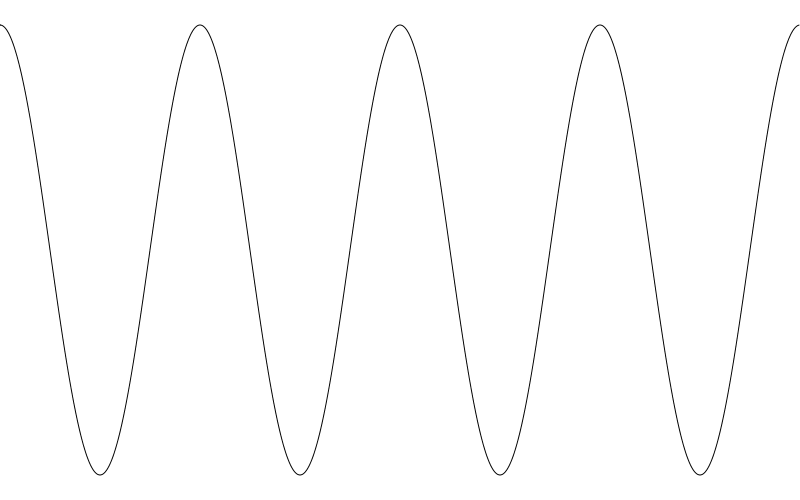

I don’t really have a whole lot to say about cosine waves for this post. But we’ll be revisiting them again later in the series.

在此章中我不会说太多余弦，但后面系列中我们还会再涉及到余弦相关知识。

A Function
We can use everything we’ve covered so far to make a reusable function that draws a sine wave between two points. Again, I’ll do the pseudocode drop and then the explanation.

## 可复用的函数

至此学到的相关知识我们可以封装一个可重用的函数，它接收两个位置参数在两点之间绘制一个正弦波。再次，我先放伪代码在下面，然后慢慢解释。

```
function sinewave(x0, y0, x1, y1, freq, amp) {
    dx = x1 - x0
    dy = y1 - y0
    dist = sqrt(dx*dx + dy*dy)
    angle = atan2(dy, dx)
    push()
    translate(x0, y0)
    rotate(angle)
    for (x = 0.0; x < dist; x++) {
        y = sin(x / dist * freq * PI * 2) * amp
        lineTo(x, -y)
    }
    stroke()
    pop()
}
```

This function has six parameters, the x and y coords of the start and end points, frequency and amplitude.
We get the distance between the two points on each axis as dx and dy.

此函数接收 6 个参数，x 和 y 坐标点表示开始与结束点，还有频率和振幅。

我们通过 dx 和 dy 获取计算两点间稳中各轴间的距离。

Then, using these, we calculate the distance between the two points using the Pythagorean theorem and the sqrt function which should be somewhere in your language.

然后根据dx 和dy ，我们用勾股定理计算出两点之间的距离。sqrt 函数应该在所用的编程语言中是内置。

And we get the angle between the two points using the atan2 function that should also be available. If you don’t understand what’s happening so far, I suggest you go look at the references at the beginning of the post.

然后我们通过 atan2 内置函数计算出角度，如果至此你不知道发生了啥，那么我建议你找一找我以前发表过的文章(译者注：作者博客中的文章 有过介绍，并且出版过 flash 基础动画，flash 高级动画等书籍)。

Now this function is assuming that your drawing api has some 2d transformation methods. If so, it probably also has a way to push and pop transforms from a stack. In HTML’s Canvas api for example, these would be context.save() and context.restore().

现在，这个函数内假定你的绘制api 有2d transform 变形能力。如果是的话，transform 功能大概率会有 push和pop，入栈与出栈功能 。以HTML Canvas api 举例， 它的功能api 会像是这样 context.save() 和 context.restore();

We want to push the current transform to the stack so we can transform the canvas, do our drawing, and then restore the earlier state when we are done. So we call push.

我们将当前transform push 到栈中我们就可以对canvas整个执行变形绘制，然后在绘制完毕后再 restore 恢复到进入栈前的状态

 (译者注：push 和 pop ，save 和 restore 等类似的功能的存在是由于2d 图形绘制涉及到变幻功能时使用的是线性代数中矩阵转换功能实现，相关知识请自行学习大学数学，反正我在上学的时候是没学好。后来是看 3blue1brown 出的线性代数视频理解的… 好吧我是学渣承认我是假装理解……这不重要，继续)。


Then we translate to the first point and rotate to the angle we just calculated. At this point we just need to draw a sine wave using dist, freq and amp exactly as we’ve been doing.


然后我们将上下文移动到开始点并旋转到计算出来的角度.。 在这个点我们仅需要用 dist、freq、amp 这几个变量 绘制一个正弦波，正如我们之前所做的那样。

Since our canvas is translated exactly as we want it, we can just call lineTo(x, -y) which just corrects the sine wave like we did before.

当我们的 canvas 上下文移动到了我们希望的起始点时，我们直接调用用 lineTo(x, -y) 实现正确的正弦波绘制就像之前那样。

When we’re done, we stroke that path and call pop (or restore or whatever your api uses) to leave things how we found them.
We can now use this function like so:

当搞定以上步骤后，调用 stroke 来显示出路径，还要调用 pop（或 restore 或其它什么类似的 api ）恢复到函数绘制前的状态。
现在我们就可以像这样调用函数了

```
width = 800
height = 500
canvas(width, height)
 
sinewave(100, 100, 700, 400, 10, 40)
```

This draws a sine wave starting at 100, 100, going to 700, 400, with a frequency of 10 and amplitude of 40.

这次绘制了一条正弦波形在起始 100，100 位置 至 700， 500 结束频率 10， 振幅 40.

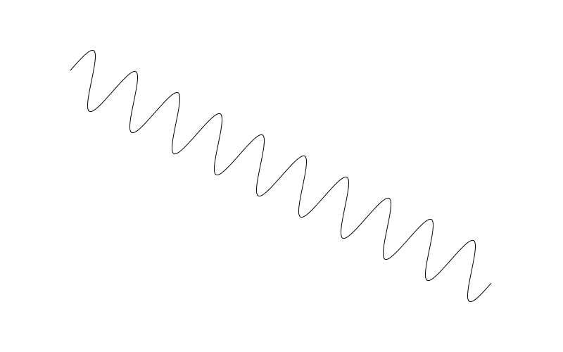

If your drawing api does not have transform methods, I pity you. You can still do this kind of thing, but it will be much more complex. And beyond the scope of this post.

如果你正使用的编程语言没有 transform 这一类函数，那你可太惨了。虽然你依然可以实现类似的效果，但会非常复杂，这超出了本篇的范围。

As mentioned in the comments below, the “frequency” aspect of this method might be a bit confusing, because the way it’s coded “frequency” means “number of cycles between point A and B”. So a long wave drawn with this method would have a larger wavelength than another, shorter line drawn with the same frequency. To address this, you might want to change the function to use wavelength instead. This would ensure that all waves drawn with the same wavelength would look similar, no matter how long they were. Another option would be to adopt a frame of reference for frequency, like “so many cycles per 1000 pixels” or something. What you do here depends on your needs and application, so I’ll leave that up to you.

在博文下方评论内有人提到 frequency 这一词可能会导致困惑，这词隐含的意思会是 A 点 B 点之间一共包含多少个周期循环，所以一个长波的绘制意谓着比同频绘制一个较短的 wavelength 要大。为解决这一点，你可能希望用 wavelength 代替 frequency. 这将确保所有具有相同波长的波看起来都很相似，无论它们有多长。另一个选项是将 frequency 与 frame 帧率联系起来，如：“每1000像素有多少个周期”，诸如此类的。无论怎么做都需要根据你自己的需求来，所以选择权交给你。

（译者注: 这是作者博文评论区有有人提出作者使用 frequency 频率这个变量控制波形有歧义，因为按现在的 sinewave 函数在绘制两点距离不同时，所产生的图形，波长是不一样的。所以有人提议用 wavelength 代替 frequency 来实现，这样不管两点距离是多少，波长总是一样的，感觉作者的意思就是情况有很多，你可以根据自己的需求调整，调整很简单我试了一下, 循环中改成这句就行  y = sin(x / wavelength * PI * 2) * amp;  传 freq 变成 传 wavelegnth。源码中我用 wave-function-wavelength.html 演示了一下）


Tangent
Drawing tangent curves is not nearly as useful as sine and cosine waves, but we’ll cover it for completeness.
Unlike the two functions we’ve covered so far, tangent does not constrain itself to the range of -1 to 1. In fact, it’s range is infinite. Let’s do the same thing we did for sin and just trace out the values.

## 正切

绘制正切曲线比起正弦与余弦来讲没啥大用，但为了完整性还是讲一讲。
不像之前两个函数，正切自身的值没有限制在 -1 至 1 的范围，事实上，它范围是无限的，让我们像之前对正弦那样输出查看一下正切值是啥样。

```
for (i = 0.0; i < 6.28; i += 0.1) {
  print(tan(i))
}
```

你基本上可以看到类似下面的输入结果：

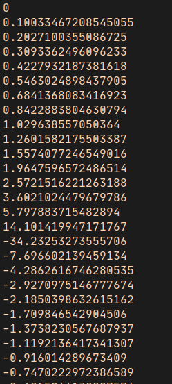

Again we start at 0, but quickly go up to 14, then jump to -34. But that’s deceiving. The values are truncated because we are moving in relatively large steps of 0.1. What is actually happening is that we are rapidly going up to positive infinity as the input angle approaches PI / 2 radians (or 90 degrees). Once it crosses that value, it jumps towards negative infinity, swiftly rises to 0.0 again at PI radians (180 degrees) and then repeats the cycle again once more before it gets to 2 * PI radians (360 degrees). This isn’t a linear progression though – it executes a curve as it approaches and leaves 0. Let’s code it up using frequency to see a single tangent wave cycle.

再一次，我们从 0 开始，但它迅速增长至 14，接着直接跳到 -34，就很迷。这些值被截断了因为我们用的是相对较大的 0.1 作为步长。 实际是这样的，随着输入值接近 PI/2 弧度（或90度角）数值快速增长到正无穷大，一旦超过了这个值，它又向下跳到负无穷，很快在 PI （180 度角）又升到 0.0 ，然后在到达 2 * PI （360 度）前重复这一循环。这不是一个线性过程虽然它在接近和离开 0 时绘制了一条曲线，让我们用频率实现一个正切波形看看

```
width = 800
height = 500
amplitude = 10
freq = 1.0
canvas(width, height)
 
for (x = 0; x < width; x++) {
  y = height / 2 + tan(x / width * PI * 2 * freq) * amplitude
  lineTo(x, height - y)
}
stroke()
```

Same thing here again, but swapped out tan for sin. I also reduced the amplitude just so we could see the curve better. In fact, it’s probably a misnomer to talk about the amplitude of a tangent wave since its amplitude is actually infinite. But this value does affect the shape of the curve.

和之前代码一样，只是将 sin 替换成了 tan。我还减少了 amplitude 值以更好的观察曲线。事实上，振幅用在这里解释可能用词不当，因为这里的振幅是无限的。但这个值的确会影响曲线形状。


One thing to note is those near-vertical lines that shoot down from positive to negative infinity. Those aren’t technically part of the plot of the tangent. Mathematically, it implies that the tangent could have a value somewhere along that line at some point, but it will not. It is actually undefined at an angle of 90 and 270 degrees. And near infinity/negative infinity just before and after those values.
Not sure if this one will be of much use to you, but there it is.

有一点需要注意，这些接近垂直的线是从正无穷到负无穷。这些不是正切图像上的部分。数学上来讲，这暗示着正切值在这条垂直线上有某个点会有某个值，但确不是。事实上在 90-270 度之间这个值是 undefined 。这些值前后接近正负无穷。不确定这特性对你有没有用，就这样吧。

Summary
Well, we got through the first few curves in this series. Good ones to have under the belt as a lot of other curves will uses these functions in one way or another. See you soon!

## 总结
我们已经学习了这个系列中最初部分的曲线。这是好的基础，后面我们将会在其它曲线中用到这里学习到的知识和相应的函数。 回头见。


