# 第三章 三角函数曲线（TRIG CURVES）
> 原作：Keith Peters https://www.bit-101.com/blog/2022/11/coding-curves/

> 译者：池中物王二狗(sheldon)

> blog: http://cnblogs.com/willian/

> 源码：github: https://github.com/willian12345/coding-curves

CODING CURVES 03: ARCS, CIRCLES, ELLIPSES
Chapter 3 in the Coding Curves Series
In this installment we’ll look at how to draw arcs, circles and ellipses. (And wander off on some tangents before we get done.)
It’s likely that your platform’s drawing api has at least some of this built in. For example, the HTML Canvas api does not have a circle method, but it does have an arc method as well as an ellipse method, either of which can be used to draw circles.
But it’s good to know how to do all of these manually. You’ll wind up using it someday, somewhere on some platform.
First let’s just look at arcs and circles. You can say that an arc is just part of a circle, or you could say that a circle is an arc that extends 360 degrees. So we could go at this either direction, but it makes sense to me to start with circles and specialize into arcs.

曲线艺术编程系列第三章

在这一篇中我们将关注如何绘制圆弧，圆和椭圆。（结束前再聊聊正切相关的）
我希望你的编程平台内拥有一至必要的绘图api。比如，HTML Canvas api 没有直接画圆形和椭圆的函数,但它有一个arc函数，可以用它来间接实，但这样手动实现有助于我们更好的理解。会有用武之地的。
首先，我们先聚焦于圆弧与圆。可以说圆弧是圆的一部分，也可以说圆是圆弧延展360度而成。从哪个方向开始探索都可以，但对我来讲从圆开始深入弧是有意义的。

Note on Measurements
The drawing api I am using has the y-axis reversed from standard Cartesian coordinates. Negative values go up, positive down. This is very common for drawing apis which aren’t specifically made for math or science use cases. It’s the same with Processing, HTML canvas, Cairographics, .net graphics, and many others. Some apis do use Cartesian coordinates and have positive angles going counter-clockwise. Yet others, such as pygame, mix the systems – y values go down positively, but positive angles go couter-clockwise.
This affects the measurements of angles. Zero degrees is due east. In a Cartesian system, positive angles will move in a counter-clockwise direction and negative angles in a clockwise direction. In reversed y-axis systems, the opposite is true. In this chapter, I don’t make any attempt to “correct” this. The functions we’ll be creating here will mirror the built-in functions of many drawing apis.
But know that if you do want to create circle, arc and ellipse functions that operate per the Cartesian coordinates, that’s easy enough to do. And when you finish the section on arc, you’ll know how to do that.

#### 注意测量标准
我使用的绘图api 内 y 轴与标准笛卡尔坐标系是相反的。负的向上，正的下向。这在图形绘制api 中很常见但有别于数学和科学中使用的笛卡尔坐标系。与Processing, HTML Canvas, Cairographics, .net graphics 以及其它很多图形绘制库一样。 一些api 确实使用笛卡尔坐标系和逆时针正向角度。当前另一些，例如像 pygame, 混用 -y 是向下，但逆时针旋转是正向角度。这会影响角度的测量。0度应该指向东方。在笛卡尔坐标系中，正向角度移动是逆时针，负向角度移动是顺时针。在Y轴反转的系统中，反就是正，在这章中我不会再强调这里的差别。我们这里会镜向实现一些内建的绘图 api 函数。在你学完圆弧这一章节后，如果你想在笛卡尔坐标系下创建圆弧，圆和椭圆的函数也很简单，很会很容易的实现它。


Circles 
Definition
A circle is usually defined something like “the set of points that are equidistant from a given center point”. But when you are trying to draw a specific circle, that’s not very useful. I don’t need a set of infinite points. I just need enough points to draw short line segments through that will form a circle.
You’ll also see the “equation of a circle” as x2 + y2 = r2 . Also pretty useless from the perspective of trying to draw one.
But then you get to the parametric form:

## 圆
## 定义
圆的定义一般来说会像这样：“与给定的一个中心点等距的一堆点的集合” ，但当你真的想画一个圆的时候，发现这并没什么卵用。我并不需要一堆无限的点。我仅需要一堆形成圆的足够多的点用短线串起来。
你也见过“圆方程”类似 x^2+y^2=r^2(译者注：这里是x平方+y平方= r 平方，可表示圆周上任意一点)。 当你尝试想画圆，这好好像也没啥用。
然后你得到了下面这样的参数方程

```
x = a + r * cos(t)
y = b + r * sin(t)
```

Here, a, b is the center of the circle, r is the radius, and t is a parametric variable that ranges from 0 to 2 * PI.
This starts to get useful. We can define the center point and the radius and then run a for loop from 0 to 2 * PI to get a set of points that we can draw lines through.
Eternal reminder. All the code here is pseudocode. See the first post in this series for more info.

这里 a 和b 是圆的中心点， r 是半径， t 是范围参数变量从 0 到 2 * PI。
这里才开始有点儿用。我们可以定义一个圆心点和半径然后跑一个循环，从0至2 * PI  从而得到一堆点，然后用线将这些点连接起来。
不厌其烦的提醒你，这里展示的是伪代码。

```
width = 600
height = 600
canvas(width, height)
 
cx = width / 2
cy = height / 2
radius = 250
for (t = 0; t < PI * 2; t += 0.01) {
  lineTo(cx + cos(t) * radius, cy + sin(t) * radius)
}
closePath()
stroke()
```

Depending on your drawing api, you might need to start off with a moveTo before the lineTos. If so, I trust you’ll figure that out. Otherwise, this is straightforward. cx, cy and radius are a, b and r from the above formula. And t is the angle we loop through.
Note the final closePath call there. That’s a feature of most drawing apis. It will draw a final line segment from where the last operation left off to the place where the current path started, closing the circle. It might be different on your platform but there should be something there.
This gives us…

取决于你所使用的绘图api， 在你使用lineTo之前，你很可能需要用moveTo 来开头。我信你自己能搞定。这很简单。cx, cy和 radius 就是上面公式中的 a, b 和 r 。 t 就是弧度我们通过循环创建的。
注意，最后需要用closePath 闭合一下。大多数绘图api特性需要闭合这一操作。最后你会得到一条线从从开始点回到结束点的形成的圆。可能在你的平台上有一丢丢不一样，但大概应该如下图所示：

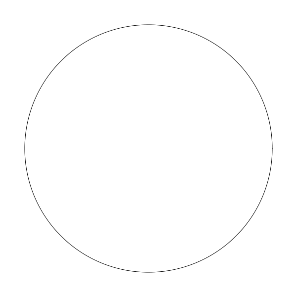

One question is the 0.01 value in the for loop. At this point, this was just a rough guess. If you make it too big, like 0.2, then you’re going to be jumping around the circle in large jumps and it’s not going to look quite as good:

有一个问题，循环中 0.01 这个值是个大概值。如果你定的太大，比如0.2 ，那么相当于你大踏步在围绕圆跳一圈，得到的结果将会是下面这样很粗糙的圆，看起来可不咋地。

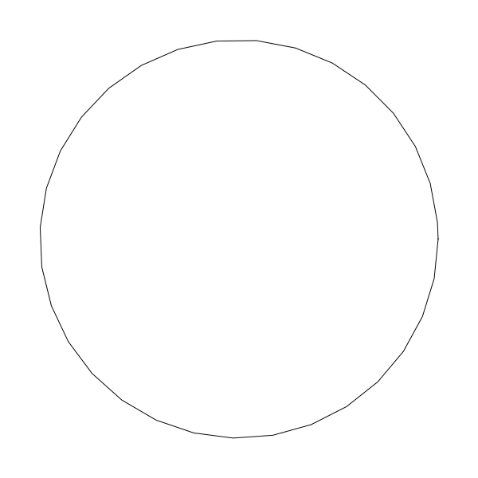

But if you make the increment too small, then you’re doing a lot of extra work for nothing. The larger the radius, the larger the circumference, and the more segments you need to use to make it smooth. The smaller the radius, the fewer the segments you need.
If you’re going with a constant 0.01 increment, you’re drawing 628 segments for each circle. This is way too many for a small circle.
By shear trial and error, I’ve found that a workable resolution seems to be about 4.0/radius. This looks good on circles down to a radius of 5. And on a radius of 200 draws half as many line segments as an increment of 0.01 and looks just as good. You can do some experiments on your own and see what looks good to you as it may vary by system.

但你如果将值设的太小，那么系统将会做太多无用的绘制。圆周越大你就需要更多的线段让它看起来丝滑，半径越小需要的线段就越少。如果你用0.01这个常量用于递增，你将在每个圆上绘制628条线段。这在小圆上面可就太多了，浪费了。
吾上下而求索，找到了一个可用的方案，大至是 4.0/radius . 在半径小于5或大于200，比直接使用0.01这个递增值绘制时的线断少了一半，但看起来依然不错。可能因系统而异，你自己尝试一下不同值看看。

## A Function
With this, we can make a circle drawing function like so:

## 封装成函数
有了这些， 我们可以把绘制圆封装成一个函数：

```
function circle(x, y, r) {
  res = 4 / r
  for (t = 0; t < PI * 2; t += res) {
    lineTo(x + cos(t) * r, y + sin(t) *r)
  }
  closePath()
}
```

Note that I left off the stroke in the function. This way you can create the circle with this function and then choose to stroke it, fill it or do both. If you want, you can make a strokeCircle function and a fillCircle function. Here’s how you’d use this:


注意：我将stroke 方法移在函数内移徐掉了，这样你可以用函数创建圆，可以选择描边或填充，或两者都用。如果你愿意，你可以进一步封装strokeCircle函数和 fillCircle函数。下面是函数使用演示

```
width = 600
height = 600
canvas(width, height)
 
circle(width / 2, height / 2, 200)
stroke()
```


## Arcs
Now that we have that down, we can build on this to create an arc function. Again, your api may already have this, but lets’ do it anyway.
This’ll be pretty easy. It’s the same as the circle function, but instead of starting at 0 and ending at 2 * PI, we let the user say what angles they want to start and end at.
This is all pretty straightforward, I’ll just throw the code out here without any pre-explanation:

## 圆弧
圆算是干完了，现在我们可以在此基础上创建arc函数。你的编程语言可以已经实现了，不重要，我们再实现一遍。这很简单。和圆函数一样，但我们取代开始位置0和结束位置2 * PI, 我们让调用者决定开始与结束位置。
不再解释了因为过于简单我直接抛出伪代码吧

```
function arc(x, y, r, start, end) {
  res = 4 / r
  for (t = start; t < end; t += res) {
    lineTo(x + cos(t) * r, y + sin(t) *r)
  }
  lineTo(x + cos(end) * r, y + sin(end) *r)
}
```

Told you it was simple. Instead of hard-coding the start and end angles to 0 and 2 * PI, we make them parameters. Also, I removed the call to closePath and replaced it with a final lineTo that draws a last line to the end angle, just to be precise.

To use it:

你看简单吧，仅仅是将硬编码的开始与结束角度替换成参数传入的形式。当然，我移除了closePath() 调用，取而代之的是最终lineTo，这样更精确一点。

像下面一样使用它：

```
width = 600
height = 600
canvas(width, height)
 
arc(width / 2, height / 2, 250, 0.5, 3.5)
stroke()
```

结果会是：


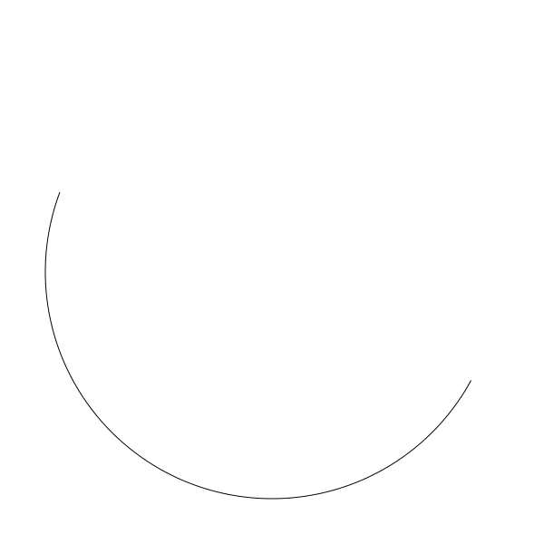

But there are a couple of problems. What if I entered the start and end angles in the opposite order?
有一丢丢问题。如果我将输入的开始与结束对调呢？

```
arc(width / 2, height / 2, 250, 3.5, 0.5)
```

his will jump out of the for loop right away because 3.5 is already greater than 0.5. Nothing gets drawn. What I probably wanted was to start at the angle of 3.5 and go around until I crossed the start of the circle and hit 0.5 again, like this:

它会立即结束循环，因为3.5 已经大于 0.5了。啥也不会画出来。 我想要的是开始在3.5度，又绕回到 0.5度像下面这样：

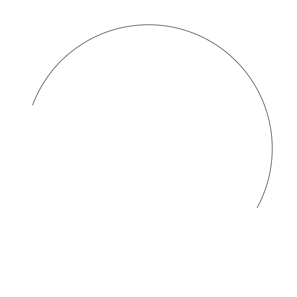

One way to handle this is just to make sure that the end angle is greater than the start angle. We can do that by checking if it’s smaller and then adding 2 * PI to it until it is bigger.

一种实现方式是我们只要保证结束的度数大于开始度数，我们可以判断如果结束度数小于开始度数，那么直接加上2*PI，直到结束度数大于开始度数。


```
function arc(x, y, r, start, end) {
  while (end < start) {
    end += 2 * PI
  }
  res = 4 / r
  for (t = start; t < end; t += res) {
    lineTo(x + cos(t) * r, y + sin(t) *r)
  }
  lineTo(x + cos(e) * r, y + sin(e) *r)
}
```


Now this should work as expected and produce the image shown above. One more thing though. We’re always making the assumption that we’re drawing the arc clockwise. We should allow the user to make that decision. Luckily this is pretty simple. We’ll just add another parameter, anticlockwise. If this is true, we just need to swap start and end and we should be good.

现在应该可以正常展示成上面期望的那样了。还有一件事儿，我们总是假定用户绘制是顺时针的。我们应该让用户自己决定，幸运地是这很容易实现，我们只需要传另一个参数 anticlockwise，如果值为true，我们只需要交替start 与end 就可以了。

```
function arc(x, y, r, start, end, anticlockwise) {
  if (anticlockwise) {
    start, end = end, start
  }
  while (end < start) {
    end += 2 * PI
  }
  res = 4 / r
  for (t = start; t < end; t += res) {
    lineTo(x + cos(t) * r, y + sin(t) *r)
  }
  lineTo(x + cos(e) * r, y + sin(e) *r)
}
```

If you’re lucky, your language will let you do the swap like this:

如果你足够幸运，你使用的编程语言支持像这样交换变量：
```
start, end = end, start
```

If not, you’ll have to go the old fashioned route:
如果不能像上面这样交替，那就只能用老方法了：
```
temp = start
start = end
end = temp
```

Now this code:
这里调用代码

```
arc(width / 2, height / 2, 250, 3.5, 0.5, false)
stroke()
```

will give you this arc:
会给你期望的圆弧了：



And this code:
下面这段代码
```
arc(width / 2, height / 2, 250, 3.5, 0.5, true)
stroke()
```

will give you this arc:
则给你这样的圆弧：



Both start at an angle of 3.5 and draw an arc to 0.5. One goes one way, the other goes the opposite way.
As mentioned at the beginning of the article, positives angles going clockwise is the default I chose here, unlike Cartesian coordinates. Now that you know how to draw arcs in either direction, you are free to make your default whichever way you want.
Now that we have a solid arc function, we can actually go back and remove some duplication from our circle function, changing it to this:

两者都是开始于3.5度结束到0.5，一条正的，一条按反的方式画。
正如开始时在圆形处提到过，这里我选择了正向角度顺时针为默认，这与笛卡尔坐标系不同。现在你知道在不同方向上如何绘制圆弧，你可以选择你一个喜欢的作为默认方向。

现在我们有了一个强大的圆弧函数，我们其实可以用它替换原来圆函数内的一些重复代码，像下面这样


```
function circle(x, y, r) {
  arc(x, y, r, 0, 2 * PI, true)
}
```

This draws an arc from 0 to 2 * PI, which is a circle.

从0- 2*PI 可不就是一个圆么。


## Segments and Sectors
There are a couple of other functions you can create if you find them useful. A segment is an arc that is joined by a line segment between its beginning and end (a chord). We can do this by drawing an arc and then just calling closePath or whatever does that on your system.

## 片段与扇区
这里还有几个可以创建的函数如果你觉得它们有用的话。将圆弧首尾相连起(一条弦)形成的一个圆弧片。我们可以这样实现它，在绘制圆弧完毕时直接调用closePath函数，你使用的编程语言中肯定也有类似的函数。

```
function segment(x, y, r, start, end, anticlockwise) {
  arc(x, y, r, start, end, anticlockwise)
  closePath()
}
```

Here’s a segment that goes from an angle of 2.5 to 4.5:

这个圆弧片，就是从2.5度至4.5度

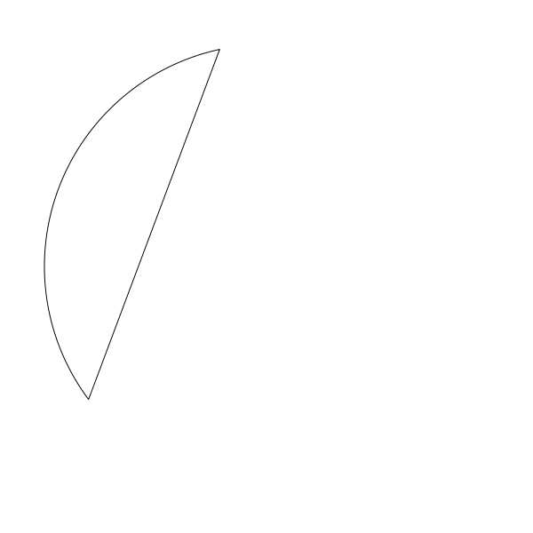

And a sector is an arc that is joined by line segments that go to the center of the circle. We can do that by executing a lineTo to the center point and then calling closePath

一个扇形就是将圆弧用线段从中心点连接起来，我们可以调用lineTo至中心点，然后再 closePath


```
function sector(x, y, r, start, end, anticlockwise) {
  arc(x, y, r, start, end, anticlockwise)
  lineTo(x, y)
  closePath()
}
```

Here is a sector drawn with the same angles as the segment example:

用上面圆弧片一样的度数参数画的扇形：

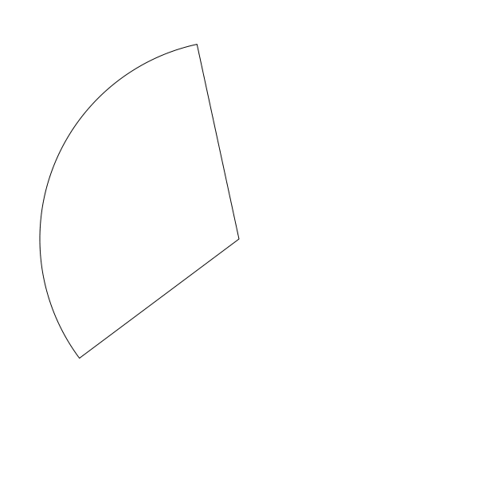

Now you’re well on you way to making pie charts!
现在你可以自己画饼图了。


## Polygons
Before we move on to ellipses, I want to give you one bonus function: regular polygons. This isn’t what I would normally think of as a curve, but mathematically, it might be. Anyway, it’s low hanging fruit, right there for the picking, so let’s do it.
When we were talking about resolution, we saw how a low resolution circle starts to look chunky. You can see the individual line segments that make it up. Well, we can push that bug even further and turn it into a feature.If we push the resolution so low that we only wind up drawing six segments in our circle (exactly six), we have a hexagon. Five create a pentagon, four a square and three a triangle. We just have to specify how many sides we want, and divide 2 * PI by that number to get the resolution that will make that shape.
Here’s one take:

## 多边形
在介绍椭圆之前，我想先给你奖励个规则多边型。 这倒不是我认为多边形是曲线，但数学上来讲它可能真的是。 无论如何，反正来都来了，把它学了吧。

最开始我们讨论过分辨率，我们看到过低分辨率的圆边上看起来一段一段的。你能看到圆是由单独一条条线段组成的。我们可以把这个bug点更进一步转化成一个可用的特征。如果我们将分辨率降低到足够低直到只有6个片段组成一个圆，我们就得到了一个六边形， 5 条线段就是 五边形，4条就是方形，3条就是三角形。 我们仅需要特别处理我们希望有多少条边，除以 2*PI 当作分辨率就可以成形了。

实现如下：

```
function polygon(x, y, radius, sides) {
  res = PI * 2 / sides
  for (i = 0; i < PI * 2; i+= res) {
    lineTo(x + cos(i) * radius, y + sin(i) * radius)
  }
  closePath()
}
```

Now you can call it like:

```
polygon(300, 300, 250, 5)
stroke()
```

and get a pentagon like this:

得到一个五边形：

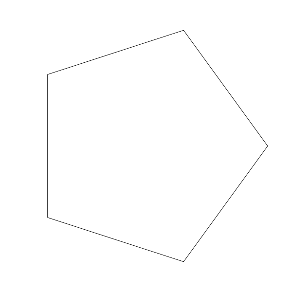

You might want to specify an initial rotation, you can do that like so:

也许你想为这个多边形初始化一个特别的角度，你可以这样做


```
function polygon(x, y, radius, sides, rotation) {
  res = PI * 2 / sides
  for (i = 0; i < PI * 2; i+= res) {
    lineTo(x + cos(i + rotation) * radius, y + sin(i + rotation) * radius)
  }
  closePath()
}
```

Now you can say

```
polygon(300, 300, 250, 5, 0.5)
stroke()
```
and have the polygon rotated a bit.

得到了一个转了一点角度的多边形

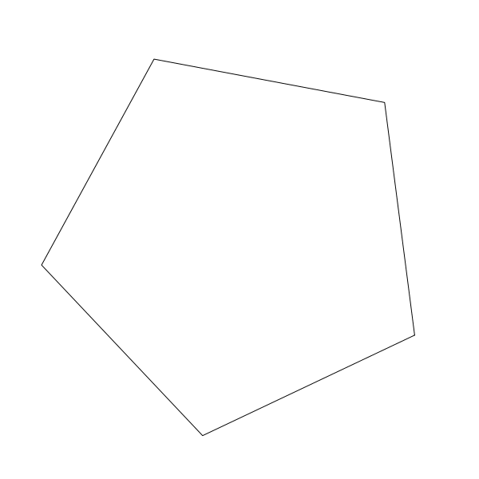

Try it with different numbers of sides.
A fun effect is to create a series of polygons of different sizes, each slightly rotated.

试试传入不同的边数。

一个有趣的效果是创建一系列多不是大小的多边形，每个多边形相应旋转一丢丢的角度：

```
angle = 0
for (r = 5; r <= 255; r += 10) {
  polygon(300, 300, r, 5, angle)
  stroke()
  angle += 0.05
}
```
This creates a nice pattern like so:

效果如下：

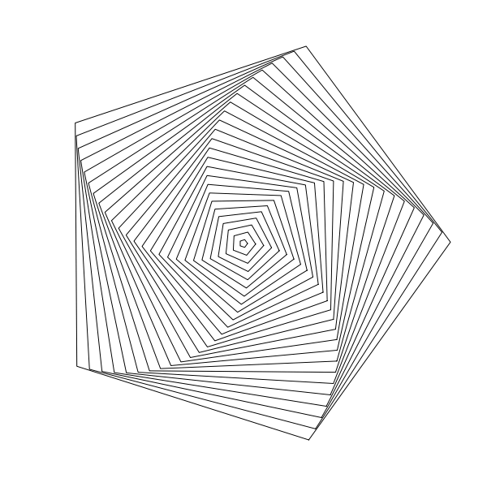

Might be a bit off-topic, but hey, there are five new emergent curves there! I’ll accept it.
也许有一点点离题，但你看图形里突然形成了5条新的曲线，能接受，能接受。

## Ellipses
Final bit of this installment, ellipses.

## 椭圆
本文最后一部分，椭圆。

Well, let’s look at the definition of an ellipse, from Wikipedia…
好的让我们来看看椭圆在维基百科中的定义...

> a plane curve surrounding two focal points, such that for all points on the curve, the sum of the two distances to the focal points is a constant.
> https://en.wikipedia.org/wiki/Ellipse

> 环绕两个焦点的平面曲线，对于曲线上的所有点，到焦点的两个距离之和为常数
> https://en.wikipedia.org/wiki/Ellipse
hmm… I get it, but doesn’t really help us to draw it. How about…

Em... 完全搞不懂，太数学化了。再看看这条解释...

> Ellipses are the closed type of conic section: a plane curve tracing the intersection of a cone with a plane
> https://en.wikipedia.org/wiki/Ellipse

> 椭圆是圆锥截面的封闭类型:沿圆锥与平面相交的平面曲线
> https://en.wikipedia.org/wiki/Ellipse

Nope. Let’s keep reading…
还是一样不好理解，好吧，继续...

An ellipse may also be defined in terms of one focal point and a line outside the ellipse called the directrix: for all points on the ellipse, the ratio between the distance to the focus and the distance to the directrix is a constant.
https://en.wikipedia.org/wiki/Ellipse

> 一个椭圆也可以用一个焦点和椭圆外一条叫做准线的线来定义:对于椭圆上的所有点，到焦点的距离和到准线的距离之比是一个常数。
> https://en.wikipedia.org/wiki/Ellipse

OK, this is going nowhere. But as before, we can eventually find the parametric formula, which I’ve tweaked a bit to be similar to the one we had for the circle.

好吧，行不通，但就如之前那样，最终我们可以找到可用的参数方程，和之前的圆参数方程差不多


```
x = a + rx * cos(t)
y = b + ry * sin(t)
```

Here, in addition to the a and b that form the center position of the circle, we have rx and ry which I find easiest to think about as “radius x” and “radius y”, though these names will probably make mathematicians cringe. But for an un-rotated ellipse, rx will wind up being equal to half the ellipse’s width, and ry half its height.
So we can make a function:

这里，除了用 a 和 b 表示圆心点之外，还有 rx  和 ry 这是我找能找到最简单的表示变量 ”radius x” 和“radius y”, 尽管这些名可能让数学家鄙视。但对于一个未旋转的椭圆 rx 终会等于一半的椭圆宽，ry 等于一半的椭圆高。

所以我们可以编写下面这样一个函数

```
function ellipse(x, y, rx, ry) {
  res = 4.0 / max(rx, ry)
  for (t = 0; t < 2 * PI; t += res) {
    lineTo(x + cos(t) * rx, y + sin(t) * ry)
  }
  closePath()
}
```

About the only thing worth mentioning here is that to get the resolution value, I divide 4.0 by the largest of the two “radii”. you might think of a better way, but this is good enough for me. Now you can call it like:

值得提醒的一点，是分辨率值， 我将4.0 除以 rx和ry中的最大值。你可以想想有没有更好的，但这对于我来说足够用了。现在你可以像下面这样调用它


```
ellipse(300, 300, 250, 150)
stroke()
```

And get:

得到

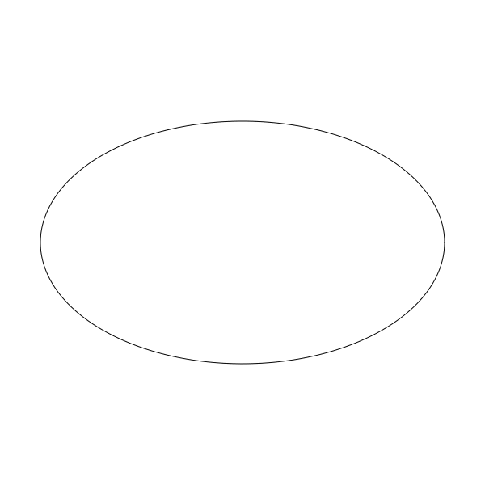

## Bonus
Sometimes I can’t stop writing. This next part isn’t really so much about creating curves… or maybe it is. You decide. But rather than draw line segments between each point on a circle (or arc, or polygon, or ellipse), we could just draw some other shape there. We’ll have to increase the interval that we use to draw the curve so all the shapes don’t mash together. In fact, the polygon method is perfect for this. This lets us draw a circle with a set number of circles. I’m not even going to explain this code. You should get it.

## 小惊喜
有时候我写了就停不下来。接下来的这部分与创建曲线关系不大…，或者说也有一定相关。你自己看后再看是不是吧。 比起在圆周（或圆弧，多边形，椭圆）上每个点之间连线段，我们可以在这些点上画一些不一样的形状。我们将增加曲线间这些点之间的间隔以足够空间画其它形状不至于挤在一起太乱。事实上，多边形函数正好适用在这里。它可以让我们画一个多个圆组成的圆形。对于代码我就不解释了，你应该可以 理解。

```
width = 600
height = 600
canvas(width, height)
 
cx = width / 2
cy = height / 2
 
res = PI * 2 / 20 // to draw 20 circles
for (t = 0; t < PI * 2; t += res) {
  x = cx + cos(t) * 200
  y = cy + sin(t) * 200
  circle(x, y, 20)
  stroke()
}
```
Which gives us:

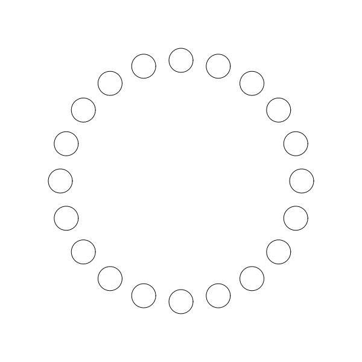

## Summary
I’m already elaborating on this in my head, but we’re off-topic enough, and this installment is long enough.
So far things have been pretty basic, but hopefully still interesting. From here on, they will get a bit more complex and hopefully even more interesting.

## 总结
写这章内容之前我在脑海中仔细想过，但是其实已跑题了，这一篇也足够的长了。
到目前为止都很基础，但希望依然有趣。从这之后，我们将慢慢接触一点复杂的东西希望内容更加的有趣。


