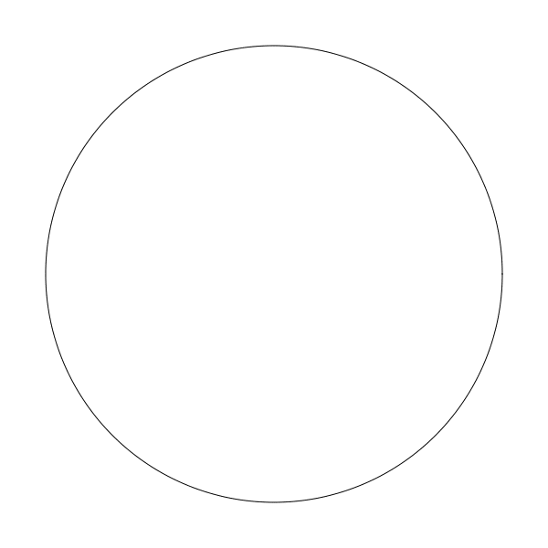
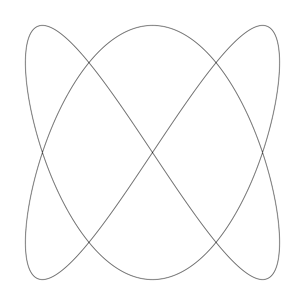
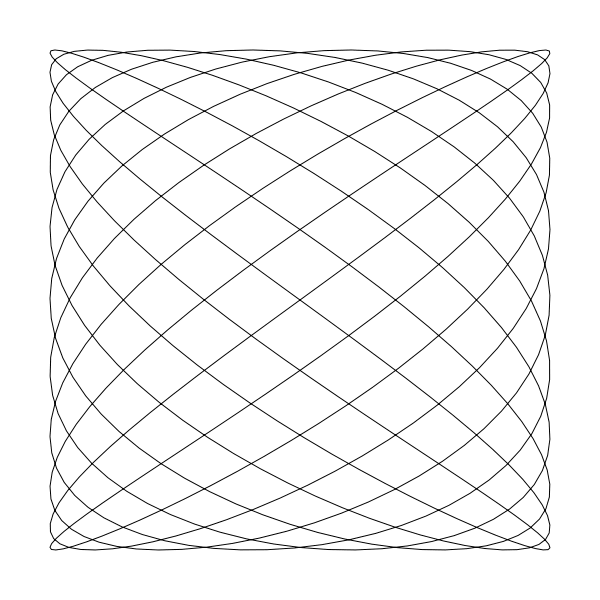
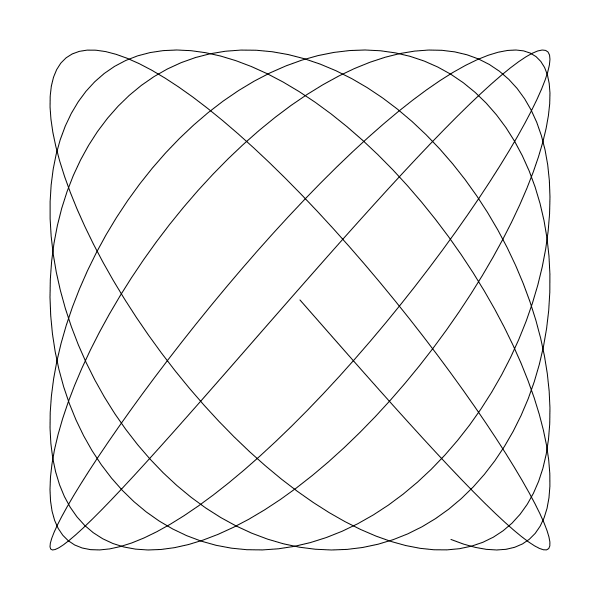
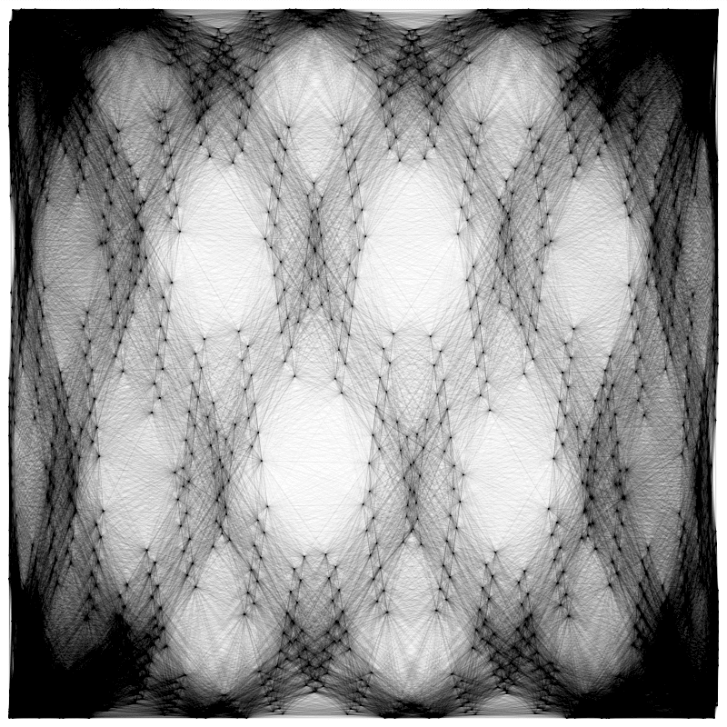

# 第四章 利萨茹曲线

Chapter 4 in the Coding Curves Series

Make sure you are familiar with at least the first chapter, to understand how the code samples work.

Lissajous curves have always been one of my favorite techniques. They are useful for many things beyond the obvious loopy shapes they create. In this installment, we’ll cover the basics, and as usual, wander off course here and there to look at other ways they can be used.


这是曲线艺术编程系列的第四章

确保您已知晓了最初一章中我们对示例代码的约定。

利萨茹曲线一直是我最喜欢的技术之一。除了它创建的明显的循环形状，在实际中它比它看起来更有用。

在这一篇中我们将覆盖它的基础知识，像往常一样，我们还得看看它在其它方面的应用。

The Basics

Lissajous curves are also known as Lissajous figures or Bowditch curves. Both names came from the names of men who looked into and wrote about them in the 1800s.

These figures are formed by long looping curves that go back and forth and left and right. In their pure form, they recall the glowing patterns seen on oscilloscopes used for special effects in a vintage scifi movies.

## 基础

利萨茹曲线又名利萨茹图形或鲍迪奇曲线。两个名字都来自于19世纪研究和撰写它们的人名。

这些曲线图形由规则的长曲线左右来回的循环组成。它们纯粹的形状，让我们想起常常在老式科幻电影中显示在示波器上发光的图形。


The Formula
In this case, a useful parametric formula was one of the first things I found in researching this subject.

## 公式
此番，在一开始我搜索利萨茹曲线相关题材时就找到了一个有用的参数方程。

```
x = A * sin(a * t + d)
y = B * sin(b * t)
```

Basically what we have here is a sine wave on the x-axis, and another sine wave on the y-axis. So instead of going off infinitely in any direction, it keeps looping back in on itself.

最基础的我们发现一个正弦波在 x 轴，另一个正弦波在 y 轴。 它不会在某个方向上趋向无限，它在自己的周期内会循环回来。

We have a bunch of variables here. Let’s break them down.

我们有了好些个变量在这个公式中。让我们分开拆解看看。

A and B wind up being the width and height of the curve on the x- and y-axes. Or technically, half the width and height because the curve will extend that distance in each direction.

A 和 B 最后影响的是曲线在 x 轴宽和 y 轴高. 或者从技术上讲，只是宽高的一半，因为会在它各自方向上延展。

The t is a parametric variable that will range form 0 to 2 * PI. Although it can actually go beyond that in either direction, it will effectively just loop back on itself when it does. t is multiplied by a for the x component, and by b for the y component, and the sine is taken of the result on each axis. In addition, the x component has a d or delta variable added to it to move it out of phase.

t 是一个范围 在 0 到 2*PI 的范围参数变量。尽管在真正执行时它在各自方向上会超出范围，但实际上只是在自身内循环。在 x 方程中 t 乘以 a, y 方程中 t 乘以 b ，然后在各自轴结果传入正弦函数。另外，在 x 方程中参数 d 或者说 delta 变量用于把它移出相位。

This formula might look a bit familiar from the previous chapter on circles. If we set A and B equal to each other and call them r, and set a and b both equal to 1, then remove the d and use cosine instead of sine for the x component, then we get:

此方程可能看起来像之前章节中我们接触的圆方程。如果我们将 A 和 B 设为相等并且把它当作 r ，并且将 a 和 b 设为 1，再去掉 d ,再用余弦代替 x 方程的 正弦函数，我们就得到了：

```
x = r * cos(t)
y = r * sin(t)
```
this is the parametric formula for a circle (with its center at 0, 0). Since cosine is the same as sine but 90 degrees out of phase, we could also say:

这就是原点在 0，0 的圆方程了。并且 余弦就是正弦+90度，所以我们也可以说：

```
x = r * sin(t + d)
y = r * sin(t)
```

… where d equals 90 degrees, or PI / 2 radians.

... 这个 d 就是 90 度 ，或者 PI / 2 弧度。

You can also see the relation to the ellipse formula if you keep A and B separate, where A is what we called the “x radius” and B is the “y radius”:

A 和 B 分开的情况你在椭圆方程里已经见过了， 在那里 A 我们叫作 '半径 x', B 就是 “半径 y”

```
x = A * sin(t + d)
y = B * sin(t)
```

So when everything is in sync like this, we get a circle or ellipse, but when we start changing these parameters, we get much more interesting curves.

OK, enough talk, let’s code. We can jump right into making a Lissajous function. I’ll abbreviate a bit.

所以当参数像上面那样，我们就得到了圆和椭圆，但当我们改动一些参数后，我们就得到了更有趣的曲线。

好了，说的够多了，开始编码吧。我们直接掉到利萨如函数。我会简化一下。

```
function liss(cx, cy, A, B, a, b, d) {
  res = 0.01
  for (t = 0; t < 2 * PI; t += res) {
    x = cx + sin(a * t + d) * A
    y = cy + sin(b * t) * B
    lineTo(x, y)
  }
  closePath()
}
```

Here, the resolution value is not as straightforward as in circles and ellipses. For now, I’m just going to keep the res value very small, even if it means we’re doing to much work for simpler, smaller curves. Since we’re going from 0 to 2 * PI (6.28…), incrementing by 0.01 will give us 628 line segments, which should be enough for most cases. If it starts getting blocky, you can increase it, but I’m not going to go into how to best predict it.

Now we can use this in a sketch like this:

此处，分辨率变量 res 不像之前在圆和椭圆函数内那样。在这里我给了一个很小的值，尽管它意味着画更多的小曲线。这样设定后从 0 到 2 * PI (6.28...), 从0.01开始增长将会得到528条线段，这对大多数例子来说足够用了（译者注：线段越多意味着越平滑）。如果曲线变的不平滑了，你就改这个值让线段变的更多。但我不打算深入测算到一个合适的值。

现在我们能用它画出来像下面这样调用：

```
width = 600
height = 600
canvas(600, 600)
 
liss(300, 300, 250, 250, 1, 1, PI / 2)
stroke()
```

Here, I did what I described above, setting A and B equal to each other, a and b to 1, and d to PI / 2. This should give us a circles, and in fact…

这个图就像我上面说的那样，我把 A 和 B 设为相等的值，a 和 b 设为 1 并且 d 设为 PI / 2 。这样实际得到的结果就是一个圆形...



... 看，确实是圆。


Let’s set d to 0 and mess with a and b for a while. Here, a and b are 2 and 1 (again, with d at 0):

让我们先将 d  设为 0 然后 a 和 b 稍后小变化一下子。 这里，将 a 和 b 分别设置为 2 和 1（再次 d 设为 0）

```
liss(300, 300, 250, 250, 2, 1, 0)

```


And now they are 2 and 3:

设为 2 和 3 时：

```
liss(300, 300, 250, 250, 2, 3, 0)

```



Let’s crank them up to 11 and 8.

让我们调的更大一点，11 和 8

```
liss(300, 300, 250, 250, 11, 8, 0)

```


In all these cases, with d at 0, the waves on each axis are in phase with each other. Here, I kept 11 and 8 and set d to 0.5, moving them out of phase:

以上的这几个例子都中 d 都是 0， 波形都在自己轴的相位。现在我们保持 11 和 8 不变，将 d 变成 0.5， 移出它们的相位。

```
liss(300, 300, 250, 250, 11, 8, 0.5)

```


Here’s an animation with a at 6, b at 7, and d varying.

这里的动画是 a 为 6，b 为 7， d 持续变化时产生的图形变化


It’s worth noting that a and b should be whole numbers if you want the curve to join its start and end points together smoothly. Here’s what happens if you set a to 6.4 and b to 7.3:

如果你想你的曲线首尾相接的丝滑那么没有什么 比 a 和 b 不是整数更糟的了。 如果你将 a 设为 6.4，b 设为 7.3

```
liss(300, 300, 250, 250, 6.4, 7.3, 0)
```


You can see even more clearly what is happening, if you remove the closePath call from the function:

如果你想看清楚点发生了啥，那么将 closePath 从函数内注释掉看看结果：




Now you can see the curve starts and ends in random locations, rather than joining up smoothly as it does when a and b are whole numbers.

Of course, when you use fractional numbers here, you can now extend your t way past the 0 to 2 * PI range and continue to fill the space. Here, t goes from 0 to all the way up to 20 * PI:

现在你可以看到曲线开始与结束点在随机位置， 而不是像 a 与 b 为整数时丝滑的连接起来。

当然，当你在这里使用小数时，你可以将变量 t 的范围从 0  到 2 * PI 继续放大到可以填满整个空间。 这里是我将 t 范围扩展到 20 * PI 的效果：


The paths will eventually join up again if you use rational numbers for a and b. But it might take a while. Here it looks like they came pretty close.

如果 a 和 b 你使用了有理数路径将最终又连接起来。 但可能会花点时间（译者注：如果是在动画中）。这里看起来基本很接近了。


We can of course, change A and B to get wide figures:

我们当然也能通过改变 A 和 B 这两个变量来获取更宽的图形：


A = 250, B = 100

or tall figures:

或更高


A = 100, B = 250

That’s about it in terms of drawing these figures directly. Check out the Wikipedia article on the subject to learn more about the various properties of this type of curve. I was thinking about creating an interactive demo here, but it turns out there are a bunch of them on line already. A few are linked near the bottom of the Wikipedia article I just mentioned.

这就是直接绘制利萨茹图形的方法。 可以查查维基百科与此相关的资料，学习一下这类曲线的多种属性。 我考虑在这里创建一个可交互的 demo， 但最后发现网上已经有很多了。文章最后我放了一些链接

Instead we can look at some other applications here.

取而代之的是，我们可以看看另外的应用方向。

Animation

Here, I’m not talking about animating the curve itself, like I did above, but using the Lissajous curve results to animate an object. But first let’s talk about a simpler level of animation.

## 动画

不会像上面做的曲线动画一样，这里我不讨论曲线自身的动画，但会利用利萨茹曲线的结果应用于某个对象。

但，首先我们先聊一聊最基础的动画

Oscillation

Often you want to animate an object but have it remain on screen. You just want it to go back and forth or up and down, or twist one way or the other or even grow and shrink. You might recognize that these are some of the more basic 2D transformations – translation, rotation and scaling. You can use a sine or cosine function to generate values for these transformations, and just change the input to that function over time.

We’ll have to expand our pseudocode to include a loop function that runs repeatedly forever and can draw something differently each time it’s run to create an animation. Processing has something like this built in, as may other graphics systems. But you might have to put something together yourself. If you’re using HTML and JavaScript you can use requestAnimationFrame.

And we’ll postulate into existence a clearCanvas function too. Why not? We’ll also include a circle function that can be the one we created in the last installment, or one that comes with your drawing api. We’ll start something like this:

## 振荡

通常你想在屏幕上对一个对象进行动画， 你想让它上下左右的动，或者对它进行扭曲，变大，缩小。 那么你可能已经认识了一些2D图形变形属性，平移，旋转，缩放。 你可以用正弦或余弦函数计算结果值应用于这些变形属性，随时时间的推移改变那些方法的输入值就可以。

我们需要扩展一下我们的伪代码，它包含一个 loop 循环函数用于时刻进行不同绘制，它运行起来就是动画了。Processing （译者注：一个著名的图形库） 已经有内建的功能，其它图形系统也有类似的功能。但是你可能需要自己编写一个函数来实现这些功能。如果你用的是 HTML 和 javascript 的，那么我们可以使用 requestAnimationFrame 函数来实现。

我们假定它也拥有一个 clearCanvas 方法。我们可以把上一篇中编写的 circle 函数用到此处，或者使用你编码平台内置的绘图 api 。 我们像下面这样开始：

```
width = 400
height = 400
t = 0
canvas(width, height)
 
function loop() {
  clearScreen()
  circle(width / 2 + sin(t) * 100, height / 2, 20)
  fill()
  t += 0.1
}
```


This takes the sine of t and multiplies that by 100 to get an offset position for the circle on the x-axis. As t is continually incremented, the circle keeps going back and forth. You could easily do the same thing on the y axis, or you could apply the sine to the radius:

这里将正弦中的 t 乘以 100 以获得圆在 x 轴上的偏移。当 t 持续增长时，这个圆会来回运动。你也可以简单的对 y 轴应用同样的效果。或者应用在半径上：

```
width = 400
height = 400
t = 0
canvas(width, height)
 
function loop() {
  clearScreen()
  circle(width / 2, height / 2, 50 + sin(t) * 20)
  fill()
  t += 0.1
}
```


Here, we’re taking 50 as the base radius, and using the sine of t times 20 to that. Because sine will go from -1 to +1, we’ll be adding -20 up to +20 to the radius, making it oscillate from 30 to 70.

We could do the same thing with rotation, but then we’d have to switch to something other than a circle so we could actually perceive it rotating. I’ll leave that to you to try.

But going back to moving the circle around. Say we want to have it move all around the canvas. We could of course use sine and cosine to make it move in a circle:

此处，我们用 50 作为基础半径，加上使用 t 的正弦值乘以 20。由于 正弦值从 -1 到 +1 ，半径会加上 -20 到 +20 , 结果就是 30 至 70 之间振荡。

我们同样也可以将此应用在旋转属性上，但需要换一下图形，以便于我们可以观察到它的旋转。我把这个留给你自己实现吧。

回到绕圆运动。我们希望它绕整个canvas做圆周运行。我们一样可以使用正弦配合余弦完成圆周运动：

```
width = 400
height = 400
t = 0
canvas(width, height)
 
function loop() {
  clearScreen()
  circle(width / 2 + cos(t) * 100, height / 2 + sin(t) * 100, 20)
  fill()
  t += 0.1
}
```


But what if we wanted something more organic? We could start adding random motion, but then you run into the problem of how to constrain it so it doesn’t wander off screen. Not insurmountable, but we can do a pretty good trick using the Lissajous formula, like so:

假设我们希望它运动的更加自然该如何实现？我们可以为它添加一些随机运动，然后你会发现一个问题，如何保证它只在屏幕内运动。不难，我们可以使用利萨茹的公式来实现这一点，如下：

```
width = 400
height = 400
t = 0
a = 13
b = 11
canvas(width, height)
 
function loop() {
  clearScreen()
  circle(width / 2 + sin(a * t) * 100, height / 2 + sin(b * t) * 100, 20)
  fill()
  t += 0.02
}
```


This is an imperfectly looping gif, but you get the idea. The circle just seems like it’s randomly moving around the screen, but it’s actually following the path of a Lissajous curve. To me it looks like a fly buzzing around. In fact, if you add several of these with different parameters, it gives you a pretty convincing swarm of flies. High numbers for a and b, that don’t have common denominators, make the most random looking path.

这是一个不太完美的循环运动 gif 动画，但你应该得到了启发。这个圆看起来就像是随机绕着屏幕运动，但它实际是按利萨茹曲线路径运动。在我看来它就像是一只苍蝇在来回飞。事实上如果你多添加一些应用不同的参数的圆，那么它们会看起来更像一群苍蝇在飞。没有公分母的 a 和 b 数值设的越高，它在路径的运动看起来会更加随机。

Lissajous Webs and Random Lissajous Webs

This isn’t anything remotely “official” that you’ll find documented anywhere (well, maybe one place I’ll mention below), but I think it’s always good to cross-pollinate different ideas. You often come up with something very unique. So I’m just throwing these out there as something I came up with.

Some years ago I had been playing about with drawing Lissajous curves and was thinking about different ways of rendering them. Rather than just rendering the paths themselves, I decided to try capturing each point that made up the curve and then connecting nearby points with lines. The results were pretty cool, and I dubbed them “Lissajous Webs”. Here’s a few examples:

## 利萨茹网络和随机利萨茹网络
下面这些图并非“标准官方”的图形，你可以在任何地方找到相关文档（可能我以前在某个地方提到过），但我始终觉得相互交流不同的点子是非常好的。你常常可以创造出一些独一无二的东西。所以我就放一些我自创的图在这里。

一些年前我曾经使用过利萨如曲线并尝试在不同的方式渲染它们。不仅仅是渲染它自己的路径，我决定用曲线上的每个相近点连接成线条。结果非常酷炫， 我将它们称为“利萨茹网络”。这里是一些例子：

 	

 	


You can find a few more examples here: http://www.artfromcode.com/?p=657

你可以在这里找到更多 http://www.artfromcode.com/?p=657

I thought these were pretty damn cool looking. The technique was included in the book Generative Design (with full credit to and permission by me).

我认为它们看起来超酷。这些技术包含在了 Generative Design 这本书中 （信我）

As I continued to play around with the idea, I wanted to make them even more organic. Rather than fixed a and b multipliers, I started letting these parameters wander a little bit, randomly. These wound up creating some really amazing images, which I called “Random Lissajous Webs”.

随着我创意持续的进步， 我希望让它们更加的自然有机。 而不是为 a 和 b 填充乘数，我开始让这些参数一点点随机漫游。这会生成真正惊艳的图，我把它们称作“随机利萨茹网络”

 	

 	


This concept became one of my more popular pieces. I was even commissioned some years later to do a series of designs using this technique that got used on wine bottles.

这个概念成为了我受欢迎作品的一部分。我甚至被委托在几年后将用此项技术设计一个系列印在红酒瓶上。


（译者注：红酒网站打不开...）

I’m not going to go through the code for all of these. This is more just for inspiration – how the concept of Lissajous curves led to something entirely different and very interesting.

The next chapter will look at a couple of related systems that are also very interesting ways of creating curves.

我就不再亮代码了。这更多的是启发-如何利用利萨茹曲线这一概念让事物变的完全不同并且非常有趣。

下一章我们将聚焦在一些相关的系统上，它们同样使用非常有趣的方式创建曲线。


