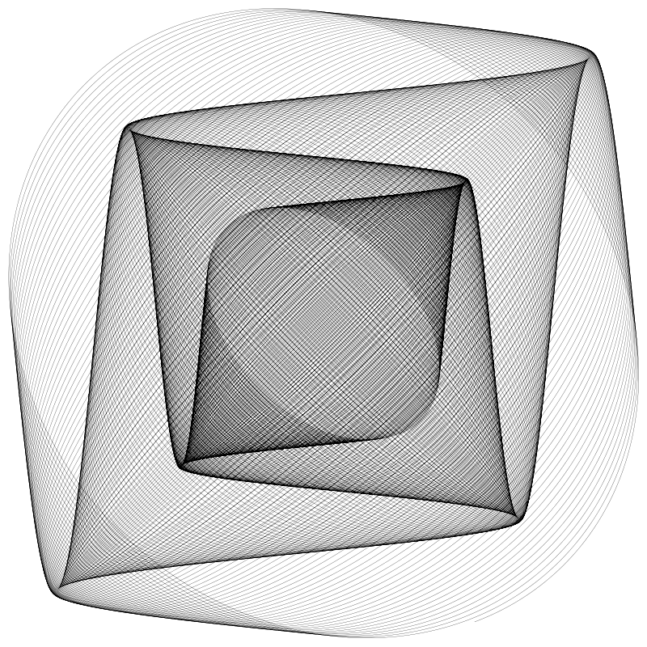
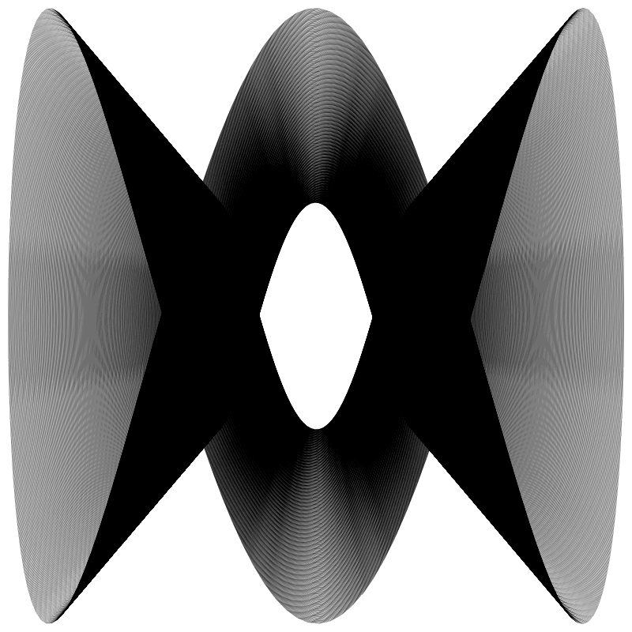
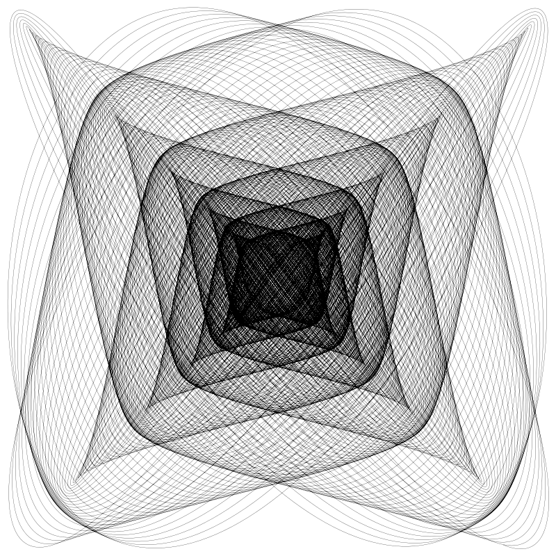
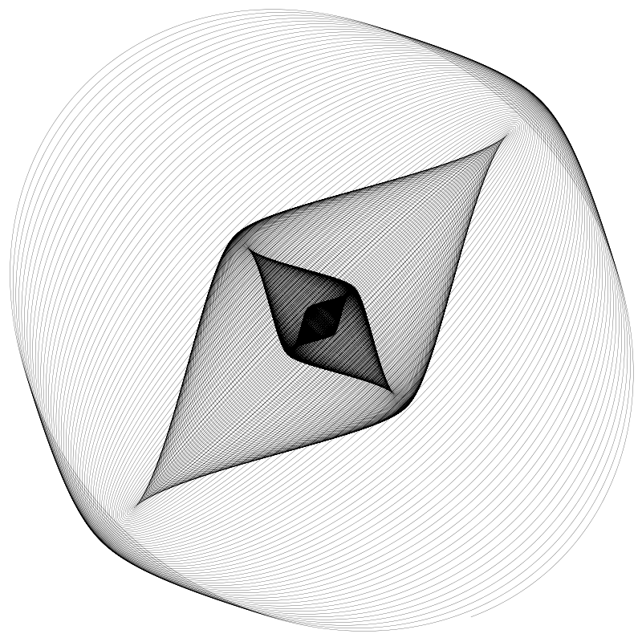

# 第五章 谐波图形（谐振图形） HARMONOGRAPHS

> 原作：Keith Peters

> 译者：sheldon(王二狗) 

> blog: http://cnblogs.com/willian/

> github: http://github.com/willian12345

Chapter 5 of the Coding Curves Series

曲线艺术编程系列第 5 章

This installment builds on Chapter 4’s discussion of Lissajous curves. Actually, a harmonograph is not a type of curve, it’s a device used to draw Lissajous (and similar) curves. And when I say a device, I mean a real world physical device that has ropes or chains and levers and pen and paper or bottles of sand and pendulums or other mechanics to create these curves.

这一篇幅建立在对第四章利萨茹曲线的讨论之上。事实上谐波图形并不是一类曲线，它是一种用于绘制（模拟）利萨茹曲线的装置。当我说一个装置时，我的意思就是真实物理世界的一个设备，它由绳子、链条、杠杆、笔、沙瓶、钟摆或其它机械结构组成用于创建这些曲线。

Real Harmonographs

The first time I saw a harmonograph was at the Museum of Science in Boston on one of my many childhood trips there. It was a pendulum with a container of sand that leaked out and created a trail. The video below is not the exact one I was familiar with, but is essentially the same thing. I didn’t know it was called a harmonograph until many years later.

## 真谐波图形

我第一次碰到谐波图形是在波士顿的一个科技馆中。那是在我小时候众多旅行中的一次。它是一个类似钟摆，装满沙子的容器，沙子漏出来形成一条轨迹。这个视频中展示的并不完全像我当时看到的，但基本差不多。直到多年后我才知道它叫 谐波图形 harmonograph 


（译者注：这里我截了个图，我小时候从未见过，不知道你大伙有没有见过类似的东西，反正我是第一次见）

https://www.youtube.com/watch?v=uPbzhxYTioM


The video is worth watching and discusses Lissajous patterns in depth. With a pendulum, the time it takes to go back and forth is called its period, but it’s what we called the frequency in the last installment of this series. At around 4:12 in the video, the presenter explains how this pendulum can have two different periods – one on each axis. This is why the patterns it forms look like Lissajous curves – because they are! If each axis had the same period, it would just create circles and ovals and spirals. Still technically Lissajous curves, but not as interesting.

Here’s another version using a pen and paper:


这个视频值得观看用于深入探讨利萨茹图形。 通过一个杠杆，来回摆动所花费的时间就称为周期，我们说过的 frequency 频率放到后面再讨论。在视频的4分12秒处，视频作者解释了这个钟摆装置为什么 可以拥有两个不同周期在它各自轴上。这就是为啥最后形成的图形看起来像利萨茹曲线- 因为它本来就是！ 如果各自轴周期相同，则它可能会创建一个圆形，椭圆形，螺旋。 技术上讲它也是利萨茹图形的一种，只是看起来不太有意思。

这里是另一个版本使用笔和纸


From https://en.wikipedia.org/wiki/Harmonograph

In this case, the pen is stationary and it’s the paper that moves around on a pendulum. But it accomplishes the same thing.

在这个例子中，笔不动，纸做周期摆动。但完成的是一样的事情。

Here’s another video of a similar setup, which appears to be made of cardboard, string and tape!

这里有另一个视频与此类似的的装置，它则纸盒，线，和胶带做成！


https://www.youtube.com/watch?time_continue=65&v=S92mZcNIS8w&embeds_referring_euri=https%3A%2F%2Fwww.bit-101.com%2F&source_ve_path=MjM4NTE&feature=emb_title

There is a key difference between a pure Lissajous curve and a mechanical, pendulum-based harmonograph though. The pendulum slowly loses energy and the distance it travels on each pass gets smaller and smaller. Eventually it will stop swinging all together and sit stationary in the middle of the drawing.

这是纯粹的利萨茹曲线相比机械的，基于摆动的谐波图形关键不同点。 钟摆慢慢失能，摆动经过的距离越来越小。直到停摆在绘制的中心点。

While this type of harmonograph will produce some interesting drawings, you can make it even more complex by using a double pendulum. A common way to do this is to have the paper or drawing surface moving on one pendulum, and the pen moving on another one.

而这种类型的谐波图形可以产生一些有趣的图形，你甚至可以用两个钟摆制作出更复杂的。


Here’s one example of this:

Here, both the paper and pen are mounted on top of the pendulums, which are weights swinging below the table. So they move independently and are able to produce more complex curves.

And here’s yet another video of a very fancy double-pendulum, showing some of the amazing drawings it can create. Quite a couple of characters here too.

下面是一个相关的例子：

此处，纸和笔都安装在钟摆顶部，配重在桌底摆动。所以它们自动能产生复杂的曲线。


这个视频就是一个非常魔幻的双钟摆，展示了它可以创建出惊人的图形。也演示了不少特征。


https://www.youtube.com/watch?v=_PdGcl1Ugl0&t=110s


# Simulated Harmonographs

As this is more of a programming focused site, I’m not going to explain how to build a physical harmonograph. But, these devices operate on the principles of physics. And the formulas that control them are known. We can use these formulas to create a virtual harmonograph.

We’ll start with a simple, single pendulum version. But first, let’s revisit our Lissajous curve formula:

# 模拟谐振

鉴于咱是一个聚焦于编程的网站，我就不解释如何建一个物理的谐振装置了。 但这些装置是基于物理规则的，且这些公式已被我们知晓。我们可以用这些公式创建虚拟的谐波图形。

我们先从单钟摆谐振版本入手，但开始之前我们先回顾一下我们的利萨茹公式: 

```
x = A * sin(a * t + d)
y = B * sin(b * t)
```

A and B are the amplitude of the wave on each axis and a and b are the frequencies. And d is the delta, which puts x out of phase with y. And of course t is the parametric time variable. Initially we said that t would go from 0 to 2 * PI, but later we saw how it could increase infinitely.

To start to move towards simulating a harmonograph, we’ll recognize that each axis will have its own phase, rather than thinking one is phased and the other … unphased? So we’ll change the single d to p1 and p2.

A 和 B 是波在自各轴上的振幅， a 和 b 是频率。 d 用于让 x 和 y 脱离它们的相位。t 是时间参数。  最初我们说 t 会是 0 至 2 * PI 区别，但后面我们会看到它会无穷增长。

为了改动到模拟谐振， 我们要认识到各自轴它们由自己的相位， 而不是只有一个有相位，另一个...没相位？ 所以我们将 d 变成两个变量 p1 和 p2。

```
x = A * sin(a * t + p1)
y = B * sin(b * t + p2)
```

This still gives us a Lissajous curve, but with a bit more complex definition. To fully move it to a simulated harmonograph, we’ll need to simulate that loss of energy, or damping. To do this fairly accurately, this will be an additional multiplier that looks like this:

这依然会是一个利萨茹曲线， 但有了多了一点点复杂的定义。 为了完全模拟谐誫， 我们先要模拟失能或者说摸拟衰减。 为了更为精确，它会以额外的乘数的形式呈现：

```
e-d*t
```

… or “e to the power of minus d times t”

...... 或者说 “e 的底的 负 d 乘以 t 次方” 指数

in code, that might be:

在代码中表现为：

```
pow(e, -d * t)
```

Where pow is the power function, available in any fine math library

pow 方法在任何数据库中都会有。

So what is all this? We have two new variables here: e and d. Actually e is a constant, aka Euler’s number, equal to approximately 2.71828. I’ll let you read up on that on your own, but e is used in all kinds of real world physical formulas. Including, it seems, the damping of pendulums.

所以，这都是些啥？ 我们有了两个新的变量 e and d。 实现上 e 是个常量， 又名欧拉数， 约等于 2.71828。 我会让你自己去了解相关知识，但 e 确实广泛存在于各种物理公式中。当然也存在于钟摆衰减中。

By now you might have guessed that d is for the damping factor. We’ll set d to a pretty small number, something like 0.002 is good to start with. Now when t is 0, that will make the exponent 0 and the result of the power calculation will be 1.0.

到目前为止，你可能猜到 d 是那个衰减因子。 我们将 d 设为成一个相当小的值 比如 0.002 就挺不错的。 现在当 t 等于 0， 那么指数为 0， 指数函数计算结果会为 1.0 。

As t increases, by say 0.01 on each iteration, the value of the exponent will slowly grow negatively. When t is 0.01, the exponent will be -0.00002, and the result of the whole damping equation will be 0.9999800002.

当 t 不断增长， 比如每个迭代增加 0.01， 指数会缓慢的负向增长。 当 t 为 0.01， 指数 为 -0.00002, 指数函数结果将会衰减至 0.9999800002

After 100 iterations, t will hit 1.0 and the damping factor will be 0.9980019987. After 1000 iterations, it will be 0.9801986733. So you can see this goes down very slowly. If you increase d, it adds more damping and that number will go towards 0.0 faster. Here’s how we work it into the harmonograph equation:

100 次迭代后， t 会变为 1.0 衰减因子将会是 0.9980019987。 1000 次迭代后， 它将是 0.9801986733。 所以你可以观察到它减小的非常慢。 如果 d 增加， 那么衰减值会向0.0更快的进发。 下面展示的是应用在谐振公式内：

```
x = A * sin(a * t + p1) * pow(e, -d1 * t)
y = B * sin(b * t + p2) * pow(e, -d2 * t)
```

Notice I made it d1 and d2, so you can have separate amplitudes, frequencies, phases and damping for each axis.

注意，我用了 d1 和 d2 这样你在各自轴就有它各自的振幅、频率、相位和衰减因子了。

To bring it all home, as t increases, that last part of the equation moves closer and closer to 0.0, meaning both x and y will get smaller and smaller and will eventually be 0.0 themselves, simulating the pendulum running down and stopping. The higher d1 and d2 are, the quicker that will happen.

为了让它归位，当 t 增长时上面的等式会慢慢接近 0.0， 意谓着 x 和 y 会越来越小接近 0.0， 模拟钟摆摆动至停止。 d1 和 d2 设的越大，速度就越快。

Depending on the math library you use, there may be a shortcut here. Since taking e to some power is a pretty common operation, there’s usually a built in function for doing just that, often called exp. For example in JavaScript, you could say Math.exp(-d1 * t), which would be exactly the same thing as Math.pow(Math.E, -d1 * t), but a bit shorter, and potentially more optimized.

根据你自己使用的数学函数库， 也许它提供了简写。 自由需将 e 进行指数计算成为一个普遍的操作， 通常会提供一个内置函数一般叫 exp 。比如 Javascript ， 你可以直接用 `Math.exp(-d1 * t)`, 这和用 `Math.pow(Math.E, -d1 * t)` 相同，但更简短，也许更加高效。

Thus we can change the pseudocode to:

于是我们的伪代码可以写成这样：

```
x = A * sin(a * t + p1) * exp(-d1 * t)
y = B * sin(b * t + p2) * exp(-d2 * t)
```


## The Function

Let’s make something happen! Here’s our function:


## 函数

走起！我们的函数将会是下面这个样子：

```
function harmonograph(cx, cy, A, B, a, b, p1, p2, d1, d2, iter) {
  res = 0.01
  t = 0.0
  for (i = 0; t < iter; i += res) {
    x = cx + sin(a * t + p1) * A * exp(-d1 * t)
    y = cy + sin(b * t + p2) * B * exp(-d2 * t)
    lineTo(x, y)
    t += res
  }
  stroke()
}
```

Whole lotta parameters goin’ on. But you should understand most of this by now. The one I’ll mention is iter. Earlier we were mostly looping from 0 to 2 * PI. Now we want to loop a whole lot more than that, as the curve is going to continue to change as it is dampened and the amount of motion decreases. We’ll use a very high number for iter which simulates the harmonograph running for a long time. Real world harmonographs can take five minutes or longer to complete a single drawing.

Here’s an example of the function in use:

现在有了一大堆参数。但你应该已经知道了它们中的大部分。我首先要介绍变量 iter. 之前我们循环一直是从 0 到 2 * PI 。 现在我们期望更多， 随着曲线的持续改变和运动范围的减小。 我们设一个非常大的值给 iter 用于模拟谐振长时间运行。在现实现世中单个谐波图绘制会花费5分钟以上。

下面是调用：
```
width = 800
height = 800
canvas(width, height)
 
A = 390
B = 390
a = 2.0
b = 2.01
p1 = 0.3
p2 = 1.7
d1 = 0.001
d2 = 0.001
iter = 100000
 
harmonograph(width / 2, height / 2, A, B, a, b, p1, p2, d1, d2, iter)
```

Yeah… 100,000 – a hundred thousand iterations. Might take a second or two. But you should get something like:

是的... 10 万次迭代。 也许会花个 1 到 2 秒，但你应该可以看到类似下面的结果：

（译者注：注意 这个 10 万次的迭代在我的 firefox 浏览器中感觉花了10多秒才画完，绘制过程浏览器会出现假死现象， webkit 内核的浏览器上完全显示不出来，所以需要减小 iter 值）




Here are some others I came up with by trying random parameters:

下面是尝试使用随机参数产生的结果：







I’ve found that it’s best to keep a and b close to whole numbers, and let them vary by a very small amount, like in the first example where they were 2.0 and 2.01. It also works pretty well if the numbers are easily broken down into a relatively simple ratio, like 7.5 and 2.5 which is 3:1. And again, if you add a small amount to one of them it becomes a little more interesting, like 7.5 and 2.501. But totally random numbers like 5.7 and 3.2 will make for rather chaotic drawings.

The d values change how fast the pendulum is dampened, so a very low value will tend to draw more lines away from the center. Here’s the first example with damping on both axes at 0.0003:

我发现最好将 a 和 b 设为非常相近的值， 让它们变化量很小， 比如像最上面的例子我设它们为 2.0 和 2.01。 如果将值设为相关的简单比例值也很好，比如 7.5 和 2.5 它们的比值是   3 : 1。你再将其中的某个值改动一丢丢的量，它将会变的更有趣， 比如 7.5 和 2.501。 但如果是完全随机的值如 5.7 和 3.2 这会产生相当狂野的图形。

d 值决定钟摆衰减的快慢，所以较小的值将会在距离中心处产生更多的线条。 下面是将上面例子中自各衰减值设为 0.0003 后的结果：


And the same with damping of 0.003:

这是衰减值设为 0.003 的结果：



The pendulum decayed more quickly and you get more lines towards the center.

You can play with this endlessly. Try adding color too!

钟摆衰退的很快且离中心点近的位置画了更多线条。

你可以好好尝试一下，比如给它加点颜色!

Double Pendulums

The drawings produced in that last video look pretty compelling. To do that, we need to come up with a double pendulum harmonograph simulation. You can consider that we have an x, y pendulum for the pen, and an x, y pendulum for the paper. Both will move independently, and wind up creating much more complex curves. You just need to calculate both x-axis pendulums and add them together for the final x, and the same on the y-axis.

Although the concept is relatively straightforward, this means we’ll be doubling the number of parameters we need.Four each for amplitude, frequency, phase and damping. If we do this naively, we might come up with something like this, which is really tough to manage.

## 双钟摆

最后一个视频中绘制产生的图形非常有吸引力。为了实现它需要实现双钟摆模拟。你可以认为我们有一支笔给它 x，y 轴钟摆， 还有另一张纸也拥有 x, y 轴钟摆。 两者都单独运动，最终创造出复杂的曲线。你只需要计出各两个 x 轴的钟摆值加在一起给 x ，y 轴也同样做。

尽管概念上相对直白，但意味着我们需要传双倍的参数。每个 振幅，频率，相位，衰减 都需要传两遍。如果我们真这么傻白甜的做了，它可能会是像下面这样的代码实现那是相当难维护了。


```
// 别这么干 !!!
function harmonograph2(cx, cy, a1, a2, a3, a4, f1, f2, f3, f4, p1, p2, p3, p4, d1, d2, d3, d4, iter) {
  res = 0.01
  t = 0.0
  for (i = 0; t < iter; i += res) {
    x = cx + sin(f1 * t + p1) * a1 * exp(-d1 * t) + sin(f2 * t + p2) * a2 * exp(-d2 * t)
    y = cy + sin(f3 * t + p3) * a3 * exp(-d3 * t)+ sin(f4 * t + p4) * a4 * exp(-d4 * t)
    lineTo(x, y)
    t += res
  }
  stroke()
}
```

I’ve tried this and totally confused myself multiple times trying to remember which frequency value controlled which axis of which pendulum, etc. A better idea (maybe not the best, but better) would be to encapsulate the parameters needed for a single axis pendulum (amplitude, frequency, phase and damping) into a single value object, and pass four of those into the function.

I don’t know if the platform you’re using has classes or structs or plain old generic objects, so I’m just going to say that we have some kind of object with four properties:


我试过这样做把我整懵了根本记不住哪个变量控制哪个轴的钟摆频率，参数太高不清。 更好的做法（可能是不是最好的）是将它们安装单轴（振幅，频率，相位，衰减）的钟摆需求封装成参数形式到一个对象内，然后传给函数。

我不知道你使用的平台语言用的是类或者结构或仅仅是纯粹的普通通用对象，所以你只需要知道我们有这样个拥有4个参数的对象用于传参：

```
pendulum: {
  amp,
  freq,
  phase,
  damp,
}
```

Don’t worry about the syntax here. Use whatever you need to use that will create such an object.

Now we can create four of these, maybe call them penX, penY, paperX, paperY. Like this:

这里别担心语法，用你所在平台的语法实现这样一个对象即可。

现在我们可以创建四个对象，它们可能命名为 penX，penY，paperX，paperY。 像这样：

```
penX = pendulum(90.0, 7.5, 1.57, 0.0001)
penY = pendulum(90.0, 4.0, 0.0, 0.0001)
paperX = pendulum(280.0, 1.001, 1.57, 0.0001)
paperY = pendulum(280.0, 2.0, 0.0, 0.0001)
```
Again, don’t get caught up in the syntax. This could be a factory function, a constructor, or you could just create some kind of object literal with those values – amplitude, frequency, phase and damp – for each pendulum.

Now we can change the harmonograph2 function to look like this:

再次提醒，别关心语法。为每个钟摆周期你需要创建一个工厂函数或一个构造函数或者类似的一个包含振幅，频率，相位，衰减对象字面量。

现在我们可以将 harmonograph2 函数改成下面这样：

```
function harmonograph2(cx, cy, penX, penY, papX, papY, iter) {
  res = 0.01
  t = 0.0
  for (i = 0; t < iter; i += res) {
 
    x = cx
      + sin(penX.freq * t + penX.phase) * penX.amp * exp(-penX.damp * t)
      + sin(papX.freq * t + papX.phase) * papX.amp * exp(-papX.damp * t)
 
    y = cy 
      + sin(penY.freq * t + penY.phase) * penY.amp * exp(-penY.damp * t)
      + sin(papY.freq * t + papY.phase) * papY.amp * exp(-papY.damp * t)
 
    lineTo(x, y)
    t += res
  }
  stroke()
}
```

There’s still a lot of code duplication there, but at least the method signature is better. I’ve done what I could to make it as readable as possible. There’s probably more you can do to make this whole set up easier, but that’s often the fun part of programming something complex – taking a somewhat janky proof of concept and turning it into an elegantly coded application. I don’t want to take that away from you, so I’ll leave plenty of room for improvement.

Anyway, now you can take those pendulum values we created and feed them into the function like so:

这里仍然有些重复的代码，但这是个好的开始。我已可能保证它的可读性。你当然可以将它写的更简洁，但这常常是在复杂编程中有趣的部分先概念验证再转为优雅的代码实现。我并不想在这上面深入太多。你可以自己去优化。

```
penX = pendulum(90.0, 7.5, 1.57, 0.0001)
penY = pendulum(90.0, 4.0, 0.0, 0.0001)
paperX = pendulum(280.0, 1.001, 1.57, 0.0001)
paperY = pendulum(280.0, 2.0, 0.0, 0.0001)
 
harmonograph2(width/2, height/2, penX, penY, paperX, paperY, 100000)
```

And if you’ve done everything right (and if I wrote this all up correctly), you should get an image like this:

如果你做的没错（且我上面的代码也没写错的）的话，你应该会得到以下这个图形：


Pretty neat, eh? There’s nothing magic about the values of those parameters. I just fiddled and tweaked and experimented and came up with something that looked cool. Here’s some more parameters to try:

很接近了是不是？参数值并没用啥魔法。为了让图形看起来很酷，我只是随意改动测试了一下参数值。下面是更多应用别的参数值后的结果：


```
penX = pendulum(50.0, 17.5, 1.57, 0.0001)
penY = pendulum(50.0, 11.0, 0.5, 0.0001)
paperX = pendulum(280.0, 0.50, 1.57, 0.0007)
paperY = pendulum(280.0, 1.50, 0.0, 0.0007)
```

Anyway, play with that for a while. There is an infinity of shapes you can create.

你可以多式式，它将产生无穷无尽的图形。

Animation

So far, we’ve just created static images here, but this is ripe for animation. You can do the obvious and show the curve building up over time just as if a real harmonograph were drawing it. I’ll skip over that one as it’s pretty easy and from my viewpoint not all that interesting.

What’s more fun is to animate some of the other properties. The phases are good candidates. Here’s an example where one of the phase values just moves from 0 to 2 * PI. It almost looks three-dimensional.


## 动画

到目前为止我们实现的都是静态图，是时候实现动画了。你可以动画实现绘制过程就像真实世界绘制的过程一样。我觉得不太有意思 ，就直接跳过这一步了。

对其它属性进行动画有趣的多。相位这个选项就不错。这里就是以相位值从 0 到 2 * PI 动态变动的一个例子。它看起来几乎成三维的了。


(译者注：原 gif 图太大42.6M ，我压缩了下 ^_^! )

And here, some of the damp values are going back and forth between 0.001 and 0.0001.

还有下面，一些衰减值在 0.001 到 0.0001 来回变动。


(译者注：gif 图太大 33.8 M ，我压缩了下 ^_^! )


Summary

So that’s harmonographs. Code it up and have some fun with it. There’s an endless ways you can tweak this to create interesting shapes. Heck, you might even decide to go buy some hardware and make a physical harmonograph. I’d love to see it if you do.

Next chapter we’ll be looking at yet another physical device and simulating that.

## 总结

这就是谐波图了。试着用程序实现它吧。你可以玩一整天。你甚至可以买些设备实现一个绘制谐波图的设备。我很期待看到你这么做。

下一章我们将聚集到另一个绘制曲线的物理设备并把它模拟出来。


