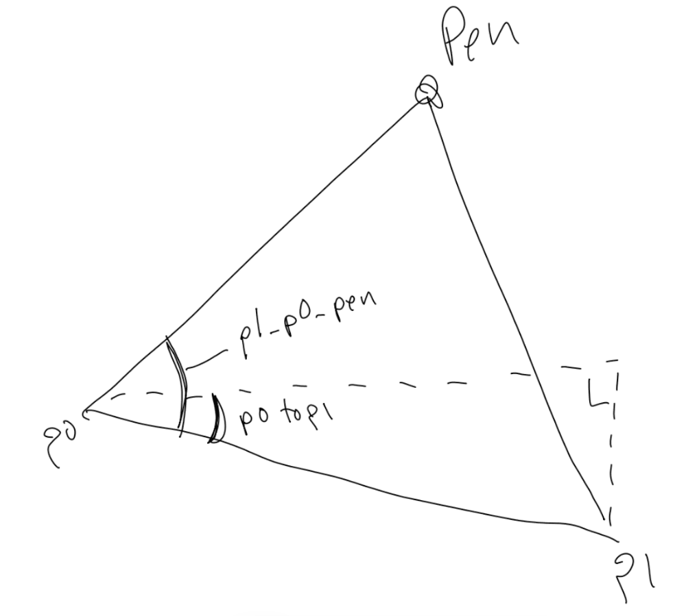

# 第六章 平托图 Pintographs

> 原作：Keith Peters

> 译者：sheldon(王二狗) 

> blog: http://cnblogs.com/willian/

> github: http://github.com/willian12345

Chapter 5 of the Coding Curves Series

曲线艺术编程系列第 6 章
Chapter 6 of the Coding Curves Series

Another physical device which renders complex curves that we can simulate!

This one is called a Pintograph, and I’ve actually built one of these myself.

We’ll start with a video – this is literally the first video that came up when I searched Youtube for “pintograph”, but it does the job. 

另一个可用于模拟绘制复杂曲线的物理装置叫平托图(Pintograph), 事实上我真的自己弄了一个。

我们将从一个视频开始--这个第一个按 Pintograph 字面意思在 Youtube 找上找到的视频


video url https://www.youtube.com/embed/1JyNLzdbcz4?feature=oembed

A pintograph can be considered to be a type of harmonograph, but rather than being based on pendulums, pintographs are usually driven by electric motors (though some are hand-cranked). There are disks attached to the motors and arms attached to the disks and a pen attached to the arms. You can change the size of the disks and where the arms are attached, the length of the arms and where they pivot, and the relative speed and offset of the motors to create a bunch of different types of curves.

平托图也可以认为是谐波图的一种，但不像谐波图那样是基于钟摆原理，平托图通常是用电动机驱动的（尽管也有一些是手摇的）。一些圆盘连接在电动机上，连杆又连接在圆盘上，一支笔又连接到连杆上。连杆上的圆盘尺寸、连杆长度、连接点位置你都可以自已改动，电机的相对速度与和偏移量可以创造出一大堆不同类型的曲线。


For a long time I didn’t know where the word “pintograph” came from. I finally discovered it from the person who coined the term. Actually, their daughter coined the term. It comes from a pantograph, and the idea that the spinning wheels look like a Ford Pinto. Read more here: http://www.fxmtech.com/harmonog.html

很长时间内我都不知道“pintograph”这个名字是怎么来的。最终发现是他创造了这个名词，事实上是他的女儿。它是从“缩放仪pantograph”演变而来，这些转动的轮子看起来像是一辆福特平托。阅读这里获取更多 http://www.fxmtech.com/harmonog.html

In case you are not familiar with a pantograph, it’s a device that is often used for copying drawings. It has a few pivoting arms. You pin one of the pivot points so it doesn’t move, then put a pointer in one of the points and a pen in another. As you move the pointer along the original drawing, it moves the pen along the same shape. You can configure it to copy the drawing at the same size, or scale it up or down.
From https://en.wikipedia.org/wiki/Pantograph

以防你对缩放仪(pantograph)不熟悉，我解释一下，这个装置是一般是用来绘图复制的。它有一些旋转的连杆。将一个轴点固定住，将指示器指向这些轴点中的其实一个点，另一头是固定的笔。 当你按原图移动指示器，另一头的笔就绘制出相同的形状。你可以用它复杂同样的形状或者调整复制时的大小。这是维基百科对缩放仪(pantograph)的解释 https://en.wikipedia.org/wiki/Pantograph


The Simulation

The pintograph we’ll simulate will be pretty simple. It will have two rotating disks with one arm attached to each. The arms will be attached to each other on the opposite end and that’s where the virtual pen will be.

## 模拟器

平托图模拟起来相当简单。它由两个旋转的转盘用各的连杆连在一起。两个连杆会在相反点连接在一起的点就是虚拟画笔的位置，


First of all, we’ll need to simulate the two disks. They’ll each have an x, y position, a radius, a speed and a phase. We’ll make these visible to start with so you can get a feeling for what’s going on. Otherwise it would just be a long complicated formula.

首先，我们得先模拟两个盘。它们拥有各自的 x, y 位置，半径，速度和相位。我们将两个盘都变成可视化以便让你知道到是如何运行的。另外它将会是一个非常长且复杂的公式。

We’ll create two circles and rotate them and show the point where the arms will be attached.

Each disk will be represented by this kind of structure:

我们将创建两个旋转的圆，且在圆周上显示那个连杆连接的点。

每个圆盘将用以下结构表示：

```
disk: {
  x,
  y,
  radius,
  speed,
  phase,
}
```

Like last time, it doesn’t matter if this is a generic object, a struct, a class or what. I’m going to assume that you’ll also have a function that will create one of these disks like this:

就像之前一样，我们不管它是一个通用对象、结构、类或其它什么的来表示。并且我假定你已经有一个函数用于创建返回这样的结构：

```
d0 = disk(100, 200, 100, 2, 0.5)
d1 = disk(400, 200, 60, 3, 0.0)
```

Now we can set up an animation like so:

现在我们可以像下面这样设置一个动画：

```
width = 600
height = 400
canvas = (width, height)
t = 0
 
d0 = disk(100, 200, 100, 2, 0.5)
d1 = disk(400, 200, 60, 3, 0.0)
 
function loop() {
  clearScreen()
 
  circle(d0.x, d0.y, d0.radius)
  stroke()
  x0 = circle.d0.x + cos(t * d0.speed + d0.phase) * d0.radius
  y0 = circle.d0.y + sin(t * d0.speed + d0.phase) * d0.radius
  circle(x0, y0, 4)
  fill()
 
  circle(d0.x, d0.y, d0.radius)
  stroke()
  x1 = circle.d1.x + cos(t * d1.speed + d1.phase) * d1.radius
  y1 = circle.d1.y + sin(t * d1.speed + d1.phase) * d1.radius
  circle(x1, y1, 4)
  fill()
 
  t += 0.1
}
```

Again, loop is a theoritical function that will be fun over and over again so that we get an animation. I’ve set mine up to create the frames for an animated gif, but this can be done as a real time animation as well. Here’s what I got:

（译者注：注意原作者在伪代码中有个小错误，即下面 y0, y1 内也使用了 cos 来计算，我已将其改为 sin ）

再一次强调一下，loop 是个假定的函数代表的是无限循环用于创建动画。我自己用代码实现了 loop 创建了一个帧动画，下面是我弄的 gif 图，但它也可以是一个实时动画：


This doesn’t smoothly loop, but that’s ok. You can see that we have two disks of different sizes moving at different speeds. The code itself shouldn’t be too complex. We clear the screen and for each disk we draw a circle at its position and with its radius. Then we take an offset from that circle to calculate the point where the arm will be attached. This uses basic trig: x = cos(angle) * radius, y = sin(angle) * radius. Here, the angle is t times the disk’s speed, plus it’s phase. When we get that point, we fill a smaller circle there.
Attaching the Arms and Finding the Pen

它虽然不是那么丝滑，但不重要。我们有了两个不同大小、速度的圆。 你自己用代码实现相信也不会太复杂。我们先清空了屏幕，然后在两个圆的圆周位置上各自绘制一个圆。它用于连接连杆。这里应用基础的三角学：`x = cos(angle) * radius, y = sin(angle) * radius`, 角度是用 t * 速度 + 相位。 这样就得到了那两个点，我们用实现小圆代表。
连接连杆并找到那根虚拟笔的位置


OK. Now things get a bit more mathy. We’re going to have two arms. each one is going to be attached to one of those spinning points at one and, and they’ll be attached to each other on the other end. At this point, a sketch is in order:

接下来事情变的数学化了。我们需要两个连接杆。每个连接杆都应该各自连接到一个旋转的点上。然后它们的另一端彼此相连。像下面草图画的那样：


We have our two disks. Through their radii and rotation and position, we know the positions of points p0 and p1. That’s what we just did above. We can also define the lengths of those arms. They’ll be the same for now, but they could be different. We’ll call them a0 and a1. (I know, it looks like 90 and 91 in the sketch. Sorry!) What we need to do is get the position of that top point where the two arms join.

两个圆盘。通过两个圆盘的半径，旋转和位置，这 p0 和 p1 也就知道了。这就是我们上面做的。 我们也可以直接定义连杆长度。它们现定义成等长， 它当然也可以不等长。 我们把它命名成 a0 和 a1.(我知道它们现在草图中看起来像 90 和 91  sorry!), 我们需要计算是的两个连杆连接点的位置。

We can easily get the distance between p0 and p1 with the Pythagorean theorem. We can call that d. It’s represented by the dotted line in the diagram.

p0 和 p1 之间的距离我们通过勾股定理很容易计算出来。我们把它命名为 d 。在图中用虚线表示。

Now we have a triangle whose sides are a0, a1 and d.

现在我们拥有了一个三角形，每一边分别为 a0, a1 和 d。

There’s a trigonometric rule called the “law of cosines” that will help us here. With it, if you you know the lengths of all three sides of a triangle, a, b, and c, you can get any angle of that triangle. Usually the way it’s written is as follows though:

这里有个三角法则叫“余弦定理”能帮我们。如果你知道三角形的三条边, a, b 和 c, 那么我们就可以计算得到三个角的角度。通常被写成下面这样：

```
c = sqrt(a*a + b*b - 2*a*b*cos(y))
```

… where y is the angle opposite side c. So if you know the length of two sides and the angle between them, you can find the length of the opposite side. Also useful in some cases, but not what we need here.

y 是 c 边的对角。所以如果你知道两边的长度和它们的夹角，那么你就能算出它夹角的对边长度。尽管它非常有用，但我们这里暂时用不到。

But we can rearrange that formula and put the unknown variable by itself on one side, and the other side will be the formula you need to calculate that value.

我们可以重新整理公式，让未知道的变量在一边，另一边则是可计算的公式。

What I want is to know is one of those angles so I can use it to find the location of the pen. Here’s what I came up with, showing the formula, some hand-wavey algebra and the resulting formula we’ll need.

我们需要知道三个角中的其中一个角用于计算虚拟笔的位置。下面是我用余弦定理公式手动计算的代数结果公式。


In our case, the sides we have correspond to the sides in the formula like so:

在我们例子中，三边在余弦定理公式中对应关系如下：


```	
a = a0
b = d
c = a1
```

So if we apply this formula, we’ll get the angle between the p1, p0, and the pen.

应用公式后，我们就可以得到 角 p1-p0-pen 的夹角了.

We can also use atan2 to get the angle from p0 to p1. And if we subtract them, we get the actual angle that goes from p0 to the pen.

Again, a drawing is in order:

我们也能用 atan2 得到 p0 到 p1 的角度。两者相关就得到了 p0 到 pen 的角度。

再次，展示下我画的草图





The big angle that goes from p1 to p0 to the pen, which we get with the law of cosines, we call p1_p0_pen. The smaller angle we get with atan2, we call p0toP1. Subtract them and we have the angle we have to go towards to get the location of the pen. I’m sure there are different ways to do this, and probably much better ones, but this one works. Once you have all the steps, you can further simplify it to something more concise, but I wanted to show the steps to hopefully have it make some sense.

通过余弦定理得到 大角 p1 到 p0 到 pen 的夹角 我们把它命名为 p1_p0_pen. 通过 atan2 诸出的小的那个角命名为 p0toP1。相减后角的值，就指向虚拟笔的位置。我相信有很多种方式可以计算出这个角， 也许比我这种方式更好， 但我这种方式可以正常运行。一量

Anyway, we can now code this up:

下面是代码部分：

```
width = 600
height = 600
canvas = (width, height)
t = 0
 
d0 = disk(150, 450, 100, 2, 0.5)
d1 = disk(450, 450, 60, 3, 0.0)
 
function loop() {
  clearScreen()
 
  circle(d0.x, d0.y, d0.radius)
  stroke()
  x0 = d0.x + cos(t * d0.speed + d0.phase) * d0.radius
  y0 = d0.y + sin(t * d0.speed + d0.phase) * d0.radius
  // （译者注：左侧大圆圆周上的小圆）
  circle(x0, y0, 4)
  fill()
  
  // (译者注：原作者此处 circle(d0.x, d0.y, d0.radius); 书写错误 ，应为 circle(d1.x, d1.y, d1.radius))
  circle(d1.x, d1.y, d1.radius)
  stroke()
  x1 = d1.x + cos(t * d1.speed + d1.phase) * d1.radius
  y1 = d1.y + sin(t * d1.speed + d1.phase) * d1.radius
  circle(x1, y1, 4)
  fill()
 
  // 连杆长度
  a0 = 350
  a1 = 350
 
  // p0 和 p1 距离
  dx = x1 - x0
  dy = y1 - y0
  d = sqrt(dx * dx + dy * dy)
 
  // 找到两个关键角相减
  p1_p0_pen = acos((a1 * a1 - a0 * a0 - d * d) / (-2 * a0 * d))
  p0toP1 = atan2(y1 - y0, x1 - x0)
  angle = p0toP1 - p1_p0_pen
 
  // 计算得到虚拟笔的位置
  //（译者注：左侧大圆圆周上的小圆位置和上面的angle 计算出虚拟笔的位置）
  pX = x0 + cos(angle) * a0
  pY = y0 + sin(angle) * a0
   
  // 绘制连杆
  moveTo(x0, y0)
  lineTo(pX, pY)
  lineTo(x1, y1)
  stroke()
 
  t += 0.1
}
```

With that, you should be able to render something like what you see below.

按上面的代码正确编码后你应该可以渲染出如下的结果：


Again, this is a non-cleanly looping gif, but shows the idea at work. I’ve commented the code to explain what’s going on in each step. Hopefully that helps. Note that I also changed the size of the canvas and moved the disks towards the bottom to make room for the arms.

One thing to be careful of is making sure that the two arms are long enough so that they can always reach between the two connection points on the disks. In the real world, if they were too short, they’t probably just break or jam up the motors. In code, you’ll probably just get a NaN (not a number) error when you go to do the acos and you’ll be sitting there wondering what’s wrong. I speak from experience.

再次提醒，这只是不完整循环 gif 图，仅用于示例如何运行。我已经在代码中注释了每一步。希望对你有帮助。 注意我也改了 canvas 的宽高并且将圆盘位置调整到了底部腾出空间用于显示完整的连杆。

有一点需要注意，要确保连杆足够的长保证它们能彼此相连。在真实世界中，如果它们太短，可能会卡住或弄坏电动机。 在我们的模拟中，在反余弦函数计算 acos 可能会得到 NaN （not a number）错误，而你可能还摸不着头脑。我这是经验之谈。

## Drawing the Curve

Finally, let’s see what this thing draws. For this, I’m going to abandon the animation and stop drawing the circles and arms. I’ll just track where the pen is on each iteration and use that to draw a long, looping, Lissajous-ish curve.

## 绘制曲线

最后让我们看看画出个啥。在此，我把动画禁掉并且也不绘制圆和连杆 。我将追踪每次迭代虚拟笔的路径用于绘制一个长循环具有利萨茹特征的曲线。

```
width = 800
height = 600
canvas = (width, height)
 
function render() {
  t = 0
   
  d0 = disk(250, 550, 141, 2.741, 0.5)
  d1 = disk(650, 550, 190, 0.793, 0.0)
 
  // the length of the arms
  a0 = 400
  a1 = 400
   
  for (i = 0; i < 50000; i++) {
    x0 = d0.x + cos(t * d0.speed + d0.phase) * d0.radius
    y0 = d0.y + sin(t * d0.speed + d0.phase) * d0.radius
 
    x1 = d1.x + cos(t * d1.speed + d1.phase) * d1.radius
    y1 = d1.y + sin(t * d1.speed + d1.phase) * d1.radius
 
    // get the distance between p0 and p1
    dx = x1 - x0
    dy = y1 - y0
    d = sqrt(dx * dx + dy * dy)
 
    // find the two key angles and subtract them
    p1_p0_pen = acos((a1 * a1 - a0 * a0 - d * d) / (-2 * a0 * d))
    p0toP1 = atan2(y1 - y0, x1 - x0)
    angle = p0toP1 - p1_p0_pen
 
    // find the pen point
    pX = x0 + cos(angle) * a0
    pY = y0 + sin(angle) * a0
   
    lineTo(pX, pY)
    t += 0.01
  }
  stroke()
}
```

I’ve left lots of room for you to optimize this, so go for it! Even in its rough form though, this code should draw something like this:

我留了足够多的空间让你自己去优化代码，少年加油！尽管代码看起来乱糟糟的，但绘制结果它应该会像下图：


There’s lots of things to play around and experiment with here. But the truth is that this is a pretty simple pintograph, so mostly the shapes are going roughly look like what you see above. But you can build on these principles and make all kinds of more complex devices. This site has several demos to inspire you:


这里你可以尝试修改代码中的许多东西用于体验。但事实是这就是一个超简易的平托图，所以上面的图看起来大多都有点糙。但你可以依据这些原则创建各种更复杂的设备模拟。这个网站拥有许多 demo 相信可以启发你的思路：

https://michaldudak.github.io/pintograph/demo/


Disks on disks, and rotary pintographs and 3-wheel pintographs, etc.

And if you’re into this stuff, just search “harmonograph”, “pintograph” and “drawing machines” on Youtube to get an endless supply of inspiration – either for coding or actually building. Some of the more interesting ones (in my mind) are the ones that draw the curves on a piece of paper that itself is slowing rotating on a turntable.

一个盘接一个盘， 旋转的平托图，三个转盘的平托图，等等。

如果你想开始尝试，你只需要在 youtube 搜索 “harmonograph”, “pintograph” and “drawing machines” 等关键字，它会提供无限的启发点子给你----你可以用来编码或弄个真实的设备。在我看来最有趣的那一个例子是一个转台上自身慢慢旋转在一张纸上绘制出曲线。

## Summary

This wraps up our discussion of Lissajous curves and the simulation of physical drawing machines. At least for a while. Next time we’ll go back a bit more to basic, standard geometric curves.

## 总结

利萨茹曲线和相关的模拟装置讨论在这里就结束了。至少暂时就这样了。下一章我们将回归到比较基础的标准几何曲线。