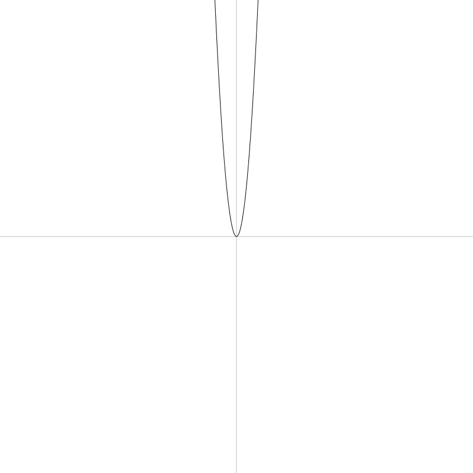
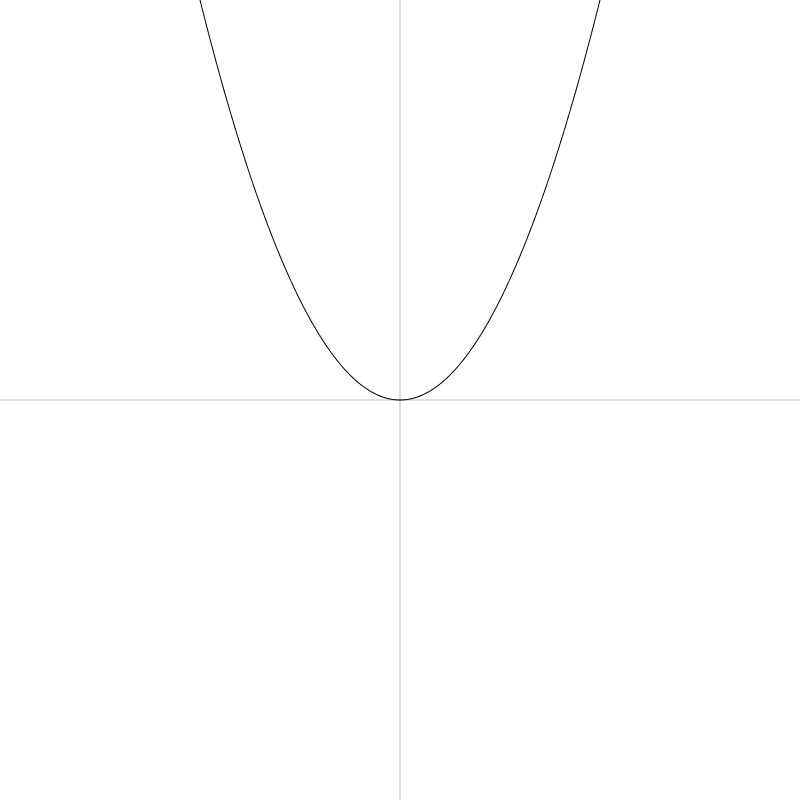
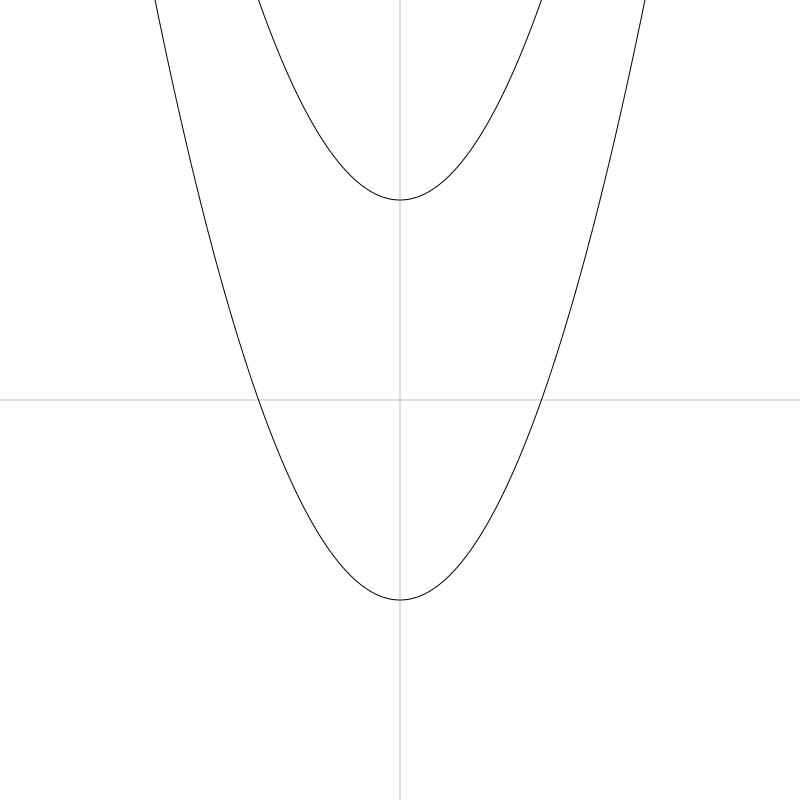

# Parabolas
Chapter 7 of the Coding Curves Series

I’ll admit that when I started brainstorming this chapter, I began to second guess the decision to include it at all. The curve we’ll cover here, the parabola, is fairly simple, basic, even plain compared to the crazy curves we’ve been generating in the last three chapters. But as I got into it I realized that this curve is pretty cool and has lots of interesting properties. In fact, I was going to cover another curve, the hyperbola, in this chapter as well, but I got so deep into parabolas that I decided to save hyperbolas for another time.
Parabolas

Just to make sure we’re on the same page here, this is what we’re talking about when we’re talking about parabolas:


One of the first things you’ll learn about parabolas is that they are a type of conic section. OK. But since we’re just doing two-dimensional curves here, their relation to a three-dimensional form is a bit irrelevant. But I’ll throw this image in here anyway and be done with the subject:
From https://en.wikipedia.org/wiki/Parabola

Since we’ve already covered circles and ellipses, this chapter and the next will fill out all of the conic sections. That was never a goal, but I’ll never pass up an achievement gained.

In the first picture above, note that the parabola is mirrored across the y-axis, and that the vertex (the highest or lowest point, depending on which way it opens) is just touching the x-axis.

As with most of these geometric shapes, there are various formulas used to describe them. Here’s a fairly simple and usable one:

```	
y = a * x * x
```

In this case, a is a parameter that controls how wide the parabola opens up – and whether it opens on the top or bottom. So that’s pretty simple. Let’s draw one. But first, let’s set things up correctly and even create a couple of utility functions that will help us do so. 

## Set Up

As you can see in the initial image, we want the origin of the space to be in the center of the canvas so we can clearly see the parabola. So we’ll want to translate the canvas there.

Also, there’s a very good chance that your drawing api will be drawing things upside down, compared to normal Cartesian coordinates. In other words, y values will increase positively towards the bottom of the screen and negatively towards the top. So it will be good to flip it the other way around.

Finally, it will be nice if we can actually see the axes sometimes. We can create a function to draw them easily.

To center the canvas, you’ll use something like the following:

```	
translate(width / 2, height / 2)
```

This is assuming your drawing api has transformation functions built in. It’s possible to do everything here without them, but it would be cumbersome to try to explain things twice, so I’m just going to assume that your drawing api, like most decent ones, does have transformation built in.

For the above, we can simplify that by making a center function:

```
function center() {
  translate(width / 2, height / 2)
}
```

As always, this is making the pseudocode assumption that your canvas or surface or whatever object you draw things on is a global object and you can just call these functions like that. Processing works that way, but for may other systems, these functions will be methods on a canvas object, so it might be more like

```	
canvas.translate(canvas.width / 2, canvas.height / 2)
```

But I’m sure you can figure all that out.

To flip the y-axis, just do a scale:

```	
scale(1, -1)
```

This keeps the x-axis as is, and flips the y-axis. I know, I know. Sometimes in this series I flip the canvas, other times I do not. Once again, these posts are meant to be practical drawing tutorials, not necessarily mathematically rigorous. So you should know how to flip the canvas and do it when and if you think you should.

Finally, I like to have a function around to draw the axes. For the purposes here, we can do something like:

```
function drawAxes() {
  lineWidth = 0.25
  moveTo(-width, 0)
  lineTo(width, 0)
  moveTo(0, -height)
  lineTo(0, height)
  stroke()
  lineWidth = 1
} 
```

This draws horizontal and vertical lines well beyond the bounds of the canvas, but that’s usually ok. It also sets the line width very low so it’s just a hint of a line, and then resets it to 1 when it’s done. In your actual function, you’ll probably want to do something like pushing and popping or saving and restoring the state of the canvas, so that your line width goes back to what it was before calling the function, which may not have been 1.

OK, now we can set up our canvas like so:

```
width = 800
height = 800
canvas(width, height)
 
center()
scale(1, -1)
drawAxes()
```

That gets you here, which is a good start:


You might want to combine all that stuff into a more comprehensive setup function. Up to you.

## Drawing the Parabola

Building on the last code we can now loop x from -width/2 to width/2 to go across the canvas from left to right. We’ll use a low value of a like 0.003 because we are operating on pixel values that are in the several hundreds. I just chose that value because it worked visually.

```
a = 0.003
for (x = -width / 2; x <= width / 2; x++) {
  y = a * x * x
  lineTo(x, y)
}
stroke()
```

And here’s our parabola:


If we change a to something larger, like 0.3, we get a much narrower parabola:



And something smaller like 0.0003, we get a much wider one:


Technically, a should not be 0 in the parabola formula. But if you do try it, you’ll just get a line. Then when a goes negative, the parabola opens up on the opposite side. Here’s -0.003:


And that’s all there is to parabolas.

Oh, no, wait. There’s a few more things!

Focus and Directrix

Parabolas have what is known as a focus point. That point is defined as:

```
x = 0
y = 1 / (4 * a)
```

Let’s draw that point:

```
a = 0.003
for (x = -width / 2; x <= width / 2; x++) {
  y = a * x * x
  lineTo(x, y)
}
stroke()
 
// draw focus
focusX = 0
focusY = 1/(4 * a)
circle(focusX, focusY, 4)
fill()
```


And it has another property called the directrix. This is a horizontal line where the y value is:

```	
y = -1 / (4 * a)
```

We can draw that:

```
a = 0.003
for (x = -width / 2; x <= width / 2; x++) {
  y = a * x * x
  lineTo(x, y)
}
stroke()
 
// draw focus
focusX = 0
focusY = 1/(4 * a)
circle(focusX, focusY, 4)
fill()
 
// draw directrix
directrixY = -1/(4 * a)
moveTo(-width / 2, directrixY)
lineTo(width / 2, directrixY)
stroke()
```


What’s obvious here is that the distance from that the vertex to the focus is the same as the distance from the vertex to the directrix. Obvious because the formula for the y value of both is the same but reversed in sign.

But here’s an interesting fact – that statement of equal distance holds true for any point on the parabola! We can show that. Building on top of the last code sample…

```
lineWidth = 0.5
for (x = -width / 2; x <= width/2; x += 40) {
    // find a point on the parabola
    y = a * x * x
    circle(x, y, 4)
 
    // draw a vertical line from the directrix to that point
    // then from the that point to the focus
    moveTo(x, directrixY)
    lineTo(x, y)
    lineTo(0, focusY)
}
```

We sample the parabola at a number of points. We draw the point and then draw a line up from the directrix, and then over to the focus. Both lines emanating from each point will be the same length. You may not have a practical use for this straight off, but it looks neat anyway!


Tangent Line

Another thing you can do is find the tangent line at any point on the parabola. This will represent the slope of the curve at that point. The formula for the tangent at point x0, y0 is:

```
y = 2 * a * x0 * x - a * x0 * x0
```

This might be a bit confusing because we have x and x0. Again, x0 is a fixed point on the parabola. And x is one of the points the defines the tangent line. The formula gives you the y for that x. Let’s code that up for a single point on the curve. We’ll draw the parabola, then choose an x0, y0 point and use the formula to find two other points that make up the line.

```
// draw the parabola
a = 0.003
for (x = -width / 2; x <= width / 2; x++) {
  y = a * x * x
  lineTo(x, y)
}
stroke()
 
// find a point on the parabola
x = -80
y = a * x * x
circle(x, y, 4)
fill()
 
// find a point on the far left of the canvas
x1 = -width / 2
y1 = 2 * a * x0 * x1 - a * x0 * x0
 
// and one on the far right
x2 = width / 2
y2 = 2 * a * x0 * x2 - a * x0 * x0
 
// and draw a line
moveTo(x1, y1)
lineTo(x2, y2)
stroke()
```

And that gives us this point and line:


Now we can sample various points on the parabola (like we did above) and draw the tangent line for each.

```
lineWidth = 0.5
for (x0 = -width / 2; x0 <= width/2; x0 += 40) {
    // find a point on the parabola
    y0 = a * x0 * x0
    circle(x0, y0, 4)
    fill()
 
    // find a point on the far left of the canvas
    x1 = -width / 2
    y1 = 2 * a * x0 * x1 - a * x0 * x0
 
    // and one on the far right
    x2 = width / 2
    y2 = 2 * a * x0 * x2 - a * x0 * x0
 
    // and draw a line
    moveTo(x1, y1)
    lineTo(x2, y2)
    stroke()
}
```

This is pretty much all the same code just moved inside the loop. But then we get this:


You could remove the original parabola and tighten up the interval and have some nice pseudo-string-art.
Parabolic Mirrors

One thing you’ll always read about with parabolas is that rays coming straight in to the parabola will all reflect onto a single point. This is used in antennas and radio telescopes, to focus the received signal on the receiver, and in various solar devices to focus the rays of the sun onto a single point (which becomes incredibly hot). Not surprisingly, the point they are focused on is the focus point.


https://en.wikipedia.org/wiki/Parabolic_antenna#/media/File:Erdfunkstelle_Raisting_2.jpg

In fact, I remember when I was a kid, my step-father had a little solar cigarette lighter like this:


While more of a novelty than something you’d use day to day, it actually worked.

If you wanted to do all the math, you could find out the point where an incoming ray hits the parabola, find the tangent line for that point. Then find the normal at that point (the vector perpendicular to the tangent line) and reflect the incoming ray across that normal. If you did all that, you’d see that the reflected ray hits the focus point. I’m not going to do that exercise with you, but let’s draw some of these rays and you should be able to see that it looks correct. We’ll just draw some rays from the top of the canvas, down to where they hit the parabola and then over to the focus point.

```
a = 0.003
 
// assume code for drawing the parabola is here...
 
// draw the focus
focusX = 0
focusY = 1/(4 * a)
circle(focusX, focusY, 4)
fill()
 
lineWidth = 0.5
for (x = -width / 2; x <= width/2; x += 40) {
    // find a point on the parabola
    y = a * x * x
     
    moveTo(x, -height / 2)
    lineTo(x, y)
    lineTo(focusX, focusY)
    stroke()
}
```


You can follow any ray down to the parabola and from there to the focus point. And you can see it reflects off the curve at a believable angle. Again, I cheated and just drew it directly, but you could work out the physics and get the same thing.

Note that this only works for rays that are parallel to the y-axis in this configuration. Rays coming in at any other angle will not converge on the focus. This is why you have to carefully aim the cigarette lighter at the sun to get enough heat, or aim the satellite dish at the satellite to get a good signal.


## Another Formula

Of course, parabolas are not always centered on the y-axis and just touching the x-axis. They are so far because we’re using a very simplified formula. Here’s one that we can do more with:

```
	
y = a * x * x + b * x + c
```

We’ve added a couple new parameters here. It’s pretty clear that the c parameter just gets added on to the rest, so has a direct influence on the final y position of the vertex and the rest of the curve. The b parameter is a bit more complex, so let’s code it up and see what it does. We’ll start by making a parabola function

```
function parabola(a, b, c, x0, x1) {
    for (x = x0; x <= x1; x++) {
        y = a*x*x + b*x + c
        lineTo(x, y)
    }
}
```

You might want to improve on this, but this will work for our purposes here. We just loop through from x0 to x1, find a y for each x, and draw a line to it.

Let’s see what different values give us.

```	
parabola(0.01, 0, 0, -width/2, width/2)
```

This gives us what we’re already used to:



Here’s two more with a c of -200 and +200.

```
parabola(0.01, 0, -200, -width/2, width/2)
parabola(0.01, 0, 200, -width/2, width/2)
```



Nothing surprising. Now let’s set c back to 0 and give b a positive value.

```
parabola(0.01, 3, 0, -width/2, width/2)
```


And a negative value…

```	
parabola(0.01, -3, 0, -width/2, width/2)
```


So for a positive a, changing b moves the parabola down and to the left or right. What about for negative a?

```
parabola(-0.01, -3, 0, -width/2, width/2)
parabola(-0.01, 3, 0, -width/2, width/2)
```


Not too surprising that they move up now.

Note that for any of the formulas we’ve used so far, we can swap the x’s and y’s and get a parabola that opens to the left or the right.


In this case, the simple formula is:

```	
x = a * y * y
```

And the deluxe version would be:

```	
x = a * y * y + b * y + c
```

## Summary

Well, that’s all we’ll cover about parabolas for now. I don’t know if you’ll ever have the need to draw a parabola with code, but if you do, you will now be well equipped!


