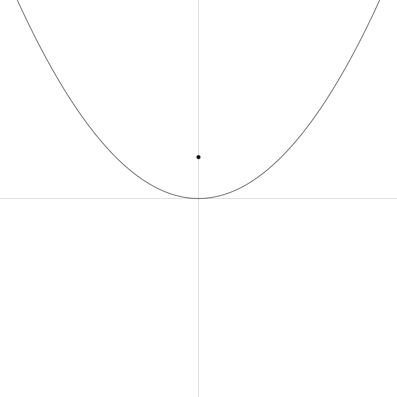
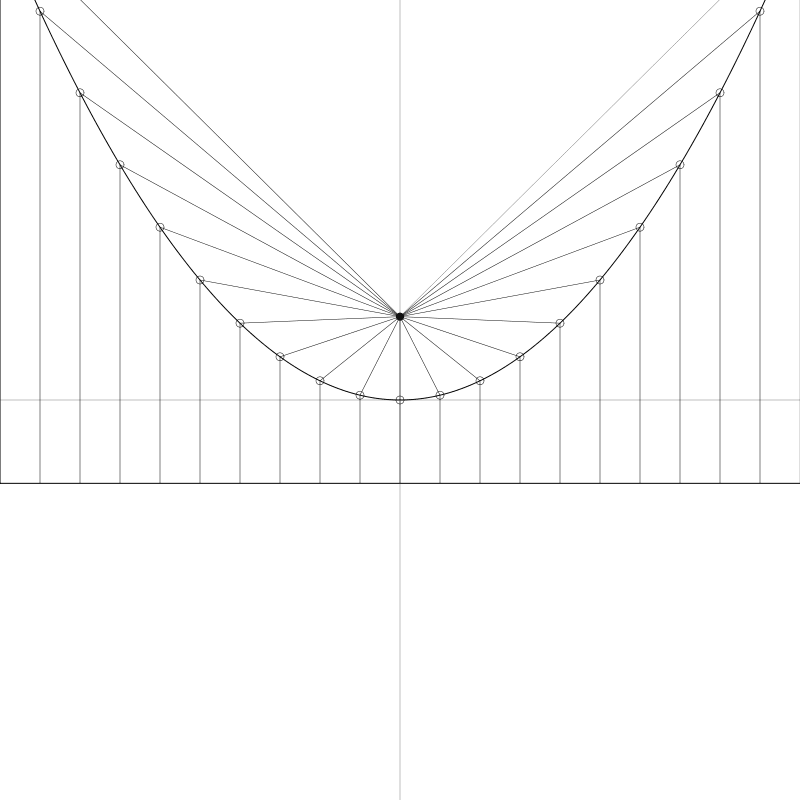
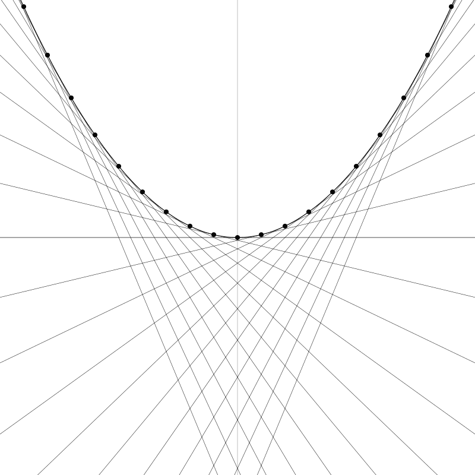
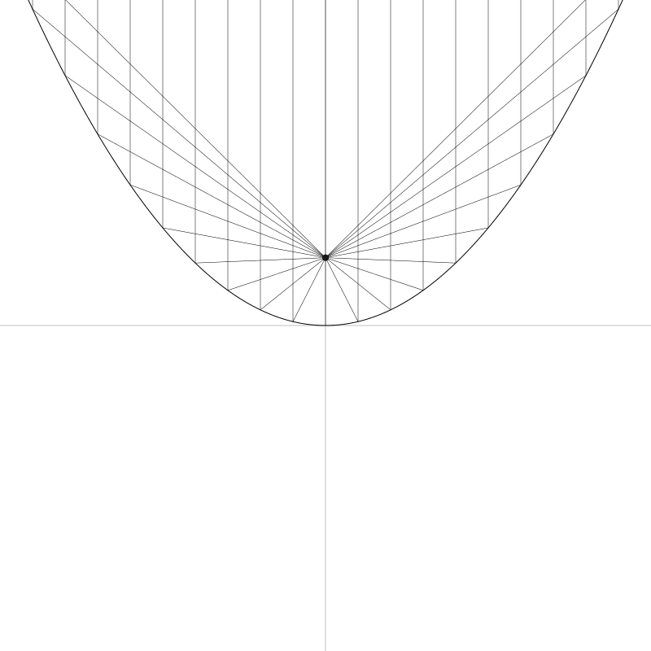

# 抛物线 Parabolas

> 原作：Keith Peters https://www.bit-101.com/blog/2022/11/coding-curves/
>
> 译者：池中物王二狗(sheldon)
>
> blog: http://cnblogs.com/willian/
>
> 源码：github: https://github.com/willian12345/coding-curves

Chapter 7 of the Coding Curves Series

I’ll admit that when I started brainstorming this chapter, I began to second guess the decision to include it at all. The curve we’ll cover here, the parabola, is fairly simple, basic, even plain compared to the crazy curves we’ve been generating in the last three chapters. But as I got into it I realized that this curve is pretty cool and has lots of interesting properties. In fact, I was going to cover another curve, the hyperbola, in this chapter as well, but I got so deep into parabolas that I decided to save hyperbolas for another time.

曲线艺术编程系列第 7 章 抛物线

我承认这一章脑暴时，再三考虑过是否要将抛物线包含进来。此篇覆盖的抛物线比起之前三章我们弄出来的复杂曲线相比非常的简单且基础的。但当我真的开始后才发现它也非常的酷，并且拥有很多有趣的特性。事实上，我一开始还打算将双曲线也包含在这一章， 但当我深入抛物线后，决定双曲线还是另找其它时间讲吧。

Just to make sure we’re on the same page here, this is what we’re talking about when we’re talking about parabolas:

先确认一下我们讲的抛物线是像下面这样的：


One of the first things you’ll learn about parabolas is that they are a type of conic section. OK. But since we’re just doing two-dimensional curves here, their relation to a three-dimensional form is a bit irrelevant. But I’ll throw this image in here anyway and be done with the subject:
From https://en.wikipedia.org/wiki/Parabola

学习抛物线之前你首先得知道它是圆锥截面的一种。由于我们仅在这里介绍二维曲线，它的三维形式有点不相关。你可以自行在维基百科上查询相关信息：

https://en.wikipedia.org/wiki/Parabola

Since we’ve already covered circles and ellipses, this chapter and the next will fill out all of the conic sections. That was never a goal, but I’ll never pass up an achievement gained.

自从我们讲了圆和椭圆，本章与下一章我将填坑所有相关的圆锥曲线。虽然这从未是目标，但我向来是搂草打兔子，能讲的就都讲了吧。

In the first picture above, note that the parabola is mirrored across the y-axis, and that the vertex (the highest or lowest point, depending on which way it opens) is just touching the x-axis.

As with most of these geometric shapes, there are various formulas used to describe them. Here’s a fairly simple and usable one:

上面的第一张图，注意抛物线是 y 轴对称的，顶点（最高或最低点，取决于抛物线的开口方向）就是最接近 x 轴的点。

像大多数几何图形一样，有很多种公式可以描述它们。下面是一个相当简单易用的一个：

```	
y = a * x * x
```

In this case, a is a parameter that controls how wide the parabola opens up – and whether it opens on the top or bottom. So that’s pretty simple. Let’s draw one. But first, let’s set things up correctly and even create a couple of utility functions that will help us do so. 

在这个式子中，a 参数是控制抛物线开口宽度的 - 无论开口是向上还是向下。相当简单。 先画个看看，但首先做些准备工作写一些通用函数。

## Set Up

As you can see in the initial image, we want the origin of the space to be in the center of the canvas so we can clearly see the parabola. So we’ll want to translate the canvas there.

Also, there’s a very good chance that your drawing api will be drawing things upside down, compared to normal Cartesian coordinates. In other words, y values will increase positively towards the bottom of the screen and negatively towards the top. So it will be good to flip it the other way around.

Finally, it will be nice if we can actually see the axes sometimes. We can create a function to draw them easily.

To center the canvas, you’ll use something like the following:


## 准备工作

就如最上面那张图，我们希望原始位置位于 canvas 中心点以便完整显示抛物线。所以我们需要将 canvas　原点平移到那里。

当然，这也是很好的机会用于对比你使用的语言平台绘图 api 与 普通笛卡尔坐标系是否上下颠倒。换句话说， y 轴的值越大越向下，反之越向上。也就是说 y 坐标翻转过来就是普通笛卡尔。

最后，要是坐标轴能看到就更好了。我们可以简单的写个函数将轴画出来。

为了平移到 canvas 中心。你可能需要使用像下面这样的方法：


```	
translate(width / 2, height / 2)
```

This is assuming your drawing api has transformation functions built in. It’s possible to do everything here without them, but it would be cumbersome to try to explain things twice, so I’m just going to assume that your drawing api, like most decent ones, does have transformation built in.

For the above, we can simplify that by making a center function:

我假定你的绘图 api 内建了 translate 方法。好像老是解释这一点显的我有点啰嗦， 所以我假定你的绘图 api 常用方法都有内建支持了。


```
function center() {
  translate(width / 2, height / 2)
}
```

As always, this is making the pseudocode assumption that your canvas or surface or whatever object you draw things on is a global object and you can just call these functions like that. Processing works that way, but for may other systems, these functions will be methods on a canvas object, so it might be more like

就像之前一样，这里用的是伪代码，无论你想在何种目标对象上绘制，都可以像这样调用这些方法。Processing 就是像这样写的 (译都注：Processing 图形库 processing.org) ，但其它系统中这些方法很有可能是在 canvas 对象下。它更可能像下面这样调用：

```	
canvas.translate(canvas.width / 2, canvas.height / 2)
```

But I’m sure you can figure all that out.

To flip the y-axis, just do a scale:

我肯定可以搞得定。

为了翻转 y 轴，你可以这样调用 scale: 

```	
scale(1, -1)
```

This keeps the x-axis as is, and flips the y-axis. I know, I know. Sometimes in this series I flip the canvas, other times I do not. Once again, these posts are meant to be practical drawing tutorials, not necessarily mathematically rigorous. So you should know how to flip the canvas and do it when and if you think you should.

Finally, I like to have a function around to draw the axes. For the purposes here, we can do something like:

这能让 x 轴不变 y 轴翻转。好了，好了，在这个系列文章中有时候翻转有时候又不翻转。此系列文指在实践练习绘图课程，而非严密的数学教程。所以你应该知道啥时候翻转 canvas 啥时候不翻转了吧。

最后， 还要有一个函数用于绘制坐标轴。像下面这样：

```
function drawAxes() {
  lineWidth = 0.25
  moveTo(-width, 0)
  lineTo(width, 0)
  moveTo(0, -height)
  lineTo(0, height)
  stroke()
  lineWidth = 1
} 
```

This draws horizontal and vertical lines well beyond the bounds of the canvas, but that’s usually ok. It also sets the line width very low so it’s just a hint of a line, and then resets it to 1 when it’s done. In your actual function, you’ll probably want to do something like pushing and popping or saving and restoring the state of the canvas, so that your line width goes back to what it was before calling the function, which may not have been 1.

OK, now we can set up our canvas like so:

此函数实现了横竖两条线且超过了 canvas 的边界，但问题不大。 线的宽度同样设置的很细，这仅仅是用来辅助的线条， 绘制完成后线宽重新设为 1。 在你的实际代码中有可能需要调用类似 pushing 和 popping 或 saving 和 restoring 这样的 api 用于canvas 的上下文状态管理， 以便于恢复到调用此函数之前的状态，因为它可能调用前的上下文状态线宽不是 1。

Ok, 现在可以设置 canvas 了: 

```
width = 800
height = 800
canvas(width, height)
 
center()
scale(1, -1)
drawAxes()
```

That gets you here, which is a good start:

下图就是这一番操作后的结果，这是一个好的开始：


You might want to combine all that stuff into a more comprehensive setup function. Up to you.

你可能想将以上的代码整合到 setup 函数内。这取决于你自己。

## Drawing the Parabola

Building on the last code we can now loop x from -width/2 to width/2 to go across the canvas from left to right. We’ll use a low value of a like 0.003 because we are operating on pixel values that are in the several hundreds. I just chose that value because it worked visually.

## 绘制抛物线

在上面代码的基础上，我们可以用一个循环将 x 从左至右贯穿 canvas。我们将 a 设为很小的一个值比如 0.003  因为我们操作的是几百像素值。我选这个值是因为它让绘出的结果图在我们可视的 canvas 范围内

```
a = 0.003
for (x = -width / 2; x <= width / 2; x++) {
  y = a * x * x
  lineTo(x, y)
}
stroke()
```

And here’s our parabola:

这就是我们绘制的结果了：


If we change a to something larger, like 0.3, we get a much narrower parabola:

如果将 a 值大，比如 0.3 ， 我们会得到非常窄的抛物线：


And something smaller like 0.0003, we get a much wider one:

如果变的更小，如 0.0003 ， 我们会得到一个非常宽的抛物线：


Technically, a should not be 0 in the parabola formula. But if you do try it, you’ll just get a line. Then when a goes negative, the parabola opens up on the opposite side. Here’s -0.003:

技术上讲，你不应该将 a 值设为 0。如果你这么干了，那么你会得到一条直线。如果 a 变为负值，抛物线开口将会反向。这是 -0.003 :


And that’s all there is to parabolas.

Oh, no, wait. There’s a few more things!

这就是抛物线的全部了。

Oh, 等等。还有一些事情需要交待！

## Focus and Directrix

Parabolas have what is known as a focus point. That point is defined as:

## 焦点与准线

抛物线还有一个熟知的知识点叫焦点。焦点的定义如下：

```
x = 0
y = 1 / (4 * a)
```

Let’s draw that point:

让我们把这个点画出来：

```
a = 0.003
for (x = -width / 2; x <= width / 2; x++) {
  y = a * x * x
  lineTo(x, y)
}
stroke()
 
// draw focus
focusX = 0
focusY = 1/(4 * a)
circle(focusX, focusY, 4)
fill()
```


And it has another property called the directrix. This is a horizontal line where the y value is:

还有另一个属性是准线。这是一条水平线用于表示 y  值：

```	
y = -1 / (4 * a)
```

We can draw that:

我们可以把它画出来：


```
a = 0.003
for (x = -width / 2; x <= width / 2; x++) {
  y = a * x * x
  lineTo(x, y)
}
stroke()
 
// draw focus
focusX = 0
focusY = 1/(4 * a)
circle(focusX, focusY, 4)
fill()
 
// draw directrix
directrixY = -1/(4 * a)
moveTo(-width / 2, directrixY)
lineTo(width / 2, directrixY)
stroke()
```


What’s obvious here is that the distance from that the vertex to the focus is the same as the distance from the vertex to the directrix. Obvious because the formula for the y value of both is the same but reversed in sign.

But here’s an interesting fact – that statement of equal distance holds true for any point on the parabola! We can show that. Building on top of the last code sample…

很明显，顶点距离焦点与准线的距离相等。因为 y 值的公式相等只是符号相反。

但这里有个有趣的事实 - 等距适用于抛物线上的任意一点（译者注：抛物线上的任意一到到焦点和焦点垂直到准线的距离相等）！我们能根据上面的代码展示出来...

```
lineWidth = 0.5
for (x = -width / 2; x <= width/2; x += 40) {
    // find a point on the parabola
    // 在抛物线上找到那个点
    y = a * x * x
    circle(x, y, 4)
    // draw a vertical line from the directrix to that point
    // then from the that point to the focus
    // 画一条线垂直于准线于那个点
    // 再将那个点连接至焦点
    moveTo(x, directrixY)
    lineTo(x, y)
    lineTo(0, focusY)
}
```


We sample the parabola at a number of points. We draw the point and then draw a line up from the directrix, and then over to the focus. Both lines emanating from each point will be the same length. You may not have a practical use for this straight off, but it looks neat anyway!

我们简单的从抛物线上采样了一些点。画出点，然后再从准线上画一条垂线到这个点，然后再连接到焦点。从点出发的两条线长度相等。可能没啥直接的实际用途，但它看起来还是巧妙的！



## Tangent Line

Another thing you can do is find the tangent line at any point on the parabola. This will represent the slope of the curve at that point. The formula for the tangent at point x0, y0 is:

另一个你能做的事情是找到抛物线上的任意点的切线。这个代表曲线在那个点上的斜率。切线点 x0, y0 公式：

```
y = 2 * a * x0 * x - a * x0 * x0
```

This might be a bit confusing because we have x and x0. Again, x0 is a fixed point on the parabola. And x is one of the points the defines the tangent line. The formula gives you the y for that x. Let’s code that up for a single point on the curve. We’ll draw the parabola, then choose an x0, y0 point and use the formula to find two other points that make up the line.

这里也许有一点点乱，因为我们即有 x 又有 x0, 再次提示 x0 是抛物线上的某个点，而 x 是定义切线点中的一个点。公式给出了x 对应的 y 。 让我们开始对曲线上的单个点进行编码吧。先画一个抛物线， 然后选择一个 x0, y0 点然后用公式找到另两个点用于绘制出切线。

```
// draw the parabola
// 抛物线
a = 0.003
for (x = -width / 2; x <= width / 2; x++) {
  y = a * x * x
  lineTo(x, y)
}
stroke()
 
// find a point on the parabola
// 找任意一个抛物线上的点
x = -80
y = a * x * x
circle(x, y, 4)
fill()
 
// find a point on the far left of the canvas
// 找一个远离 canvas 左边的点
x1 = -width / 2
y1 = 2 * a * x0 * x1 - a * x0 * x0
 
// and one on the far right
// 找一个远离 canvas 右边的点
x2 = width / 2
y2 = 2 * a * x0 * x2 - a * x0 * x0
 
// and draw a line
// 画线
moveTo(x1, y1)
lineTo(x2, y2)
stroke()
```

And that gives us this point and line:

我就就得到了如下的点与线：


Now we can sample various points on the parabola (like we did above) and draw the tangent line for each.

现在我们可以像上面那样画出多条抛物线上面的切线。

```
lineWidth = 0.5
for (x0 = -width / 2; x0 <= width/2; x0 += 40) {
    // find a point on the parabola
    y0 = a * x0 * x0
    circle(x0, y0, 4)
    fill()
 
    // find a point on the far left of the canvas
    x1 = -width / 2
    y1 = 2 * a * x0 * x1 - a * x0 * x0
 
    // and one on the far right
    x2 = width / 2
    y2 = 2 * a * x0 * x2 - a * x0 * x0
 
    // and draw a line
    moveTo(x1, y1)
    lineTo(x2, y2)
    stroke()
}
```

This is pretty much all the same code just moved inside the loop. But then we get this:

代码很相似只是把它放到了循环内，然后结果是：



You could remove the original parabola and tighten up the interval and have some nice pseudo-string-art.
你可以将原始的抛物线条去掉并将间隔缩紧，然后你就可以得到一些伪线条艺术了

## Parabolic Mirrors

One thing you’ll always read about with parabolas is that rays coming straight in to the parabola will all reflect onto a single point. This is used in antennas and radio telescopes, to focus the received signal on the receiver, and in various solar devices to focus the rays of the sun onto a single point (which becomes incredibly hot). Not surprisingly, the point they are focused on is the focus point.

## 抛物面反射镜

另一个抛物线特性是射线打到抛物线后最后都会聚集到单一的一个点上。利用这个原理它一般被应用于天线和射电望远镜，将收到的信号聚集于接受器，各种各样的太阳能设备会将太阳光汇集于一点（这个点会异常的烫）。毫无疑问，这个汇集点就是抛物面的焦点。


https://en.wikipedia.org/wiki/Parabolic_antenna#/media/File:Erdfunkstelle_Raisting_2.jpg

In fact, I remember when I was a kid, my step-father had a little solar cigarette lighter like this:

事实上，我记得在我小时候，我的继父有一个小的太阳能打火机，像这样：


While more of a novelty than something you’d use day to day, it actually worked.

虽然比你日常使用的东西要新奇，但它确实能正常点火工作。

If you wanted to do all the math, you could find out the point where an incoming ray hits the parabola, find the tangent line for that point. Then find the normal at that point (the vector perpendicular to the tangent line) and reflect the incoming ray across that normal. If you did all that, you’d see that the reflected ray hits the focus point. I’m not going to do that exercise with you, but let’s draw some of these rays and you should be able to see that it looks correct. We’ll just draw some rays from the top of the canvas, down to where they hit the parabola and then over to the focus point.

如果你懂了相关的数学，你可以找到射线射到抛物线上的点，找到这个点对应的切线。然后找到这个点的法线（垂直于切线的向量）并反射射入法线点的射线。如果你都做对了，你就会发现反射的射线都汇集到了焦点。我就不和你一起练习了，让我们绘制一些射线看看正不正常。我们仅仅画了一些从 canvas 顶部垂直向下交于抛物线的直线，然后再将其连接到焦点。

```
a = 0.003
 
// assume code for drawing the parabola is here...
// 在这个位置假装画了个抛物线 
// draw the focus
// 绘制焦点
focusX = 0
focusY = 1/(4 * a)
circle(focusX, focusY, 4)
fill()
 
lineWidth = 0.5
for (x = -width / 2; x <= width/2; x += 40) {
    // find a point on the parabola
    // 找到一个抛物线上的点
    y = a * x * x
     
    moveTo(x, -height / 2)
    lineTo(x, y)
    lineTo(focusX, focusY)
    stroke()
}
```


You can follow any ray down to the parabola and from there to the focus point. And you can see it reflects off the curve at a believable angle. Again, I cheated and just drew it directly, but you could work out the physics and get the same thing.

Note that this only works for rays that are parallel to the y-axis in this configuration. Rays coming in at any other angle will not converge on the focus. This is why you have to carefully aim the cigarette lighter at the sun to get enough heat, or aim the satellite dish at the satellite to get a good signal.

你可以试着找一条任意的线垂直到抛物线然后连接到焦点。你会发现它从曲线上按它正确的角度反射了。再次我就套用公式直接画出来了，如果可以的话你可以从物理角度上算算应该会得到一样的结果。

注意：这只能在正确配置垂直于 y 轴的射线时才会正常运行。如果射线从其它角度射入那么它就不会聚集于抛物面的焦点了。这就是为啥太阳能点烟器必须要摆到正常的角度才能获取足够的热度用于点烟， 卫星接受器也一样要调整到正常角度信号才能足够好。

## Another Formula

Of course, parabolas are not always centered on the y-axis and just touching the x-axis. They are so far because we’re using a very simplified formula. Here’s one that we can do more with:

## 另一个公式

当然，抛物线不会总是居中 y 轴对称且顶点靠近 x 轴的这一种形态。以上我们接触的抛物线样子是因为我们使用的是最简单的公式。下面是另一种：

```
	
y = a * x * x + b * x + c
```

We’ve added a couple new parameters here. It’s pretty clear that the c parameter just gets added on to the rest, so has a direct influence on the final y position of the vertex and the rest of the curve. The b parameter is a bit more complex, so let’s code it up and see what it does. We’ll start by making a parabola function

我们在此处添加了一些额外的参数。最后添加的 c 很明显是用于直接影响曲线顶点在 y 轴的位置。参数 b  就有一点点复杂了，让我们编码运行看看它到底是干什么用的。先把它写成一个抛物线函数：

```
function parabola(a, b, c, x0, x1) {
    for (x = x0; x <= x1; x++) {
        y = a*x*x + b*x + c
        lineTo(x, y)
    }
}
```

You might want to improve on this, but this will work for our purposes here. We just loop through from x0 to x1, find a y for each x, and draw a line to it.

Let’s see what different values give us.

你也许想对它进行改进，但在此处能用就行。我们只是从 x0 循环至 x1, 找到每个 x 上的 y 点，然后全连接起来。

```	
parabola(0.01, 0, 0, -width/2, width/2)
```

This gives us what we’re already used to:

结果就是之前我们已经实现过的一条抛物线：


Here’s two more with a c of -200 and +200.

下面两个是给 c 分别赋于 -200 与 +200 的结果。

```
parabola(0.01, 0, -200, -width/2, width/2)
parabola(0.01, 0, 200, -width/2, width/2)
```


Nothing surprising. Now let’s set c back to 0 and give b a positive value.

没啥大惊喜，现在把 c 改回 0， 然后把 b 变成正数。

```
parabola(0.01, 3, 0, -width/2, width/2)
```


And a negative value…

b 为负数：

```	
parabola(0.01, -3, 0, -width/2, width/2)
```


So for a positive a, changing b moves the parabola down and to the left or right. What about for negative a?

a 为正数，b 用于控制抛物线位置左、右移动。那如果将 a 变成 负数会如何？

```
parabola(-0.01, -3, 0, -width/2, width/2)
parabola(-0.01, 3, 0, -width/2, width/2)
```


Not too surprising that they move up now.

Note that for any of the formulas we’ve used so far, we can swap the x’s and y’s and get a parabola that opens to the left or the right.

毫无意外。它们向上移动了。

注意，到目前为止我们所用到的公式，我们将 x 与 y 交换将得到抛物线开口向左或向右的形状。


In this case, the simple formula is:

在个例子的简单公式：

```	
x = a * y * y
```

And the deluxe version would be:

豪华进阶版：

```	
x = a * y * y + b * y + c
```

## Summary

Well, that’s all we’ll cover about parabolas for now. I don’t know if you’ll ever have the need to draw a parabola with code, but if you do, you will now be well equipped!

## 总结

好了， 这就是全部我要讲的抛物线内容。我不知道你的编程过程中是否有绘制抛物线的需求，如果有，那么你现在已经整装待发了！


