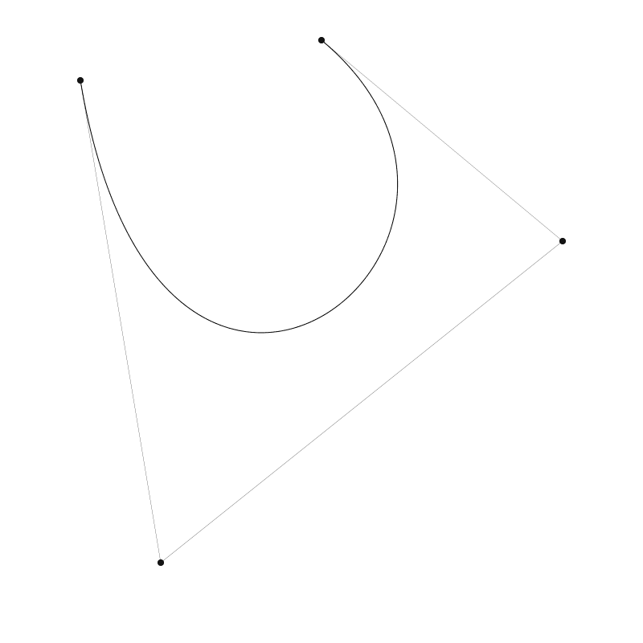
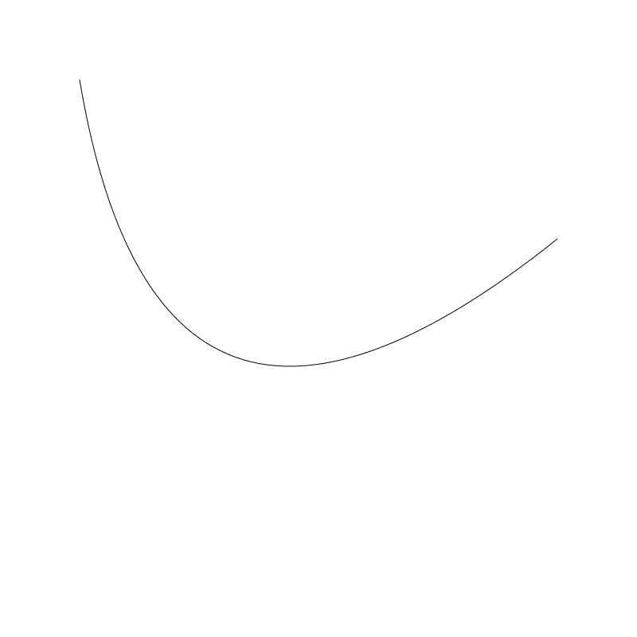

Coding Curves 08: Bézier Curves

Chapter 8 of the Coding Curves Series

I had to hold myself back here. Bézier curves are fun to program, fascinating to explore, and you can go down a deep hole in explaining how they are constructed and what the formulas mean. The thing is, I’ve already done that a few times. In books and in videos. Here’s a couple of my own videos you might want to check out to learn more:

让我们回到真正的曲线上来。贝赛尔曲线编程就非常有趣领人止不住的想探索一翻， 你可以自己深入学习它的组成以及相应的公式。在我的视频或我的书里面这些事我做过很多次了。 下面是我做的两个视频你可以先看看：

https://www.youtube.com/watch?v=dXECQRlmIaE: Coding Curves 08: Bézier Curves
https://www.youtube.com/watch?v=2hL1LGMVnVM: Coding Curves 08: Bézier Curves

And here are a couple of amazing videos by Freya Holmer:
https://www.youtube.com/watch?v=aVwxzDHniEw: Coding Curves 08: Bézier Curves
https://www.youtube.com/watch?v=jvPPXbo87ds: Coding Curves 08: Bézier Curves

So I’m going to limit myself here to the bare basics, some functions, and some cool, practical tips and tricks I’ve discovered over the years.

我还是仅限介绍最基础的一些函数以及这些年积累的一些很酷实用技巧与经验。

The Basics

A Bézier curve is defined by two end points and one or more control points. It starts at one end point, curves towards (but not through) the control point(s) and ends at the other end point. By moving any of the points, you alter the shape of the curve. These curves are generally visually pleasing and are used in all kinds of design tools, and are a key part of the shapes of things from fonts to cars.

There are two types of Bézier curves that you’ll run into most often.

## 基础

贝塞尔曲线由两个端点和一个控制点定义而成。它从一个点出发向控制点（不穿过控制点）再至另一个端点。你可以通过控制这些点中的任意改变曲线的形状。这些曲线通常很优美，应用于各种各样的设计工具，从绘制文字到绘制汽车，它是各种形状绘制的关键组成部分。

Quadratic Bézier Curves

These are defined by two end points and a single control point. Here’s an example:

## 二阶贝塞尔曲线

两个端点与一个控制点组成，如下：

;

The control point is the one near the bottom of the canvas. If I move that to the right, it changes the curve:

控制点靠近 canvas 底部。如果你把它移动到右边，它会影响到曲线：

;

The lighter lines and black points I just threw in for visual context.

细一点的线和那个点主要用于可视化演示控制点的位置。

## Cubic Bézier Curves

Cubic Bézier Curves have two end points and two control points. Example:

## 三阶贝塞尔曲线

三阶贝塞尔曲线拥有两个端点和两个控制点，如图：

;

It is possible to have higher order Bézier curves with more control points, but the math gets more and more costly. See Freya’s videos above for some explanations about this.

Most drawing apis have methods for both quadratic and cubic curves, but how they are names varies greatly.

I’ve seen quadratic Bézier curve methods named:

高阶贝塞尔曲线拥有更多的控制点，但花费的计算成本也相应会变的更高。 可以看看 Freya 的相关视频讲解。

大多数绘图程序 api 都有提供二阶和三阶曲线的函数，但名字可能有比较大的出入。

我看过二阶贝塞尔曲线的函数有被命名为：

  * curveTo
  * quadraticCurveTo

And cubic Bézier curve methods named:

三阶贝塞尔曲线被命名为:

  * curveTo
  * cubicCurveTo
  * bezierCurveTo

So make sure you know what the method names are for your api. A common strategy, as seen in the examples above, is to have the starting point defined by using a moveTo, or the last known position of the drawing cursor, and then have the curve method just define the control points and the final end point. So you’d do something like:

你得确保你使用的编程语言用的是哪一个。通常你可以参考上面列出的几个例子，起始点用 moveTo 定义， 否则起点将会是绘图 api 最近一次的绘制点，然后调用贝塞尔曲线函数定义控制点与结束点。你可以像下面这么做：

```
moveTo(100, 100)
cubicCurveTo(200, 100, 200, 500, 100, 300)
stroke()
```

But some apis may have other methods that allow you to specify all the points at once.

That’s about it for the basics and built-ins, but of course, we’ll now leave the apis behind and code up some curves ourselves.

但有些编程语言可以允许你一次设定所有点。它是作为基础的内建函数，当然我们还是会忽略具体内建的 api 我们必须自己实现一遍。


## Coding Bézier Curves

We’ll start with quadratic curves and then move on to cubic. But before we create the methods that draw the paths, we’re going to create another, more basic method. This will give us the point at any interval along the Bézier curve.

## 贝塞尔曲线编码
我们先从二阶贝塞尔曲线开始然后转向三阶贝塞尔曲线。但在我们开始画曲线路径前，我们需要先另外创建一个基础函数。它会提供贝塞尔曲线上任意点的点的位置。

## Quadratic

Interestingly, the basic formulas for Bézier curves are one-dimensional. To make two-dimensional, three-dimensional or higher Bézier curves, you just apply the formula once for each dimension. We’ll be sticking two 2D here, so we’ll be doing this twice. The single parametric formula is:

## 二阶贝塞尔曲线

有趣的一点是贝塞尔曲线基础公式是一维的。为达到二维，三四，或更高阶，你权需为每一维应用公式。这里我们需要用两个一维组合成二维，所以我们将执行两次。单参数公式如下：

```
x = (1 - t) * (1 - t) * x0 + 2 * (1 - t) * t * x1 + t * t * x2
```

Here, x0, x1, and x2 are the end and control “points” and t is a value that ranges from 0.0 to 1.0. This returns the x value along the Bézier path corresponding to the value of t. When t is 0, x is equal to x0. When t is 1, x is equal to x2. When t is between 0 and 1, x will be interpolated.

So to make a 2D quadratic Bézier point function we do this:

此处，x0, x1, 和 x2 是两个端点与控制点，t 的值范围是 0.0 到 1.0。 它会根据 t 的值返回这条贝塞尔曲线上对应 x 点。 当 t 为 0， x 等于 x0。 当 t 为 1， x 等于 x2。 当 t 在 0 和 1 之间时，x 会是是插值。

所以要创建一个二阶贝塞尔曲线点的函数应该像下面这样做：

```
function quadBezierPoint(x0, y0, x1, y1, x2, y2) {
  x = (1 - t) * (1 - t) * x0 + 2 * (1 - t) * t * x1 + t * t * x2
  y = (1 - t) * (1 - t) * y0 + 2 * (1 - t) * t * y1 + t * t * y2
  return x, y
}
```

You can do this if your language lets you return multiple values. Otherwise, you’ll have to encode x, y in come kind of point object.

Note that we have a lot of duplication going on there. We can clean it up first factoring out all those 1-ts:

你可以这么做，如果你的编程语言支持返回多个值的话。否则你需要将返回值变成类似点对象。

注意，我们先去重一下。我们可以先提取 1-t 为 m  因子：

```
function quadBezierPoint(x0, y0, x1, y1, x2, y2, t) {
  m = (1 - t)
  x = m * m * x0 + 2 * m * t * x1 + t * t * x2
  y = m * m * y0 + 2 * m * t * y1 + t * t * y2
  return x, y
}
```

And then

然后

```
function quadBezierPoint(x0, y0, x1, y1, x2, y2, t) {
  m = (1 - t)
  a = m * m
  b = 2 * m * t
  c = t * t
  x = a * x0 + b * x1 + c * x2
  y = a * y0 + b * y1 + c * y2
  return x, y
}
```

If nothing else, this makes it much easier to read.

Now that we have this, we can make a function to draw quadratic Bézier curves. To make it perfectly clear, I’ll name this quadCurve and the cubic one will be cubicCurve

无它，就是更易读。

有了它就可以用它画二阶贝塞尔曲线了。为了清晰的定义二阶与三阶，我把它们分别命名为 quadCurve 和 cubicCurve。 

```
function quadCurve(x0, y0, x1, y1, x2, y2, res) {
  moveTo(x0, y0)
  for (t = res; t < 1; t += res) {
    x, y = quadBezierPoint(x0, y0, x1, y1, x2, y2, t)
    lineTo(x, y)
  }
  lineTo(x2, y2)
}
```

To make sure we explicitly start and end on the start and end points, we’ll start with an explicit moveTo to the first point and end with an explicit lineTo to the last point. The function takes a res parameter that lets you know how many steps to take along the curve. We’ll start t out equaling res because we’ve already moved to the first point, which is what you’d get if t was 0. In the middle of all that, we just get the point corresponding to the current t and draw a line to it.

Of course, you can make a quadCurveTo method by dropping the first two parameters and the moveTo. This will rely on the user using their own moveTo to specify the starting point of the curve (or continuing it from an existing path). Example of this in use:

确保在 quadCurve 我们将起始点与结束点拆出来了，我们 moveTo 拆出第一个点，用 lineTo 拆出最后一个点。 函数接受一个 res 参数，用于指定沿曲线上迭代多少次。我们将 t 初始值为 res 因为函数外已经移动到第一个点了，无论 t 值是否为 0。中间的所有点根据当前 t 绘制出线条。

当然，你也可以创建一个 quadCurveTo 函数去掉函数内前两个参数还有 moveTo（译者注：这里并非是让你去掉，而是让你自己决定是否单独在函数外面调用）。 这取决于用户自己是否需要指定曲线起始点（或从已有的路径开始绘制）。以下是调用方式：

```
canvas(800, 800)
quadCurve(100, 100, 200, 700, 700, 300, 0.01)
stroke()
```

Which gives us:

这会生成如下图：

;

If we change the res to something larger like 0.1, we see that things get a bit chunky:

如果 res 变大一点，则会生成一个有点糙的曲线：

;

So here you’ll have to experiment with a resolution value that works well. Given that the built-in Bézier methods already figure out a good resolution for you, this curve method has questionable value. But, it got us to write the quadBezierPoint function, which has a LOT of value, as we’ll see.

One thing that the point function can do that the built in methods can’t is animation. For this section, like I did in previous chapters, I’m going to assume you have or can make some kind of function that runs repeatedly and can create animations. I’m going to call it loop. What I’m going to do here is rather than drawing the curve from a t of 0 to 1, I’ll have it go from 0 to a value finalT that will change over time.

你已经对 res 分辨率这个值有一定经验了。内建的贝塞尔曲线会自动给定一个合适的 res 值。但我们自己实现的 quadCurve 函数内 res 值可能还是有点儿问题的。但在此处并不重要，因为它已经能让 quadBezierPoint 返回给我们足够的坐标值了，正如你所见的这样。

我们的 quadBezierPoint 能用于实现动画，而内建函数做不到（译者注：内建函数只能一次性画出路径）。在这一节， 就像之前章节我做的那样， 我已经假定你有或有能力实现无限循环的函数用于创建动画了。 还是叫它 loop 函数。 我不会像之前那样用 t 实现 0 到 1 绘制曲线，我将 让 t 从 0 到 finalT , finalT 的值会一直变化。

```
canvas(400, 400)
x0 = 50
y0 = 50
x1 = 150
y1 = 360
x2 = 360
y2 = 150
finalT = 0
dt = 0.01
res = 0.025
 
function loop() {
  clearCanvas()
  moveTo(x0, y0)
  for (t = res; t < finalT; t += res) {
    x, y = quadBezierPoint(x0, y0, x1, y1, x2, y2, t)
    lineto(x, y)
  }
  stroke()
 
  // add to finalT
  finalT += dt
 
  // if we go past 1, turn it around
  if (finalT > 1) {
    finalT = 1
    dt = -dt
  } else if (finalT < 0) {
    // if we go past 0, turn it back
    finalT = 0
    dt = -dt
  }
}
```

And this should give you an animation that looks something like this:

结果应该会像下面这样的动画

;

Here, the for loop is going from res to finalT so it doesn’t draw the entire curve (unless finalT equals 1). Then we change finalT by adding dt to it. This brings finalT closer and closer to 1, so the curve is drawn more and more fully. Eventually finalT will go beyond 1 so we set it back to 1 and make dt negative, which reverses the whole process until finalT goes below 0, where we bounce it back the other way.

Rather than just drawing a line, we can animate an object along a Bézier path now! Here’s the code for that. It should be pretty clear. I’ll just include the loop function. The rest should be the same.

此处， for 环境内 t 是从 res 到 finalT 变化的所以不会画出完整的曲线（除非 finalT 为 1）。然后我们给 finalT 加上 dt。 这会让 finalT 慢慢接近 1， 这会曲线越来越完整。当 finalT 超过 1 时, 我们将它设为负值，这会让整个过程反转直到 finalT 变为 0， 这是我们变回出发点的方法。（译都注：其实就是当 finalT 超过临界点后，通过将 dt 设为 -dt 使得 finalT 一直在 1 和 0 之间来回变动）

相比于画一条线， 我们这次做一个沿贝塞尔曲线运动的动画！下面是代码示例。相当清晰明了。我只是添加了一个实心圆的逻辑放进 loop 函数内，剩下的代码和之前一样。

```
function loop() {
  clearCanvas()
 
  x, y = quadBezierPoint(x0, y0, x1, y1, x2, y2, finalT)
  circle(x, y, 10)
  fill()
 
  // no changes beyond here...
  // add to finalT
  finalT += dt
 
  // if we go past 1, turn it around
  if (finalT > 1) {
    finalT = 1
    dt = -dt
  } else if (finalT < 0) {
    // if we go past 0, turn it back
    finalT = 0
    dt = -dt
  }
}
```

Now we’re just getting the x, y point for the current value of finalT and drawing a circle there. This assumes you have a circle drawing function. You can use the one we created in Chapter 3 if you need one.

这样我们就得到了 finalT 的当前值对应点的 x, y 并在 x, y 处画了个圆。假定你已经有了 circle 绘制函数。你如果有需要你可以在第三章里复制一个过来。

;

In this example, I drew a light line for the same quadratic curve using the built-in method of my api, just to show that we’re on track with the standard definitions of these things.

在下面这个 gif 图，是我用内建的函数绘制的相同曲线，多来了一条细线表示运动轨道展示动画一直在我们我们定义的标准的二阶贝塞尔曲线上。

;

OK, let’s take a break here and jump over to cubic curves

好的，稍作休息后让我们进入三阶贝塞尔曲线。

##　Cubic

Pretty much everything I said above for quadratic curves is going to apply to cubics. It’s just a different formula – a bit more complicated. Here is is for one dimension:

## 三阶贝塞尔曲线

上面介绍的二阶贝塞尔曲线都将应用到三阶上。只是公式不一样 - 更复杂一点点。下面是一维的定义：

```
x = (1 - t) * (1 - t) * (1 - t) * x0 + 3 * (1 - t) * (1 - t) * t * x1 + 3 * (1 - t) * t * t * x2 + t * t * t * x3
```

And the 2D function:

还有二维函数的定义：

```
function cubicBezierPoint(x0, y0, x1, y1, x2, y2, x3, y3, t) {
  x = (1 - t) * (1 - t) * (1 - t) * x0 + 3 * (1 - t) * (1 - t) * t * x1 + 3 * (1 - t) * t * t * x2 + t * t * t * x3
  y = (1 - t) * (1 - t) * (1 - t) * y0 + 3 * (1 - t) * (1 - t) * t * y1 + 3 * (1 - t) * t * t * y2 + t * t * t * y3
  return x, y
}
```

Yikes! That’s a mess. Let’s clean it up again by factoring out the 1 - ts:

是的看起来相当乱，我们同样提取出 1- t 因子出来整理一下：

```
function cubicBezierPoint(x0, y0, x1, y1, x2, y2, x3, y3, t) {
  m = 1 - t
  x = m * m * m * x0 + 3 * m * m * t * x1 + 3 * m * t * t * x2 + t * t * t * x3
  y = m * m * m * y0 + 3 * m * m * t * y1 + 3 * m * t * t * y2 + t * t * t * y3
  return x, y
}
```

That’s a little better. One more step to clean it up:

好一点儿了，更进一步优化后：

```
function cubicBezierPoint(x0, y0, x1, y1, x2, y2, x3, y3, t) {
  m = 1 - t
  a = m * m * m
  b = 3 * m * m * t
  c = 3 * m * t * t
  d = t * t * t
  x = a * x0 + b * x1 + c * x2 + d * x3
  y = a * y0 + b * y1 + c * y2 + d * y3
  return x, y
}
```

Much better!

Now we can make a cubicCurve function.

还可以！

现在可以创建 cubicCurve 三阶贝塞尔曲线函数了。

```
function cubicCurve(x0, y0, x1, y1, x2, y2, x3, y3, res) {
  moveTo(x0, y0)
  for (t = res; t < 1; t += res) {
    x, y = cubicBezierPoint(x0, y0, x1, y1, x2, y2, x3, y3, t)
    lineTo(x, y)
  }
  lineTo(x2, y2)
}
```
That was easy. No explanation or example needed I think.

Now for your assignment: adjust the animations we did above to work for cubic curves. It’s really just a matter of adding a new x3, y3 point and calling the new function.

That’s the basic code for implementing Bézier curves and paths. But there are a few more neat tricks for you.

很简单。我想不需要更多的解释了。

现在你的任务是：调整二阶动画用三阶来实现一遍。仅仅需要加一个　x3, y3 的新坐标点并调用这个新函数。

这些就是对贝塞尔曲线和路径的基础代码实现了。但我这里还准备了一些其它有用的小技巧给你。

## Drawing Through a Point

At some point, everyone who starts coding Bézier curves is going to say:

> This is neat, but I want it to go THROUGH the control point(s). Me – some time around the year 2000.

Well, we can do that! It’s pretty easy for quadratic curves. What you need to do is create another control point that will pull the curve even further out so that it just goes through the original control point. And that new point is pretty simple to calculate. Where the points are x0, y0, x1, y1, x2, y1, the new control point will be:

## 过点画线

那些刚开始使用贝塞尔曲来线编程的人经常会说

> 这很巧妙，但我希望曲线能穿过控制点 ---- 这也是我-大约在 2000 年左右想要实现的功能

当然可以实现了！这对二阶贝塞尔曲线相当容易实现。你只需要在更远的地方创建另一个控制点，控制曲线刚好穿过原控制点的位置。新的控制点很容易计算。以点 x0, y0, x1, y1, x2, y1 为例，那么新控制点会是：

```
x = x1 * 2 - x0 / 2 - x2 / 2
y = y1 * 2 - x0 / 2 - x2 / 2
```

Now we can make a function, let’s call it quadCurveThrough that implements this behavior. It just gets this new point and uses the built-in function to draw the curve. I’m going to postulate that’s called quadraticCurveTo on your system, but it might be something else.

现在我们可以创建地一个新函数 quadCurveThrough 实现上面的代码公式。下面是计算获取新控制点并使用内建函数实现贝塞尔曲线绘制。我假定你的系统中也有名为 quadraticCurveTo 的函数，当然也可能名字不同。


```
function quadCurveThrough(x0, y0, x1, y1, x2, y2) {
  xc = x1 * 2 - x0 / 2 - x2 / 2
  yc = y1 * 2 - y0 / 2 - y2 / 2
  moveTo(x0, y0)
  quadraticCurveTo(xc, yc, x2, y2)
}
```

Here I’ve drawn a regular quadratic curve in red and one using this function in blue. And I drew in the points to prove that it does what I claim it does!

下图中红的是我用标准的二阶贝塞尔曲线画的，蓝的是用新函数画的。并且绘制了那些控制点用于证明。

;

Your next question is how to do the same thing for cubic curves. I don’t have an answer for that one yet. But I will keep digging. I guess there’s a chance that someone will comment the answer here, or tell me it’s not possible. 🙂

你下一个问题一定是如何在三阶贝塞尔曲线实现同样的过控制点绘制曲线。我暂时还不知道，但我会一直探索。我猜这也是一个机会，也许有人会在评论区给出答案，或直接告诉我这不可能实现🙂

## Piece-wise Quadratic Bézier Curves

The other question people commonly ask is:

> How do I make a Bézier curve with N control points (where N is 3 to infinity)? Also me around the same time as earlier question

## 分段二阶贝塞尔曲线

人们通常会问的另一个问题是：

> 我如何绘制 N 个控制点的贝塞尔曲线（N 为 3 到 无穷）？早期这个问题也困扰着我

As mentioned earlier, this is mathematically possible, but it gets prohibitively expensive when you move past cubic. That’s why you’ll probably never see quartic or quintic Bézier curve functions. But it’s still a very useful thing to have a smooth curve with an arbitrary number of control points. And of course you’ve seen this kind of thing any time you’ve used a pen tool in a drawing program.

正如我之前提到过的，在数学上是可行的，但可以肯定的是从三阶往上它相当消耗性能。这也就是为什么你几乎没怎么见过四阶贝塞尔曲线函数。但对于创建一条拥有任意控制点的平滑曲线还是非常有用的。当然，你肯定已经在某些绘图软件用过“钢笔”这种类工具了。

In the splines video above (second one by Freya), she shows making a longer curve by piecing together multiple cubic Bézier curves.

在上面视频样条曲线（第二个作者为 Freya）， 她展示了如何使用多个三阶贝赛尔曲线组成长曲线（样条曲线）

https://www.youtube.com/watch?v=jvPPXbo87ds: Coding Curves 08: Bézier Curves

These are sometimes called piecewise Bézier curves. I’m going to show you something a bit simpler, using only quadratic curves. It’s not too hard to implement and it supports any number of control points you want to throw at it. I’ll even show you a version that creates a closed loop.

有时被称为分段二阶贝塞尔曲线，我将展示一点简单的例子使用二阶曲线。它的实现并不难且它支持任意多的控制点。我甚至会为你创建一个曲线闭环的版本。

This technique is actually covered in depth in the second video I posted above (by me):
这项技术在我的视频中讲过了：
https://www.youtube.com/watch?v=2hL1LGMVnVM: Coding Curves 08: Bézier Curves

So I’m not going to do too deep a dive here, but I’ll go over the basics and give you some code and examples.

The basic principle is you’re going to first create a new point that is mid-way between p0 and p1. Call that pA. And another that’s between p1 and p2. Call that pB. Draw a line from p0 to pA, then draw a quadratic curve using pA, p1 and pB. 

所以在此处我不会深入太多，仅覆盖基础部分并给你一些示例。

基本原则是在 “p0 p1” 之间画创建一个中点称为 pA。然后再创建一个 p1 与 p2 之间的中点设为 pB 。连接 p0 到 pA，然后使用 pA，p1 和 pB 绘制二阶贝塞尔曲线。

;

Then you’ll get midpoint from p2 and p3, called pC and make a curve from pB through p2 and ending at pC. 

然后你找到 p2 和 p3 之间的 pC 并且从 pB 绘制二阶贝塞尔曲线通过控制点 p2 到达 pC

;

You’ll continue that until the end where you draw a curve from the second-to-last midpoint, through the second-to-last point, ending at the last midpoint. Then finally a line from the last midpoint to the last point.

继续以上步骤直到倒数第二个中间点，穿过倒数第二点，结束在最后一个中间点。最终连接最后一个中间点到最后一个结束点。


;

And here’s the curve:

下面是画出的曲线：

;

The code for this can get a little tricky, but having worked through it a few times, I’m pretty happy with a method that looks like the following. Note, that due to the potentially large number of parameters that will be passed in, it really helps to have some kind of point object. Whether that’s a class, structure, or generic object with x and y properties.. up to you and your language. This method will take an array of these point objects. The code assumes the array has a length property, but there might be something different in your language, like a len method.

实现这个效果的代码看起来有点儿棘手，但我已经弄过好几回了，很庆幸已经有了像下面这样的函数。注意，为了能传递大量参数， 参数需要定义成某种类型的对象。无论它是类，结构，或拥有x, y 属性的普通对象...。根据你自己使用的编程语言选择吧。此函数使用数组存储坐标点。假定数组有个 length 属性，在你的编程语言中有可能它不是一个属性，而是一个获取数组长度的方法。

```
function multiCurve(points) {
  // line from the first point to the first midpoint.
  // 连接第一个点到第一个中间点
  moveTo(points[0].x, points[0].y)
  midX = (points[0].x + points[1].x) / 2
  midY = (points[0].y + points[1].y) / 2
  lineTo(midX, midY)
 
  // loop through the points array, starting at index 1
  // and ending at the second-to-last point
  // 循环数组，index 从 1 开始至倒数第二个点结束
  // （译者注：注意这循环内的最开始的 p0 其实是数组中的第二个点了）
  for (i = 1; i < points.length - 1; i++) {
    // find the next two points and their midpoint
    p0 = points[i]
    p1 = points[i+1]
    midX = (p0.x + p1.x) / 2
    midY = (p0.y + p1.y) / 2
 
    // curve through next point to midpoint
    // 从下一个点开始绘制二阶曲线至中间点
    quadraticCurveTo(p0.x, p0.y, midX, midY)
  }
 
  // we'll be left at the last midpoint
  // draw line to last point
  // 连接最后一个中间点到结束点。
  p = points[points.length - 1]
  lineTo(p.x, p.y)
}
```

That method seems long, but I added a lot of comments to each part.

For an example, I generated a half dozen random points. I don’t know how you’d do that on your system, so I’m going to say we have a function randomPoint(xmin, ymin, xmax, ymax). (Actually I do have such a method in my own library!) Once you have your points array, you just pass that array to your new function and stroke the resulting path:

方法看起来有点儿长，但我为每部分加了对应的注释。

如下例子中，我添加了半打（译者注：一打是 12 个 半打 是 6 个）随机坐标点。我不知道你使用的编程语言中如何生成这些随机数，我假定你会有 randomPoint(xmin, ymin, xmax, ymax) 这样的函数。（事实上我在自已函数库中确实实现过这样的函数！）一旦你有了这样的数组，把数组传进 multiCurve 后再调用 stroke 进行描边渲染：

```
context(800, 800)
points = []
for (i = 0; i < 6; i++) {
  points.push(randomPoint(0, 0, 800, 800))
}
 
multiCurve(points)
stroke()
```

The glorious result:

看看这图：

;

Quite nice. I also drew all the points to give a bit more context on why the curve looks like it does.

相当不错。 曲线之所以看起来是样，是因为在生成这些随机数的数组时也是要根据上下文环境来的

## Closed Curves

The final thing in this section will be to alter the method to allow for a closed loop. Mainly that’s going to be getting rid of the starting and final line segments, and figuring out the curve from the end of the curve back to the beginning.

## 封闭曲线

最后部分将要介绍的是如何将函数改造成封闭曲线。主要是去除掉开始与结束线断，并且将它首尾相连。

```
function multiLoop(points) {
  // find the first midpoint and move to it.
  // we'll keep this around for later
  // 找到最开始的那个中间点，将绘制点移至此点。
  // 先存下来后面会用到
  midX0 = (points[0].x + points[1].x) / 2
  midY0 = (points[0].y + points[1].y) / 2
  moveTo(midX0, midY0)
 
  // the for loop doesn't change
  // 循环和之前一样不用变
  for (i = 1; i < points.length - 1; i++) {
    p0 = points[i]
    p1 = points[i+1]
    midX = (p0.x + p1.x) / 2
    midY = (p0.y + p1.y) / 2
    quadraticCurveTo(p0.x, p0.y, midX, midY)
  }
 
  // we'll be left at the last midpoint
  // find the midpoint between the last and first points
  // 找到数组首尾间的中间点
  p = points[points.length - 1]
  midX1 = (p.y + points[0].x) / 2
  midY1 = (p.y + points[0].y) / 2
 
  // curve through the last point to that new midpoint
  // 将最后一个点与首尾中间点相连
  quadraticCurveTo(p.x, p.y, midX1, midY1)
 
  // then curve through the first point to that first midpoint you saved earlier
  // 然后再将数组第一个点与早前我们保存的第一个中间点连接
  quadraticCurveTo(points[0].x, points[0].y, midX0, midY0)
}
```

;

We move to the first midpoint, then loop through the rest, finding midpoints and doing quadratic curves. This leaves us at the last midpoint. Then…

我们先从第一个中间点开始，循环剩下的点，找到各自点的中间点并用二阶贝塞尔曲线相连。我们最终停留在最后一个中间点。然后...

;

We find the midpoint between the first and last points, and execute the last two curves to close up the shape. The following image is made with the same setup as the last one, but calling multiLoop instead of multiCurve (and different random points).

找到首尾间的中间点，并将剩下两段曲线连在一起将形状闭合。如下图与上面一样的设置一样，但用 multiLoop 函数取代了之前的 multiCurve函数 （随机出的 points 数组值也不一样）。

;

These are two of my favorite functions, and I’m happy to share them with you.

这是我最爱的函数，我很乐意分享给你们。

## Even Distribution

The final trick I want to share has to do with evenly distributing objects on a quadratic curve. One use case for this is when you want to have text follow a curve. You want to be able to space the letters evenly on the curve. You’ll also want to rotate them to follow the curve, but that’s beyond the scope of this article.

At first this might seem like a trivial problem. You have your t value that you use to divide up the curve. If you want, say, 20 object spaced out on the curve, just have them 0.05 apart. 20 x 0.05 = 1.0. Work done. Well, let’s try it.

## 均匀分布

最后要分享的技巧是如何在二阶贝塞尔曲线中均匀地分布对象。 一个实用的例子是要把文本放到曲线上并且均匀的分布。当然你肯定希望文本的角度也根据曲线的位置跟着旋转相应的角度，但这一部分超出了本篇文章的讨论范围。

乍一看很容易实现。你可以用 t 来分割曲线。如果你想在曲线上给 20 个对象留出空间， 每个对象占 0.05 份。 20 x 0.05 = 1.0。 搞定。让我们试试：

```
canvas(800, 800)
 
x0 = 100
y0 = 700
x1 = 100
y1 = 100
x2 = 700
y2 = 400
 
moveTo(x0, y0)
quadraticCurveTo(x1, y1, x2, y2)
stroke()
 
// 20 evenly spaced t values (21 counting the end one)
// 20 个等距的 t 值（算上最后一个是21个）
for (t = 0; t <= 1; t += 0.05) {
  x, y = quadBezierPoint(x0, y0, x1, y1, x2, y2, t)
  circle(x, y, 6)
  fill()
}
```

Here’s what that gives us.

下面是我们得到的结果：

;

Not evenly spaced at all. The ones near the ends are spaced out and in the middle they are closer together. That’s just the way it is with Bézier curves. So, we have to figure out a way to get those points evenly spaced.

Sadly, there’s not a very easy way to do this. I’m going to give you a horribly un-optimized, brute force way to get decent results, and a couple of hints on how to make it better.

So, to get evenly spaced points along a curve, it makes sense that you need to know the length of the curve. If the length is 200 pixels, and you want 20 points, you put one point every 10 pixels along the length of the curve.

Surprisingly, there is no simple formula to get the length of a Bézier curve. But we can get pretty close by sampling a bunch of points along the curve and getting the distance between each pair. This would look something like this:

最终没有均分。尾部间隔较大，中间间隔又比较紧。这就是贝塞尔曲线的特点。所以我们得找到方法让这些点平均分布。

遗憾的是没有什么简单的方式来实现。我将用粗暴的方式强行实现它，当然也会给你一些用于优化它的提示。

为了在曲线上均分等距空格，直觉告诉我们需要先获取曲线的总长度。如果长度是 200 像素， 你想要 20 个点均分， 那么每间隔 10 像素就放一个。

意外的是没什么现成的公式可以在贝塞尔曲线实现这一效果。但我们可以在曲线上采样一堆的点，获取每个点之间的距离来模拟实现。代码大致如下：

```
function quadBezLength(x0, y0, x1, y1, x2, y2, count) {
  length = 0.0
  dt = 1.0 / count
  x, y = x0, y0
  for (t = dt; t < 1; t += dt) {
    xn, yn = quadBezierPoint(x0, y0, x1, y1, x2, y2, t)
    length += distance(x, y, xn, yn)
    x, y = xn, yn
  }
  // (译者注：这里原作者用了 '==' 打错字了, 应该是 '+=')
  length += distance(x, y, x2, y2)
  return length
}
```

Here, count is how many samples we want to take. The more samples, the more accurate we’ll be.

Then, dt is the amount to increase t by as we loop through the curve.

We keep track of the last point, x, y, which will start as x0, y0. Then we loop through the curve getting each new point, xn, yn and finding the distance between the last point and the new point, then making the new point the last point. I’m not going to show you how to find the distance between two points, just assuming that you have a function for that. You add that distance to the accumulating length.

Then you do one last length addition for x2, y2. Then return the length.

Make sure that all makes sense first, because I’m going to throw something else in there.

It’s going to be very useful to keep track of what the length was at each point as we work through the curve. So we’re going to store each successive value in an array. And rather than returning the total length, we’ll return the array.

变量 count 是采样数量。采样越多，越精准。

然后 dt 是我们在曲线上循环迭代的步长。

我们追踪每一步循环的 x, y 点，初始值是 x0, y0 。然后循环迭代得到曲线上每一个新坐标点 xn, yn 并计算出上一次迭代点到此时新点的距离， 然后再将新值赋值给 x, y。不我打算展示如何计算两点间的距离 ，我假定你已经有这样的函数了。将距离累加进 length.

最后再将算最后x2, y2 与 x, y 最后值的距离加到 length 上。然后返回 length 结果

确保你完全明白了，因为我已准备在此处添加更多代码了。

沿曲线追踪每个点的距离非常有用。所以我们要把这些距离存进数组。这比返回整个长度有用，我们将直接返回这个数组

```
function quadBezLengths(x0, y0, x1, y1, x2, y2, count) {
  lengths = []
  length = 0.0
  dt = 1.0 / count
  x, y = x0, y0
  for (t = dt; t < 1; t += dt) {
    xn, yn = quadBezierPoint(x0, y0, x1, y1, x2, y2, t)
    length += distance(x, y, xn, yn)
    lengths.push(length)
    x, y = xn, yn
  }
  length == distance(x, y, x2, y2)
  lengths.push(length)
  return lengths
}
```

Now the full length of the curve is in the last element, but we have a whole bunch of other sub-lengths too. Here’s what we do.

现在曲线的完整长度存在了最后的数组元素中，并且我们还有一堆其它长度，下面看我如何应用：

```
count = 500
lengths = quadBezLengths(x0, y0, x1, y1, x2, y2, count)
length = lengths[count-1]
 
for (i = 0.0; i <= 1; i += 0.05) {
  // the length of the curve up to the next point
  // 曲线上下一个目标点的长度
  targetLength = i * length
 
  // loop through the array until the length is higher than the target length
  // 循环数组直到 length 高于目标长度
  for (j = 0; j < count; j++) {
    if (lengths[j] > targetLength) {
      // t is now the percentage of the way we got through the array.
      // this is the t value we need to get the next point
      // t 现在是数组的百分比
      // 这是下一个点的 t 值
      t = j / count
 
      // get the point and draw the next circle.
      // 获取下一个点，并绘制圆。
      x, y = quadBezierPoint(x0, y0, x1, y1, x2, y2, t)
      circle(x, y, 6)
      fill()
      break
    }
  }
}
```

OK, a bit complex, but let’s go through it. We get the lengths using a count of 500, and capture the total length.

The we loop through from 0 to 1 by 0.05, like we were doing before. But rather than using that as the t value of the Bézier curve, we use it to find a fraction of the length of the curve. Say the curve was 500 pixels long and i was 0.5, then the target length we are looking for is 250 for the next point.

Now we loop through the array with j and get the length values until we go above our target length. If we divide j by count, we wind up with the t value that created this particular length. We plug that back into the Bézier point function to get the next point and draw it. We also want to break out of the inner loop at that point, since we are done and can move on to the next point.

This gives us the following:

好的，有点儿小复杂， 让我们过一遍代码。我们用设 count 为 500 采样得到了长度数组，且获取了总长度。。

就像之前一样创建了一个 0.05 为步长 从 0 至 1 的循环。但并不像在画贝塞尔曲线时使用的 t， 我们用它寻找曲线长度的百分比。意思是当曲线长度为 500 像素且 i 为 0.5 时，我们寻找的的目标点长度即为 250 像素。

现在我们用循环遍历数组 通过 j 获取长度值直到值大于 targetLength 结束内循环。我们将 j / count 得到这一部分特定的长度。我们 t 传入 quadBezierPoint 函数得到下一个点并把它绘制出来。此时我们应该跳出内部的循环，直到完成这些再入下一步循环。

;

We missed the last point (because we never went beyond that length), but we could just draw another point at x2, y2. This is pretty close to evenly spaced. The higher the value you use for count, the more accurate it will be. If we move count down to 100, we can see it’s off:

忘了还有最后一个点（因为循环并未超过它的长度），但我们仅需要再绘制另一个坐标在 x2, y2 的点即可。这回相当接近均分了。 count 值设的越高，均分的精度就会越高。如果 count 降为 100 ，我们可以看下它的效果：

;

Now, there is a LOT wrong with this code. Mostly in its optimization.

现在，代码中有许多错误。大多是优化上的。

First of all, rather than looping through from 0 on each point, we could use a binary search.

首先，二分查询就比从 0 开始循环整个数组要好。

Secondly, we have to add a lot of points to get any kind of accuracy. Because we are just grabbing the last point we find in that inner loop. Instead of taking a predefined point, which we know is a bit too high, we could interpolate between that point and the previous point.

其次，我们不得不添加一大堆任意精度的点。用于在内循环中匹配查找。取一个预定义的点太费性能了， 我们可以在这个点与前一个点之间插值。

For example, say our target length was 150. And at index 87 we got a length of 160. We look back at index 86 and we find 140. OK, so we want a value half way in between 86 and 87. So instead of calculating t as 87 / count, or even 86 / count, we interpolate 50% and say 86.5 / count. It still won’t be perfect, but you can use a lower count and still get good results.

举个例子，假设我们的目标长度是150，然后在 index 87 位置我们得到了长度是值是 160。 index 往回到 86 我们得到 140。现在我希望得到 86 与 87 中间的值。 比起用 87 / count ， 或 86 / count ，我们用插值 50% 即 86.5 / count。虽然还是不太完美，但你现在可以将 count 设低一点，但得到结果却依旧很好。

I’m going to leave all of that as an exercise for you.

If you want more info on this technique, and a fuller explanation, check out this site:

我将这些工作当作练习留给你

如果你想获取更多这类相关的技术信息和完整解释，可以参考以下网站

http://www.planetclegg.com/projects/WarpingTextToSplines.html


## Summary

So there, you go, a few basics, a few tips, a few tricks. Until next time…

就到这里了，一些基础知识，一些小提示，一些小技巧，下一章见...