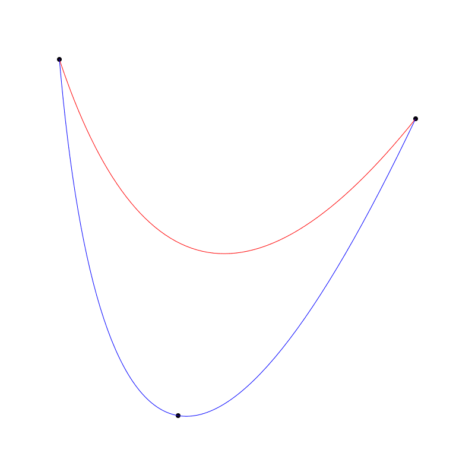

Coding Curves 08: Bézier Curves

Chapter 8 of the Coding Curves Series

I had to hold myself back here. Bézier curves are fun to program, fascinating to explore, and you can go down a deep hole in explaining how they are constructed and what the formulas mean. The thing is, I’ve already done that a few times. In books and in videos. Here’s a couple of my own videos you might want to check out to learn more:

年轻人可能把握不住自己，但我能。贝赛尔曲线编程非常有趣领人止不住的想探索一翻， 你可以自己深入学习它的组成以及相应的公式。在我的视频或我的书里面这些事我做过很多次了。 下面是我做的两个视频你可以先看看：

https://www.youtube.com/watch?v=dXECQRlmIaE: Coding Curves 08: Bézier Curves
https://www.youtube.com/watch?v=2hL1LGMVnVM: Coding Curves 08: Bézier Curves

And here are a couple of amazing videos by Freya Holmer:
https://www.youtube.com/watch?v=aVwxzDHniEw: Coding Curves 08: Bézier Curves
https://www.youtube.com/watch?v=jvPPXbo87ds: Coding Curves 08: Bézier Curves

So I’m going to limit myself here to the bare basics, some functions, and some cool, practical tips and tricks I’ve discovered over the years.

还是从最最基础的开始介绍一些函数以及这些年积累的一些很酷实用技巧与经验。

The Basics

A Bézier curve is defined by two end points and one or more control points. It starts at one end point, curves towards (but not through) the control point(s) and ends at the other end point. By moving any of the points, you alter the shape of the curve. These curves are generally visually pleasing and are used in all kinds of design tools, and are a key part of the shapes of things from fonts to cars.

There are two types of Bézier curves that you’ll run into most often.

## 基础

贝塞尔曲线由两个端点和一个控制定义而成。它从一个点出发向控制点（不穿过控制点）再至另一个端点。你可以通过控制这些点中的任意改变曲线的形状。这些曲线通常很优美，应用于各种各样的设计工具，从绘制文字到绘制汽车，它是绘制各种形状的关键组成部分。

Quadratic Bézier Curves

These are defined by two end points and a single control point. Here’s an example:

## 二次贝塞尔曲线

两个结束点与一个控制点组成，如下：

;

The control point is the one near the bottom of the canvas. If I move that to the right, it changes the curve:

控制点靠近 canvas 底部。如果你把它移动到右边，它会影响到曲线：

;

The lighter lines and black points I just threw in for visual context.

细一点的线和那个点主要用于可视化演示控制点的位置。

## Cubic Bézier Curves

Cubic Bézier Curves have two end points and two control points. Example:

## 三次贝塞尔曲线

三次贝塞尔曲线拥有两个结束点和两个控制点，例如：

;

It is possible to have higher order Bézier curves with more control points, but the math gets more and more costly. See Freya’s videos above for some explanations about this.

Most drawing apis have methods for both quadratic and cubic curves, but how they are names varies greatly.

I’ve seen quadratic Bézier curve methods named:

高阶贝塞尔曲线拥有更多的控制点，但花费的计算成本也相应会变的更高。 可以看看 Freya 的相关视频讲解。

我看过二次贝塞尔曲线的函数被命名为以下函数名：

  * curveTo
  * quadraticCurveTo

And cubic Bézier curve methods named:

三次贝塞尔曲线可能被命名为以下函数名:

  * curveTo
  * cubicCurveTo
  * bezierCurveTo

So make sure you know what the method names are for your api. A common strategy, as seen in the examples above, is to have the starting point defined by using a moveTo, or the last known position of the drawing cursor, and then have the curve method just define the control points and the final end point. So you’d do something like:

你得确保你使用的编程语言用的是哪一个。通常你可以参考上面列出的几个

```
moveTo(100, 100)
cubicCurveTo(200, 100, 200, 500, 100, 300)
stroke()
```

But some apis may have other methods that allow you to specify all the points at once.

That’s about it for the basics and built-ins, but of course, we’ll now leave the apis behind and code up some curves ourselves.

## Coding Bézier Curves

We’ll start with quadratic curves and then move on to cubic. But before we create the methods that draw the paths, we’re going to create another, more basic method. This will give us the point at any interval along the Bézier curve.

## Quadratic

Interestingly, the basic formulas for Bézier curves are one-dimensional. To make two-dimensional, three-dimensional or higher Bézier curves, you just apply the formula once for each dimension. We’ll be sticking two 2D here, so we’ll be doing this twice. The single parametric formula is:

```
x = (1 - t) * (1 - t) * x0 + 2 * (1 - t) * t * x1 + t * t * x2
```

Here, x0, x1, and x2 are the end and control “points” and t is a value that ranges from 0.0 to 1.0. This returns the x value along the Bézier path corresponding to the value of t. When t is 0, x is equal to x0. When t is 1, x is equal to x2. When t is between 0 and 1, x will be interpolated.

So to make a 2D quadratic Bézier point function we do this:

```
function quadBezierPoint(x0, y0, x1, y1, x2, y2) {
  x = (1 - t) * (1 - t) * x0 + 2 * (1 - t) * t * x1 + t * t * x2
  y = (1 - t) * (1 - t) * y0 + 2 * (1 - t) * t * y1 + t * t * y2
  return x, y
}
```

You can do this if your language lets you return multiple values. Otherwise, you’ll have to encode x, y in come kind of point object.

Note that we have a lot of duplication going on there. We can clean it up first factoring out all those 1-ts:

```
function quadBezierPoint(x0, y0, x1, y1, x2, y2, t) {
  m = (1 - t)
  x = m * m * x0 + 2 * m * t * x1 + t * t * x2
  y = m * m * y0 + 2 * m * t * y1 + t * t * y2
  return x, y
}
```

And then

```
function quadBezierPoint(x0, y0, x1, y1, x2, y2, t) {
  m = (1 - t)
  a = m * m
  b = 2 * m * t
  c = t * t
  x = a * x0 + b * x1 + c * x2
  y = a * y0 + b * y1 + c * y2
  return x, y
}
```

If nothing else, this makes it much easier to read.

Now that we have this, we can make a function to draw quadratic Bézier curves. To make it perfectly clear, I’ll name this quadCurve and the cubic one will be cubicCurve

```
function quadCurve(x0, y0, x1, y1, x2, y2, res) {
  moveTo(x0, y0)
  for (t = res; t < 1; t += res) {
    x, y = quadBezierPoint(x0, y0, x1, y1, x2, y2, t)
    lineTo(x, y)
  }
  lineTo(x2, y2)
}
```

To make sure we explicitly start and end on the start and end points, we’ll start with an explicit moveTo to the first point and end with an explicit lineTo to the last point. The function takes a res parameter that lets you know how many steps to take along the curve. We’ll start t out equaling res because we’ve already moved to the first point, which is what you’d get if t was 0. In the middle of all that, we just get the point corresponding to the current t and draw a line to it.

Of course, you can make a quadCurveTo method by dropping the first two parameters and the moveTo. This will rely on the user using their own moveTo to specify the starting point of the curve (or continuing it from an existing path). Example of this in use:

```
canvas(800, 800)
quadCurve(100, 100, 200, 700, 700, 300, 0.01)
stroke()
```

Which gives us:

;

If we change the res to something larger like 0.1, we see that things get a bit chunky:

;

So here you’ll have to experiment with a resolution value that works well. Given that the built-in Bézier methods already figure out a good resolution for you, this curve method has questionable value. But, it got us to write the quadBezierPoint function, which has a LOT of value, as we’ll see.

One thing that the point function can do that the built in methods can’t is animation. For this section, like I did in previous chapters, I’m going to assume you have or can make some kind of function that runs repeatedly and can create animations. I’m going to call it loop. What I’m going to do here is rather than drawing the curve from a t of 0 to 1, I’ll have it go from 0 to a value finalT that will change over time.

```
canvas(400, 400)
x0 = 50
y0 = 50
x1 = 150
y1 = 360
x2 = 360
y2 = 150
finalT = 0
dt = 0.01
res = 0.025
 
function loop() {
  clearCanvas()
  moveTo(x0, y0)
  for (t = res; t < finalT; t += res) {
    x, y = quadBezierPoint(x0, y0, x1, y1, x2, y2, t)
    lineto(x, y)
  }
  stroke()
 
  // add to finalT
  finalT += dt
 
  // if we go past 1, turn it around
  if (finalT > 1) {
    finalT = 1
    dt = -dt
  } else if (finalT < 0) {
    // if we go past 0, turn it back
    finalT = 0
    dt = -dt
  }
}
```

And this should give you an animation that looks something like this:

;

Here, the for loop is going from res to finalT so it doesn’t draw the entire curve (unless finalT equals 1). Then we change finalT by adding dt to it. This brings finalT closer and closer to 1, so the curve is drawn more and more fully. Eventually finalT will go beyond 1 so we set it back to 1 and make dt negative, which reverses the whole process until finalT goes below 0, where we bounce it back the other way.

Rather than just drawing a line, we can animate an object along a Bézier path now! Here’s the code for that. It should be pretty clear. I’ll just include the loop function. The rest should be the same.

```
function loop() {
  clearCanvas()
 
  x, y = quadBezierPoint(x0, y0, x1, y1, x2, y2, finalT)
  circle(x, y, 10)
  fill()
 
  // no changes beyond here...
  // add to finalT
  finalT += dt
 
  // if we go past 1, turn it around
  if (finalT > 1) {
    finalT = 1
    dt = -dt
  } else if (finalT < 0) {
    // if we go past 0, turn it back
    finalT = 0
    dt = -dt
  }
}
```

Now we’re just getting the x, y point for the current value of finalT and drawing a circle there. This assumes you have a circle drawing function. You can use the one we created in Chapter 3 if you need one.

;

In this example, I drew a light line for the same quadratic curve using the built-in method of my api, just to show that we’re on track with the standard definitions of these things.

;

OK, let’s take a break here and jump over to cubic curves

##　Cubic

Pretty much everything I said above for quadratic curves is going to apply to cubics. It’s just a different formula – a bit more complicated. Here is is for one dimension:

```
x = (1 - t) * (1 - t) * (1 - t) * x0 + 3 * (1 - t) * (1 - t) * t * x1 + 3 * (1 - t) * t * t * x2 + t * t * t * x3
```

And the 2D function:

```
function cubicBezierPoint(x0, y0, x1, y1, x2, y2, x3, y3, t) {
  x = (1 - t) * (1 - t) * (1 - t) * x0 + 3 * (1 - t) * (1 - t) * t * x1 + 3 * (1 - t) * t * t * x2 + t * t * t * x3
  y = (1 - t) * (1 - t) * (1 - t) * y0 + 3 * (1 - t) * (1 - t) * t * y1 + 3 * (1 - t) * t * t * y2 + t * t * t * y3
  return x, y
}
```

Yikes! That’s a mess. Let’s clean it up again by factoring out the 1 - ts:

```
function cubicBezierPoint(x0, y0, x1, y1, x2, y2, x3, y3, t) {
  m = 1 - t
  x = m * m * m * x0 + 3 * m * m * t * x1 + 3 * m * t * t * x2 + t * t * t * x3
  y = m * m * m * y0 + 3 * m * m * t * y1 + 3 * m * t * t * y2 + t * t * t * y3
  return x, y
}
```

That’s a little better. One more step to clean it up:

```
function cubicBezierPoint(x0, y0, x1, y1, x2, y2, x3, y3, t) {
  m = 1 - t
  a = m * m * m
  b = 3 * m * m * t
  c = 3 * m * t * t
  d = t * t * t
  x = a * x0 + b * x1 + c * x2 + d * x3
  y = a * y0 + b * y1 + c * y2 + d * y3
  return x, y
}
```

Much better!

Now we can make a cubicCurve function.

```
function cubicCurve(x0, y0, x1, y1, x2, y2, x3, y3, res) {
  moveTo(x0, y0)
  for (t = res; t < 1; t += res) {
    x, y = cubicBezierPoint(x0, y0, x1, y1, x2, y2, x3, y3, t)
    lineTo(x, y)
  }
  lineTo(x2, y2)
}
```
That was easy. No explanation or example needed I think.

Now for your assignment: adjust the animations we did above to work for cubic curves. It’s really just a matter of adding a new x3, y3 point and calling the new function.

That’s the basic code for implementing Bézier curves and paths. But there are a few more neat tricks for you.

## Drawing Through a Point

At some point, everyone who starts coding Bézier curves is going to say:

> This is neat, but I want it to go THROUGH the control point(s). Me – some time around the year 2000.

Well, we can do that! It’s pretty easy for quadratic curves. What you need to do is create another control point that will pull the curve even further out so that it just goes through the original control point. And that new point is pretty simple to calculate. Where the points are x0, y0, x1, y1, x2, y1, the new control point will be:

```
x = x1 * 2 - x0 / 2 - x2 / 2
y = y1 * 2 - x0 / 2 - x2 / 2
```

Now we can make a function, let’s call it quadCurveThrough that implements this behavior. It just gets this new point and uses the built-in function to draw the curve. I’m going to postulate that’s called quadraticCurveTo on your system, but it might be something else.

```
function quadCurveThrough(x0, y0, x1, y1, x2, y2) {
  xc = x1 * 2 - x0 / 2 - x2 / 2
  yc = y1 * 2 - y0 / 2 - y2 / 2
  moveTo(x0, y0)
  quadraticCurveTo(xc, yc, x2, y2)
}
```

Here I’ve drawn a regular quadratic curve in red and one using this function in blue. And I drew in the points to prove that it does what I claim it does!


;

Your next question is how to do the same thing for cubic curves. I don’t have an answer for that one yet. But I will keep digging. I guess there’s a chance that someone will comment the answer here, or tell me it’s not possible. 🙂

## Piece-wise Quadratic Bézier Curves

The other question people commonly ask is:

> How do I make a Bézier curve with N control points (where N is 3 to infinity)? Also me around the same time as earlier question

As mentioned earlier, this is mathematically possible, but it gets prohibitively expensive when you move past cubic. That’s why you’ll probably never see quartic or quintic Bézier curve functions. But it’s still a very useful thing to have a smooth curve with an arbitrary number of control points. And of course you’ve seen this kind of thing any time you’ve used a pen tool in a drawing program.

In the splines video above (second one by Freya), she shows making a longer curve by piecing together multiple cubic Bézier curves.
https://www.youtube.com/watch?v=jvPPXbo87ds: Coding Curves 08: Bézier Curves

These are sometimes called piecewise Bézier curves. I’m going to show you something a bit simpler, using only quadratic curves. It’s not too hard to implement and it supports any number of control points you want to throw at it. I’ll even show you a version that creates a closed loop.

This technique is actually covered in depth in the second video I posted above (by me):
https://www.youtube.com/watch?v=2hL1LGMVnVM: Coding Curves 08: Bézier Curves

So I’m not going to do too deep a dive here, but I’ll go over the basics and give you some code and examples.

The basic principle is you’re going to first create a new point that is mid-way between p0 and p1. Call that pA. And another that’s between p1 and p2. Call that pB. Draw a line from p0 to pA, then draw a quadratic curve using pA, p1 and pB. 

;

Then you’ll get midpoint from p2 and p3, called pC and make a curve from pB through p2 and ending at pC. 

;

You’ll continue that until the end where you draw a curve from the second-to-last midpoint, through the second-to-last point, ending at the last midpoint. Then finally a line from the last midpoint to the last point.

;

And here’s the curve:

;

The code for this can get a little tricky, but having worked through it a few times, I’m pretty happy with a method that looks like the following. Note, that due to the potentially large number of parameters that will be passed in, it really helps to have some kind of point object. Whether that’s a class, structure, or generic object with x and y properties.. up to you and your language. This method will take an array of these point objects. The code assumes the array has a length property, but there might be something different in your language, like a len method.

```
function multiCurve(points) {
  // line from the first point to the first midpoint.
  moveTo(points[0].x, points[0].y)
  midX = (points[0].x + points[1].x) / 2
  midY = (points[0].y + points[1].y) / 2
  lineTo(midX, midY)
 
  // loop through the points array, starting at index 1
  // and ending at the second-to-last point
  for (i = 1; i < points.length - 1; i++) {
    // find the next two points and their midpoint
    p0 = points[i]
    p1 = points[i+1]
    midX = (p0.x + p1.x) / 2
    midY = (p0.y + p1.y) / 2
 
    // curve through next point to midpoint
    quadraticCurveTo(p0.x, p0.y, midX, midY)
  }
 
  // we'll be left at the last midpoint
  // draw line to last point
  p = points[points.length - 1]
  lineTo(p.x, p.y)
}
```

That method seems long, but I added a lot of comments to each part.

For an example, I generated a half dozen random points. I don’t know how you’d do that on your system, so I’m going to say we have a function randomPoint(xmin, ymin, xmax, ymax). (Actually I do have such a method in my own library!) Once you have your points array, you just pass that array to your new function and stroke the resulting path:

```
context(800, 800)
points = []
for (i = 0; i < 6; i++) {
  points.push(randomPoint(0, 0, 800, 800))
}
 
multiCurve(points)
stroke()
```

The glorious result:

;

Quite nice. I also drew all the points to give a bit more context on why the curve looks like it does.

## Closed Curves

The final thing in this section will be to alter the method to allow for a closed loop. Mainly that’s going to be getting rid of the starting and final line segments, and figuring out the curve from the end of the curve back to the beginning.

```
function multiLoop(points) {
  // find the first midpoint and move to it.
  // we'll keep this around for later
  midX0 = (points[0].x + points[1].x) / 2
  midY0 = (points[0].y + points[1].y) / 2
  moveTo(midX0, midY0)
 
  // the for loop doesn't change
  for (i = 1; i < points.length - 1; i++) {
    p0 = points[i]
    p1 = points[i+1]
    midX = (p0.x + p1.x) / 2
    midY = (p0.y + p1.y) / 2
    quadraticCurveTo(p0.x, p0.y, midX, midY)
  }
 
  // we'll be left at the last midpoint
  // find the midpoint between the last and first points
  p = points[points.length - 1]
  midX1 = (p.y + points[0].x) / 2
  midY1 = (p.y + points[0].y) / 2
 
  // curve through the last point to that new midpoint
  quadraticCurveTo(p.x, p.y, midX1, midY1)
 
  // then curve through the first point to that first midpoint you saved earlier
  quadraticCurveTo(points[0].x, points[0].y, midX0, midY0)
}
```

;

We move to the first midpoint, then loop through the rest, finding midpoints and doing quadratic curves. This leaves us at the last midpoint. Then…

;

We find the midpoint between the first and last points, and execute the last two curves to close up the shape. The following image is made with the same setup as the last one, but calling multiLoop instead of multiCurve (and different random points).

;

These are two of my favorite functions, and I’m happy to share them with you.

## Even Distribution

The final trick I want to share has to do with evenly distributing objects on a quadratic curve. One use case for this is when you want to have text follow a curve. You want to be able to space the letters evenly on the curve. You’ll also want to rotate them to follow the curve, but that’s beyond the scope of this article.

At first this might seem like a trivial problem. You have your t value that you use to divide up the curve. If you want, say, 20 object spaced out on the curve, just have them 0.05 apart. 20 x 0.05 = 1.0. Work done. Well, let’s try it.

```
canvas(800, 800)
 
x0 = 100
y0 = 700
x1 = 100
y1 = 100
x2 = 700
y2 = 400
 
moveTo(x0, y0)
quadraticCurveTo(x1, y1, x2, y2)
stroke()
 
// 20 evenly spaced t values (21 counting the end one)
for (t = 0; t <= 1; t += 0.05) {
  x, y = quadBezierPoint(x0, y0, x1, y1, x2, y2, t)
  circle(x, y, 6)
  fill()
}
```

Here’s what that gives us.

;

Not evenly spaced at all. The ones near the ends are spaced out and in the middle they are closer together. That’s just the way it is with Bézier curves. So, we have to figure out a way to get those points evenly spaced.

Sadly, there’s not a very easy way to do this. I’m going to give you a horribly un-optimized, brute force way to get decent results, and a couple of hints on how to make it better.

So, to get evenly spaced points along a curve, it makes sense that you need to know the length of the curve. If the length is 200 pixels, and you want 20 points, you put one point every 10 pixels along the length of the curve.

Surprisingly, there is no simple formula to get the length of a Bézier curve. But we can get pretty close by sampling a bunch of points along the curve and getting the distance between each pair. This would look something like this:

```
function quadBezLength(x0, y0, x1, y1, x2, y2, count) {
  length = 0.0
  dt = 1.0 / count
  x, y = x0, y0
  for (t = dt; t < 1; t += dt) {
    xn, yn = quadBezierPoint(x0, y0, x1, y1, x2, y2, t)
    length += distance(x, y, xn, yn)
    x, y = xn, yn
  }
  length == distance(x, y, x2, y2)
  return length
}
```

Here, count is how many samples we want to take. The more samples, the more accurate we’ll be.

Then, dt is the amount to increase t by as we loop through the curve.

We keep track of the last point, x, y, which will start as x0, y0. Then we loop through the curve getting each new point, xn, yn and finding the distance between the last point and the new point, then making the new point the last point. I’m not going to show you how to find the distance between two points, just assuming that you have a function for that. You add that distance to the accumulating length.

Then you do one last length addition for x2, y2. Then return the length.

Make sure that all makes sense first, because I’m going to throw something else in there.

It’s going to be very useful to keep track of what the length was at each point as we work through the curve. So we’re going to store each successive value in an array. And rather than returning the total length, we’ll return the array.

```
function quadBezLengths(x0, y0, x1, y1, x2, y2, count) {
  lengths = []
  length = 0.0
  dt = 1.0 / count
  x, y = x0, y0
  for (t = dt; t < 1; t += dt) {
    xn, yn = quadBezierPoint(x0, y0, x1, y1, x2, y2, t)
    length += distance(x, y, xn, yn)
    lengths.push(length)
    x, y = xn, yn
  }
  length == distance(x, y, x2, y2)
  lengths.push(length)
  return lengths
}
```

Now the full length of the curve is in the last element, but we have a whole bunch of other sub-lengths too. Here’s what we do.

```
count = 500
lengths = quadBezLengths(x0, y0, x1, y1, x2, y2, count)
length = lengths[count-1]
 
for (i = 0.0; i <= 1; i += 0.05) {
  // the length of the curve up to the next point
  targetLength = i * length
 
  // loop through the array until the length is higher than the target length
  for (j = 0; j < count; j++) {
    if (lengths[j] > targetLength) {
      // t is now the percentage of the way we got through the array.
      // this is the t value we need to get the next point
      t = j / count
 
      // get the point and draw the next circle.
      x, y = quadBezierPoint(x0, y0, x1, y1, x2, y2, t)
      circle(x, y, 6)
      fill()
      break
    }
  }
}
```

OK, a bit complex, but let’s go through it. We get the lengths using a count of 500, and capture the total length.

The we loop through from 0 to 1 by 0.05, like we were doing before. But rather than using that as the t value of the Bézier curve, we use it to find a fraction of the length of the curve. Say the curve was 500 pixels long and i was 0.5, then the target length we are looking for is 250 for the next point.

Now we loop through the array with j and get the length values until we go above our target length. If we divide j by count, we wind up with the t value that created this particular length. We plug that back into the Bézier point function to get the next point and draw it. We also want to break out of the inner loop at that point, since we are done and can move on to the next point.

This gives us the following:

;

We missed the last point (because we never went beyond that length), but we could just draw another point at x2, y2. This is pretty close to evenly spaced. The higher the value you use for count, the more accurate it will be. If we move count down to 100, we can see it’s off:

;

Now, there is a LOT wrong with this code. Mostly in its optimization.

First of all, rather than looping through from 0 on each point, we could use a binary search.

Secondly, we have to add a lot of points to get any kind of accuracy. Because we are just grabbing the last point we find in that inner loop. Instead of taking a predefined point, which we know is a bit too high, we could interpolate between that point and the previous point.

For example, say our target length was 150. And at index 87 we got a length of 160. We look back at index 86 and we find 140. OK, so we want a value half way in between 86 and 87. So instead of calculating t as 87 / count, or even 86 / count, we interpolate 50% and say 86.5 / count. It still won’t be perfect, but you can use a lower count and still get good results.

I’m going to leave all of that as an exercise for you.

If you want more info on this technique, and a fuller explanation, check out this site:

http://www.planetclegg.com/projects/WarpingTextToSplines.html


## Summary

So there, you go, a few basics, a few tips, a few tricks. Until next time…