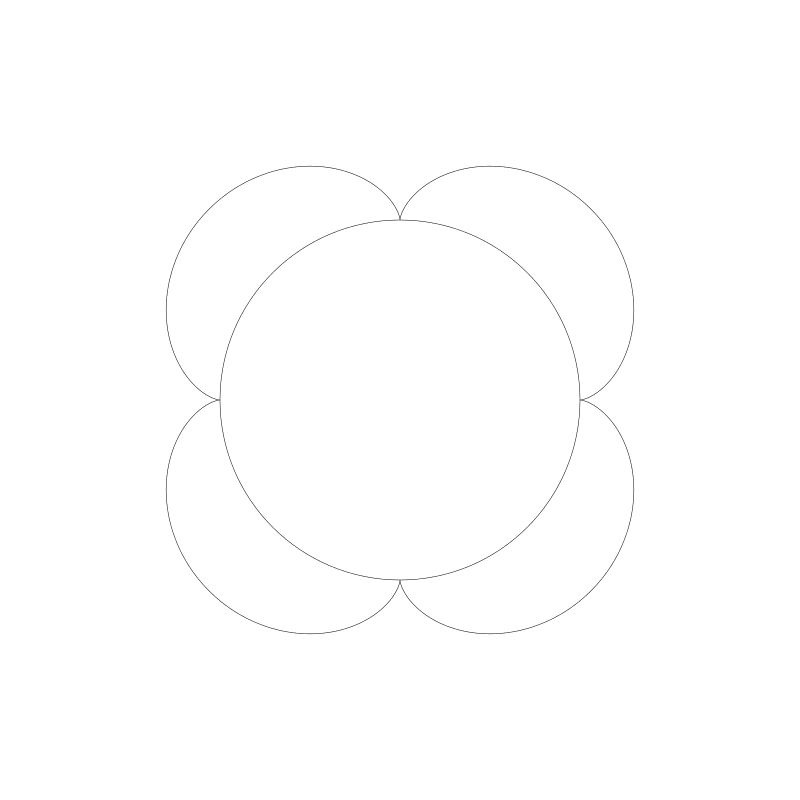
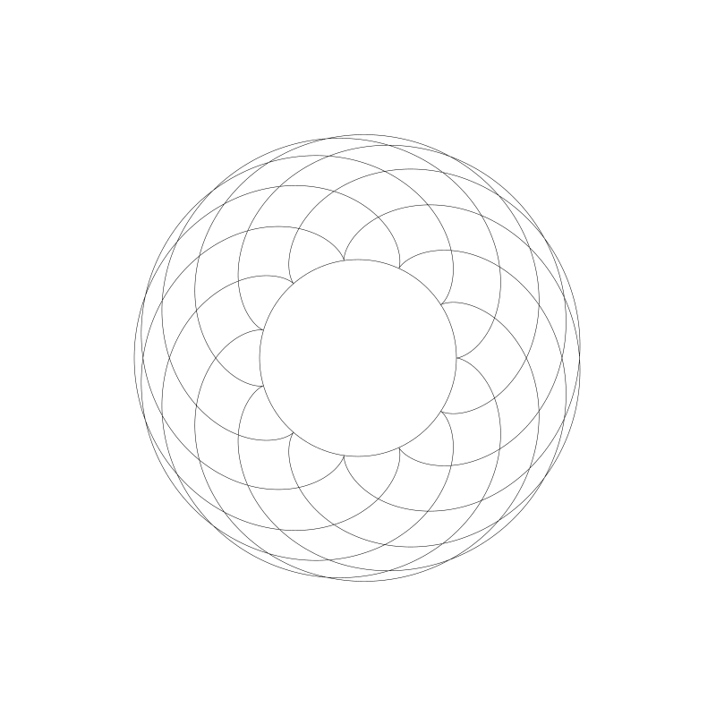
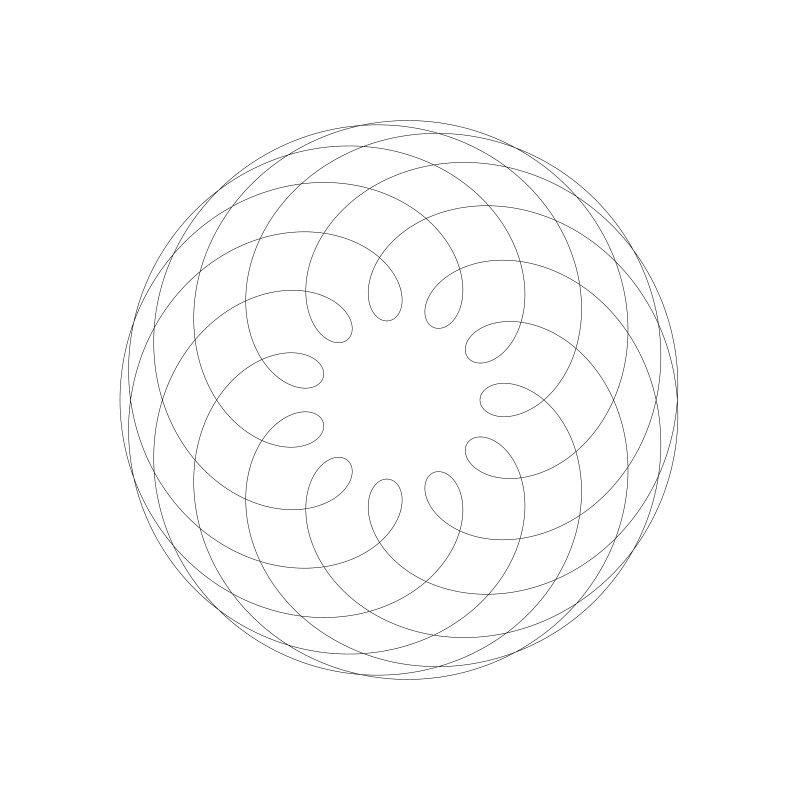
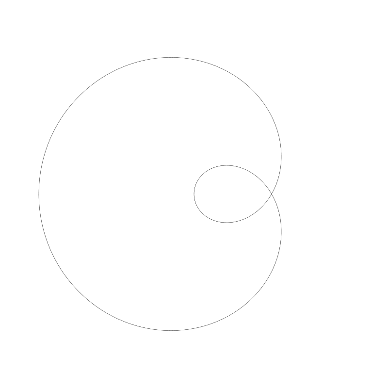
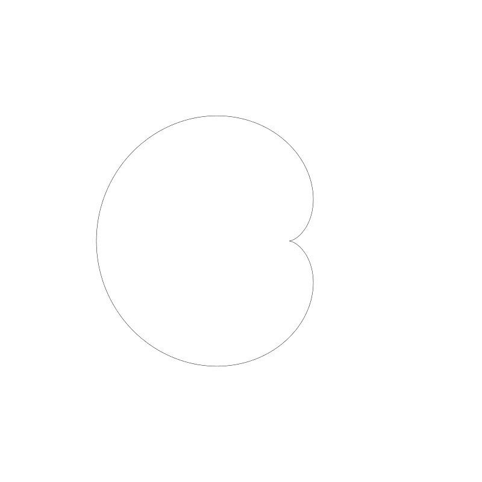
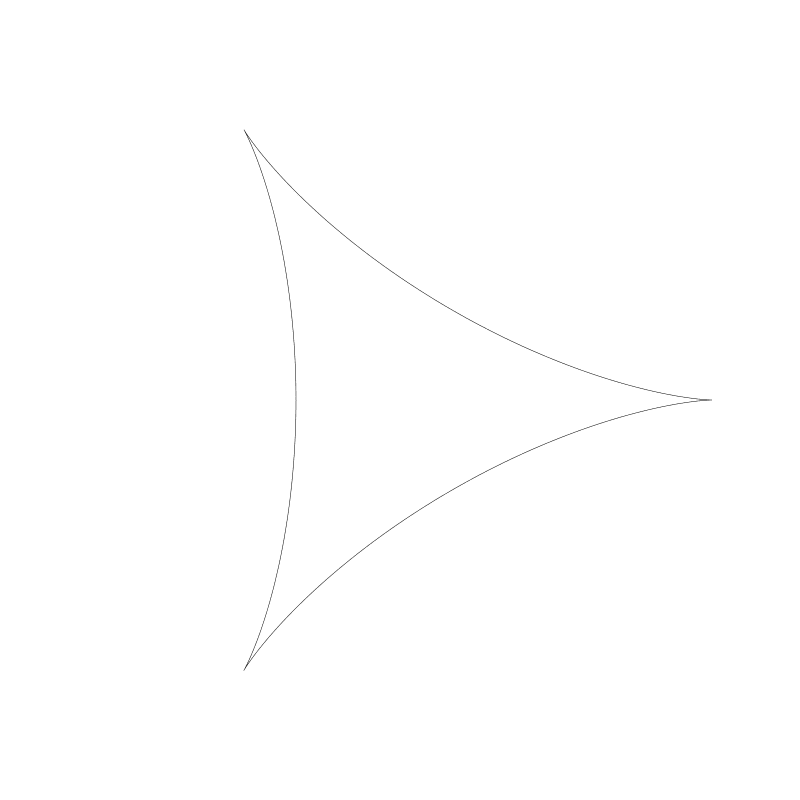

# CODING CURVES 09: ROULETTE CURVES

Chapter 9 of Coding Curves

Initially I was going to title this chapter “Trochoids and Cycloids”. I thought they were two different, but related things. As I got into it, I realized I was very confused about what each thing was. Actually a cycloid is just a very specific type of trochoid. I’ll forgive myself though. Here are the definitions of each on Wikipedia:

In geometry, a trochoid (from Greek trochos ‘wheel’) is a roulette curve formed by a circle rolling along a line.

In geometry, a cycloid is the curve traced by a point on a circle as it rolls along a straight line without slipping.

Well, not only are they not two different things, they sound almost identical from those descriptions. The devil is in the details. So let’s explore.

There are three different types of trochoids:

Common trochoids (also called cycloids!)
Prolate trochoids
Curtate trochoids
Beyond those, there are a number of related curves, most of which we’ll cover here:

Epitrochoids
Hypotrochoids
Epicycloids
Hypocycloids
Involutes
All together, these make up the family of roulette curves. We’ll cover all but Involutes in this chapter.

Now that I’ve thrown a whole bunch of meaningless words at you, let’s figure out what all these things are. Starting with trochoids.

## Trochoids

So, as described above, a trochoid is the curve formed by rolling a circle on a line. Let’s visualize that before we get into coding:


If we trace the path of that black dot on the edge of the circle…


…that new curve is a trochoid. In fact, because that drawing point lies exactly on the edge of the circle, it’s a “common” trochoid, also called a cycloid.

If we extend that point out beyond the edge of the circle, we get what’s called a prolate trochoid.


And if the point is inside, the circle, it’s a curtate trochoid.


To make these animations, I moved the circle along from left to right, figured out what its rotation should be at each location, and used sine and cosine to figure out where that point would be based on the position of the circle and its rotation. Then drew lines to that point. But there’s a somewhat more direct formula for trochoids:

```
x = a * t - b * sin(t)
y = a - b * cos(t)
```

Here, t is the angle of rotation of the circle, and can just increase infinitely, a is the radius of the circle, and b is the distance from the center of the circle to the drawing point – you could say the radius of that point. Let’s try it out.

```
width = 800
height = 300
canvas(width, height)
 
translate(0, height/2)
scale(1, -1)
moveTo(0, 0)
lineTo(width, 0)
stroke()
 
a = 20.0
b = 20.0
res = 0.05
 
for (t = 0.0; t < width; t += res) {
    x = a * t - b * sin(t)
    y = a - b * cos(t)
    lineTo(x, y)
}
stroke()
```

Since this formula is written for Cartesian coordinates, we’ll translate the y-axis to the center of the canvas and flip it.

Then we’ll draw a horizontal line through the center to represent the “floor” that the circle is rolling on. That part is optional.

We set a and b both to 20, so well get a cycloid here. We loop through from 0 to the width of the canvas as t, apply our formulas to that value, and draw a line to the resulting point.


If we raise b to 60, we get prolation.


And if we lower it to 10, we see significant curtation.


I don’t know if prolation and curtation are actual words, but they sound pretty cool.

Anyway, that’s about all there really is to trochoids. Try different values for a and b, or whatever else you want to mix it up with, but I don’t have much more to say about them. But there are several other roulette curves we have left to discuss here.

## Centered Trochoids

The next four curves we’ll look at are called centered troichoids. The difference is that rather than the circle rolling along a line, it’s rolling along another circle, either inside or outside that other circle.

The four curves are:

* Epicycloid – a curve formed by the path of a point exactly on the edge of a circle which is rolling around the outside another circle
* Epitrochoid – same as above, but the point is within or outside of the moving circle, not on the edge, the same as a curtate or prolate trochoid.
* Hypocycloid – a curve formed by the path of a point exactly on the edge of a circle which is rolling around the inside another circle
* Hypotrochoid – same as above, but the point is within or outside of the moving circle, not on the edge
In addition to these there are a number of named curves that are just one of the above with a particular ratio between the radii of the two circles. We’ll take a look at a few of them.

I find these curves to be a lot more interesting than regular trochoids, with a lot more variety. So let’s dig in.

## Epitrochoids

First, let’s visualize a circle rolling around the outside of another circle.


And let’s see what we get if we trace the path that black point is drawing.


There’s your epitrochoid!

And in fact, because that point is on the edge of the moving circles, it’s also an epicycloid!

If we move the point out a bit…


And we can move it in a bit.


Again, I made these animations by figuring out where the circle would be, drawing the circle, figuring out what it’s rotation would be at that stage of its journey and drawing the dot, and then connecting the paths of where that dot was on each frame into a curve. It was worth doing in order to show everything at work like that, but there’s a (relatively) simple formula you can just apply:

The formula for an epitrochoid:

```
x = (r0 + r1) * cos(t) - d * cos(((r0 + r1) * t) / r1)
y = (r0 + r1) * sin(t) - d * sin(((r0 + r1) * t) / r1)
```

The parameters:

* r0 is the radius of the fixed circle
* r1 is the radius of the moving circle
* t is the increasing angle
* d is the distance from the center of the moving circle to the drawing point (the same as r1 for an epicycloid).
We can use this in some code to draw an epitrochoid in one shot.

```
width = 800
height = 800
canvas(width, height)
 
translate(width/2, height/2)
 
r0 = 180
r1 = 60
d = 60
res = 0.01
 
circle(0, 0, r0)
stroke()
 
for (t = 0.0; t < PI * 2; t += res) {
  x = (r0 + r1) * cos(t) - d * cos(((r0 + r1) * t) / r1)
  y = (r0 + r1) * sin(t) - d * sin(((r0 + r1) * t) / r1)    lineTo(x, y)
}
stroke()
```

We set r0, r1 and d, and then draw the fixed circle just for reference.

Then we just loop t from 0 to 2 * PI, get an x,y point, and draw a line to that point.

And this gives us:


One thing to note here is the ratio of r0 to r1. 180:60 or 3:1. And we got three nodes. If we change r1 to 45, making the ratio 4:1, we get four nodes. (I changed d to 45 as well to match r1.)



And here, the ratio is 12:1:


If the second number in the ratio is not one, what happens? Let’s set r0 to 150 and r1 to 100. Now the ratio is 3:2.


Not surprisingly, we get one and a half nodes. To finish this curve, we’d have to go around again, having t go from 0 to PI * 4. Then we get:


If you use whole numbers, the cycle will always complete eventually. In the next example, the ratio was 11:7, so I had to go to PI * 14:




And 111:70, meaning I had to go up to 140 * PI:

It’s somewhat of a pain to work out the math manually, but you can create a function to simplify the fraction and use the denominator * PI * 2 as your for loop count. Here’s a couple of functions that will help you:


```
function gcd(x, y) {
  result min(x, y)
  while (result > 0) {
    if (x % result == 0 && y % result == 0) {
      break
    }
    result--
  }
  return result
}
 
function simplify(x, y) {
  g = gcd(x, y)
  return x / g, y / g
}
```

Just put r0 and r1 into the simplify method, to get the simplified ratio. Take the second number times 2 * PI for your for loop limit. Here’s an example…

```
width = 800
height = 800
canvas(width, height)
 
translate(width/2, height/2)
 
r0 = 111
r1 = 70
d = 70
res = 0.01
num, den = simplify(r0, r1)
 
circle(0, 0, r0)
stroke()
 
for (t = 0.0; t < PI * 2 * den; t += res) {
  x = (r0 + r1) * cos(t) - d * cos(((r0 + r1) * t) / r1)
  y = (r0 + r1) * sin(t) - d * sin(((r0 + r1) * t) / r1)    lineTo(x, y)
}
stroke()
```

In line 11, I get the simplified fraction and use the denominator in line 16 to make sure we loop enough times to complete the curve.

So far, all of these have been epicycloids. Let’s change that d parameter to make some other epitrochoids.

Making d larger than r1:



And smaller:


I stopped drawing the inner circle in these cases.

Well, you don’t need me to supply you with more examples. Just change the numbers and see what comes up.

Special Epitrochoids

A Limaçon is an epitrochoid where the two circles have the same radius. If the points is exactly on the circle, it’s a special Limaçon called a Cardioid.

Here’s a Limaçon where both radii are 80 and the value of d is 160.



And a cardioid where all three are 80.



A nephroid is an epitrochoid where the fixed circle’s radius is twice the radius of the moving circle and the point is on the edge of the moving circle. Here’s a nephroid:


Of course you can make the point distance more or less than the radius, but it’s no longer technically a nephroid at that point. Still a nice curve though:


Now let’s move on to hypotrochoids!

## Hypotrochoids

As mentioned, this is when the moving circles is rolling along the inside of the fixed circle.


And if we trace the curve that dot draws, we have a hypotrochoid:


In fact, because the point is on the edge of the circle, we also have a hypocycloid.

When the point moves out, we get something like this:


And when we move it further in…


As before, the animation was made in a brute force way with multiple steps, but there is a one-shot formula.

The formula for a hypotrochoid:

```
x = (r0 - r1) * cos(t) + d * cos(((r0 - r1) * t) / r1)
y = (r0 - r1) * sin(t) - d * sin(((r0 - r1) * t) / r1)
```

The parameters are the same as for epitrochoids. In fact the formula is almost exactly the same, just a different sign on some of the terms.

Here’s how we can use it.

```
width = 800
height = 800
canvas(width, height)
 
translate(width/2, height/2)
 
r0 = 300
r1 = 50
d = 50
res = 0.01
num, den = simplify(r0, r1)
 
for (t = 0.0; t < PI * 2 * den; t += res) {
  x = (r0 - r1) * cos(t) + d * cos(((r0 - r1) * t) / r1)
  y = (r0 - r1) * sin(t) - d * sin(((r0 - r1) * t) / r1)
}
stroke()
```

Running this code gives us:


Note that the ratio of r0 to r1 is 6:1, and we have six points. This works the same way as it did for epitrochoids.

Here’s one with the radii of 312 and 76:


Here’s the same one with the d point moved out:


And moved in…


I’m sure you can build something fun to explore these with.

Special Hypotrochoids

I’ll mention just a couple of special, named hypotrochoids. Again, they have to do with ratios between the two circles.

A deltoid is a hypocycloid with a circle ratio of 3:1.



And an astroid has a ratio of 4:1.


There’s one more interesting named ratio, that of 2:1. This is called a Tusi couple, named after the 13th century Persian astronomer who first described it. Here’s an animation of it.


As you can see, the path formed is a straight line.

If you make a bunch of these, each a bit out of phase with the last one, you get a picture like this:


Each dot is plainly moving back and forth in a straight line. But if you remove all those lines and inner circles, you get quite an illusion of a rotating circle. In fact, it looks like yet another hypocycloid!


Spirograph!

If you were a nerdy kid like me, growing up you had one of these in your house:


This one I bought brand new a few weeks ago in preparation for this chapter. It came in a very cool tin box with some drawing paper and an instruction/inspiration booklet.


It’s got one large gear which is fixed to the paper. In the old days with small pins, and now with some sticky-tack stuff (a great improvement!) And a bunch of smaller gears with holes in them. You put a pen in one of the holes and trace it around in a circle till you are back where you started.


Voila! A hypotrochoid!


Or, you put the smaller gear on the outside and get an epitrochoid. Great fun, though to be honest, I enjoy doing it in code a lot more! Here, the pen slipped and messed up my epitrochoid before I could finish it. Also, the pen was rather skippy.


As I was playing with this, I realized that you can only make “curtate” epi- and hypotrochoids. The drawing point is always less than the radius of the moving gear.


