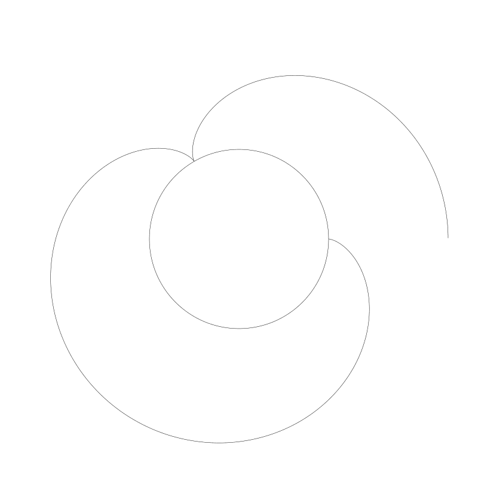
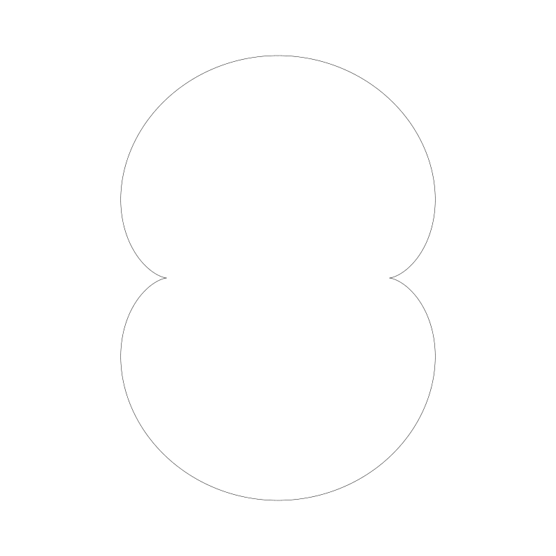
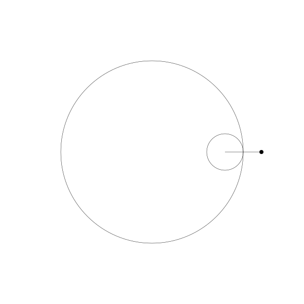
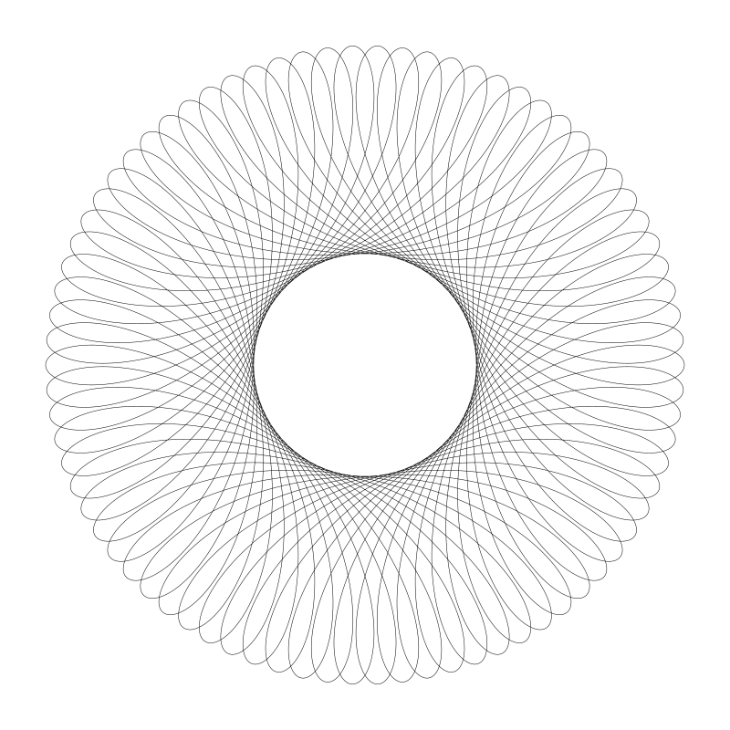

# 第九章 旋轮曲线（ROULETTE CURVES）

> 原作：Keith Peters https://www.bit-101.com/blog/2022/11/coding-curves/

> 译者：池中物王二狗(sheldon)

> blog: http://cnblogs.com/willian/

> 源码：github: https://github.com/willian12345/coding-curves

Chapter 9 of Coding Curves

Initially I was going to title this chapter “Trochoids and Cycloids”. I thought they were two different, but related things. As I got into it, I realized I was very confused about what each thing was. Actually a cycloid is just a very specific type of trochoid. I’ll forgive myself though. Here are the definitions of each on Wikipedia:

In geometry, a trochoid (from Greek trochos ‘wheel’) is a roulette curve formed by a circle rolling along a line.

In geometry, a cycloid is the curve traced by a point on a circle as it rolls along a straight line without slipping.

Well, not only are they not two different things, they sound almost identical from those descriptions. The devil is in the details. So let’s explore.

There are three different types of trochoids:

Common trochoids (also called cycloids!)
Prolate trochoids
Curtate trochoids
Beyond those, there are a number of related curves, most of which we’ll cover here:

Epitrochoids
Hypotrochoids
Epicycloids
Hypocycloids
Involutes
All together, these make up the family of roulette curves. We’ll cover all but Involutes in this chapter.

Now that I’ve thrown a whole bunch of meaningless words at you, let’s figure out what all these things are. Starting with trochoids.

曲线艺术编程系列第 9 章

一开始我本章标题我打算使用“次摆线与摆线（旋轮线）”。我想它们是两种不同类型的曲线，虽然有点儿联系。但随着了解的深入，我有点儿凌乱了。事实上摆线是一类非常特别的次摆线。我会原谅我自己的。这是维基百科上它们的定义：

在几何上，次摆线（trochoid 原自古希腊语 trochos ‘wheel’）是一个圆延一条直线滚动一圈形成的旋转曲线。

在几何上， 摆线追踪在圆上的一个点，圆延直线滚动后形成的曲线。

它们不仅不是两个不同的东西，从描述上看它们几乎是同一个东西。细节决定成败。让我们开始探索吧。

有三种不同的次摆线：

* 普通次摆线（也称摆线）
* Prolate trochoids 长幅摆线
* Curtate trochoids 短幅摆线

除此之外，还有一些相关的曲线，大概覆盖以下几种：

Epitrochoids 长短辐外摆线
Hypotrochoids 长短辐内摆线
Epicycloids 外摆线
Hypocycloids 内摆线
Involutes 渐伸线

它们组合在一起就是旋轮曲线家族了。在这章除 Involutes 渐伸线外其它都将涉及到。

讲了了大堆有的没的，先从次摆线开始，让我们一一把它们搞清楚。

## Trochoids

So, as described above, a trochoid is the curve formed by rolling a circle on a line. Let’s visualize that before we get into coding:

## Trochoids 次摆线

就像上面描述的，一条次摆线就是一个圆在直线上滚动形成的旋转曲线。在编码之前先把它可视化看看：


If we trace the path of that black dot on the edge of the circle…

如果我们追踪圆周上的那个黑点...


…that new curve is a trochoid. In fact, because that drawing point lies exactly on the edge of the circle, it’s a “common” trochoid, also called a cycloid.

... 新的曲线就是次摆线。事实上由于是绘制点依赖于圆周，所以也称为普通摆线或圆滚线。

If we extend that point out beyond the edge of the circle, we get what’s called a prolate trochoid.

如果将圆周上的点延伸超过圆周，那么我们就得到长幅次摆线（Prolate trochoid）。


And if the point is inside, the circle, it’s a curtate trochoid.

如果黑点在圆内部，它就是短幅次摆线（Curtate trochoids)。


To make these animations, I moved the circle along from left to right, figured out what its rotation should be at each location, and used sine and cosine to figure out where that point would be based on the position of the circle and its rotation. Then drew lines to that point. But there’s a somewhat more direct formula for trochoids:

为了做出这些动画，我让圆从左向右运动，计算出每个位置上圆的旋转角度，用 sine 和 cosine 基于圆的位置与旋转角度计算出点的位置，然后用这些点画出线。但对于次摆线其实有更直接的公式


```
x = a * t - b * sin(t)
y = a - b * cos(t)
```

Here, t is the angle of rotation of the circle, and can just increase infinitely, a is the radius of the circle, and b is the distance from the center of the circle to the drawing point – you could say the radius of that point. Let’s try it out.

t 是圆的旋转角度，它可以无限增长， a 是圆的半径， b 是圆心点至绘制点的距离 - 可以说是那个点的半径。让我们把它实现出来：


```
width = 800
height = 300
canvas(width, height)
 
translate(0, height/2)
scale(1, -1)
moveTo(0, 0)
lineTo(width, 0)
stroke()
 
a = 20.0
b = 20.0
res = 0.05
 
for (t = 0.0; t < width; t += res) {
    x = a * t - b * sin(t)
    y = a - b * cos(t)
    lineTo(x, y)
}
stroke()
```

Since this formula is written for Cartesian coordinates, we’ll translate the y-axis to the center of the canvas and flip it.

Then we’ll draw a horizontal line through the center to represent the “floor” that the circle is rolling on. That part is optional.

We set a and b both to 20, so well get a cycloid here. We loop through from 0 to the width of the canvas as t, apply our formulas to that value, and draw a line to the resulting point.

公式是基于笛卡尔坐标的，我们要将 y 轴移至 canvas 中心，并将 y 轴翻转。 

然后画一条直线从 y 轴中心穿过用于表示圆滚动时的“地面”。你可以画也可以选择不画。

我们将 a 和 b 都设为 20， 这样就可以得到摆线（译者者：普通旋转线）了。我们循环将从 0 至 canvas 的宽度用于变量 t, 应用公式连接至计算出的结果点。


If we raise b to 60, we get prolation.

如果将 b 提高到 60， 我们就得到了长幅摆线


And if we lower it to 10, we see significant curtation.

如果将 b 减小到 10， 我们就得到了短幅摆线。


I don’t know if prolation and curtation are actual words, but they sound pretty cool.

Anyway, that’s about all there really is to trochoids. Try different values for a and b, or whatever else you want to mix it up with, but I don’t have much more to say about them. But there are several other roulette curves we have left to discuss here.

我不知道长幅摆线和短幅摆线的用词是否准确，但听起来挺酷。

这就是全部关于次摆线的内容。试试给 a 和 b 设不同的值，或者你自己改一下其它值，我就不再再多讲了。因为下面还留有很多旋轮曲线需要探讨。

## Centered Trochoids

The next four curves we’ll look at are called centered troichoids. The difference is that rather than the circle rolling along a line, it’s rolling along another circle, either inside or outside that other circle.

The four curves are:

* Epicycloid – a curve formed by the path of a point exactly on the edge of a circle which is rolling around the outside another circle
* Epitrochoid – same as above, but the point is within or outside of the moving circle, not on the edge, the same as a curtate or prolate trochoid.
* Hypocycloid – a curve formed by the path of a point exactly on the edge of a circle which is rolling around the inside another circle
* Hypotrochoid – same as above, but the point is within or outside of the moving circle, not on the edge
In addition to these there are a number of named curves that are just one of the above with a particular ratio between the radii of the two circles. We’ll take a look at a few of them.

I find these curves to be a lot more interesting than regular trochoids, with a lot more variety. So let’s dig in.

## 中心次摆线

接下来我们要聚焦于被称为中心次摆线的四种曲线。与延直线滚动不同，它是延另一个圆滚动，可能是延那个圆圆内部滚动也可能是延那个圆的外部滚动。

四类分别是：

* Epicycloids 外摆线 - 延一个圆外部滚动的圆，圆周上某一点轨迹形成的曲线。
* Epitrochoids 长短辐外摆线 - 与上面一个一样，但这个点是不在圆周上，而是在圆外或圆内，与短幅次摆线与长幅次摆线一样。
* Hypocycloids 内摆线 - 延一个圆内部滚动的圆，圆周上某一点轨迹形成的曲线。
* Hypotrochoids 长短辐内摆线 - 与上面那个一样，但这个点是不在圆周上，而是在圆外或圆内

除此之外，还有一些曲线也是属于上面曲线的一种变体，只是形成曲线的两个圆半径有特殊的比例关系。我们稍后会看介绍一些。


## Epitrochoids

First, let’s visualize a circle rolling around the outside of another circle.

## Epitrochoids 长短辐外摆线

首先，让我们将一个圆延另一个圆外滚动可视化


And let’s see what we get if we trace the path that black point is drawing.

再追踪一下那个黑色的点的绘制结果


There’s your epitrochoid!

And in fact, because that point is on the edge of the moving circles, it’s also an epicycloid!

If we move the point out a bit…

这就是你长短辐外摆线！

事实上，由于那个点是在圆周位置上，所以这也就是外摆线！

如果将点往外移动一点...


And we can move it in a bit.

再我们往内移动一点。


Again, I made these animations by figuring out where the circle would be, drawing the circle, figuring out what it’s rotation would be at that stage of its journey and drawing the dot, and then connecting the paths of where that dot was on each frame into a curve. It was worth doing in order to show everything at work like that, but there’s a (relatively) simple formula you can just apply:

The formula for an epitrochoid:

再一次，我创建这些动画是通过计算这些圆的位置，绘制这些圆，再计算这些圆的旋转角度并绘制对应的点， 然后再连接每一帧所绘制的点路径形成曲线。为了展示动画像这么做是值得的，但是其实是有更简单的公式，你可以直接应用：

长短辐外摆线公式：

```
x = (r0 + r1) * cos(t) - d * cos(((r0 + r1) * t) / r1)
y = (r0 + r1) * sin(t) - d * sin(((r0 + r1) * t) / r1)
```

The parameters:

* r0 is the radius of the fixed circle
* r1 is the radius of the moving circle
* t is the increasing angle
* d is the distance from the center of the moving circle to the drawing point (the same as r1 for an epicycloid).
We can use this in some code to draw an epitrochoid in one shot.

参数解析：

* r0 是定圆的半径
* r1 是动圆的半径
* t  是增长的弧度
* d 是动圆中心点与绘制点之间的距离 (如果是外摆线则 r1 与 d 相同)

我们用这个公式瞬间就可以用些代码实现：

```
width = 800
height = 800
canvas(width, height)
 
translate(width/2, height/2)
 
r0 = 180
r1 = 60
d = 60
res = 0.01
 
circle(0, 0, r0)
stroke()
 
for (t = 0.0; t < PI * 2; t += res) {
  x = (r0 + r1) * cos(t) - d * cos(((r0 + r1) * t) / r1)
  y = (r0 + r1) * sin(t) - d * sin(((r0 + r1) * t) / r1)    
  lineTo(x, y)
}
stroke()
```

We set r0, r1 and d, and then draw the fixed circle just for reference.

Then we just loop t from 0 to 2 * PI, get an x,y point, and draw a line to that point.

And this gives us:

我们设置变量 r0, r1, d 然后绘制定圆仅仅是为了引用变量

接着循环 t 至 2 * PI, 得到 x， y 点，绘制一条线至那个点。

得到结果：


One thing to note here is the ratio of r0 to r1. 180:60 or 3:1. And we got three nodes. If we change r1 to 45, making the ratio 4:1, we get four nodes. (I changed d to 45 as well to match r1.)

值得注意的一点， ro 到 r1 的比例。 180:60 或 3:1。 我们得到3个结点。如果将 r1 改为 45，比例即变为 4:1 ， 我们将得到 4 个结点。（我将 d 变为 45 也是为了适配 r1）


And here, the ratio is 12:1:

下面是 12:1 :


If the second number in the ratio is not one, what happens? Let’s set r0 to 150 and r1 to 100. Now the ratio is 3:2.

如果比例的第二个数字不是1，会如何？让我们将 r0 设置为 150，r1 为 100。现在，ratio 为 3:2。



Not surprisingly, we get one and a half nodes. To finish this curve, we’d have to go around again, having t go from 0 to PI * 4. Then we get:

毫无意外，我们得到了一个半的结点（nodes）。为了完成这个曲线，我们不得不再绕一圈，需要将 t 的范围值变为 0 到  PI * 4。然后得到结果：


If you use whole numbers, the cycle will always complete eventually. In the next example, the ratio was 11:7, so I had to go to PI * 14:

如果你使用整数，循环总是会完成的。在下一个例子中，比如是 11:7 ，所以不得不将 t 结束值调整为 PI * 14：


And 111:70, meaning I had to go up to 140 * PI:

It’s somewhat of a pain to work out the math manually, but you can create a function to simplify the fraction and use the denominator * PI * 2 as your for loop count. Here’s a couple of functions that will help you:

如果是 111:70， 意味着我需要 t 结束范围调整至 140 * PI:

手动算这个有点痛苦，你可以创建个函数简化比例计算并用分母 * PI * 2 作为循环次数。 下面有两个有用的函数

```
//（译者注： gcd 即 greatest common divisor 求最大公约数）
function gcd(x, y) {
  result min(x, y)
  while (result > 0) {
    if (x % result == 0 && y % result == 0) {
      break
    }
    result--
  }
  return result
}
 
function simplify(x, y) {
  g = gcd(x, y)
  return x / g, y / g
}
```

Just put r0 and r1 into the simplify method, to get the simplified ratio. Take the second number times 2 * PI for your for loop limit. Here’s an example…

仅需要将 r0 和 r1 传入 simplify 函数，得到简化后的比例。将结果的第二个数字 * 2 * PI 做为循环的结束条件。下面是例子...

（译得注：简化比例式，最后将分母 * 2 * PI）

```
width = 800
height = 800
canvas(width, height)
 
translate(width/2, height/2)
 
r0 = 111
r1 = 70
d = 70
res = 0.01
num, den = simplify(r0, r1)
 
circle(0, 0, r0)
stroke()
 
for (t = 0.0; t < PI * 2 * den; t += res) {
  x = (r0 + r1) * cos(t) - d * cos(((r0 + r1) * t) / r1)
  y = (r0 + r1) * sin(t) - d * sin(((r0 + r1) * t) / r1)    
  lineTo(x, y)
}
stroke()
```

In line 11, I get the simplified fraction and use the denominator in line 16 to make sure we loop enough times to complete the curve.

So far, all of these have been epicycloids. Let’s change that d parameter to make some other epitrochoids.

Making d larger than r1:

用化简后的分数的分母保证循环足够多闪以形成完整的曲线。

到目前为止，全部是外摆线(圆外旋轮线)。 让我们改变参数 d 来创建一些其它的长短幅外摆线。

让 d 大于 r1:


And smaller:

d 小于 r1:


I stopped drawing the inner circle in these cases.

Well, you don’t need me to supply you with more examples. Just change the numbers and see what comes up.

在这些例子中我没有再把内圆画出来。

你无需让我再提供更多的例子了。只需要改变数字看看能得到啥结果。

## Special Epitrochoids

A Limaçon is an epitrochoid where the two circles have the same radius. If the points is exactly on the circle, it’s a special Limaçon called a Cardioid.

Here’s a Limaçon where both radii are 80 and the value of d is 160.

## 特殊长短幅外摆线

蚶线是长短幅摆线的一种，生成它的两个圆半径相等。如果两个点在圆内，则它是特殊的蚶线被称为 Cardioid 心形曲线。

下面是一个蚶线，两个半径都是 80 ， d 值设为 160。


And a cardioid where all three are 80.

心形线三个值都设为 80


A nephroid is an epitrochoid where the fixed circle’s radius is twice the radius of the moving circle and the point is on the edge of the moving circle. Here’s a nephroid:

肾脏线是长短幅外摆线的一类，它的定圆半径是动圆半径的2倍，且那个点在动圆的圆周上。这是肾脏线的图




Of course you can make the point distance more or less than the radius, but it’s no longer technically a nephroid at that point. Still a nice curve though: 

你也可以让那个动圆上的点不在动圆圆周上，但却不再是肾脏线了，但依然是很不错的曲线。


Now let’s move on to hypotrochoids!

现在让我们把视线转向长短幅内摆线！

## Hypotrochoids

As mentioned, this is when the moving circles is rolling along the inside of the fixed circle.

## 长短幅内摆线

正如前面提到的，长短幅内摆线其实就是动圆是延定圆内部滚动的。


And if we trace the curve that dot draws, we have a hypotrochoid:

我们跟踪那个曲线上的绘制点，就得到了长短幅内摆线


In fact, because the point is on the edge of the circle, we also have a hypocycloid.

When the point moves out, we get something like this:

事实上，由于绘制点在动圆圆周上，它就是内摆线。

当绘制点移动到动圆外部， 得到的就是：



And when we move it further in…

当绘制点移到动圆内部...


As before, the animation was made in a brute force way with multiple steps, but there is a one-shot formula.

The formula for a hypotrochoid:

像之前一样，这个动画是用野路子创建的，其实是有简单公式可以实现。

长短幅内摆线公式：

```
x = (r0 - r1) * cos(t) + d * cos(((r0 - r1) * t) / r1)
y = (r0 - r1) * sin(t) - d * sin(((r0 - r1) * t) / r1)

```

The parameters are the same as for epitrochoids. In fact the formula is almost exactly the same, just a different sign on some of the terms.

Here’s how we can use it.

参数与长短幅外摆线类似，事实上公式也基本相同，仅有几项符号不同。

下面是使用方法。

```
width = 800
height = 800
canvas(width, height)
 
translate(width/2, height/2)
 
r0 = 300
r1 = 50
d = 50
res = 0.01
num, den = simplify(r0, r1)
 
for (t = 0.0; t < PI * 2 * den; t += res) {
  x = (r0 - r1) * cos(t) + d * cos(((r0 - r1) * t) / r1)
  y = (r0 - r1) * sin(t) - d * sin(((r0 - r1) * t) / r1)
}
stroke()
```

Running this code gives us:

代码运行结果：


Note that the ratio of r0 to r1 is 6:1, and we have six points. This works the same way as it did for epitrochoids.

Here’s one with the radii of 312 and 76:

注意 r0 与 r1 比例是 6:1, 拥有 6 个点。比例的作用原理与之前的长短幅外摆线一样

下面是半径 312 和 76 (译者注：这里 r0 为 312，r1，d 都为 76)：


Here’s the same one with the d point moved out:

将绘制点 d 值设大一点移出动圆圆周：



And moved in…

移入动圆内...


I’m sure you can build something fun to explore these with.

如果你不断尝试，我保证你能发掘出更多有趣的图形。
## Special Hypotrochoids

I’ll mention just a couple of special, named hypotrochoids. Again, they have to do with ratios between the two circles.

A deltoid is a hypocycloid with a circle ratio of 3:1.

## 特殊长短幅内摆线

我将再介绍两种特殊长短幅内摆线。我们需要再次调整两个圆的大小比例。


And an astroid has a ratio of 4:1.

这是星状图的比例 4:1


There’s one more interesting named ratio, that of 2:1. This is called a Tusi couple, named after the 13th century Persian astronomer who first described it. Here’s an animation of it.

还有一个更有趣的比例 2:1. 被称为图斯双圆，以描述它的13世纪波斯天文学家名字而命名。下面是演示它的动画。


As you can see, the path formed is a straight line.

If you make a bunch of these, each a bit out of phase with the last one, you get a picture like this:

正如你所看到的，形成了一条直线。

如果你多创建几个动圆，并将每个动圆的绘制点相位与前一个相比再往后调整一点，你将会得到如下图：


Each dot is plainly moving back and forth in a straight line. But if you remove all those lines and inner circles, you get quite an illusion of a rotating circle. In fact, it looks like yet another hypocycloid!

每个点延直线来回运动。如果你将所有线条和动圆移除，你会得到一个旋转的圆的错觉。事实上，它看起来像是另一个内摆线


Spirograph!

If you were a nerdy kid like me, growing up you had one of these in your house:

## 螺旋图！

小时候如果你像我一样比较呆，那么你可能也会像我这样拥有下面这些东西（译者注：可能我不够呆，反正我没有过，倒是见过同学有类似的东西--!）：


This one I bought brand new a few weeks ago in preparation for this chapter. It came in a very cool tin box with some drawing paper and an instruction/inspiration booklet.

这是几个星期前为写这一章内容我新买的。它很酷，锡盒子包装内包含了一些绘制用的纸还有使用说明和灵感小册子。


It’s got one large gear which is fixed to the paper. In the old days with small pins, and now with some sticky-tack stuff (a great improvement!) And a bunch of smaller gears with holes in them. You put a pen in one of the holes and trace it around in a circle till you are back where you started.

大的齿轮固定在纸上。过去用的是小钉子，现在用的是用粘粘的东西（sticky-tack 多伟大的改进！）固定住，还有一些小的多孔的小齿轮。你将笔插进这些小孔中，让它延着大圆旋转一圈。


Voila! A hypotrochoid!

瞧！一个长短幅内摆线


Or, you put the smaller gear on the outside and get an epitrochoid. Great fun, though to be honest, I enjoy doing it in code a lot more! Here, the pen slipped and messed up my epitrochoid before I could finish it. Also, the pen was rather skippy.

如果你将小齿轮摆外面滚一轮，它就是长短幅外摆线。相当有趣，说实施，我还是更喜欢用代码实现它。下面是绘制过程中笔滑了，这让线条看起来有点儿乱。笔触也断断续续的。


As I was playing with this, I realized that you can only make “curtate” epi- and hypotrochoids. The drawing point is always less than the radius of the moving gear.

当我玩的过程中才发现，它只能画出短幅摆线和内摆线。绘制点只能是在移动的齿轮内。


