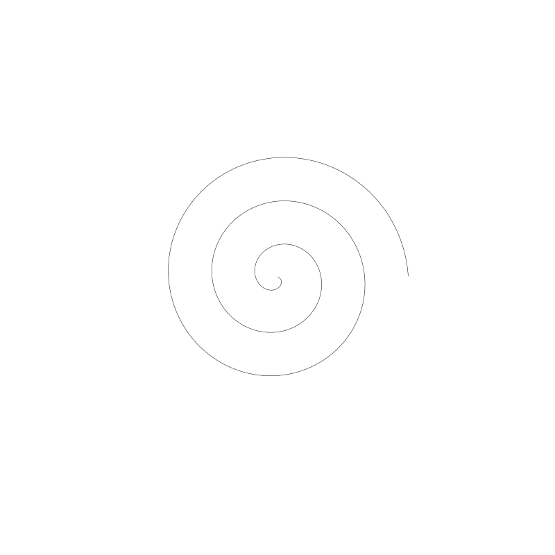
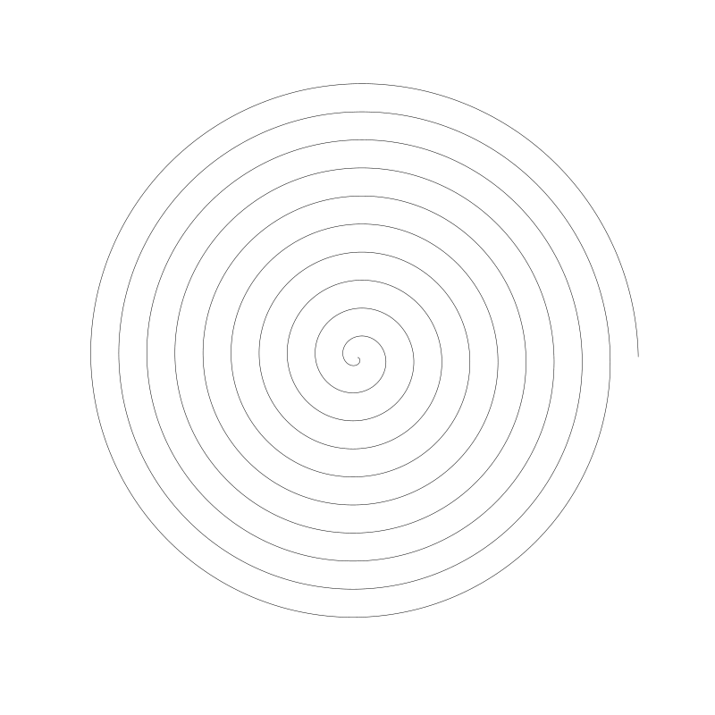
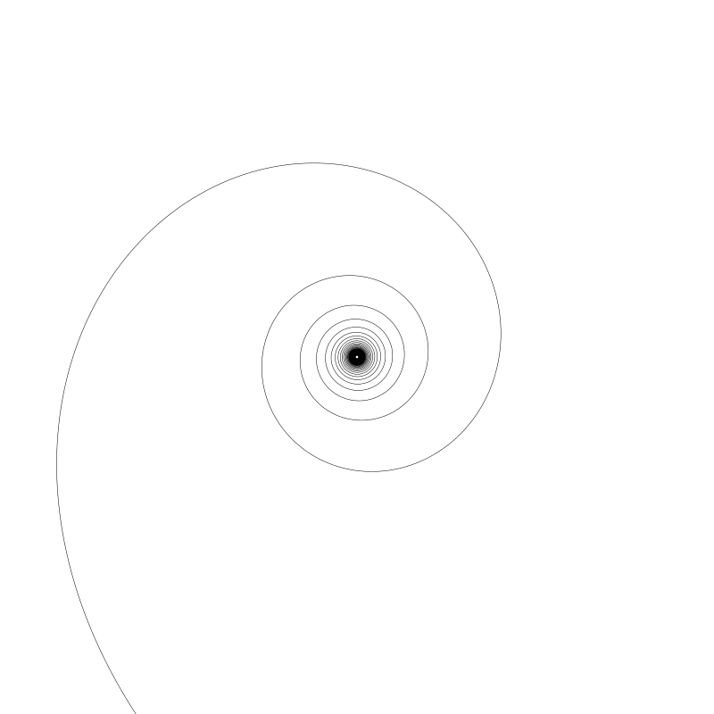
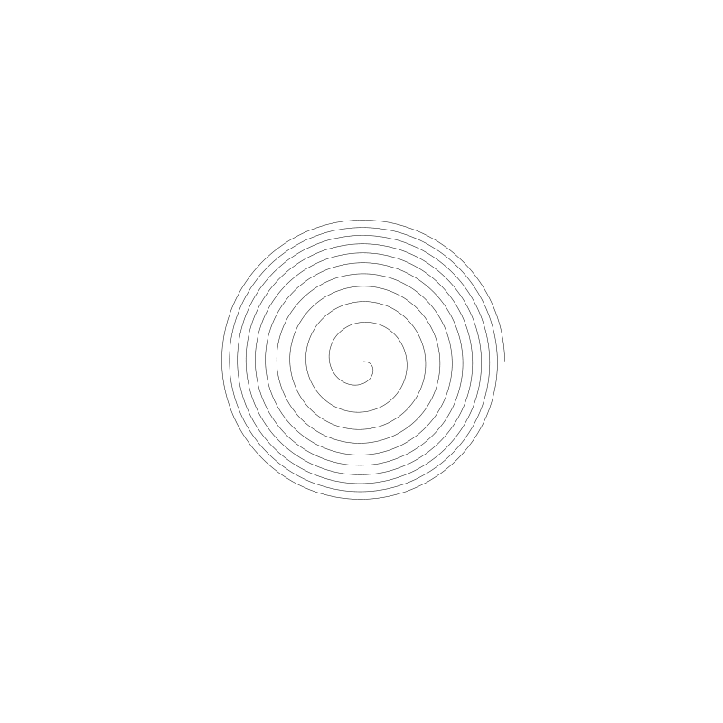

# CODING CURVES 10: SPIRALS

Chapter  of Coding Curves

# 第十章 螺旋（SPIRALS）

曲线艺术编程系列第 9 章

Chapter 10 of Coding Curves

OK, let’s talk spirals.

Spirals are a lot like circles, in that they are a set of points with a distance relationship to a fixed center point. But unlike circles, where that distance is fixed, with spirals, that distance varies. The distance from a given point to the center point is generally a function based on the angle between those two points. So you’ll usually have some function that takes in an angle and returns a radius. Then you can use the radius and angle to find the x, y position of the point at that angle. There are many different spiral formulas, which give you spirals that have a different look and feel. Let’s start with one of the most basic spirals.

Side note: a circle is sometimes called a “degenerate” spiral. No disrespect intended. It just means that a circle follows the “rules” of spirals but isn’t really what we would think of as a spiral. Like a triangle where one side has a length of zero. All the triangle math generally works fine, but it’s really just a line to our eyes.

聊聊螺旋线。

螺旋非常像圆，它是一系列点到定圆中心点的距离之间的关系。与圆不同的是，圆的点与中心点距离固定不变，而螺旋上的点与中心点距离是变化的。给定点与中心点的距离通常是由一个基于两点之间的角度计算得到。所以通常你需要一些函数用于传入角度参数返回半径。然后你可以通过半径与角度找到那个角度上对应的点。有很多不同的螺旋公式，会得到不同形态的螺旋。让我们从最基础的一个开始。

注：圆有时候也被称为“退化”的旋转。没有冒犯的意思，只是说圆遵循螺旋的“规则”但又不是通常我们想象中的螺旋。就像一个三角形其中某一边的长度为 0。所有三角形数学计算通常都能正常工作，但在我们眼中它却成了一条线。

## The Archimedean Spiral

## 阿基米德螺旋


As you can see, on each cycle, the radius grows by a fixed amount. Here’s the formula for this spiral:

如你所见，每个圆的半径都会定量固定增加。下面是这个螺旋线的公式：

```
r = a * t
```

Here, t is the angle and a is some constant, in the case of the above image, it’s 5. The product of these two is the radius at the angle t. If we increase t to 10, we get this:

此处，t 是弧度 a 是某个常量，上图中 a 设为 5。 两者相乘的结果即是这个 t 角度上的半径值。如果将 6 增加到 10，我们会得到如下 ：


Now you can see that the a constant determines the spacing between each cycle of the spiral. In this case, it’s grown outside the bounds of the canvas.

Now when we are drawing spirals, we have to decide how many cycles we’ll be drawing. How many times are we going to go around? If t goes from 0 to 2 * PI, we have one cycle:

现在如你看到的这样，常量 a 决定了螺旋内每个圆之间的间距。在这个例子中，螺旋都旋到 canvas 边界外了。

当我们绘制螺旋时，我们首先需要决定绘制多少个圈。要绕多少圈？如果 t 从 0 到 2 * PI，我们得到的是一个圈:


That’s one cycle. As you can see, for this spiral, the curve starts in the center and expands out from there. Three cycles means t goes from 0 to 2 * PI * 3.

你可以看到这个螺旋有一个圈，螺旋曲线从中心开始向外扩展。三个圈表示 t 从 0 到 2 * PI * 3。 



Given all that, we can start to put together a spiral playground, like so:

有了上面这些，我们可以将它们合在一起创建一个螺旋线的调式器，像这样：

```
width = 800
height = 800
canvas(width, height)
translate(width / 2, height / 2)
 
cycles = 10
res = 0.01
 
for (t = res; t < 2 * PI * cycles; t += res) {
  r = archimedean(5, t)
  x = cos(t) * r
  y = sin(t) * r
  lineTo(x, y)
}
stroke()
 
function archimedean(a, t) {
  r = a * t
  return r
}
```

We say we want 10 cycles, so the for loop goes to 2 * PI * cycles. We call the archimedean spiral function, passing in 5 as the constant, and t as the angle. That gives us a radius, which we use with the angle to find an x, y point and draw a line to it.

Throughout the chapter, I’ll be showing you other functions for different spirals. You can just replace the call to archimedean with the other functions.

The above code gives us this image:

比如我们希望有 10 个圈， 循环结束点就是 2 * PI * cycles。调用 archimedean 螺旋函数，传入 5 作为它的常量， t 作为弧度。它会返回给我们一个半径值，我们可以用它和弧度计算出对应点的 x, y 坐标并用线连接。



In the drawing api I’m using, angles that increase positively go around in a clockwise direction. So this spiral is going around clockwise from the center. This may be different for you. It depends on how your drawing api handles angles. To reverse the direction, you have a few options:

A. Use scale to flip the canvas

我使用的绘图 api ， 角度正向增加是顺时针方向。所以这个螺旋从中心顺时针绕出来。这可能与你正在使用的编程平台内表现有所不同。这取决于你使用的绘图 api 如何处理角度方向。为了翻转旋转方向，有几种方式：

A. 用 scale 翻转 canvas

```
scale(1, -1)
```

B. Change the code that creates the points to make one axis negative. For example:

B. 改变代码创建点的方式，使其中一个轴为负 例如： 


```
x = cos(t) * r
y = -sin(t) * r
```

C. Change the for loop to go backwards:

C. 将循环的方向变反

```
for (t = -res; t > -2 * PI * cycles; t -= res) {
```

Doing any of those should get you going around the other way.

One last thing…

One thing to note in the code, is that I defined the for loop to start with res, not 0.

任意一种方式都可以让你的螺旋方向改变。

还有最后一件事...

代码中值得注意的一点是循环起始点是 res 而不是 0

```
for (t = res; t < 2 * PI * cycles; t += res) {
```

To see why I did that, let’s move to our next spiral.

想知道为我为啥这么做，我们需要从下一种螺旋线寻找答案。

## The Hyperbolic Spiral

## 双曲线螺旋 Hyperbolic Spiral


This spiral looks quite different from the first one. Each cycle is not a fixed distance from the past one. You’d be tempted to say that the distance increases on each cycle, but hold that thought.

Here’s the function for the this spiral:

这个螺旋与第一个螺旋看起来非常不同。上个螺旋内每个圈是等距的。你可能会说每个圈之间的距离都增长了，还是等等别别下结论。

下面这个函数是这个螺旋准备的：

```
function hyperbolic(a, t) {
  r = a / t
  return r
}
```

Not very different at all. We’re just dividing a by t rather than multiplying. For the above image, I passed in an a value of 1000. If I bring a down to 10, we get a tiny little spiral like this:

也没有特别大的不同。我们用除代替了乘。上图我传入了 1000 。如果我将值降到 10， 我们会得到一个很小的螺旋线像这样：


It should also now be obvious why I started the for loop with res rather than 0. If t is 0, then we’d be in a divide-by-zero situation here, which would cause some problems. This might cause a crash, or might just give you a radius of NaN (not a number), which would not be very useful. So we start with a number we know will not be zero.

Another thing to note about this spiral is the direction it goes. I drew the above spiral with 20 cycles. If I move that down to 5 (moving a back up to 1000), we get:

这就很明显了 for 循环以 res 开始而不是 0， 如果是 0，那么就会出现除数为 0 的这种情况，这会导致某些问题。也许会崩溃，或者半径为 NaN (not a number) 值, 这没什么用。所以我们将起始值设为非 0。

另一个值得注意的事是螺旋线的旋转方向。上图我画了 20 个圈。如果降为 5（a 变回 1000），将得到：


Maybe you can now see that the spiral starts large and grows smaller as t increases. With 100 cycles, the spiral starts to jam up in the center.

你现在可能看到随着 t 值增长螺旋变的很大但，但增长的速度慢小了。当有 100 个圈，螺旋中心位置开始有些堵了。



So, as I said earlier, at first glance the radius seems to be growing on each cycle, but now you can see that it’s actually starting out large and getting smaller on each cycle.

Let’s move on.

就如我之前所说，咋一看每个圈半径都在增长，但你现在可以观察到实际上是开始很大，圈与圈之间的半径值逐渐变小了。

## The Fermat Spiral

## 费马螺线


This is a nice one. Here’s the formula:

这种螺旋线很漂亮。这是公式：

```
function fermat(a, t)  {
    r = a * pow(t, 0.5)
    return r
}
```
Here we are multiplying a by t to the power of 0.5. This assumes you have a function called pow that raises it’s first argument to the power of the second argument. Depending on your language, you might also be able to say:

这里我们将 a 乘以 t 的 0.5 平方。假定你的编程语言内置了 pow 函数计算第一个参数的第二个参数次幂。根据你使用的编程语言，它可能是这样：

```
r = a * (t^0.5)
```

or

或这样：

```
r = a * (t**0.5)
```

The above image was drawn with 20 cycles and an a of 20. Drawn with 10 cycles, we get:

上一张图 a 设为了20 绘制了 20 圈。 绘制 10 圈 结果如下：



So you can see this spiral draws from the center outwards. It starts out with a relatively large space between each cycle, but that space reduces slightly the further you go out.

Going back to 20 cycles and changing a to 40:

可以看到螺旋线是从内向外绘制的。 一开始圈与圈之间的间距比较大，但越往外面圈的间距越来越小

圈数改回 20 个圈 a 设为 40：


We see that the distance between cycles has increased.

Here we are with 100 cycles and an a of 15.

我们能看到间距有所增加。

100 个圈 a 设为 15。


At the end, there is hardly any space at all between each cycle. And we have some interesting moiré patterns going on there.

最终，每圈之间已很难有间距。而我们得到了一些有趣的摩尔纹图案
## The Lituus Spiral

## 连锁螺线 Lituus Spiral


This looks a lot like the Hyperbolic spiral, but the formula is a lot closer to the Fermat spiral:

它看起来像双曲螺线，但公式却更接近于费马螺线：

```
function fermat(a, t)  {
    r = a * pow(t, -0.5)
    return r
}
```
We just used a power of -0.5 rather than 0.5. The above spiral was drawn with 20 cycles and an a of 500. Here it is with 10 cycles:

我们公需要将指数中的 0.5 改为 -0.5。上图螺旋线绘制了 20 个圈 a 的值为 500。 下面是 10 个圈


So you can see that this is another one that draws in towards the center. Going back to 20 cycles, if we lower a to 50, we get:

你可以看到这是另一种向内绘制的螺旋线。 改回 20 圈， a 设为 50，得到：


The word “lituus” originally meant a curved staff, wand or horn. The above image explains best how this spiral got its name.

If we raise a to 1000, we get:

词 “Lituus” 原意是弯曲的杖，弯曲的魔法棒或角。上图很好的解析了它名字的由来。

将 a 升到 1000, 可以得到：


So you could say a lower a causes the spiral to get sucked in to the center more quickly.

So many spirals! Let’s do some more!

可以这样讲，a 值越低，螺旋吞噬进中心越快。

还有很多类型的螺旋线，来，继续！

## The Logarithmic Spiral

## 对数螺旋 Logarithmic Spiral


This has a feel of being the opposite of the Fermat spiral. The spacing starts quite small, and increases the further it goes out. The formula:

它有点像反费马螺旋。一开始间隔挺小，越往外越大。公式：


```
function logarithmic(a, k, t)  {
    r = a * exp(k * t)
    return r
}
```

This one is a bit more complex than the others we’ve seen. First off, it has two parameters besides the t angle. And we’ll have to get into the exp function.

We actually touched on exp in the Harmonographs chapter. To recap, we have a mathematical constant, e known as Euler’s Number. It’s value is roughly 2.71828. When working with logarithms, it’s quite common to raise e to a power. So some math libraries have included a function to do that directly, often called exp. For a concrete example, let’s take a look at Javascript. It has e as a constant, Math.E. So to get e to the power of 2, you could say:

公式看起来比之前遇到过的要复杂一点。t 前有两个参数。我们先从 exp 函数开始学习。

我们实际上在谐振波图(Harmonographs) 这一章见过它. 回顾一下，有一个数学常数 e ，也称欧拉数。它的值大概是 2.71828。 当我们在与对数打交道时，常将 e 乘方。所以很多数学程序库会直接提供一个函数， 常被命名为 exp。 举个具体的例子，在 javascript 中，有常用 e, Math.E。为了计算 e 的 2 次幂，就得像下面这样做：

```
Math.pow(math.E, 2)
```

But it also has an exp function, so you can do the exact same thing by saying:

但其实已经有一个叫 exp 的函数了，你可以直接用：

```
Math.exp(2)
```
So with this line,
代码中的公式也得改成，

```
r = a * exp(k * t)
```

we are multiplying a by e raised to the power of k * t. In the above image, I had a set to 0.5 and k at 0.05.

If we raise a to 1, we get a much larger spiral, though it looks pretty much the same.

我们用 a 乘以 e 的 k * t 次幂。上面的图，我得将 a  设成 0.5 且 将 k 设为 0.05。

如果将 a 变为 1，我们将得到一个相当大的螺旋线，虽然它们看起来很像。


Bringing a down to 0.25 gives us:

a 设为 0.24 后：


Again, similar look and feel, but smaller overall.

I’ll reset a back to 0.5 and move k up to 0.1.

还是挺像的，但更小一点儿了。

将 a 重置为 0.5 并且将 k 升到 0.1 


Now you can see it expands much faster. Bringing k down to merely 0.04 has a much bigger effect than I expected:

你可以看到扩张的更快了。将 k 设为 0.04 它对结果的影响远超我的预期


## The Golden Spiral

## 黄金螺旋（Golden spiral）


This spiral increases by a rate equal to the “golden ratio”, approximately 1.618. Here’s the formula:

这类螺旋增长率叫“黄金比例”，大概接近 1.618。它的公式是：

```
function golden(t) {
    r = pow(PHI, 2 * t / PI)
    return r
}
```

First, note that this function has no parameters other then t. It’s hard-coded with the value PHI, which is the golden ratio. Many math libraries have that value built in as a constant. If yours doesn’t, you can approximate it by saying

首先，这个函数除了 t 之外没有其它参数。 PHI 黄金比例值是硬编码在函数内的。很多数学程序库都有黄金比例这个内建常量。如果你没有，将这近似的设置为：

```
PHI = 1.61803
```

Or, if you want to be exact, you can use the following to get the exact value:

或者你想更精确一点，你可以像下面这样写得到精确值：

```
PHI = (1 + sqrt(5) ) / 2
```

Then save that as a constant somewhere and use it as needed.

You’ve probably seen this spiral in images like this:

然后放在某个地方按需引用即可。

你很可能已经见过这种螺旋图了：


By Romain – Own work, CC BY-SA 4.0, https://commons.wikimedia.org/w/index.php?curid=114415511

This is actually the Fibonacci spiral. The size of each square the sum of the next two next smaller squares and each curve is made up by a 90-degree arc centered in one corner of each square. It isn’t precisely the same as the Golden spiral, but very close.

这实际是一个斐波那契螺旋。方块大小是下两个方块之和且每个方块内的曲线是一个角为中心 90 度生成弧线。它不是精确的黄金螺旋，但很接近了。

… and more

还有更多

Peruse this list of spirals if you want to find some other interesting ones to try out:

仔细阅读这个螺旋线列表，也许你能找到其它更有趣的

https://en.wikipedia.org/wiki/List_of_spirals

Here’s another good one:

还有：

https://mathworld.wolfram.com/topics/Spirals.html

## Spirangles
## 螺旋角（Spirangles）


I ran across this term while writing this chapter. Essentially it’s a spiral made by straight line segments. By changing the angle between each segment, you can form different shapes.

These are very easy to make with our existing setup. The above one was made with the archimedean function, an a of 3, and 20 cycles. The trick is reducing the resolution. For this one, I set:

在写这一章的时候我偶然发现了这个词 (Spirangles)。本质上它是由直线线段组成的螺旋。通过改变每个线段的角度，你可以将它们组成不同的形状。

在已有的基础上实现它非常容易。上面中有个例子使用的是 archimedean 函数，a 为 3，并且 cycles 为 20。 窍门是减低分辨率 res 上图的效果我是将 res 设为了发下值：

```
res = PI * 2 / 3
```

Now on each step of the for loop, t will increase by one-third of a circle. Here are some others, dividing by 4 and 5.

现在，循环中每一步，t 会增加 1/3 个圆。 以下是其它， 除 4 和 除 5 的效果：


You get the idea. You might want to experiment with some of the other functions too. Some of them are quite satisfying.

窍门你已经知道了。你可能想在其它方法上试试。其中一些通过这样修改后变的让人相当满意。

## Sunflowers

## 葵花螺旋（Sunflowers）

No discussion of spirals would be complete without talking about sunflowers. Just do a search on some combination of the terms, sunflowers, fibonacci, and spiral and you’ll get a ton of reading material and pretty pictures. What it all means, I’ll leave to others, but it’s fun to draw the kind of spiral you find looking at sunflowers. The golden ratio is built right into this pattern, and here’s what it looks like:

若是没有讨论葵花螺旋，那么螺旋的议题就不完整。试试用葵花，斐波那契与螺旋的组合搜索，你能得到巨量的阅读材料与漂亮图片。我的意思是，除了绘制葵花螺旋这类有趣的螺旋线外，其它的螺旋我就让你自己去探索了。黄金比例在这个图中是天生的，图是这样：


You can see not one, but many, many spirals going in and out at different angles. Here’s the code I used to make this (i.e. the pseudocode that represents the actual code I used):

你可以看到不止一条螺旋，有许多螺旋以不同角度进进出出。我常用下面的代码实现（还是以伪代码展示）：

```
width = 800
height = 800
canvas(width, height)
translate(width / 2, height / 2)
 
count = 1000
for (i = 0; i < count; i++) {
  percent = i / count
  size = 14.0 * percent
  r = 380.0 * percent
  t = i * PI * 2 * PHI
  x = cos(t) * r
  y = sin(t) * r
  circle(x, y, size)
  fill()
}
```

We choose a count for how many “sunflower seeds” we want to draw. Here it’s 1000.

Then we loop through using i and get a percent value that it i / count.

The size value is the radius of each “seed”. As i approaches count, percent will approach 1, so size will approach a maximum of 14.

Similarly r is the radius at which to place each seed. It will max out at 380, just shy of half the width of the canvas.

We calculate t using line 11 there, which is just a magical sunflower Fibonacci formula. Seriously though, read up on it if you want to know more. With an angle and radius, we can get an x and y and draw the seed there with the current size.

And that’s about all I have to say about spirals for now. Catch you next time!

我们用变量 count 代表想要绘制多少“葵花籽”。这里 count 设为了 1000.

然后我们循环 用 i / count 得到一个百分比值。

变量 size 是每颗“种子”的半径。当 i 越接近 count 时，percent 的值会越接近 1，因此 size 的值也会越接近最大值 14。

同样 r 用于表示种子分布的半径。它最高值是 380， 仅比 canvas 宽度的一半小一点点。

我们用 `t = i * PI * 2 * PHI` 计算出 t ， 它就是神奇的葵花斐波那契公式。说真的，你想知道更多，那就认真看一下。有了角度和半径，我们就可以得到 x 和 y 坐标，然后根据种子自己的大小绘制种子了。

到目前为止我想说的螺旋线就这么多了。下回见！


