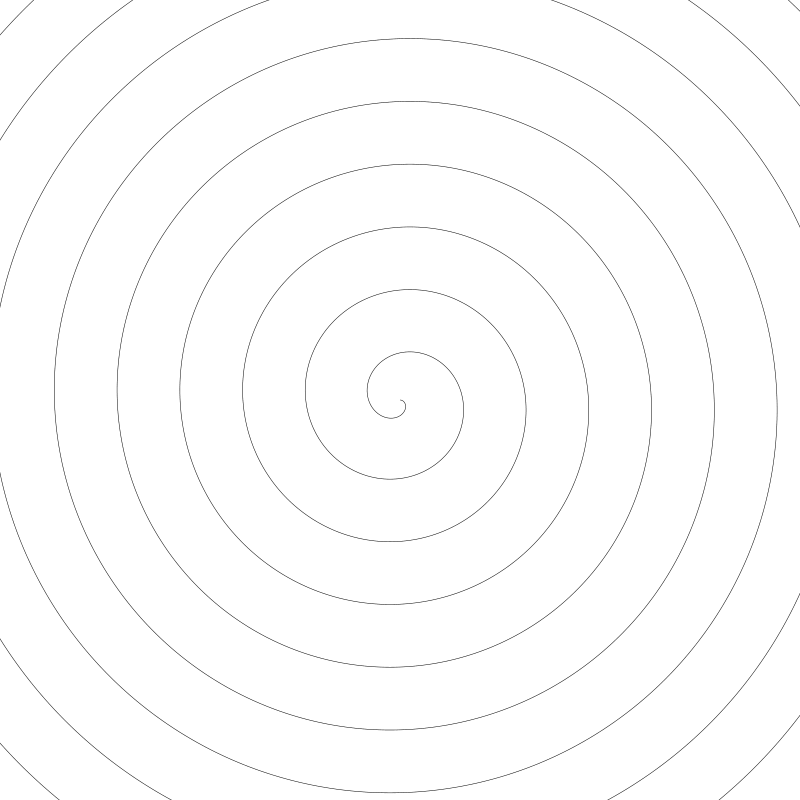
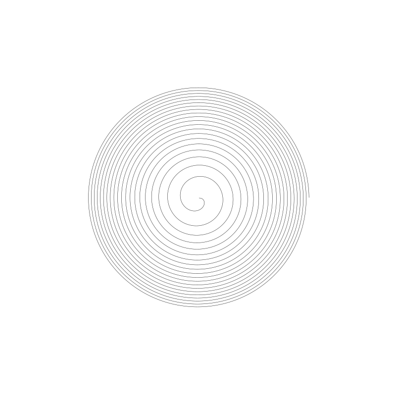
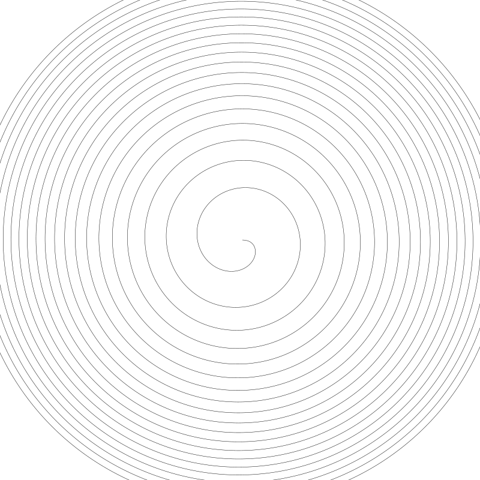
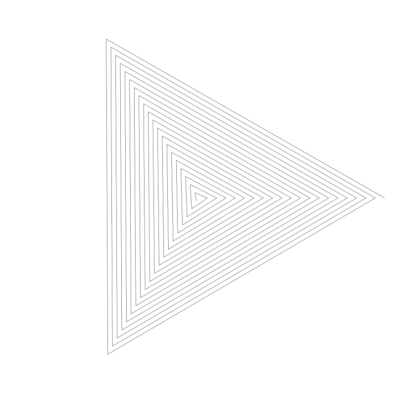
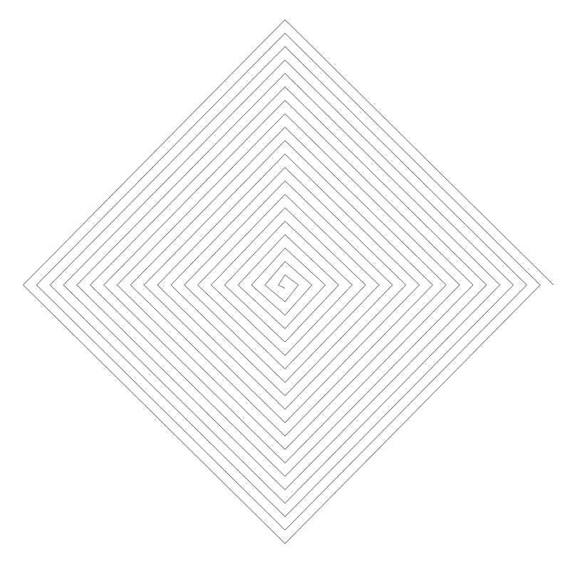

CODING CURVES 10: SPIRALS

Chapter 10 of Coding Curves

OK, let’s talk spirals.

Spirals are a lot like circles, in that they are a set of points with a distance relationship to a fixed center point. But unlike circles, where that distance is fixed, with spirals, that distance varies. The distance from a given point to the center point is generally a function based on the angle between those two points. So you’ll usually have some function that takes in an angle and returns a radius. Then you can use the radius and angle to find the x, y position of the point at that angle. There are many different spiral formulas, which give you spirals that have a different look and feel. Let’s start with one of the most basic spirals.

Side note: a circle is sometimes called a “degenerate” spiral. No disrespect intended. It just means that a circle follows the “rules” of spirals but isn’t really what we would think of as a spiral. Like a triangle where one side has a length of zero. All the triangle math generally works fine, but it’s really just a line to our eyes.

## The Archimedean Spiral


As you can see, on each cycle, the radius grows by a fixed amount. Here’s the formula for this spiral:

```
r = a * t
```

Here, t is the angle and a is some constant, in the case of the above image, it’s 5. The product of these two is the radius at the angle t. If we increase t to 10, we get this:



Now you can see that the a constant determines the spacing between each cycle of the spiral. In this case, it’s grown outside the bounds of the canvas.

Now when we are drawing spirals, we have to decide how many cycles we’ll be drawing. How many times are we going to go around? If t goes from 0 to 2 * PI, we have one cycle:


That’s one cycle. As you can see, for this spiral, the curve starts in the center and expands out from there. Three cycles means t goes from 0 to 2 * PI * 3.


Given all that, we can start to put together a spiral playground, like so:

```
width = 800
height = 800
canvas(width, height)
translate(width / 2, height / 2)
 
cycles = 10
res = 0.01
 
for (t = res; t < 2 * PI * cycles; t += res) {
  r = archimedean(5, t)
  x = cos(t) * r
  y = sin(t) * r
  lineTo(x, y)
}
stroke()
 
function archimedean(a, t) {
  r = a * t
  return r
}
```

We say we want 10 cycles, so the for loop goes to 2 * PI * cycles. We call the archimedean spiral function, passing in 5 as the constant, and t as the angle. That gives us a radius, which we use with the angle to find an x, y point and draw a line to it.

Throughout the chapter, I’ll be showing you other functions for different spirals. You can just replace the call to archimedean with the other functions.

The above code gives us this image:


In the drawing api I’m using, angles that increase positively go around in a clockwise direction. So this spiral is going around clockwise from the center. This may be different for you. It depends on how your drawing api handles angles. To reverse the direction, you have a few options:

A. Use scale to flip the canvas

```
scale(1, -1)
```

B. Change the code that creates the points to make one axis negative. For example:

```
x = cos(t) * r
y = -sin(t) * r
```

C. Change the for loop to go backwards:

```
for (t = -res; t > -2 * PI * cycles; t -= res) {
```

Doing any of those should get you going around the other way.

One last thing…

One thing to note in the code, is that I defined the for loop to start with res, not 0.

```
for (t = res; t < 2 * PI * cycles; t += res) {
```

To see why I did that, let’s move to our next spiral.

## The Hyperbolic Spiral


This spiral looks quite different from the first one. Each cycle is not a fixed distance from the past one. You’d be tempted to say that the distance increases on each cycle, but hold that thought.

Here’s the function for the this spiral:

```
function hyperbolic(a, t) {
  r = a / t
  return r
}
```

Not very different at all. We’re just dividing a by t rather than multiplying. For the above image, I passed in an a value of 1000. If I bring a down to 10, we get a tiny little spiral like this:


It should also now be obvious why I started the for loop with res rather than 0. If t is 0, then we’d be in a divide-by-zero situation here, which would cause some problems. This might cause a crash, or might just give you a radius of NaN (not a number), which would not be very useful. So we start with a number we know will not be zero.

Another thing to note about this spiral is the direction it goes. I drew the above spiral with 20 cycles. If I move that down to 5 (moving a back up to 1000), we get:


Maybe you can now see that the spiral starts large and grows smaller as t increases. With 100 cycles, the spiral starts to jam up in the center.


So, as I said earlier, at first glance the radius seems to be growing on each cycle, but now you can see that it’s actually starting out large and getting smaller on each cycle.

Let’s move on.

## The Fermat Spiral



This is a nice one. Here’s the formula:

```
function fermat(a, t)  {
    r = a * pow(t, 0.5)
    return r
}
```
Here we are multiplying a by t to the power of 0.5. This assumes you have a function called pow that raises it’s first argument to the power of the second argument. Depending on your language, you might also be able to say:

```
r = a * (t^0.5)
```

or

```
r = a * (t**0.5)
```

The above image was drawn with 20 cycles and an a of 20. Drawn with 10 cycles, we get:


So you can see this spiral draws from the center outwards. It starts out with a relatively large space between each cycle, but that space reduces slightly the further you go out.

Going back to 20 cycles and changing a to 40:



We see that the distance between cycles has increased.

Here we are with 100 cycles and an a of 15.


At the end, there is hardly any space at all between each cycle. And we have some interesting moiré patterns going on there.

## The Lituus Spiral


This looks a lot like the Hyperbolic spiral, but the formula is a lot closer to the Fermat spiral:

```
function fermat(a, t)  {
    r = a * pow(t, -0.5)
    return r
}
```
We just used a power of -0.5 rather than 0.5. The above spiral was drawn with 20 cycles and an a of 500. Here it is with 10 cycles:


So you can see that this is another one that draws in towards the center. Going back to 20 cycles, if we lower a to 50, we get:


The word “lituus” originally meant a curved staff, wand or horn. The above image explains best how this spiral got its name.

If we raise a to 1000, we get:


So you could say a lower a causes the spiral to get sucked in to the center more quickly.

So many spirals! Let’s do some more!

## The Logarithmic Spiral


This has a feel of being the opposite of the Fermat spiral. The spacing starts quite small, and increases the further it goes out. The formula:

```
function logarithmic(a, k, t)  {
    r = a * exp(k * t)
    return r
}
```

This one is a bit more complex than the others we’ve seen. First off, it has two parameters besides the t angle. And we’ll have to get into the exp function.

We actually touched on exp in the Harmonographs chapter. To recap, we have a mathematical constant, e known as Euler’s Number. It’s value is roughly 2.71828. When working with logarithms, it’s quite common to raise e to a power. So some math libraries have included a function to do that directly, often called exp. For a concrete example, let’s take a look at Javascript. It has e as a constant, Math.E. So to get e to the power of 2, you could say:

```
Math.pow(math.E, 2)
```

But it also has an exp function, so you can do the exact same thing by saying:

```
Math.exp(2)
```
So with this line,

```
r = a * exp(k * t)
```

we are multiplying a by e raised to the power of k * t. In the above image, I had a set to 0.5 and k at 0.05.

If we raise a to 1, we get a much larger spiral, though it looks pretty much the same.


Bringing a down to 0.25 gives us:


Again, similar look and feel, but smaller overall.

I’ll reset a back to 0.5 and move k up to 0.1.


Now you can see it expands much faster. Bringing k down to merely 0.04 has a much bigger effect than I expected:


## The Golden Spiral


This spiral increases by a rate equal to the “golden ratio”, approximately 1.618. Here’s the formula:

```
function golden(t) {
    r = pow(PHI, 2 * t / PI)
    return r
}
```

First, note that this function has no parameters other then t. It’s hard-coded with the value PHI, which is the golden ratio. Many math libraries have that value built in as a constant. If yours doesn’t, you can approximate it by saying

```
PHI = 1.61803
```

Or, if you want to be exact, you can use the following to get the exact value:

```
PHI = (1 + sqrt(5) ) / 2
```

Then save that as a constant somewhere and use it as needed.

You’ve probably seen this spiral in images like this:


By Romain – Own work, CC BY-SA 4.0, https://commons.wikimedia.org/w/index.php?curid=114415511
This is actually the Fibonacci spiral. The size of each square the sum of the next two next smaller squares and each curve is made up by a 90-degree arc centered in one corner of each square. It isn’t precisely the same as the Golden spiral, but very close.

… and more

Peruse this list of spirals if you want to find some other interesting ones to try out:

https://en.wikipedia.org/wiki/List_of_spirals

Here’s another good one:

https://mathworld.wolfram.com/topics/Spirals.html

## Spirangles



I ran across this term while writing this chapter. Essentially it’s a spiral made by straight line segments. By changing the angle between each segment, you can form different shapes.

These are very easy to make with our existing setup. The above one was made with the archimedean function, an a of 3, and 20 cycles. The trick is reducing the resolution. For this one, I set:

```
res = PI * 2 / 3
```

Now on each step of the for loop, t will increase by one-third of a circle. Here are some others, dividing by 4 and 5.




You get the idea. You might want to experiment with some of the other functions too. Some of them are quite satisfying.

## Sunflowers

No discussion of spirals would be complete without talking about sunflowers. Just do a search on some combination of the terms, sunflowers, fibonacci, and spiral and you’ll get a ton of reading material and pretty pictures. What it all means, I’ll leave to others, but it’s fun to draw the kind of spiral you find looking at sunflowers. The golden ratio is built right into this pattern, and here’s what it looks like:


You can see not one, but many, many spirals going in and out at different angles. Here’s the code I used to make this (i.e. the pseudocode that represents the actual code I used):

```
width = 800
height = 800
canvas(width, height)
translate(width / 2, height / 2)
 
count = 1000
for (i = 0; i < count; i++) {
  percent = i / count
  size = 14.0 * percent
  r = 380.0 * percent
  t = i * PI * 2 * PHI
  x = cos(t) * r
  y = sin(t) * r
  circle(x, y, size)
  fill()
}
```

We choose a count for how many “sunflower seeds” we want to draw. Here it’s 1000.

Then we loop through using i and get a percent value that it i / count.

The size value is the radius of each “seed”. As i approaches count, percent will approach 1, so size will approach a maximum of 14.

Similarly r is the radius at which to place each seed. It will max out at 380, just shy of half the width of the canvas.

We calculate t using line 11 there, which is just a magical sunflower Fibonacci formula. Seriously though, read up on it if you want to know more. With an angle and radius, we can get an x and y and draw the seed there with the current size.

And that’s about all I have to say about spirals for now. Catch you next time!


