# 第十一章 玫瑰花形 ROSES
# CODING CURVES 11: ROSES
> 原作：Keith Peters https://www.bit-101.com/blog/2022/11/coding-curves/

> 译者：池中物王二狗(sheldon)

> blog: http://cnblogs.com/willian/

> 源码：github: https://github.com/willian12345/coding-curves

Chapter 11 of Coding Curves

Now we come to another one of my favorite types of curves – roses or rose curves. To me, these look a lot like circular Lissajous curves, or very regular harmonographs. In fact, they are a special instance of hypotrochoids, but special enough to look at on their own. Just to give you some instant visuals, here’s a rose curve:

曲线艺术编程系列第 11 章

现在来我们来到了另一种我钟意的曲线类型 -- 玫瑰花形或玫瑰花形曲线。 在我看来这类曲线就像是圆形的利萨茹曲线 Lissajous curves，或者非常规则的谐波图。事实上它们是一类特别的长短幅内摆线，但足够特别到将自己归为一类。给你看些花形图例子先：

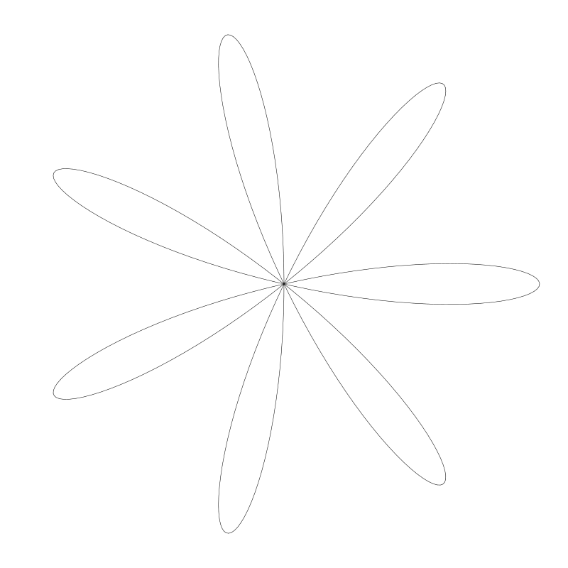

Like many other curves we’ve looked at, we can get a parameterized formula that will take a t value that goes from 0 to 2 * PI and give us back a value that will let us plot the curve. Let’s look back at the formula for a circle first…

就像其它我们关注过的其它曲线一样，我们有参数方程, 用 t 从 0 到 2 * PI 递增，计算得到返回值并用它绘制出曲线。我们先往回看看圆方程先：

```
function circle(x, y, r) {
  for (t = 0; t < 2 * PI; t += 0.01) {
    x1 = x + cos(t) * r
    y1 = y + sin(t) * r
    lineTo(x1, y1)
  }
}
```

You could simplify that into a single line within the for loop, but I wanted to spread it out for clarity.

A rose curve uses the same strategy, but instead of a fixed radius, that radius is constantly changing, also based on the t value, as well as another parameter. Here’s the formula for the radius:

你可以将它将简化成 for 循环中的一行，但为了解释的清晰还是将它展开了。

一个玫瑰花形曲线使用同样的策略，但使用以 t 和其它参数为基础的动态半径取代固定的半径。下面是半径方程：

```
r = a * cos(n * t)
```

So we have two new variables here. a is the overall radius of the rose, and n controls the number of petals in the rose (although the petal count gets a bit complicated, so we’ll come back to that shortly). So we can make a rose function like this:

现在我们有了 2 个新变量。a 是花的覆盖半径， n 控制着花瓣数（当然花瓣数量的计算有点儿复杂，捎后回来解释）。现在我们可以创建一个玫瑰花形函数：


```
function rose(x, y, a, n) {
  for (t = 0; t < 2 * PI; t += 0.01) {
    r = a * cos(n * t)
    x1 = x + cos(t) * r
    y1 = y + sin(t) * r
    lineTo(x1, y1)
  }
}
```

And now, if you want to, you can clean this up a bit:

当然如果你愿意，可以整理下代码：

```
function rose(x, y, a, n) {
  for (t = 0; t < 2 * PI; t += 0.01) {
    r = a * cos(n * t)
    lineTo(x + cos(t) * r, y + sin(t) * r)
  }
}
```

For now, let’s just say that n should be a positive whole number. But we’ll explore ranges beyond that of course.

Now we can draw our first rose like so:

现阶段先假设函数的 n 参数应该要为正整数。当然我们也会探索更大的范围。

现在我们就可以绘制我们第一个玫瑰花形：

```
width = 800
height = 800
canvas(800, 800)
 
rose(width / 2, height / 2, width * 0.45, 5)
stroke()
```

I’ll be using the width * 0.45 a lot here. It just makes the radius a bit less than half the size of the canvas, so the curve will go almost to the edge of the canvas, but never hit it.

And this gives us a 5-petal rose:

在这里我会经常用 width * 0.45。它刚好是比 canvas 宽度一半还小一点，这让曲线刚好几乎覆盖整个 canvas 但又没能碰到边界。

上面代码会生成一个 5 个花瓣的玫瑰花形：

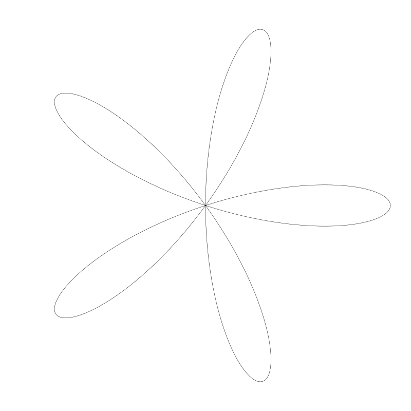

The first example at the top of this page used an n of 7. And here is a rose with an n of 11:

第一个例子中 n  用的是 7。 而下面这个花 n 用的是 11：

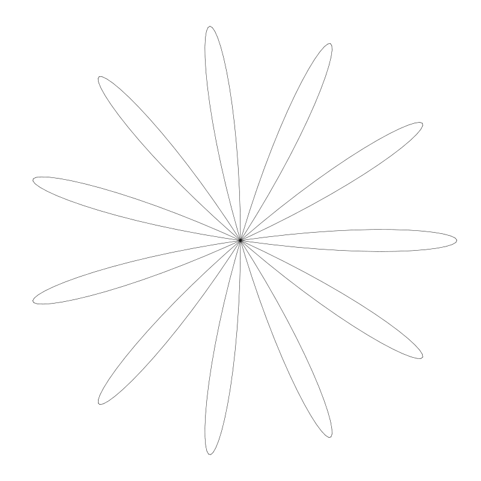

So far we’re seeing a good correlation between n and the number of petals. At least for odd values of n. But what if we use an n of 4?

到目前为止我们可以看到 n 与 花瓣数量之间有很好的相关性。前面 n 用的都是奇数。如果我们用的是偶数 n 为 4 会如何呢？

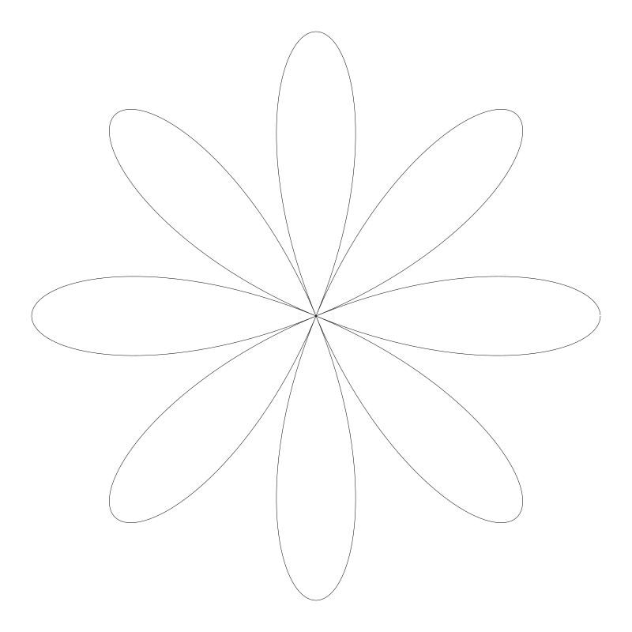

Interesting. This gives us eight petals. This holds true for any value of n. Odd values create n petals. Even values create 2 * n petals. Just to go way out in one direction, here’s one with n = 40, which gives 80 petals. I had to up the resolution – incrementing t in the for loop by 0.001 to keep it from getting jagged.

有意思，产生了 8 个花瓣。n 的值遵循 奇数 n 创建 n 个花瓣。 偶数 n 创建 2 * n 个花瓣。 在一个方向上， 设 n = 40，它将产生 80 个花瓣。我不得不提升辨率 -- 将循环上的 t 改为 0.001 以保证花瓣之间有足够的空隙。

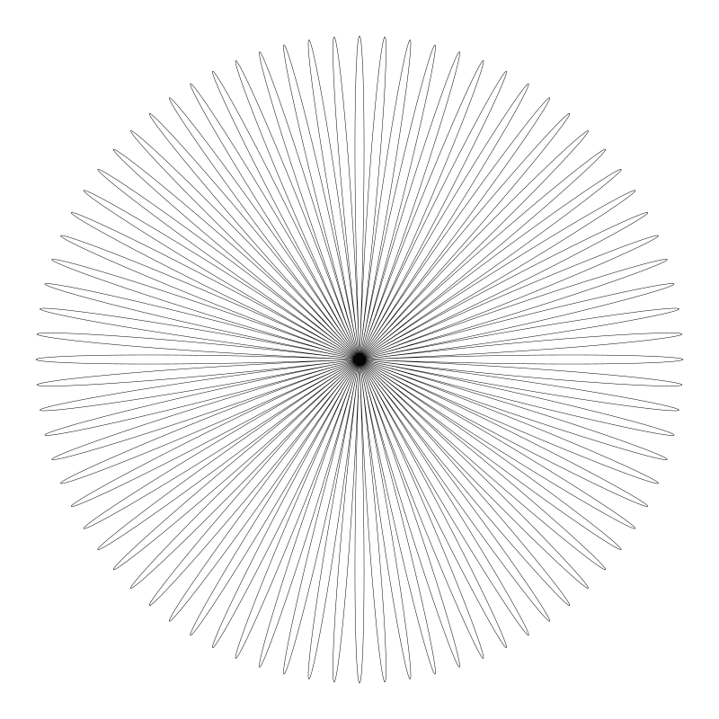

In the opposite direction, going down to n = 1, gives you a single node:

相反，如果 n = 1，仅会得到一个单圆


A bit strange, but it works out mathematically. You’ll find that for negative values, the rose looks the same as for positive values of n. Here’s 5 on the left and -5 on the right:

有点怪，但在数学上说得通。你会发现 n 为负值时，玫瑰花看起来与 n 为正值时得到的结果图形一样。 下面左边的是 5 右边的是 -5

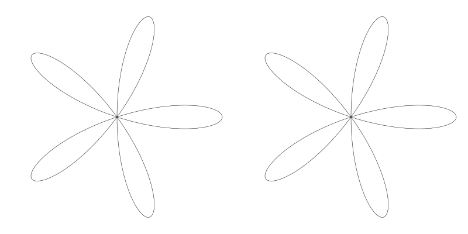

Unsurprisingly, n = 0 gives us nothing. And so that covers all the whole number roses. If that’s all there was to roses, it would be nice, but there’s a lot more to go.

毫无意外， n = 0 时会得不到任何图形。并且我们已经覆盖了全部的整数玫瑰花形。如果这是全部了的话就太好了。可惜还有更多的类型。

## An Alternate Rose

Actually, before I move beyond whole numbers of n, I want to just mention an alternate rose formula. Instead of using cosine in the radius formula, you can use sine instead:

## 交替玫瑰花形

在我讲完所有 n 值前， 我想先提一下交替玫瑰方程。在半径议程中用正弦 sine 代替余弦 cosine ：

```
r = a * sin(n * t)
```

This gives you the same roses as the original, but rotated. Here’s a 5-petal rose using the original cosine on the left and sine on the right:

它会生成与原来一样的花形，但是旋转了。左侧是用余弦 5 个花瓣的原图， 右侧是用正弦：

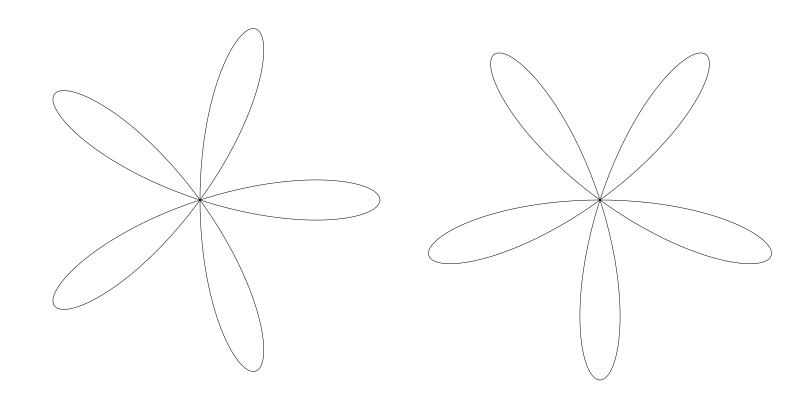

And the same for a 8-petal rose (n = 4):

8 个花瓣的也是一样的效果 （n = 4）

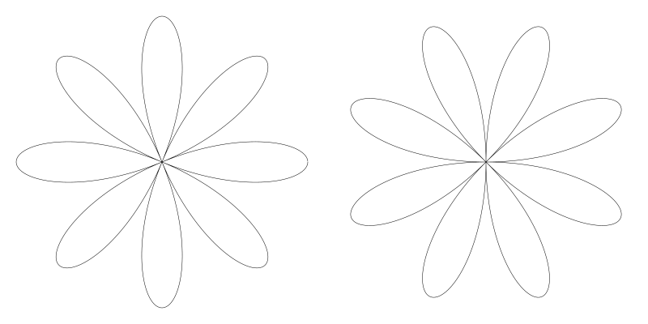

The actual amount of rotation is PI / (2 * n) radians, or 90 / n degrees. For odd values of n, this always has the visual effect of rotating the rose by 90 degrees (the actual rotation may be different, but due to rotational symmetry, it appears to rotate 90 degrees). For even values of n, it rotates the rose so the petals will now be where the spaces between the petals were in the original version.

真实的旋转值是 PI / （2 * n) 弧度, 或 90 / n 度。n 为奇数时，视觉上看起来总是旋转了 90 度 （实际旋转可能不同，但由于旋转对称性，它年起来就像是旋转了90度）。当 n 为偶数时花瓣就会在原来版本中花瓣之间的位置

## Fractional values of n

Things start to get more interesting when we start using fractional values for n. We can try it generating a rose with:

```
rose(width/2, height/2, width * 0.45, 5.0 / 4.0)
stroke()
```
But this gives us, rather disappointingly, the following:

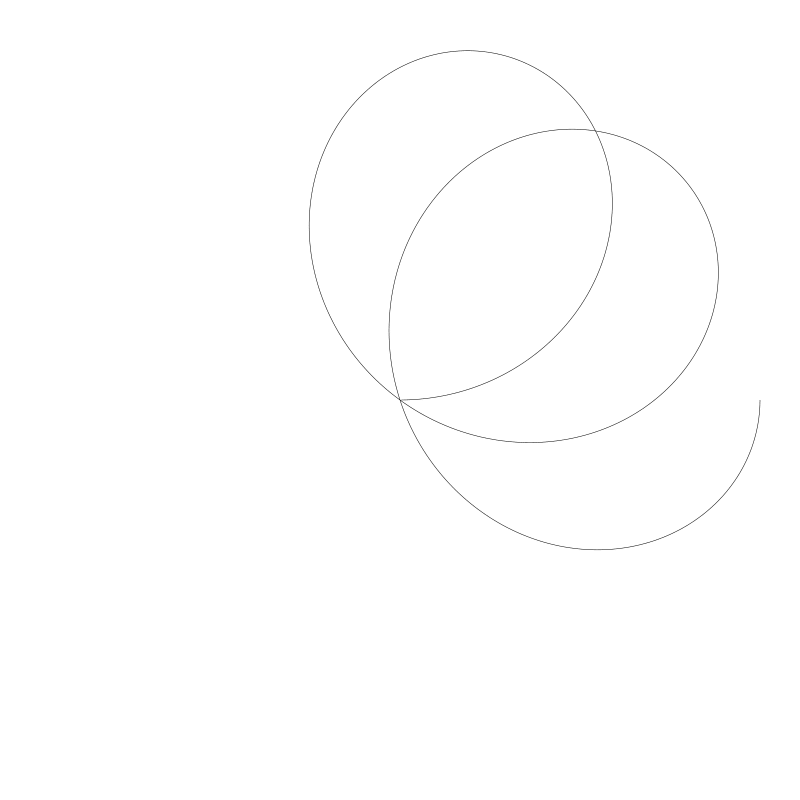

The problem is that it’s going to have to go beyond 2 * PI to finish it’s cycle. How far beyond? Well, to figure that out programatically, we’ll need to first ensure that the n value is rational. If it’s an irrational number, the rose will continue forever without reaching its exact starting point. We’ll also need to know both the numerator and denominator of that fraction. We can adjust the rose function to take an extra value, so we have n and d for numerator and denominator.

```
rose(x, y, a, n, d) {
  for (t = 0; t < 2 * PI; t += 0.01) {
    r = a * cos(n / d * t)
    lineTo(x + cos(t) * r, y + sin(t) * r)
  }
}
```

This doesn’t solve the problem yet, but gets us the first step. If you want you can enforce n and d to be integers to make sure you’re getting a rational fraction, but make sure you convert them so the division in line 3 returns a floating point value.

Now we need to change the for loop limit from 2 * PI to the actual value we need. That limit value is:

```
limit = PI * d * m
```

But what is this new m value there? Well, m should be equal to 1 if d * n is odd. And m should be 2 if d * n is even. Woo! A bit complex. But we can simplify it.

We usually test for evenness by taking a number modulo 2. If the result is 0, that means the number is even. If the result is 1, the original number is odd. So we want:

```
m = 1 when d * n % 2 == 1
```

and

```
m = 2 when d * n % 2 == 0
```

So we can say:

```
m = 2 - d * n % 2
```

This gives us:

```
rose(x, y, a, n, d) {
  m = 2 - d * n % 2
  limit = PI * d * m
  for (t = 0; t < limit; t += 0.01) {
    r = a * cos(n / d * t)
    lineTo(x + cos(t) * r, y + sin(t) * r)
  }
}
```

Remember, if you are enforcing integers for n and d, you might need to do some casting or conversion to make everything work correctly. I’ll leave that to you. Now we can redo the fractional one like so:

```
rose(width/2, height/2, width * 0.45, 5, 4)
stroke()
```

And now we get something much nicer:

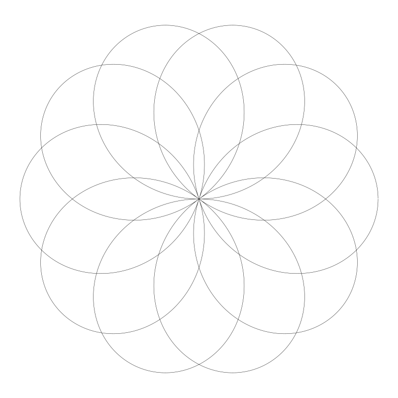

This time, the rose continued all the way around and completed itself.

Now you can go to town trying different fractions. I find that things get really interesting when you use higher numbers that are very close to each other. For example, n = 22, d = 21:

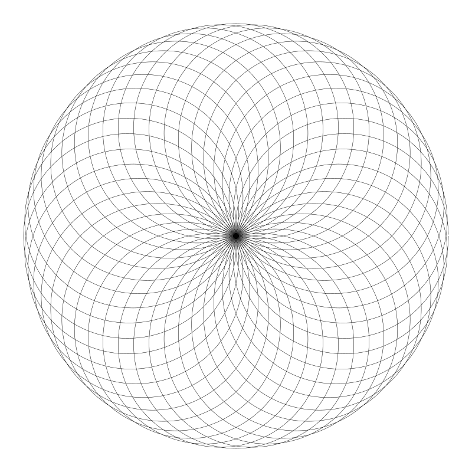

Or even 81 and 80:

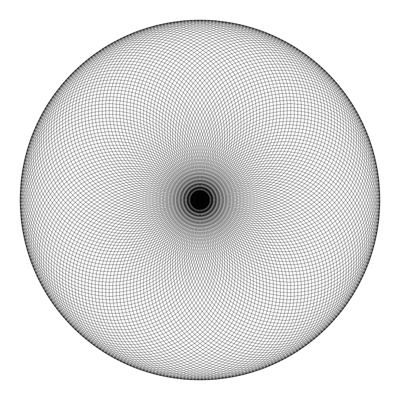

## Roses with fractions less than 1

Things become a whole different type of interesting when you get fractions that are less 1.0. For example, here are roses with n and d of 1,2 on the left, 1,3 in the middle, and 1,4 on the right.

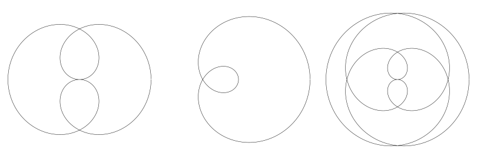

A trick to find interesting patterns is to take a pair of numbers that would usually reduce down, like 17 / 51 will reduce to 1 / 3, giving us the middle figure above. But then shift one of the values a bit. Here’s 17 and 52:

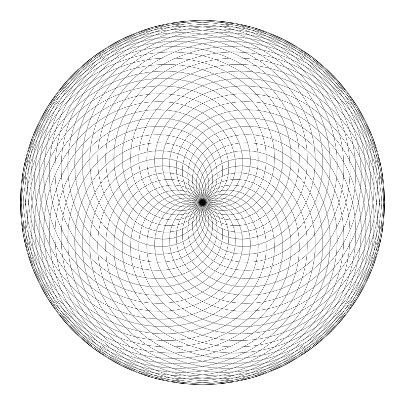

A big difference for just a shift of 1.

## Named Roses

Some of these rose curves have special names. I’ll share some of them.

## Limaçon Trisectrix

This has a ratio of 1 / 3. We already saw this one above.

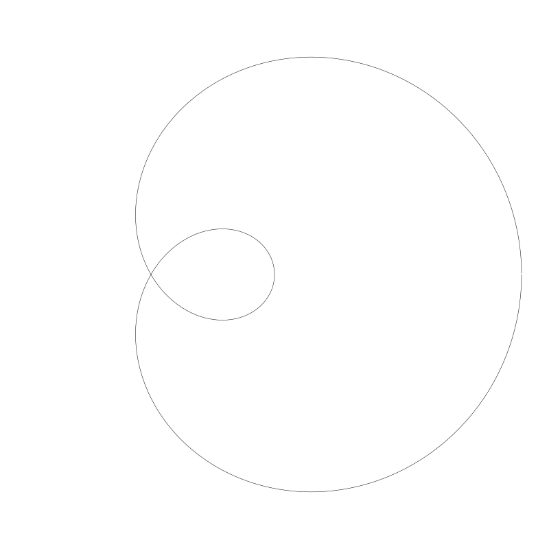

## Dürer Folium

With a ratio of 1 / 2. Also seen previously.

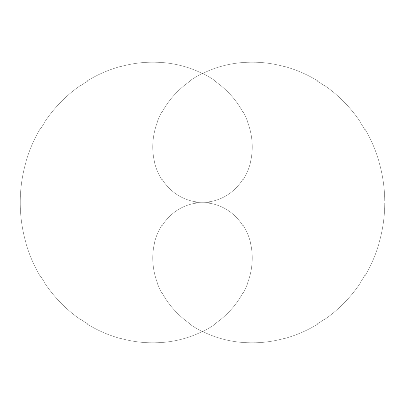

## Quadrifolium

Ratio is 2 / 1

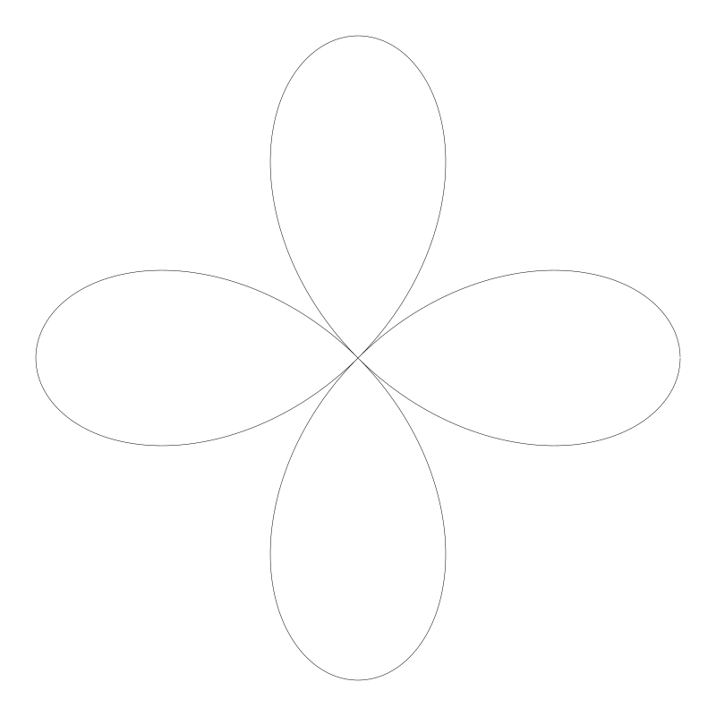

## Trifolium

Ratio of 3 / 1

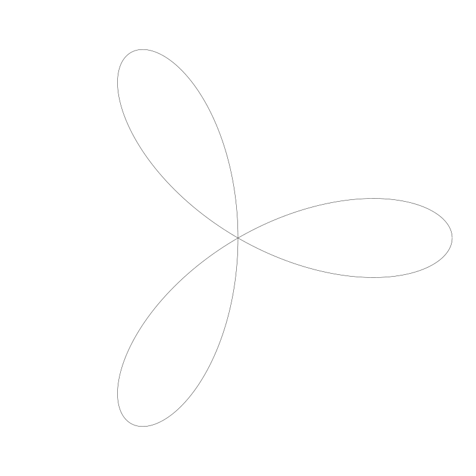

## Maurer Roses

If you thought we were almost done, wrong! There’s a whole other type of rose curve to explore – Maurer roses!

Maurer roses start with the basic rose function, but instead of just drawing the curve all the way around, it draws a series of line segments to points along the rose curve. Although it doesn’t have to be so, this is often done with 360 segments and the angles used are specified in degrees. We construct a rose, here using a ratio of 4 / 1, and then pick a degree value to step by. In this case, I chose 49. Then we loop t from 0 to 360 and multiply t by that degree value. So the degrees goes from 0, to 49, 98, 147, 196 and so on. We use that value in our rose (converting to radians of course) and use that at the next point. Here’s what it looks like in action for the first 30 iterations:


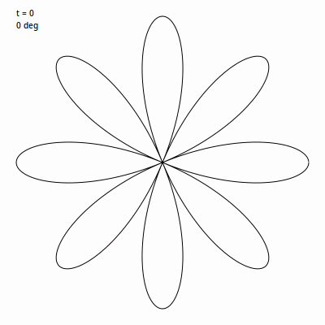

To put it a different way, in a normal rose curve, we are incrementing in very tiny increments, so we get a very smooth curve. Here, we are incrementing in gigantic jumps, so we get what looks like is going to be a chaotic mess. But, if we let it finish its full path through to 360 iterations, we get…

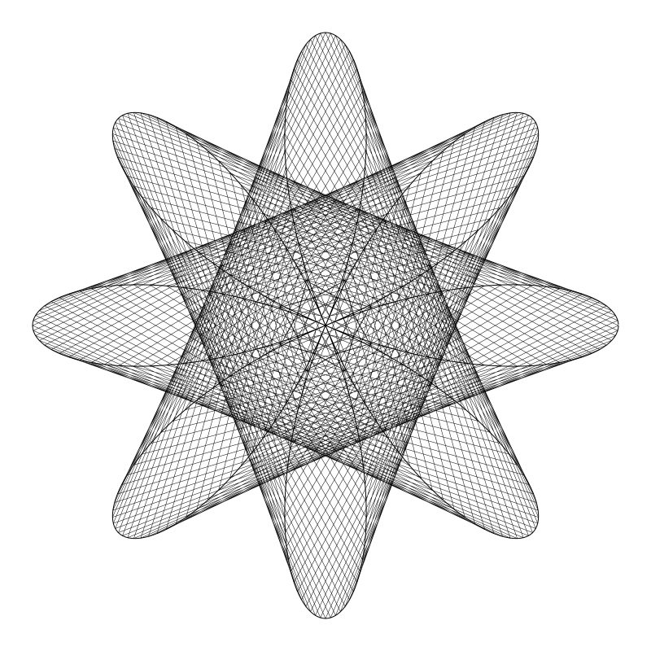

Aha! Not a chaotic mess after all! In fact, quite nice. Actually, above I’ve drawn the regular rose on top of the Maurer rose. Here is the Maurer all by itself:

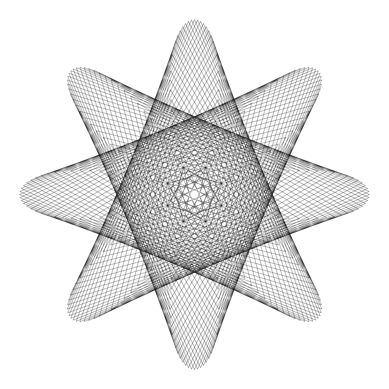

I think the two combined look really nice.

So how do we do this?

Well, again, we start out with the basic rose function. But in this case, we’ll just stick to a single integer value. So just n rather than n and d. But we also want to specify how many degrees to jump on each iteration. To avoid confusion with the earlier d parameter, I’ll call this deg. So the signature is:

```
function maurer(x, y, a, n, deg) 
```

Again, we want to loop from 0 to 360 for our initial t value. And then we want to get that value that is t multiplied by deg. This is the degree value shown in the animation above. We’ll call it k but at this point we’re done with degrees, so we’ll convert it to radians by multiplying by PI and dividing by 180

```
function maurer(x, y, a, n, deg) {
  for (t = 0; t < 360; t++) {
    k = t * deg * PI / 180
    r = a * cos(n * k)
    lineTo(x + cos(k) * r, y + sin(k) * r)
  }
}
```


We’ll then just execute the rose algorithm, but using k instead of t.

Now we can set something up like the following.

```
width = 800
height = 800
canvas(800, 800)
 
maurer(width / 2, height / 2, width * 0.45, 5, 37)
stroke()
 
// drawing the regular rose is optional
rose(width / 2, height / 2, width * 0.45, 5, 1)
stroke()
```

And get this:

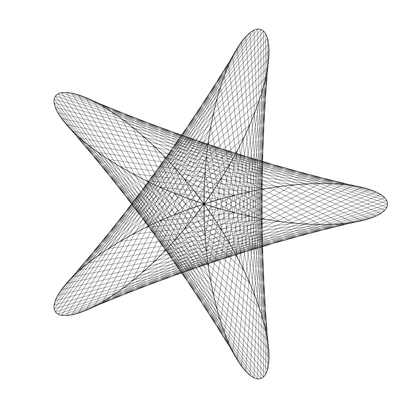

Play around with different values for n and deg. You’ll find that n works the same way it did for regular roses. But minor variations in deg can create radically different images. For example here is n = 7 and deg = 23:

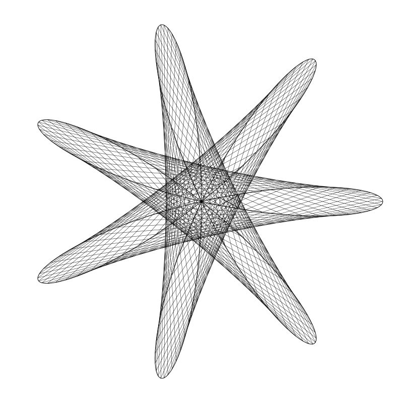

But moving deg up to 24 gives you this:

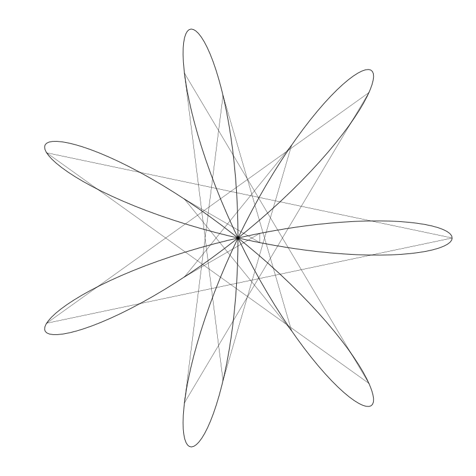

Not nearly as nice.

Generally, you’ll find that even numbers for deg will have a lower chance of being interesting than odd numbers (with exceptions).

And anything that divides evenly into 360 is not going to be great. For example, here’s 4, 120:

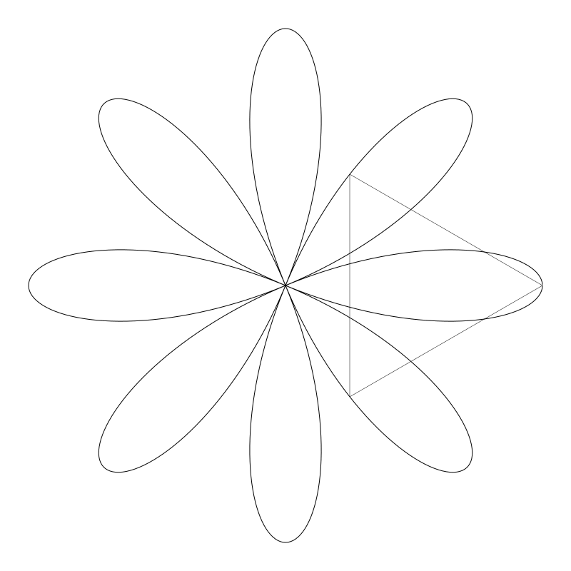

I drew the full rose too, but the Maurer is just the triangle on the right hand side. Increase that to 121 though, and you get this beauty:

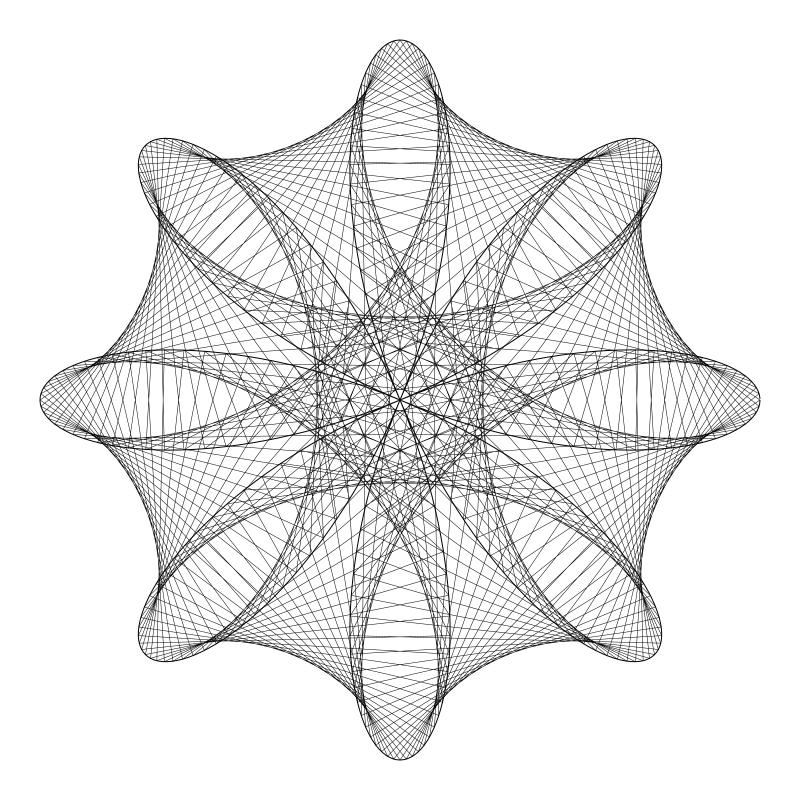

Also, lower prime numbers usually always work pretty well. I’ve noticed that the lower values of n let you get away with higher prime numbers for deg. But it’s something I haven’t tested very thoroughly. Something to play around with.

One more thing you might want to try is fractional Maurer roses. You don’t even have to alter the code at this point. You can just enter the fraction. Because we are always looping from 0 to 360, we don’t need to adjust for a different number of loops. Here’s one to start with. Make sure you put both fraction values into the rose function separately, if you are using that.

```
maurer(0, 0, width * 0.45, 5.0 / 4.0, 229)
stroke()
rose(0, 0, width * 0.45, 5, 4)
stroke
```

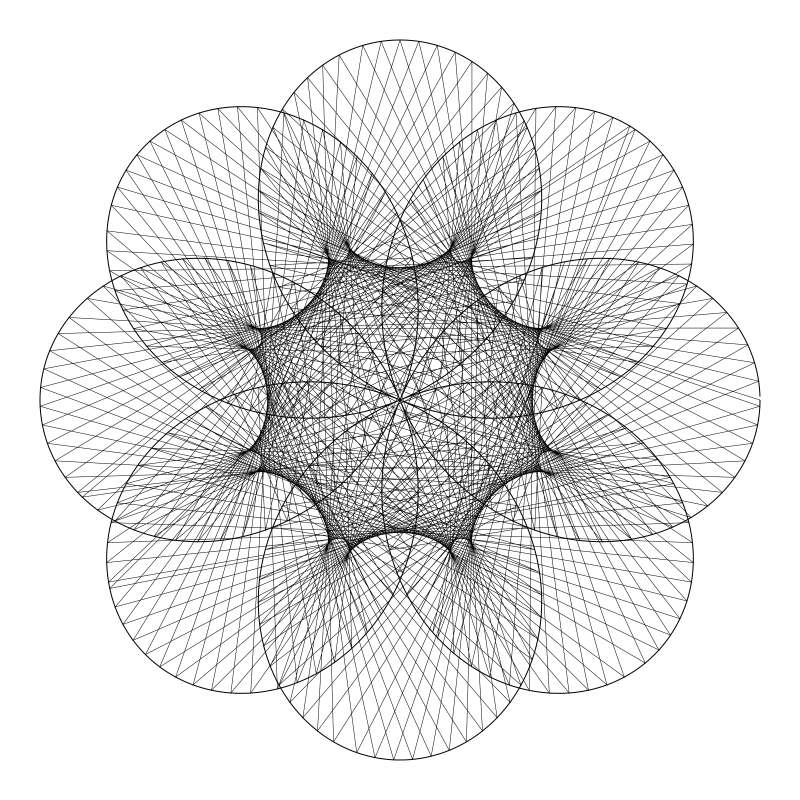

See what you can find among all the possible variations.


