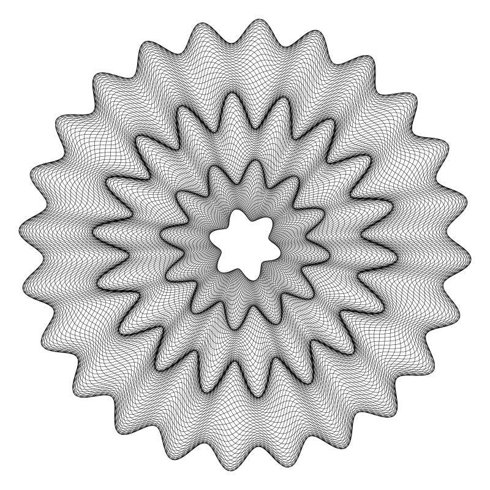

# 扭索（玑镂）纹
# Coding Curves 12: Guilloche Patterns

Chapter 12 of Coding Curves

Guilloche patterns are very intricate and fascinating patterns. You’ll often find them on bank notes and other official documents as well as watches and other intricate machinery. Because they are so intricate and complex, and often engraved into metal, they are usually done by machines themselves. Imagine a high end spirograph machine with a metal etching tool rather than a ball point pen. The name “Guilloche pattern” is rather vague and can apply to all kinds of similar patterns. I’m going to explain how to make a pattern like the one you see here:


This is a lot like the kind of thing you’d see on some kind of certificate or bank note, and once you understand what’s going on, you can adapt the code to make other similar patterns.

## Step One – A Simple Ring

We’ll start by making a single, simple ring that looks like this:


This is very much like a trochoid or a rose curve. In fact, you could probably make this with those formulas, but I’m going to do it a bit differently to set it up for the more complex stuff we’ll do later on.

This is essentially a sine wave that’s wrapped around a circle. Note that it has an inner radius and an outer radius. The sine wave has 80 nodes, but it overlaps itself. To simplify what’s happening here, I’ll increase the inner radius and make it so it doesn’t overlap:


Now you can see more clearly that this is, as I said, a sine wave wrapped around a circle. Now I’ll add a little bit of overlap:


Here, you should still be able to see the sine wave even with the overlap. The first image is the same idea, but with a lower inner radius and more overlap. Now let’s look how to draw this.

We start with an inner and outer radius. With a bit of easy math we can figure out a “mid” radius. This will be the the zero-point of the sine wave. And we’ll need a range, which is how much the sine wave will have to extend to either side of this radius to hit the inner and outer limits. You might also call this the amplitude of the wave.

```
width = 600
height = 600
canvas(width, height)
 
translate(width / 2, height / 2)
 
inner = 50
outer = 250
range = (outer - inner) * 0.5
mid = inner + range
```
Next, we need values for how many cycles in the wave, and how much it overlaps. I’ll call these nodes and div. These should be whole numbers and should not be evenly divisible. This is very similar to the n and d parameters in the rose curves we made in the last chapter, but I’ll name them differently to keep things clear.

```
nodes = 80
div = 11
```

Now we can loop t from 0 to 2 * PI * div and draw some line segments. The angle of each new point for the next segment is simply t and the radius will be computed as shown. We need to multiply 2 * PI by div to make sure we go around the circle enough times to meet back up correctly.

```
for (t = 0; t < 2 * PI * div; t += 0.01) {
  radius = mid + sin(t * nodes / div) * range
  x = cos(t) * radius
  y = sin(t) * radius
  lineTo(x, y)
}
stroke()
```

If you look back at the roses chapter, you’ll see this is very similar to how we got the radius there, but rather than figuring the radius as a sine and single multiplication, we’re using mid and range to fit the radius between inner and outer.

You can play with this a bit. Try different inner and outer radii and number of nodes and values for div. For a good Guilloche pattern, you probably want to keep nodes rather high, and div lower. But Most importantly, they should not be evenly divisible. An easy formula for decent patterns is to make div a small prime number and make sure nodes is not a multiple of div.

For example, if div is 17, you wouldn’t want to use 170 for nodes, or you’ll get this:


But changing nodes to 171 gives you a much better pattern:


If you want to play with an interactive version of this, I made this a few years back:

https://bit101.github.io/lab/dailies/170120.html

## Step 2 – A Complex Ring

Next, we’ll add some complexity to the mix. Rather than having our sine wave go back and forth between fixed inner and outer radii, we’ll have these radii themselves vary with a separate sine wave each! The result will look like this:


We’ll need a few more parameters for this. To calculate the final outer radius at any point, we’ll need the base outer radius, how many cycles of that sine wave and how far the final radius will differ from the base outer radius. And we’ll need the same three values for the inner radius. And of course we’ll still need nodes and div. The values I used for the above image are:

```
inner = 100.0
n0 = 7.0
h0 = 10.0
 
outer = 250.0
n1 = 17.0
h1 = 20.0
 
nodes = 142.0
div = 89.0
```

So the inner radius will have 7 nodes, and the radius will vary from 90 to 110, which means a base of 100, plus or minus 10. Similarly the outer radius will have 17 nodes and vary between 230 and 270.

All the code we did early to find the “mid radius” and range for the sine wave will have to be redone for each iteration of the for loop now, using these values and the dynamic inner and outer radii.

```
for (t = 0; t < 2 * PI * div; t += 0.01) {
  r0 = inner + sin(t * n0) * h0
  r1 = outer + sin(t * n1) * h1
 
  range = (r1 - r0) * 0.5
  mid = r0 + range
 
  radius = mid + sin(t * nodes / div) * range
  x = cos(t) * radius
  y = sin(t) * radius
  lineTo(x, y)
}
stroke()
```

You can surely simplify this code, but I wanted to write it all out explicitly for the sake of clarity.

Again this is a good stopping point to play with some of the parameters and see the different types of shapes you can make. We have one more level of complexity to tackle next.

Here’s an interactive version of this step:

https://bit101.github.io/lab/dailies/170121.html

Step 3 – Multiple Rings

The next step is to create multiple rings that will exactly fit together, like the image that appears at the start of this chapter:


This is easier than it might seem. If you draw one smaller ring, and then one larger one around that, you just have to make sure that the parameters for the larger ring’s inner radius match the parameters for the smaller ring’s outer radius. Since we’ll be calling the same code multiple times, this would be a good time to turn it into a reusable function. For the most part, this just means wrapping the for loop and stroke call in a function with all the parameters passed in. I also added x and y parameters, so you can center the pattern anywhere on the canvas.

```
function guilloche(x, y, ir, n0, h0, or, n1, h1, nodes, div) {
  for (t = 0; t < 2 * PI * div; t += 0.01) {
    r0 = ir + sin(t * n0) * h0
    r1 = or + sin(t * n1) * h1
 
    range = (r1 - r0) * 0.5
    mid = r0 + range
 
    radius = mid + sin(t * nodes / div) * range
    lineTo(x +cos(t) * radius, y +sin(t) * radius)
  }
  stroke()
}
```

I upped the canvas size to 800×800 and then used this set of function calls:

```
guillloche(400, 400, 50, 6, 10, 120, 12, 20, 137, 37)
guillloche(400, 400, 120, 12, 20, 220, 18, 30, 141, 41)
guillloche(400, 400, 220, 18, 30, 350, 24, 20, 164, 53)
```

This resulted in the following image:



Note that in the first call, the outer radius params are 120, 12 and 20. These correspond to the inner radius params in the next call. And the outer radius params for the second call, 220, 18 and 30, correspond to the inner radius params on the final call. This way, each ring lines up perfectly.

As usual, play around with this. You can make as many ring as you want. You might want to set up a custom data type that encapsulates all of the radius parameters to make that part more reusable. I’ll leave it to you.

Another thing you might want to try is making each ring a different color:


Here’s an interactive version of the final product:

https://bit101.github.io/lab/dailies/170122.html

Note that there’s no rule that says the rings have to match exactly. Try putting some space between them or letting the overlap and see what kind of interesting patterns you can create that way. This next example has the first and last rings the same as in the previous example, but the middle ring is defined quite differently:

```
guillloche(400, 400, 20, 4, 5, 120, 8, 10, 137, 37)
guillloche(400, 400, 160, 5, 24, 160, 11, 24, 80, 17)
guillloche(400, 400, 220, 18, 16, 350, 10, 20, 164, 53)
```

Here, the inner and outer radius is the same, 160, which makes some interesting blobs rather than a discrete ring. All is fair in Guilloche patterns!


And of course, don’t forget to animate!


## Summary

Do an image search for Guilloche patterns and you’ll find things that are much different, and often more complex than what I’ve presented here. This is just one take on them.

You might try altering the code do draw something other than circles. Ellipses would be a good place to start. And then move onto other shapes. But all that is a bit beyond the scope of this chapter.


