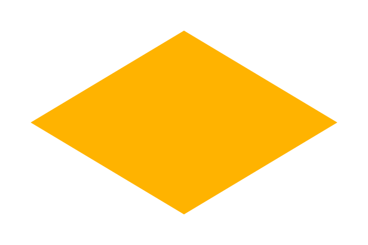

# 第十三章 超级椭圆与超级方程（Superellipses and Superformulas）

> 原作：Keith Peters https://www.bit-101.com/blog/2022/11/coding-curves/
>
> 译者：池中物王二狗(sheldon)
>
> blog: http://cnblogs.com/willian/
>
> 源码：github: https://github.com/willian12345/coding-curves

Coding Curves 13: Superellipses and Superformulas
coding curves 

Chapter 13 of Coding Curves

曲线艺术编程系列第十三章


In this chapter we’ll be talking about some interesting shapes. Superellipses are quite useful in design and UI work, especially a specific superellipse we’ve come to know affectionately as the “squircle”. These are basically rounded rectangles, but with some neat properties. Superformulas are an extension of superellipses. They are more complicated, probably less useful, but interesting in their own right. Let’s dive in.

在这一章我们将讨论一些有趣的形状。超级椭圆在设计与UI领域非常有用， 有一种特别的超级椭圆被亲切的称为“方圆形”. 一种介于正方形和圆形之间的几何形状，四个角为圆角，边缘呈现出圆润的曲线。 超级方程是超级椭圆的一个扩展。它更复杂，也许没那么有用，但它自身足够有趣。让我们开始探索吧。

## Superellipses

Sometimes you need to draw a rectangle for something. We’ve all been there. Drawing a rectangle is easy enough in almost any graphics package. So you draw a rectangle.

## 超级椭圆

有时候你可能需要绘制矩形。这个需求太常见了。在任何图形库中都会有绘制矩形的方法。


But that’s kind of boring. Those square corners are just so… square. So you come up with a rounded rectangle. Some drawing apis have this built in, but it’s not too hard to hand code. You draw a 90-degree arc at each corner and a line between each arc. This is ok.

但光是矩形看起来比较无聊。四角都有点儿。。方。 以至于你可能想把它变成圆角矩形。有些绘图 api 也有绘制圆角矩形的方法，但我们直接手搓一个也不难。在四个角都绘制一个 90 度的 圆弧，并将它们连起来就是圆角矩形了。


In fact, you can make those corners have a relatively small radius, or you can make it quite round:

事实上，你可以让四个角拥有相对小的半径，这样它看起来会更圆


But you might not love this. There’s kind of a break in continuity in the edges. It’s going along nice and straight and then it abruptly turns into an arc. Maybe you want something that smoothly transitions into that round corner. Enter the superellipse.

You can think of a superellipse as a blend between an ellipse and a rectangle. Like an ellipse, and many of the other curves we’ve drawn in this series, we’ll consider this shape as a center point and a varying radius drawn from a t of 0 to 2 * PI. This is different from a lot of rectangle functions which take an x, y location (usually top, left of the shape) and a width and height. But you can adjust the function as you want.

While there are different ways to express a superellipse mathematically, we’ll dig around until we find one that is parameterized with that 0 to 2 PI t value. And here is is:

但你应该不会喜欢这样做。这种做法边缘有些不连贯。一开始都是漂亮的直线，到边角突然又要使用 arc 这种操作。你也许想在圆角处变化的更自然顺滑。    
还是得看超椭圆。

你可以想象超级椭圆是介于椭圆和矩形的混合体。就像椭圆和其它曲线一样在本系列中，我们认为这个形状拥有一个中心点和变化的半径 t 从 0 至 2*PI。这有别于大部分矩形方法，矩形方法往往用 x,y 为坐标（通常是矩形的 left 和 top 值），还有 width,height。 但你可以按你自己的想法调整此方法。

在数学上有好几种方法用于表达超级椭圆。我们不停的寻找直到找到下面这个可对 t 进行参数化的公式：

```
x = pow(abs(cos(t)), 2 / n) * a * sign(cos(t))
y = pow(abs(sin(t)), 2/ n) * b * sign(sin(t))
```

Hmm… more complicated than you might have expected?

There is a somewhat simpler formula that looks like this:

Hmm... 比你预想的要复杂吧？

这里有个简介的公式像这样：

```
x = pow(cos(t), 2 / n) * a
y = pow(sin(t), 2 / n) * b
```

But the problem with this is that it only handles one quadrant: 0 to PI / 2. Rather than running a for loop four times, once for each corner, and figuring out the signs of x and y, we do some fancy math with abs and sign.

Your language probably has an abs function, but it just returns the absolute value of a value. You could easily write your own like:

但问题在于，此函数只能处理 1/4: 0 到 PI / 2。相比于为每个角跑4次循环， 并计算出 x 和 y，我们用了些魔幻的数学方法 abs 和 符号直接计算。

你使用的语言平台一定也有个 abs 方法，它只是直接返回了绝对值。你可以自己简单动手写一个你自己的：

```
function abs(val) {
  if (val < 0) {
    return -val
  }
  return val
}
```

This will always return zero or a positive value.

You might not have a sign function though. This just returns -1 if the given value is negative, and +1 if it’s positive. Returns 0 for 0. You can write this like so:

这个函数总是会返回 0 或正数。

```
function sign(val) {
  if (val < 0) {
    return -1
  }
  if (val > 0) {
    return 1
  }
  return 0
}
```

You might be tempted to get fancy and do something like:

你可能非常想试试：

```
function sign(val) {
  return val / abs(val)
}
```

This works wonderfully. Until val is 0. Then it crashes. So you’ll still need a conditional in there to catch that case.

Now in the formula I gave above, there’s some duplication and some not very clear variables, and there’s no way to position the shape. So here’s an actual function that’s more usable:

这个函数工作的很完美。直到 val 值为 0 时它崩溃了。为了防止崩溃你得进行一下条件判断。

在上面的公式中，有些重复或者不太清晰的变量，并且没有用于设置形状位置方法。下面这个函数才是比较有用的：

```
function superellipse(xc, yc, rx, ry, n) {
  for (t = 0; t < PI * 2; t += 0.01) {
    c = cos(t)
    s = sin(t)
    x = pow(abs(c), 2 / n) * rx * sign(c)
    y = pow(abs(s), 2 / n) * ry * sign(s)
    lineTo(xc + x, yc + y)
  }
  closePath()
}
```

Most path drawing apis have some sort of closePath function that draws a final line back to the starting point.

And there you go. Let’s recreate our above rounded rectangle using a superellipse.

大多数路径绘制 api 有 closePath 这样的方法用于最终闭合路径。

好了。让我们用新的超级椭圆重写最开始的圆角矩形。

```
width = 600
height = 400
canvas(width, height)
 
// set color to orange however you do that...
// 把颜色设置为桔色，无论你用怎样的方式
superellipse(300, 200, 250, 150, 10)
fill()
```


You might or might not like that better than the simple rounded rectangle, but let’s explore it some more. That last parameter, n, controls how curved the corners are. The higher the value, the closer you get to a rectangle. Here is an n of 20:

有可能喜欢或不喜欢这个简单的圆角矩形， 但让我们继续深入探索一下。 （译者注：看起来确实不咋地）

最后一个参数 n 值，控制着圆角的曲度。值越高，它越接近于矩形。这是 n 为 20 时：


And here is an n of 4:

这是 n 为 4 时：


This looks like the screen shape of an old fashioned TV set.

And this is a good time to bring up squircles.

它看起来像是老式电视机的屏幕形状。

是时候祭出方圆 squirecles 了。

## Squircle

A superellipse where the x and y radii equal is sometimes also known as a supercircle. And has also been called a squircle. A combination of a square and circle. Some definitions of squircle state that it must have an n of 4. It looks like this:

## 方圆 （Squircle）

一个超级椭圆的 x 和 y 半径相等则被称为超级圆。也被称为方圆。由方和圆组合而成。 一些方圆的状态定义 n 必须为 4。 它看起来会像下图： 


This shape looks very satisfying, and has become very popular recently in user interface design. It’s often used for icons, especially for those used to launch apps on mobile devices. Sometimes the n value might be not quite 4 as above, but close enough.

There is actually an alternate formula for a squircle which John Cook wrote about at https://www.johndcook.com/blog/2022/10/27/variant-squircle/. His site is a great resource by the way. I can’t say I always understand all of what he is talking about, but he’s sent me down many very interesting paths of exploration.
Back to Superellipses

Let’s explore that n parameter a bit more. We already saw that as we make it larger, the corners get tighter. When we get an n of 2, something interesting happens. We just get an ellipse (or a circle if the height and width are equal).

这个形状看起来就舒适多了， 而且最近在 UI 设置界也很流行. 它经常被用于 icon 设计， 特别多用于手机设备 app 的启动图标。有时候 n 值不完全是 4 就像上面那样，但非常接近。

这里有一些方圆公式的变种，由 John Cook 编写 <https://www.johndcook.com/blog/2022/10/27/variant-squircle/>。 顺便说一句它的网站也是相当好的学习资源。我不能说完全理解他讲的，但它确实启发了我探索各种有趣的方法。

让我们回到超级椭圆。

让我们再看看 参数 n。 我们已经知道了参数 n 越大，圆角越小。当 n 为 2 时， 有趣的来了。我们直接得到了一个椭圆（或一个圆，如果宽高相等的话）。


When we go from 2 down to 1, we see the straight edges turn to corners, and the corners become more straight. Here’s 1.5:

 n 从 2 到 1 时，我们可以看到直边偏转向角，并且角变的更直了。 下图是n 设为 1.5：


When we get down to n = 1, corners and edges have completely reversed and we get a diamond shape.

当 n = 1 ，我们直接得到了钻石形（菱形）。



Then as we go below 1, the corners start curving inwards. Here’s 0.75:

n 继续减小，四个角开始向内弯曲，下图是 0.75


At 0.2, the superellipse is almost disappearing.

当为 0.2 时，超级椭圆几乎消失了。


It will be essentially invisible with an n just a bit lower than that.

And when you go negative, things get really weird. Here’s n at -4. I had to reduce the size a bit so you could see what’s going on – we get a filled rect and some inverted superellipses extending out of each corner.

当 n 值越来越小时本质上图形确实会消失不见。

但当 n 为负数时，事情变的更诡异了。 下面是 n 为 -4 时。我不得不将 整个图弄的小一点，以便让你能看到发生了啥 -- 我们得到了一个填充矩形，超出各个角翻转的超级椭圆。


Not sure there’s any use for that last part, but there it is.

And that’s about it for superellipses. A great shape to have in your graphics toolbox. But let’s move on.

我不确定最后一部分具体有啥用，但效果就是这样。

这就是超级椭圆。在你的图形工具库里它会很有用。让我们继续往下看。

## Superformulas

A superformula is a generalization or extension of s superellipse. Again, we have a radius that differs as we go from 0 to 2 * PI. The formula for that radius is:

## 超级公式

超级公式广义的或者说是超级椭圆的扩展。再一次，半径从 0 到 2*PI 时会变化。半径的方程如下：


That’s straight from the Wikipedia article on superformulas. It was easier to copy and paste that than it would be to try and type out the formula in a way that made sense. We’ll convert that to pseudocode shortly, but you should see some similarities between this and the superellipse formula. You see that we take the cosine and sine of something, divide it by a value, then take a power of the absolute value of that. The squiggly symbol there is the Greek letter phi, and it’s what we will call t. So we’re saying the radius at angle t is …

Then we have some other variables, m, n1, n2 and n3 as well as a and b which influence the x and y radii. In my implementation I’m going simplify it by just having a single radius. So I’ll set a and b to 1, which means we can just ignore them in the code and multiply the result by the radius we want.

Since this is so complicated, I’ll break down some of these parts into separate variables and then combine them for the final result.

First we’re taking the cosine and sine of the same value, so we can precalculate that. And I’ll call m symmetry.

这方程是直接从维基百科上拿的。这比自己用键盘打出来要容易的多了。需要把它们转换成伪代码公式，但你应该可以 看到这个公式与超级椭圆很类似。你可以看到，我们从 cosine 和 sine 得到值后再除以某个值，再对其取绝对值后进行乘方。弯弯曲曲的符号是希腊字母 phi, 我们把它称为 t 。 所以 我们可以 这样说角度 t 上的半径值是...

我们还有一些其它的变量， m, n1, n2 和 n3 还有 a 和 b 它们会影响 x 和 y 半径。在我的实现中我将其简化成一个半径。所以我将设置 a 和 b 为 1， 这意为着代码中我们可以将其忽略掉并将结果与我们想要的半径相乘。

当然，这还是挺复杂的，我们将这些变量分步计算实现，最后组合在一起。

首先，传入同样的值给  cosine 与 sine 计算， 这样就可以预计算它们。我将称其为 m 对称。

```
angle = symmetry * t / 4
```

Then in between the big parentheses we have two terms we are adding together. We’ll calculate each of those:

然后大的圆括号之间还有两项需要添加上。我们将两项都计算出来：

```
term1 = pow(abs(cos(angle), n2)
term2 = pow(abs(sin(angle), n3)
```

Again, we’re considering a and b to be 1, so we can ignore them here.

Next we can plug these terms into the rest of the formula to get the final radius. Remember, we multiply that by the overall radius we want:

我们再次将 a 和 b 假设为 1， 这样就可以忽略它们了。

接下来，我们把这些项结合到最后的公式里得到最终的半径值。 记住我们需要乘以总的半径：

```
r = pow(term1 + term2, -1/n1) * radius
```

And finally, use the radius and angle to get the next point to draw to:

最后，用半径与角度得到下一个绘制点的位置：

```
x = xc + cos(t) * r
y = yc + sin(t) * r
```

Put all together, this is our function:

全部合在一起后得到下面的方法：

```
function superformula(xc, yc, radius, symmetry, n1, n2, n3) {
  for (t = 0; t < 2 * PI; t += 0.01) {
    angle = symmetry * t / 4
    term1 = pow(abs(cos(angle), n2)
    term2 = pow(abs(sin(angle), n3)
    r = pow(term1 + term2, -1/n1) * radius
    x = xc + cos(t) * r
    y = yc + sin(t) * r
    lineTo(x, y)
  }
  closePath()
}
```

OK, now what the heck can we do with this? And what are all those parameters supposed to control?

When I’m faced with something like this, I usually start by finding some parameters that create some relatively simple, stable configuration and then start tweaking just one of the parameters to see what it changes. Then move on to another, and eventually look at how various parameters interact. Fortunately, the Wikipedia page on superformulas gives us this nice chart as a starting point:

好了， 我们能拿这一坨做什么呢？这些参数分别用来控制什么？

当我面对类似这样的代码时，我通常先找到有简单联系且固定的参数，看看这个参数到底改变的是什么。然后再看另一个参数，最后再看可变参数的影响。幸运地的，超级公式的维基百科页面给了我们很好的图示，我们可以从这点入手：


The numbers on top of each image are the parameters m (what we call symmetry), n1, n2 and n3.

So we can immediately see that the symmetry parameter controls how many “nodes” will be in the shape.

So here’s a symmetry of 3, with all the n parameters set to 1:

上图中的每张图代表着不同参数数值的 m（也被称为对称）, n1, n2 和 n3。 

下图是 对称为 3， 所有n参数设为 1 的结果：


And symmetry 5:

这是对称为 5：


And 8:

这是对称为 8：


Now, keeping symmetry at 8, let’s change n1 to 10:

现在保持称为 8， 让我们把 n1 设为 10：


Then down to 3:

n1 降到 3：


And then below 1, down to 0.2:

再到 1 以下，降到 0.2:


OK, so we get that n1 makes the sides of the shape bulge in or out.

Alright, now we’ll stick with symmetry 8 and put n1 back to 1. Then we’ll up n2 to 1.5:

所以由此得知 n1 用来控制形状各个边的凹凸。

好的，现在我们将 m 固定为 8 把 n1 调回到 1。然后将 n2 升至 1.5:


We still have 8 nodes, but every other one is a bit rounder, and the in-between nodes are a bit sharper. This gets more obvious at n2 = 2:

仍然得到了 8 个节点， 间隔的节点有点儿圆，间隔之间的节点有点儿尖。让它更明显一点，设 n2 = 2:


At n2 = 5, the rounder nodes have started to double, and the sharper ones are receding:

当 n2 = 5, 圆角节点开始翻倍了，尖角节点渐渐降低了


And here we are at n2 = 10. I had to reduce the radius because the shape was outgrowing the canvas:

下图是 n2 = 10。我不得不将半径减小，因为形状超出 canvas 边界了:


Finally, setting n1 and n2 back to 1, we can try increasing n3 to 3:

最后，将 n1 和 n2 都变回 1，我们试试将 n3 设为 3：


This has a similar effect to that of n2 but changes alternate nodes, as if the whole shape was rotated 45 degrees.

At this point, I have a pretty good idea of what’s going on and I can just start trying some random parameters:

Symmetry 16, n1=0.5, n2=0.75, n3=2

它和参数 n2 的影响差不多，只是节点是相反的变化，有点儿像整个形状转了 45 度。

到这里，已经清楚这几个参数的作用了，试试给这几个参数随机值：

m=16, n1=0.5, n2=0.75, n3=2


Symmetry 32, n1=0.9, n2=0.2, n3=-0.3

m=32, n1=0.9, n2=0.2, n3=-0.3


Anyway, you don’t need me to choose random numbers for you at this point. Play with it. Use big numbers, small numbers, fractions, negatives, primes, numbers that are divisible by each other or not. And see what happens.

Remember, too, that we removed the a and b values from the original formula and used a single radius. You might want to try putting those back in and create some elliptical superformulas. The Wikipedia page also gives an alternate formula where the m parameter is split into two separate values, y and z:

当然你不用像我这样设置随机参数。你自己试试用不同的值。可以用大的数，小的数，小数，负数，质数，能被其它参数整数或不能整的数。看看会发生什么。

你应该记得，我们把 a 和 b 从原公式中去掉了用了单一的半径。你也许想把它们重加入公式用于创建椭圆的超级公式。维基百科中也给了，把 m 分成 y 和 z:


This can allow for even more complex shapes.

I played around with this a little and came up with shapes like this, which I quite like:

这允许你可以创建更复杂的形状。

我试着用不同的参数创建形状，下图是我创建出的比较喜欢的一个：


But I’ll leave the coding of that up to an exercise for the reader.

我把它作为课后练习留给读者实现。


