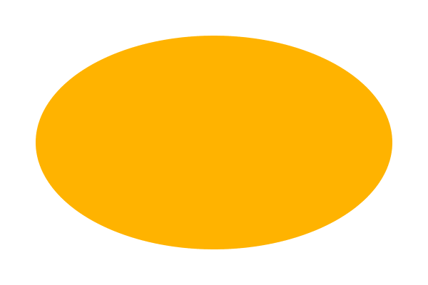

# 第十三章 超级椭圆与超级方程（Superellipses and Superformulas）

> 原作：Keith Peters https://www.bit-101.com/blog/2022/11/coding-curves/
>
> 译者：池中物王二狗(sheldon)
>
> blog: http://cnblogs.com/willian/
>
> 源码：github: https://github.com/willian12345/coding-curves

Coding Curves 13: Superellipses and Superformulas
coding curves 

Chapter 13 of Coding Curves


In this chapter we’ll be talking about some interesting shapes. Superellipses are quite useful in design and UI work, especially a specific superellipse we’ve come to know affectionately as the “squircle”. These are basically rounded rectangles, but with some neat properties. Superformulas are an extension of superellipses. They are more complicated, probably less useful, but interesting in their own right. Let’s dive in.
## Superellipses

Sometimes you need to draw a rectangle for something. We’ve all been there. Drawing a rectangle is easy enough in almost any graphics package. So you draw a rectangle.


But that’s kind of boring. Those square corners are just so… square. So you come up with a rounded rectangle. Some drawing apis have this built in, but it’s not too hard to hand code. You draw a 90-degree arc at each corner and a line between each arc. This is ok.


In fact, you can make those corners have a relatively small radius, or you can make it quite round:


But you might not love this. There’s kind of a break in continuity in the edges. It’s going along nice and straight and then it abruptly turns into an arc. Maybe you want something that smoothly transitions into that round corner. Enter the superellipse.

You can think of a superellipse as a blend between an ellipse and a rectangle. Like an ellipse, and many of the other curves we’ve drawn in this series, we’ll consider this shape as a center point and a varying radius drawn from a t of 0 to 2 * PI. This is different from a lot of rectangle functions which take an x, y location (usually top, left of the shape) and a width and height. But you can adjust the function as you want.

While there are different ways to express a superellipse mathematically, we’ll dig around until we find one that is parameterized with that 0 to 2 PI t value. And here is is:

```
x = pow(abs(cos(t)), 2 / n) * a * sign(cos(t))
y = pow(abs(sin(t)), 2/ n) * b * sign(sin(t))
```

Hmm… more complicated than you might have expected?

There is a somewhat simpler formula that looks like this:

```
x = pow(cos(t), 2 / n) * a
y = pow(sin(t), 2 / n) * b
```

But the problem with this is that it only handles one quadrant: 0 to PI / 2. Rather than running a for loop four times, once for each corner, and figuring out the signs of x and y, we do some fancy math with abs and sign.

Your language probably has an abs function, but it just returns the absolute value of a value. You could easily write your own like:

```
function abs(val) {
  if (val < 0) {
    return -val
  }
  return val
}
```

This will always return zero or a positive value.

You might not have a sign function though. This just returns -1 if the given value is negative, and +1 if it’s positive. Returns 0 for 0. You can write this like so:

```
function sign(val) {
  if (val < 0) {
    return -1
  }
  if (val > 0) {
    return 1
  }
  return 0
}
```

You might be tempted to get fancy and do something like:

```
function sign(val) {
  return val / abs(val)
}
```

This works wonderfully. Until val is 0. Then it crashes. So you’ll still need a conditional in there to catch that case.

Now in the formula I gave above, there’s some duplication and some not very clear variables, and there’s no way to position the shape. So here’s an actual function that’s more usable:

```
function superellipse(xc, yc, rx, ry, n) {
  for (t = 0; t < PI * 2; t += 0.01) {
    c = cos(t)
    s = sin(t)
    x = pow(abs(c), 2 / n) * rx * sign(c)
    y = pow(abs(s), 2 / n) * ry * sign(s)
    lineTo(xc + x, yc + y)
  }
  closePath()
}
```

Most path drawing apis have some sort of closePath function that draws a final line back to the starting point.

And there you go. Let’s recreate our above rounded rectangle using a superellipse.

```
width = 600
height = 400
canvas(width, height)
 
// set color to orange however you do that...
superellipse(300, 200, 250, 150, 10)
fill()
```


You might or might not like that better than the simple rounded rectangle, but let’s explore it some more. That last parameter, n, controls how curved the corners are. The higher the value, the closer you get to a rectangle. Here is an n of 20:


And here is an n of 4:


This looks like the screen shape of an old fashioned TV set.

And this is a good time to bring up squircles.

## Squircle

A superellipse where the x and y radii equal is sometimes also known as a supercircle. And has also been called a squircle. A combination of a square and circle. Some definitions of squircle state that it must have an n of 4. It looks like this:


This shape looks very satisfying, and has become very popular recently in user interface design. It’s often used for icons, especially for those used to launch apps on mobile devices. Sometimes the n value might be not quite 4 as above, but close enough.

There is actually an alternate formula for a squircle which John Cook wrote about at https://www.johndcook.com/blog/2022/10/27/variant-squircle/. His site is a great resource by the way. I can’t say I always understand all of what he is talking about, but he’s sent me down many very interesting paths of exploration.
Back to Superellipses

Let’s explore that n parameter a bit more. We already saw that as we make it larger, the corners get tighter. When we get an n of 2, something interesting happens. We just get an ellipse (or a circle if the height and width are equal).





When we go from 2 down to 1, we see the straight edges turn to corners, and the corners become more straight. Here’s 1.5:


When we get down to n = 1, corners and edges have completely reversed and we get a diamond shape.


Then as we go below 1, the corners start curving inwards. Here’s 0.75:


At 0.2, the superellipse is almost disappearing.


It will be essentially invisible with an n just a bit lower than that.

And when you go negative, things get really weird. Here’s n at -4. I had to reduce the size a bit so you could see what’s going on – we get a filled rect and some inverted superellipses extending out of each corner.


Not sure there’s any use for that last part, but there it is.

And that’s about it for superellipses. A great shape to have in your graphics toolbox. But let’s move on.

## Superformulas

A superformula is a generalization or extension of s superellipse. Again, we have a radius that differs as we go from 0 to 2 * PI. The formula for that radius is:


That’s straight from the Wikipedia article on superformulas. It was easier to copy and paste that than it would be to try and type out the formula in a way that made sense. We’ll convert that to pseudocode shortly, but you should see some similarities between this and the superellipse formula. You see that we take the cosine and sine of something, divide it by a value, then take a power of the absolute value of that. The squiggly symbol there is the Greek letter phi, and it’s what we will call t. So we’re saying the radius at angle t is …

Then we have some other variables, m, n1, n2 and n3 as well as a and b which influence the x and y radii. In my implementation I’m going simplify it by just having a single radius. So I’ll set a and b to 1, which means we can just ignore them in the code and multiply the result by the radius we want.

Since this is so complicated, I’ll break down some of these parts into separate variables and then combine them for the final result.

First we’re taking the cosine and sine of the same value, so we can precalculate that. And I’ll call m symmetry.

```
angle = symmetry * t / 4
```

Then in between the big parentheses we have two terms we are adding together. We’ll calculate each of those:

```
term1 = pow(abs(cos(angle), n2)
term2 = pow(abs(sin(angle), n3)
```

Again, we’re considering a and b to be 1, so we can ignore them here.

Next we can plug these terms into the rest of the formula to get the final radius. Remember, we multiply that by the overall radius we want:

```
r = pow(term1 + term2, -1/n1) * radius
```

And finally, use the radius and angle to get the next point to draw to:

```
x = xc + cos(t) * r
y = yc + sin(t) * r
```

Put all together, this is our function:

```
function superformula(xc, yc, radius, symmetry, n1, n2, n3) {
  for (t = 0; t < 2 * PI; t += 0.01) {
    angle = symmetry * t / 4
    term1 = pow(abs(cos(angle), n2)
    term2 = pow(abs(sin(angle), n3)
    r = pow(term1 + term2, -1/n1) * radius
    x = xc + cos(t) * r
    y = yc + sin(t) * r
    lineTo(x, y)
  }
  closePath()
}
```

OK, now what the heck can we do with this? And what are all those parameters supposed to control?

When I’m faced with something like this, I usually start by finding some parameters that create some relatively simple, stable configuration and then start tweaking just one of the parameters to see what it changes. Then move on to another, and eventually look at how various parameters interact. Fortunately, the Wikipedia page on superformulas gives us this nice chart as a starting point:


The numbers on top of each image are the parameters m (what we call symmetry), n1, n2 and n3.

So we can immediately see that the symmetry parameter controls how many “nodes” will be in the shape.

So here’s a symmetry of 3, with all the n parameters set to 1:


And symmetry 5:


And 8:


Now, keeping symmetry at 8, let’s change n1 to 10:


Then down to 3:


And then below 1, down to 0.2:


OK, so we get that n1 makes the sides of the shape bulge in or out.

Alright, now we’ll stick with symmetry 8 and put n1 back to 1. Then we’ll up n2 to 1.5:


We still have 8 nodes, but every other one is a bit rounder, and the in-between nodes are a bit sharper. This gets more obvious at n2 = 2:


At n2 = 5, the rounder nodes have started to double, and the sharper ones are receding:


And here we are at n2 = 10. I had to reduce the radius because the shape was outgrowing the canvas:


Finally, setting n1 and n2 back to 1, we can try increasing n3 to 3:


This has a similar effect to that of n2 but changes alternate nodes, as if the whole shape was rotated 45 degrees.

At this point, I have a pretty good idea of what’s going on and I can just start trying some random parameters:

Symmetry 16, n1=0.5, n2=0.75, n3=2


Symmetry 32, n1=0.9, n2=0.2, n3=-0.3


Anyway, you don’t need me to choose random numbers for you at this point. Play with it. Use big numbers, small numbers, fractions, negatives, primes, numbers that are divisible by each other or not. And see what happens.

Remember, too, that we removed the a and b values from the original formula and used a single radius. You might want to try putting those back in and create some elliptical superformulas. The Wikipedia page also gives an alternate formula where the m parameter is split into two separate values, y and z:


This can allow for even more complex shapes.

I played around with this a little and came up with shapes like this, which I quite like:


But I’ll leave the coding of that up to an exercise for the reader.


