# 第十四章 其它曲线（Miscellaneous Curves）
> 原作：Keith Peters https://www.bit-101.com/blog/2022/11/coding-curves/
>
> 译者：池中物王二狗(sheldon)
>
> blog: http://cnblogs.com/willian/
>
> 源码：github: https://github.com/willian12345/coding-curves

Coding Curves 14: Miscellaneous Curves

Chapter 14 of Coding Curves

This is the last planned chapter of this series. I might add another one here or there in the future if I find a new interesting curve to write about. There were also a couple of topics on my original list which I decided to hold back. I might change my mind about them someday. Any future additions will be added to the index.

For this “final” installment, I thought I’d cover a few random curves that probably wouldn’t be worth a full chapter in themselves. And I thought it would be good to kind of walk through the process I actually take when I go to code up some formula I discover.

曲线艺术编程系列 第十四章

这是系列文章规划的最后一章。如果后面发现其它有趣的曲线类型可能加在这一章。我原计划清单里有几个主题没放出来，当然也不排除某天我改主意了。未来额外的内容也可能另起一章加到目录索引中。

在“最后”一篇， 我想我会讲一些随机曲线，这些曲线不值得单独开一章来讲。还有，我觉得把我从找到公式到编码的过程完整过一遍会很不错。

## The Cannabis Curve

## 大麻曲线

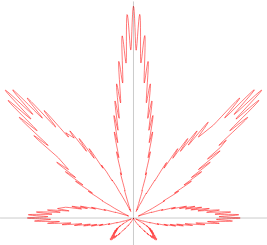


Weisstein, Eric W. “Cannabis Curve.” From MathWorld–A Wolfram Web resource. https://mathworld.wolfram.com/CannabisCurve.html

Wolfram Mathworld is a great place to find interesting formulas by the way. If you want to dig up more 2d curves, the section on Plane Curves is a great place to dive in. But there’s all kinds of other stuff on the site too.

I’m not trying to make any statement by choosing the cannabis curve. I just thought it was pretty cool that you could draw something complex like that with relatively simple math.

So we get this as a formula:

Weisstein, Eric W "大麻曲线" 来源于网站 <https://mathworld.wolfram.com/CannabisCurve.html>

Wolfram Mathworld 是一个很好的发掘有趣公式的地方，顺便说一句，如果你想发掘更多 2d 曲线，那么在平面曲线（Plane Curve）这一章节可以深入找找。网站内容很全，还有其它曲线类型可探索。

为什么选择大麻曲线？。我只是觉得它很酷（译者注：本人在此申明我与赌毒不共戴天），仅仅用简单的相关地数学公式就可以画出如此复杂的东西。

下面是对应的数学公式：

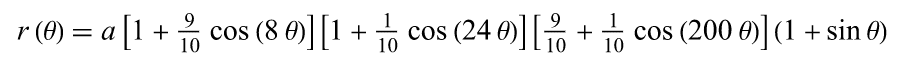

OK, it’s a bit long, but it’s just multiplication, addition and some sines and cosines. We can do this.

This is defined as a polar curve, which means rather than defining x, y values, we’ll be dealing with an angle and a radius. We have a function, r(θ), where θ is the Greek letter, theta. This usually represents an angle. And we can guess that r stands for radius. So we have a function where we pass in an angle and get a radius.

With an angle and a radius, we can easily get an x, y point to draw a segment to. This might look sort of like this:

好的，公式有点儿长，但它只是乘法，加法还有一些正弦和余弦计算。我们可以的。

它定义了一条极坐标曲线，这意味着相比于 x, y 的值，我们更关心角度与半径。我们有个函数 `r(θ)`, `θ` 是希腊字母，theta。它通常代表角度。当然我们也能猜到 r 代表半径。所以我们需要一个函数传入角度得到对应的半径。

有了角度和半径，我们很容易计算出用于绘制线段的 x,y 点。组织代码后应该像下面在这样：

```
for (t = 0; t < 2 * PI; t += 0.01) {
  radius = r(t)
  x = cos(t) * radius
  y = sin(t) * radius
  lineTo(x, y)
}
stroke()
```

We use t to get the radius and then radius and t to get the next point to draw a line to.

Practically speaking though, I’ll never use that r(θ) function anywhere but in this for loop, so I’ll just hard code it all right there.

The only other thing we see here that isn’t a number or a bracket or a trig formula or θ, is the variable a. We’re multiplying the whole rest of the formula by a to get the final radius for a given t, so it seems like a will just represent the overall radius we want this curve to be drawn at. So a will probably be a good parameter to pass into our cannabis function, and I’ll probably rename that parameter radius for clarity’s sake. We’ll also probably want a center x, y point to locate the curve, so we’ll make those parameters too (xc and yc for x and y center).

We come up with something like this for starters

我们通过 t 计算得到半径，然后再通过半径和 t 计算得到下一个绘制线条的坐标点。

不过事实上来讲，r(θ) 除了在这个循环内不会在其它任何地方使用，我就直接硬编码了。

此处唯一额外要说明的就是需要传入参数 radius  用 radius 乘以公式。还需要用 x, y 让曲线居于中心点，所以我们也把它作为参数传递（xc 与 yc 代表 x 和 y 中点）。

（译者注：这里原作都在 r(t) 计算时用字母小 a 指代除公式之外的部分, 我觉得更难理解更麻烦，小 a  在英语中随处可见，又不在伪代码中明确标出，所以我决定去掉。直接用中文表达出作者原本的意图）

以下面代码作为起点：

```
function cannabis(xc, yc, radius) {
  for (t = 0; t < 2 * PI; t += 0.01) {
    r = radius * ... // that whole formula. we'll get to it.
    x = cos(t) * r
    y = sin(t) * r
    lineTo(xc + x, yc + y)
  }
  closePath()
}
```

Now we just need to code up all the stuff that comes after a. This is really pretty simple now that we’ve figured out how it’s all going to fit together. For the fractional constants, I’ll just use decimals: 0.1 instead of 1/10 and 0.9 instead of 9/10. Let’s go!

现在，我们在上面基础上进行编码。相当的简单，我们只需代入公式。分数部分我们使用 0.1 代替 1/10, 0.9 代替 9/10。开始吧！

```
function cannabis(xc, yc, radius) {
  for (t = 0; t < 2 * PI; t += 0.01) {
    r = radius * (1 + 0.9 * cos(8 * t)) * (1 + 0.1 * cos(24 * t)) * (0.9 + 0.1 * cos(200 * t)) * (1 + sin(t))
    x = cos(t) * r
    y = sin(t) * r
    lineTo(xc + x, yc + y)
  }
  closePath()
}
```

Now I’ll try to run this by putting up something like so:

现在，像下面代码这样看看：

```
canvas(600, 600)
cannabis(300, 300, 140)
stroke()
```
That gives me this image:

这会得到如下图：

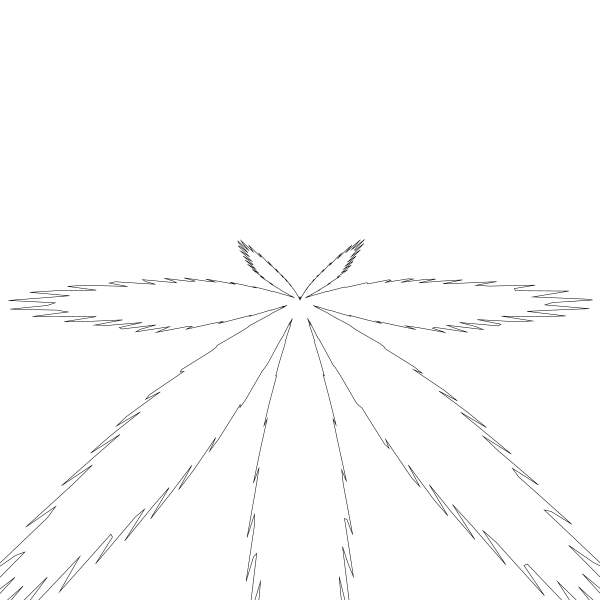

Ah, OK. This tells us a few things.

First, this formula is using Cartesian coordinates and I’m using upside-down screen coordinates. So I’ll have to flip the y-axis. No problem.

Next, the center is where all the “leaves” join. So after flipping, I can probably set the center more towards the bottom of the canvas.

Finally, I guessed that 140 would be a good value for radius, as it would keep it well within the 600×600 size of the canvas. In fact, I expected it would only be about half the size of the canvas. But we actually go well beyond the canvas edge for the larger leaves. We could correct that in the code, maybe multiplying radius by some fraction to bring the largest leaf down to the radius the user passed in. I’m going to skip that part and just pass in a smaller value, but feel free to do what you want with the function.

Here’s my final version:

Ah, 好的，有点儿东西。

首先，此公式使用笛卡尔坐标系，而我用的是上下相反的屏幕坐标系。所以我需要把 y 轴翻转。问题不大。

接着，中心点是所有“叶子”连接点。所以在翻转后，我可以将中心点设置在 canvas 靠近底部的位置。

最后，我猜 140 会是一个不错的半径值，它会将绘制出的图形限制在 600X600 大小的 canvas 内。事实上，我期望的是把图形限制在 canvas 大小的一半。但实际上大的叶子超出一部分也不影响。我们可以在代码中修复它，比如将半径乘以某些小数让大的叶子半径降下来。我就不做这部分限制了，我假装自己只会传合适的值，相关限制代码你自己可以搞定的。


```
function cannabis(xc, yc, radius) {
  for (t = 0; t < 2 * PI; t += 0.01) {
    r = radius * (1 + 0.9 * cos(8 * t)) * (1 + 0.1 * cos(24 * t)) * (0.9 + 0.1 * cos(200 * t)) * (1 + sin(t))
    x = cos(t) * r
    y = sin(t) * r
    lineTo(xc + x, yc - y)
  }
  closePath()
}
```

All I did was change the lineTo function to use yc - y instead of yc + y.

Then when I call it, I just change the parameters a bit (with a bit of trial and error to get it just right):

我所做的只是将 lineTo 这一行用`yc + y` 代替了 `yc - y` 。

在调用函数时参数也调整了一下（经过试错后得出还不错的参数值）

```
canvas(600, 600)
cannabis(300, 520, 120)
stroke()
```

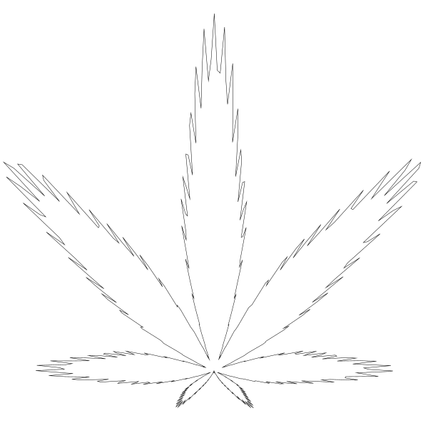

There we go!

Side note. I seriously considered changing the size of the canvas so that the yc parameter could be 420. You’ll either get that or you won’t. 🙂

Of course, now I’m curious about what that formula is doing. There’s basically four parts to it after the a, each in parentheses – three with cosines, one with sine. The first one has a hard coded 8 in there. 

结果还阔以！

提醒一下。我经过仔细考虑调整了 canvas 的大小，这样 yc 参数值可以设置到 420。 你调不调的隨你🙂。

当然，现在我很好奇这个公式到底做了些什么。 radius * 后面分 4 部分，圆括号内分别有 -- 三个 余弦 cos， 一个正弦 sin。第一个括号内直接写了数值（硬编码） 8 。


```
... (1 + 0.9 * cos(8 * t)) ...
```

Since there are seven visible leaves there, I’m guessing those are related – there’s probably actually eight leaves, but the bottom one is too small to see. I’ll change that 8 to a 12…

自从设了值为 8 便有了 7 片可见的叶子，我猜它们之间有联系 - 它实际上有可能有 8 片叶子，只是最底部的那一片太小，我们看不到。 我将 8 调高到 12 ...

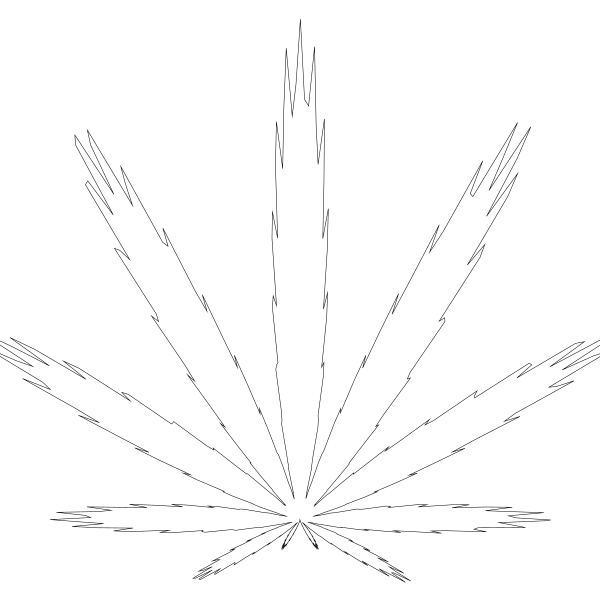

Yup, theory validated. Eleven leaves plus an invisible one.

In the second section, the 24 is a bit less obvious.

你看看！理论验证成功。 7 片可见叶子加上一片不可见的。

在第二部分数 24 的作用就不太容易看出来。

```
... (1 + 0.1 * cos(24 * t)) ...
```

If I revert back to original and then change the 24 to 0, I get very rounded leaves.

如果把代码回调然后把数值 24 设为 0 ，叶子边缘会非常圆润。

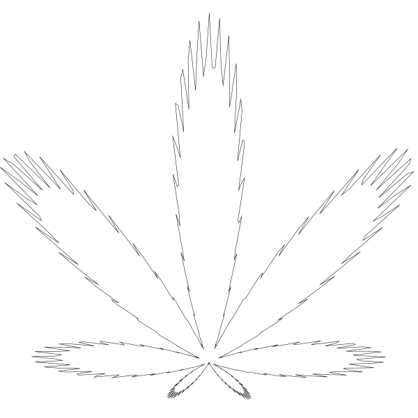

Doubling 24 to 48 gives us:

调到 24 一倍至 48 会得到：

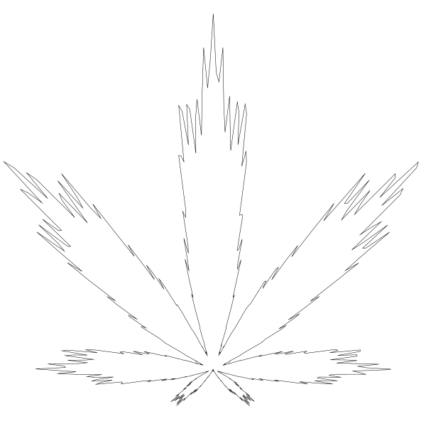

It’s kind of making three levels for each leaf. Let’s put it back to 24 and change the multiplier:

这结果有点儿像每片叶子上又生出了三片小叶子。让我们把值改回 24 然后改变乘数：

```
... (0.7 + 0.3 * cos(24 * t)) ...
```


Again, we see three levels, which make sense, as 24 = 8 * 3. So this section is using a very small multiplier, 0.1, to make a subtle change to each leaf – making it just a bit less round. Cool. We’ll revert that and look at the next one.

还是看到三片小叶子，24 = 8 * 3 很合理。所以这部分使用非常小的乘数， 0.1, 来微调每片叶子 - 让它变的不那么圆润。酷。把代码调回原位后再往下看另一部分。

```
... (0.9 + 0.1 * cos(200 * t)) ...
```

The 200 there makes me guess it’s creating all the jagged edges. If I change it to 100, it’s less jagged.

数值 200 我猜是用来创建锯齿边的。如果我把它 改为 100 ， 锯齿变就变少了。

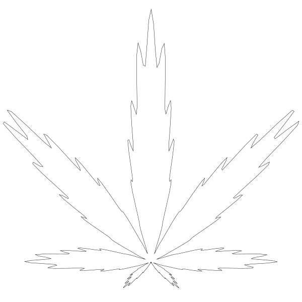

But now I’m seeing some blockiness. I can try increasing the resolution by changing the for loop increment from 0.01 to 0.005:

但现在看起来块儿状化了。试着增加分辨率把 for 循环从 0.01 调至 0.005:

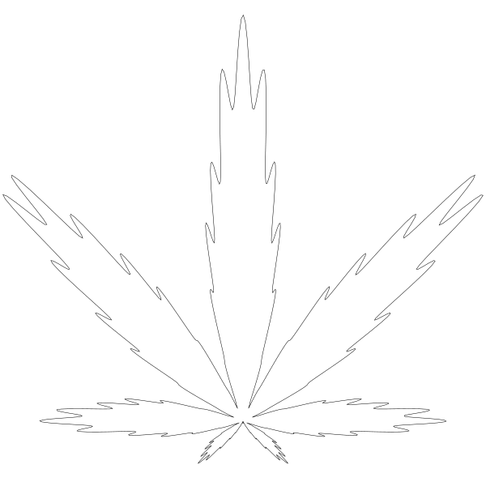

Mmmm… smooth.

I’ll revert that and look at the final sine block.

Mmmm... 丝滑。

反代码复原后再看最后一个 sin 的作用。

```	
... (1 + sin(t))
```

My guess was that this was affecting the orientation of the curve. I thought that if I removed that section, the leaf would be sideways. But I was wrong. Here’s what happens if I remove that section and set yc back to 300, the center of the canvas:

我一开始猜它影响的是曲线的朝向。我想如果把这部分删掉，叶子可能会朝向一边。但我发现我猜错了。下面是我移掉这部分代码并将 yc 调回到 canvas 中心点 300 后的结果：

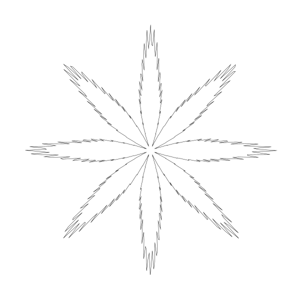

That was a pleasant surprise! And it gives me a lot of ideas of new curves I can create from this. Also, this makes that missing eighth leaf visible!

真是个小惊喜！在这个基础上我的点子可就多了，另外那消失的第 8 片叶子也找到了！

## A Heart Curve

Weisstein, Eric W. “Heart Curve.” From MathWorld–A Wolfram Web Resource. https://mathworld.wolfram.com/HeartCurve.html

Again, Wolfram Mathworld to the rescue. As you can see, there is no single formula to draw a heart shaped curve. This page shows eight different ones. Personally I like the last one in the second row.

Rather than a polar formula like last time (and some of these other examples), this just has us computing the x and y directly. But we’re still going to loop a t value from 0 to 2 * PI.

For the y part of the formula, there are four different calculations. It’s not entirely clear how these calculations are supposed to be combined, but if you look further down in the text, you find that you’re supposed to subtract them. I’m also a bit concerned that we have so many hard coded numbers in there and no way to change the final size of the heart. But I’m sure we can figure that out.

Once again, this is really a pretty straightforward formula, so let’s jump in and code it up.

## 心形

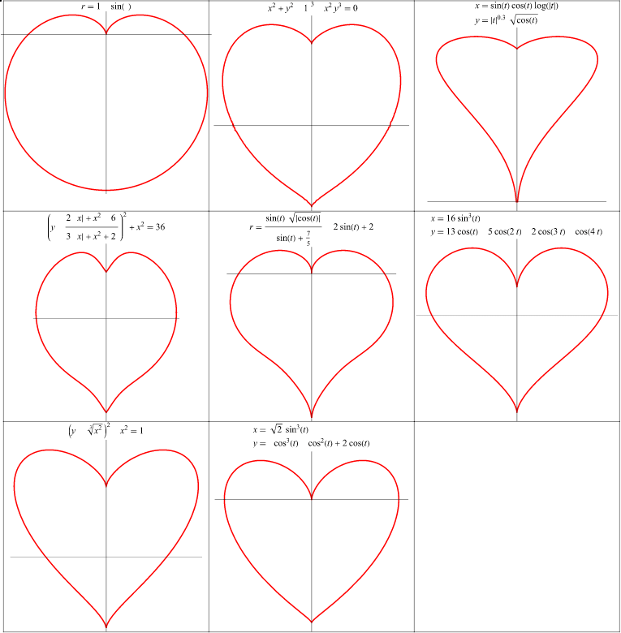

Weisstein, Eric W. “Heart Curve.” From MathWorld–A Wolfram Web Resource. https://mathworld.wolfram.com/HeartCurve.html

再一次，还得靠 Mathworld。如你所见，没有一个单独的公式可以绘制心形曲线。此页展示了 8 种不同的绘制方法。个人来讲我喜欢倒数第二行的最后一个。

相比于上一次接触的极坐标公式（还有其中其它的例子）， 此公式直接给出计算 x 和 y 值。当然还是得用 0 到 2*PI 循环出 t 值。

公式计算 y 坐标，有四个不同的计算部分。不太清楚四个计算合在一起的作用，但如果往下继续看，你会想着删减它们。我关心的还有两点，硬编码的数值太多还有就是没有直接改变心形大小的参数。但我肯定我们可以解决。

来吧，这是非常直接的公式，我们直接进入代码环节用代码写出来。


```
function heart(xc, yc) {
  for (t = 0; t < 2 * PI; t += 0.01) {
    x = 16 * pow(sin(t), 3)
    y = 13 * cos(t) - 5 * cos(2 * t) - 2 * cos(3 * t) - cos(4 * t)
    lineTo(xc + x, yc + y)
  }
  closePath()
}
```

We can run this like so:

像下面这样调用：

```
canvas(600, 600)
heart(300, 300)
stroke()
```

And we’ll get:

得到结果：


Generally right, but we need to flip it like before, and we need to allow for changing the size. Right now it’s about 32 pixels wide. That’s the hard coded 16, times 2.

For flipping we can again just say yc - y.

For size, let’s first get rid of all of those hard-coded numbers by dividing them all by 16.

基本正确，只是需要把它翻转过来，还有就是需要允许调整大小。现在大约宽度是 32 像素。这是硬编码值 16，乘以 2 倍。

翻转就很简单了再次将使用 yc - y

至于尺寸大小，先把硬编码的数值分别除以 16。

```
x = pow(sin(t), 3)
y = 0.8125 * cos(t) - 0.3125 * cos(2 * t) - 0.125 * cos(3 * t) - 0.0625 * cos(4 * t)
```

If we left it like that, we’d get a heart that would be two pixels wide (1 * 2). Now we can add a size parameter and multiply both values by that.

像这样处理后，我们得到的是 2 像素宽度的（1 * 2）心形（译都注：x 轴系数16/16归 1 了，原来 16 是 32 像素意味着输出的图像 1 就是 2 像素）。现在我们可以为它添加控制大小参数 size 了。

```
function heart(xc, yc, size) {
  for (t = 0; t < 2 * PI; t += 0.01) {
    x = size * pow(sin(t), 3)
    y = size * (0.8125 * cos(t) - 0.3125 * cos(2 * t) - 0.125 * cos(3 * t) - 0.0625 * cos(4 * t))
    lineTo(xc + x, yc - y)
  }
  closePath()
}
```

Now we call it like so:

现在像下面这样调用：

```
canvas(600, 600)
heart(300, 300, 280)
stroke()
```

And get:

得到的结果：

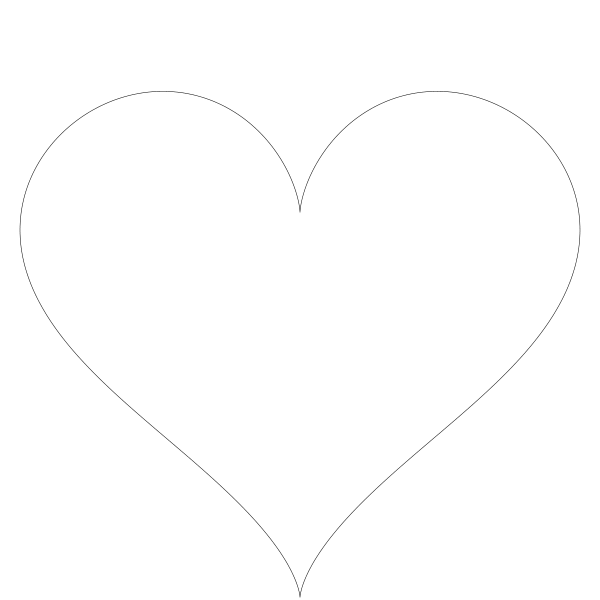


Not too difficult.

I’m not going to dive in to all the different ways you can mess with this, but just try changing the various constants in the formula and see what happens. Can you make it better? Come up with something completely different?

不是很难。

我不打算再深入另外的心形的公式了，相信你自己可以探索，你只需改动其中的常数值看看会发生什么变化。你有更好的方式吗？完全不同的那种？

## An Egg

I first looked into drawing egg shapes a couple of years ago. This post showed the result, but none of the thought process behind it: https://www.bit-101.com/blog/2021/06/how-to-draw-an-egg/

The page I got my formula from was here: http://www.mathematische-basteleien.de/eggcurves.htm

There are actually a truckload of different egg formulas on that page. Like the heart curve, I was surprised that there was no single standard egg curve formula.

But I homed in on the one on that page under the section “From the Oval to the Egg Shape”. This takes a general formula for an oval or ellipse and alters the “y radius” based on the current value at each point. If x is to the right of center, it will make the y value a little bit bigger. If x is to the left, it will make the y value a bit smaller. That seemed sensible.

So we’ll start with an ellipse formula. We covered that back in Chapter 3.

## 蛋（卵形）

几年前我才首次接触如何绘制蛋形。此篇中只展示结果，但没有写思考过程。这篇比较完整 <https://www.bit-101.com/blog/2021/06/how-to-draw-an-egg/>

公式是从这里找到的 <http://www.mathematische-basteleien.de/eggcurves.htm>

事实上这里有超多的绘制蛋形的公式。就像心形曲线一样，我好奇的是没有一个单独的绘制蛋形曲线的标准公式。

但我把目标锁定在了 “From the Oval to the Egg Shape” 这一章节。此处有一个通用的蛋形或椭圆形公式，y 轴半径在每个点上都是变化的。如果 x 偏右，则 y 值变大，如果 x 偏左则 y 值编小。很直观。

所以我们先从椭圆公式开始，椭圆公式在第三章中我们已经讲解过了。


```
function ellipse(x, y, rx, ry) {
  res = 4.0 / max(rx, ry)
  for (t = 0; t < 2 * PI; t += res) {
    lineTo(x + cos(t) * rx, y + sin(t) * ry)
  }
  closePath()
}
```

That’s nice and concise, but I’m gonna break it up a bit so we can mess with the raw x and y coords right out of the trig functions before translating and scaling them. I’m also going to ignore the res variable and just hard code the 0.01 in there. Just for simplicity and clarity. Keep it if you want.

公式很好很简洁，但我得把三角函数部分代码提出来方便对它进行平衡与缩放。为了简洁的解释我还把 res 变量去掉了直接硬编码为 0.01， 当然你可以选择保留它。

```
function egg(xc, yc, rx, ry) {
  for (t = 0; t < 2 * PI; t += 0.01) {
    x = cos(t)
    y = sin(t)
    lineTo(xc + x * rx, yc + y * ry)
  }
  closePath()
}
```

This will just draw an ellipse, but let’s make sure it works with the changes.

就是画了个椭圆，只是先确定改动代码有没有错误。

```
canvas(600, 600)
egg(300, 300, 280, 190)
stroke()
```

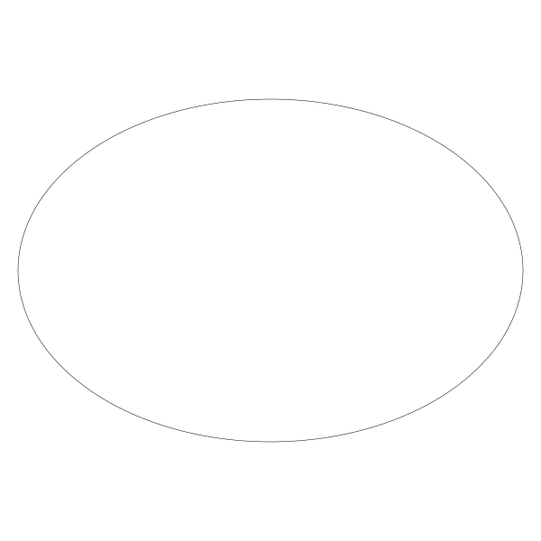

Yup, that’s an ellipse. Where did I get the 280 and 190 from? Well, 280 is a bit less than half of the width of the canvas, so that’s the rx. And I wanted ry to be somewhat less than that. It was just trial and error and 190 looked about right.

Now let’s make this ellipse into an egg. The article gives three formulas:

Yup，结果正是个椭圆。数值 280 和 190 是怎么来的？嗯，280 就是比 canvas 宽度一半还小一点点，rx。 ry 也是类似，不断试错后得到 190 这个看起来不错的值。

现在让我们把椭圆变成蛋形。那个网页中给了我们三个公式：

```
t1(x) = 1 + 0.2 * x
 
t2(x) = 1 / (1 - 0.2 * x)
 
t3(x) = e^(0.2 * x)
```

Those t functions just give us something we need to multiply the y value by. I’m not going to make new functions though. I’m just going to do the multiplication right in the for loop. Let’s try the first one…

这些 t 函数是用来乘以 y 的。我就不再创建新函数了。就在 for 循环中直接乘。先从第一个 t 公式开始...

```
function egg(xc, yc, rx, ry) {
  for (t = 0; t < 2 * PI; t += 0.01) {
    x = cos(t)
    y = sin(t)
    y *= (1 + 0.2 * x)
    lineTo(xc + x * rx, yc + y * ry)
  }
  closePath()
}
```

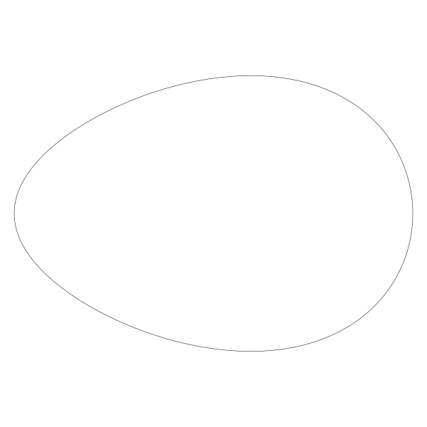

Woo! An egg!

Now we can mess with that a bit. The 0.2 value there is probably going to be the best source of experimentation. Let’s try 0.3.

Woo! 得到了一个蛋！

现在我们可以调调公式内的参数了。先从 0.2 这个数值入手。把它设为 0.3 试试。


OK, it got a bit pointy. How about 0.5?

好的，它看起变的有点儿尖。改为 0.5? 

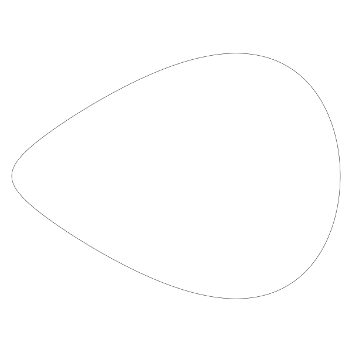

Even pointier. So we know where that’s going. Let’s go down. To 0.1.

更尖了。懂了哈。把值改回 0.1。

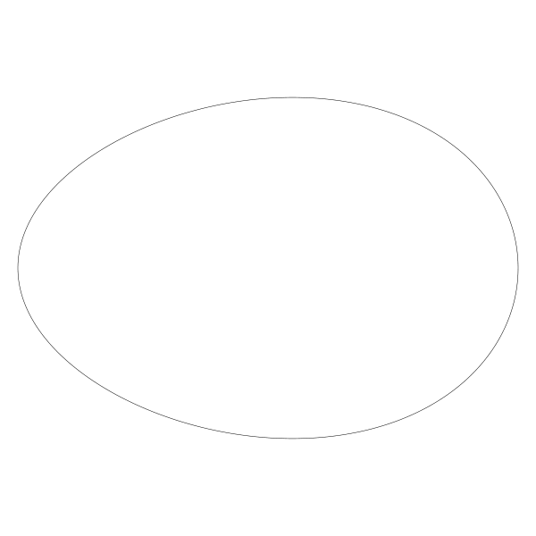

That’s barely distinguishable from the original ellipse. Which makes sense, because if that value was 0, than that line would do nothing and we’d be back to an ellipse. Let’s go back to 0.2, which probably did look the most egg-like, and try changing the yr value we’re passing in. We’ve been using 190. Here’s 220:

几乎与原椭圆别无二至。这说得通，如果值为 0， 那么这一行啥也没做，它就是个椭圆。让我们把它改回 0.2， 让它变成通常常见的蛋型，再把 ry 改成 220：


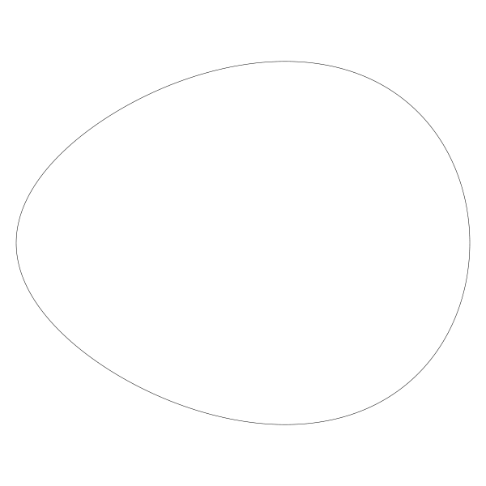

A nice fat egg. And 150:

一个漂亮“肥”蛋。下面是 150：

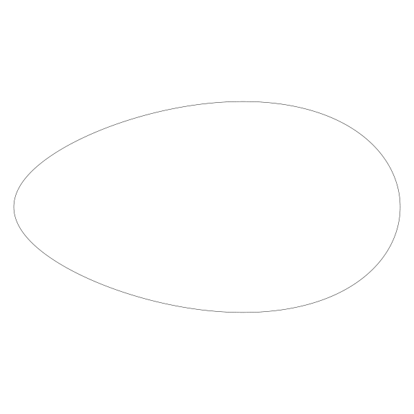

I’m gonna stand by my choice of 190, but some minor tweaks might work better. Go for it. Let’s try the other formulas. We’ll go back to the ry of 190 first. Then change that line 5 to:

我坚持我的数值 190 ，但小调一点也可能更好。多试试吧。让我们再试试其它公式。首先把 ry 调回 190。把公式换成：

```
y *= 1 / (1 - 0.2*x)
```

This gives us:

得到：

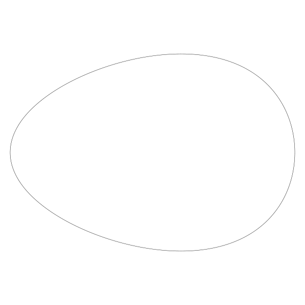

And then the third formula:

再试试第三个公式

```
y *= exp(0.2 * x)
```

Remember from Chapter 5 that most math libraries have an exp function that is e raised to a given power. That’s what we are doing here. The result of that:

还记得第五章提到过大部分数学库都会提供 exp 函数即 e^x ( e 的“参数”次幂)。这个公式就是调用了 exp 函数，结果如：


These all look suspiciously the same, so I drew them all at once, red, green and blue…

由于三个公式看起来都很像，所以我把它们用红绿蓝三种不同颜色都画了出来...

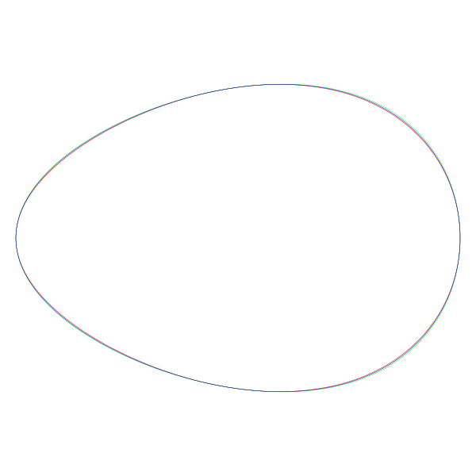

Yeah, those are all virtually the same. Maybe a pixel off here and there. Looking back at the original web site, they are talking about a different ellipse formula and multiplying y2 by that value:

> The equation of the ellipse e.g. x²/9+y²/4=1 change to x²/9+y²/4*t(x)=1.

This is also hard coding 9 and 4 as divisors. If you unsquare those you get 3 and 2. And it just so happens that 2/3 of 280 is 186ish. So we pretty much agreed on my choice of 190 for ry!

At any rate, we have a formula that draws a fairly convincing egg no matter which algorithm we use. So I’m going to leave it there. Here I was literally writing the article as I was writing the code, so you really got to see my process, along with my glossing over of details in the source article. But it all came out just fine!

Yeah, 三个几乎相同。可能有几个像素的区别。让我们回头看原网站，它们讨论的是另一种不同的椭圆公式，并且让 y2 乘以 此公式的值：

> 另一种椭圆公式 x²/9+y²/4=1 变化至 x²/9+y²/4*t(x)=1

除数 9 和 4 依然是硬编码。如果对它们开方得到 3 和 2。而 280 的 2/3 刚好是 186（译者注：公式简化后可观察得到 ry 是 2/3 的 rx）。 所以之前我选择 ry 为 190 挺合理的！

无论如何，我们有了可以画出令人信服的蛋形公式，无论使用哪种算法。就到这儿吧。这就是我写文章的过程，当然我写代码也是类似的思考，你完整的了解了整个过程，去掉了一些源文中的细枝末节。但得到的结果依然相当不错！

（译者注：很多情况下你不需要知道公式的完整推导过程，人生苦短直接使用公式即可）

## Summary

Hopefully this gives you some insight on how to find formulas in various places and convert them into code that draws something interesting – if you haven’t already done stuff like this.

And that wraps up this series on coding curves. At least for now. I have another series in mind though, so watch this space!

## 小结

如何从不同地方找到各种公式把它们转变成代码绘制出有趣的图形, 希望这会给你一些启发 - 如果你从未做过的话。

我把它们全部归档到了 coding curves 系列中。至少现在为止是这样。不过我想到了另一个系列，关注我不迷路！


